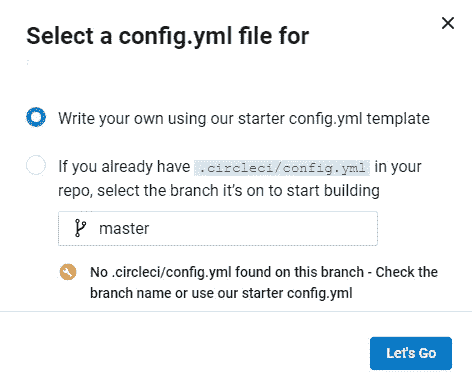
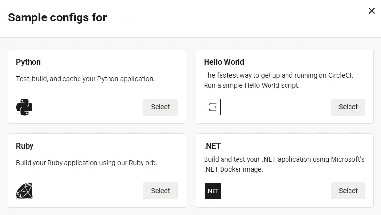
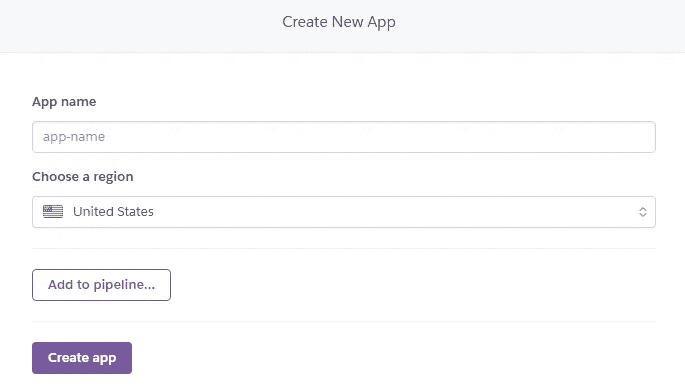
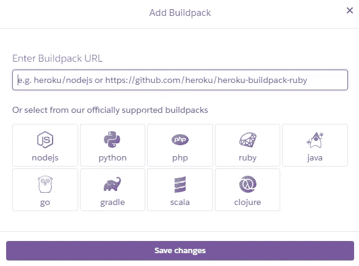
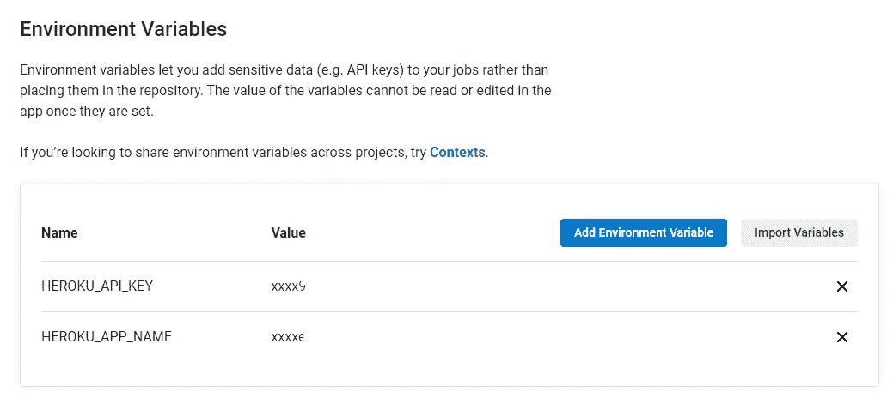
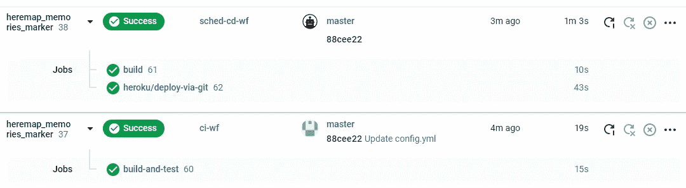

# 如何使用 CircleCI 创建 CI/CD 管道

> 原文：<https://betterprogramming.pub/how-to-create-ci-cd-pipelines-using-circleci-3110bb61ebf9>

## 开始使用 CircleCI 执行实际的 DevOps 任务

[扎克](https://unsplash.com/@zaks?utm_source=medium&utm_medium=referral)在 [Unsplash](https://unsplash.com?utm_source=medium&utm_medium=referral) 上的照片

创建 CI/CD 管道是每个处理 DevOps 任务的人的基本技能。如果你刚刚开始这个话题，我很高兴向你介绍一个现代的、初学者友好的工具，叫做 [CircleCI](https://circleci.com/) 。

在本教程中，我们将学习如何为应用创建和运行 CI/CD 管道。在本文结束时，您将获得编写自己的管道的实践经验。此外，CircleCI 很容易上手，所以你可以很快上手。

我们开始吧！

# CircleCI 概述

CircleCI 是一个现代化的持续集成和持续交付平台。它提供免费版和企业版。您可以使用 GitHub 或 Bitbucket 帐户注册。你将每周获得 2500 个免费学分，这对业余爱好项目来说是非常棒的。

**主要优点:**

*   通过最少的点击与您的 GitHub/BitBucket repos 集成
*   为每次提交自动运行管道，以构建、测试和部署您的代码
*   每当构建失败时通过电子邮件获得通知
*   丰富的语言支持——Java、Python、Dart、Go 等等
*   使用工作流来定义和协调作业执行应该如何运行
*   安排工作流在指定时间运行作业
*   强大的 Docker 支持—运行 Docker 公共/私有注册表中的任何图像

# 创建管道

## 帐户设置

首先，你需要一个 CircleCI 账户。请访问[入门](https://circleci.com/signup/?utm_source=google&utm_medium=cpc&utm_content=signup&utm_campaign=sitelinkSignup&gclid=CjwKCAjw3MSHBhB3EiwAxcaEu33a2JA52rNiqsgDFX-vTM0qSOeefOpws5Uoe-xTUv-HZRCvK9UeCRoCasYQAvD_BwE)页面进行注册。在本教程中，我选择了 GitHub 身份验证。

## 选择一个项目

接下来，我们需要一个应用程序来构建、测试和部署。你可以使用任何你喜欢的项目。我选择了一个带有单个单元测试的小型 Python 项目。你只需要知道这些，因为我们的主要重点是创建 CircleCI 管道。

## 与 CircleCI 的项目集成

要集成您的项目，请导航到 CircleCI **项目**部分，选择您的 GitHub 存储库，然后单击**设置项目。**

选择第一个选项:

设置项目屏幕

这一步将创建一个`config.yml`文件，其中包含所有需要的配置。

由于多语言支持，您可以在众多选项中进行选择。因为我的项目是用 Python 编写的，所以我将选择 Python 配置:

选择一个配置屏幕

## 配置管道

CircleCI 的美妙之处在于它会自动为您创建基本配置文件。它创建了一个`build-and-test`管道，每当您向您的 repo 提交新的更改时都会触发该管道。

让我们利用 CircleCI 的特性，向默认配置添加额外的步骤，使其更加强大。

我的配置文件如下所示:

配置说明:

*   [**Orbs**](https://circleci.com/developer/orbs?utm_source=gb&utm_medium=SEM&utm_campaign=SEM-gb-200-Eng-emea&utm_content=SEM-gb-200-Eng-emea-CircleCI-Orbs&utm_term=OrbRegistryLP&gclid=CjwKCAjw3MSHBhB3EiwAxcaEuyp9jNPuTt8Wcb6aMW3QgX7ItSvbGl7CHqfBopB3sljEebKfgY0VURoCPYwQAvD_BwE) 是 CircleCI 配置的可共享包。您可以在配置中使用它们来继承特性，从而简化您的构建。它们允许我们在项目内部和项目之间重用配置。这导致了更干净的配置。你只需要调用别人已经写好的命令。

如你所见，我对 Python 和 Heroku 使用了球体。例如，考虑一下`python/install-packages`、`heroku/deploy-via-git`的步骤。这些 orb 的源代码和文档可以在本教程末尾的**参考文献**部分找到。

*   **工作流程**定义工作列表。它们支持并行、按顺序、按计划运行作业，或者使用批准作业手动运行作业。

我有两个工作流:`ci-wf`，它在我每次提交新代码时执行，还有`sched-cd-wf`，它被安排在周一到周五的 16:00。

如果您需要定期运行作业，调度是一个很好的功能。在某些情况下，每次提交新代码时都运行管道是没有效率的。您可能希望将一些作业安排在指定的时间。你可以在这里验证 cron 语法[。](https://crontab.guru/#0_16_*_*_1,2,3,4,5)

*   **过滤器**帮助你在指定的分支或标签上运行管道。在我们的例子中，它将只在`master`运行。
*   **作业**是执行步骤的集合。它们可以使用`machine`或`docker`执行器来运行。我使用`docker`命令来指定启动哪些容器。

我为这个例子定义了两个任务— `build` 和`build-and-test`。

*   当您的工作依赖于另一个工作时,`requires` 参数很有用。只有在`build` 作业完成后，才会执行计划的部署作业。
*   **步骤**是在作业过程中执行的命令。例如，我使用`checkout`命令检查代码，使用`run`执行多行 shell 命令脚本。在这种情况下，它将运行`pytest` 命令来执行测试用例。

请注意，`python/install-packages`和`heroku/deploy-via-git`步骤是继承的，功能是现成的。

## 与 Heroku 整合

Heroku 是一个现代化的平台，可以在云上构建、运行和操作应用。

我们的配置文件已经准备好了，现在我们只需要将 Heroku 与我们的 GitHub repo 连接起来。

注册一个免费的 Heroku 帐户并创建一个新的应用程序:

转到**设置**并向下滚动到**构建包**为您的应用选择构建包:

因为我的是用 Python 写的，所以我会选择 Python buildpack。

要启用从 CircleCI 到 Heroku 的部署，您需要在 CircleCI 中设置两个环境变量。导航到您的**项目设置**并点击**环境变量**:

CircleCI 项目设置中的环境变量设置

*   `HEROKU_APP_NAME` 是您在 Heroku 中创建的应用程序的名称。
*   要生成/显示 API 密钥，请转到 Heroku 的[帐户设置](https://dashboard.heroku.com/account)并向下滚动到 **API 密钥**部分。将该值粘贴到`HEROKU_API_KEY` 值字段。

就是这样！配置部分准备好了。

# 运行管道

提交配置文件并等待管道执行。

导航到 CircleCI 中的**项目**部分。您应该会看到管道状态:

切尔莱西的成功工作

注意，常规工作流执行了`build-and-test`任务。调度的工作流首先执行`build` 作业，然后使用 Heroku 执行`deploy-via-git`。

如果一切顺利的话，你的应用应该已经部署到 Heroku 上，并且可以在[https://{ your app } . Heroku app . com](/[APP_NAME].herokuapp.com)网址上找到。

# 结论

恭喜你！现在您知道了如何使用 CircleCI 这样的现代工具创建 CI/CD 管道。您还学习了如何使用 Heroku 在云上部署您的应用程序。

希望你能把在本教程中学到的知识运用到以后的项目中。

感谢您的阅读，下次再见！

# 参考

*   [我的 GitHub 回购示例](https://github.com/kirshiyin89/heremap_memories_marker/tree/master)
*   [安排工作流程](https://circleci.com/docs/2.0/workflows/?utm_medium=SEM&utm_source=gnb&utm_campaign=SEM-gb-DSA-Eng-emea&utm_content=&utm_term=dynamicSearch-&gclid=CjwKCAjw3MSHBhB3EiwAxcaEu9mYyOoUGUitwudxO7704zgAj5YhZDxP2ZCAZM-39RoXcU0ikuvC3xoC-a0QAvD_BwE#scheduling-a-workflow)
*   [乔布斯](https://circleci.com/docs/2.0/concepts/?section=getting-started#jobs)
*   [步骤](https://circleci.com/docs/2.0/concepts/?section=getting-started#steps)
*   [蟒蛇球](https://circleci.com/developer/orbs/orb/circleci/python)
*   [Heroku orb](https://circleci.com/developer/orbs/orb/circleci/heroku)