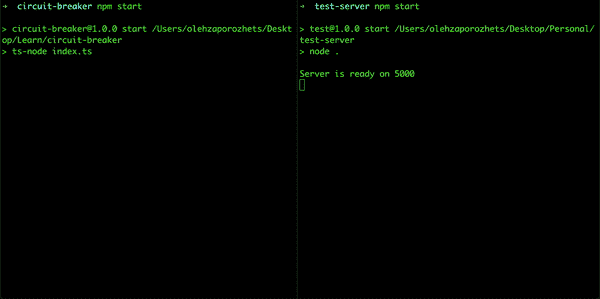

# 如何在 TypeScript 中创建断路器

> 原文：<https://betterprogramming.pub/how-to-create-circuit-breaker-in-ts-1416ba076760>

## 用纯类型脚本构建您自己的断路器


照片由 [Troy Bridges](https://unsplash.com/@esptroy?utm_source=medium&utm_medium=referral) 在 [Unsplash](https://unsplash.com?utm_source=medium&utm_medium=referral) 上拍摄

你好世界！

今天我想和你分享如何为你的代码创建另一个安全机制。我相信每个人都会发现它很有用，有人可以更新他们的知识，获得新的东西。

# 断路器？

首先，让我们弄清楚什么是断路器。从它的名字，你可能知道，它是一个自动操作的电气开关，设计用于在过载或短脉冲的情况下切断电源，以保护电路免受损坏。

这种说法对我们来说是可以接受的，唯一的区别是—我们将保护某人的系统。为了保护我们的系统，我们必须使用另一种方法——背压，但这篇文章不是关于它的。

在编程环境中，我们希望有一种机制来阻止向第三方服务发送请求。当我们使用一些其他服务时，可能需要它，但是我们受限于每分钟的请求量。

# 准备

在我们开始之前，我必须指出，有一些库提供了这个解决方案，所以没有必要自己实现它，但肯定的是，知道如何实现它是很好的。

在我们的例子中，我们将使用`axios`，因为它可以很容易地中止请求。

我们可以从一个简单的`Http`类开始我们的代码，它将负责发送请求。

它有一个非常简单的界面…

```
import { AxiosInstance } from 'axios';interface IHttp {
  instance: AxiosInstance;
}
```

…以及实施:

用法的例子:

# 履行

让我们从一个接口开始。它将只有一个公共方法来知道断路器是否打开:

```
interface ICircuitBreaker {
  getStatus(): boolean;
}
```

`CircuitBreaker`将是一个类，它接受`Http`类和一些选项。让我们也通过界面来描述这些选项:

```
interface ICircuitBreakerOptions {
  timeout: number;
  errorHandler: (error: any) => boolean;
}
```

`timeout`是断路器阻止请求的一段时间——冷却时间。

`errorHandler`是接收请求错误的功能，根据该功能的响应，断路器将被打开。我们需要它在特定时间打开断路器——通常是当我们有 429 错误而不是 400 或 404 时。

我们的基本类是这样的:

在一个构造函数中，我们接受`Http`类(以后会用到)、选项— `timeout`和`errorHandler`函数。同样默认情况下，一个类有一个`isOpen`布尔值，它指示断路器是否打开。方法`getStatus`只是返回当前状态。

现在该介绍真正的逻辑了。我们将增加两个功能`interceptErrorResponse`和`openCircuitBreaker`。第一个负责处理来自请求的错误，第二个负责断开断路器。

逻辑非常简单——当它捕捉到一个错误时，它将它传递给`this.errorHandler`。如果函数返回`true`，则意味着断路器应该打开。如果以前没有打开过，我们会触发一个相关的函数。在`openCircuitBreaker`中，我们只需改变`isOpen`的状态，并设置一个超时(从`this.timeout`开始有一个必要的持续时间)来将其切换回来。

一旦它被打开，我们需要一个机制来停止发送请求。在我们的例子中，它将是`interceptRequest`函数。

该功能使用`axios`的能力来中止请求。如果断路器打开，我们通过`cancelToken`来阻止请求的发送，并通过相关的错误信息——“断路器打开”。

毕竟，我们需要将我们的函数与来自`Http`类的`axios instance`连接起来。在构造函数内部，我们将使用`interceptors`来完成这项工作。

`this`需要不丢失断路器类的上下文。

现在完成了:

# 高级版本

然而，我们的版本运行良好，总有一些改进的空间。我提议给我们的断路器添加事件。要做到这一点，我们需要一个事件发射器，我们可以尝试自己创建它。关于创建你自己的事件发射器的文章可以在[这里](/how-to-create-your-own-event-emitter-in-javascript-fbd5db2447c4)找到。

让我们从一个界面开始:

```
interface IEventEmitter {
  on(name: string, listener: Function): void;
  removeListener(name: string, listener: Function): void;
  emit(name: string, data?: any): void;
}
```

正如你所看到的，我们未来的类将由 3 个公共方法组成:`on`用于将侦听器附加到特定事件上，`removeListener`用于移除侦听器，最后但同样重要的是——`emit`用于发出事件。

我将跳过创建事件发射器的步骤，因为这篇文章不是关于它的。以下是最终结果:

现在，我们能够将事件发射器与断路器类集成在一起。让我们从一个界面开始:

```
type CircuitBreakerEvents = 'OPEN' | 'CLOSE';interface ICircuitBreakerWithEmitter extends ICircuitBreaker {
  on(event: CircuitBreakerEvents, listener: Function): void;
}
```

…还有一门课:

区别在于:

*   我们已经更新了`constructor`和一些属性。现在它已经初始化了`EventEmitter`；
*   我们已经实现了`on`方法，它只是将事件代理给真实的事件发射器；
*   在`openCircuitBreaker`内部，我们在必要的地方触发`EventEmitter`(打开和关闭时)。

# 测试

现在是检验我们工作的时候了。首先我们需要一个第三方服务，在我们需要的时候会返回一个必要的错误。为此，我们可以创建一个简单的`express`服务器:

它具有以下逻辑—在第三次请求时返回 400 错误，在第五次请求时返回 429 错误。

好了，现在是最后一步——准备断路器和一个`http`客户端:

在`TestHttp`的帮助下，每 2 秒钟我们的服务器就会发送一个请求`GET` `http://localhost:5000/test/`。当请求返回 429 错误时- `CircuitBreakerWithEmitter`阻塞触发`http`客户端 10 秒钟。当断路器断开/闭合时，事件发射器将发送相关信息。

# 演示文稿



在上面的 gif 中，你可以看到，断路器忽略了 400 个错误(在每个第三次请求时发生)。当服务器返回 429 错误时，它会在每第 5 次请求时打开一个断路器。此外，当断路器打开时，请求不能被发送，它们被中止。

# 摘要

最后，我想再强调一次——上面的例子可以用于学习目的，而不是用于生产环境。有很多解决方案可以找到，我肯定会建议使用它们。同时，知道什么是“引擎盖下”总是好的。