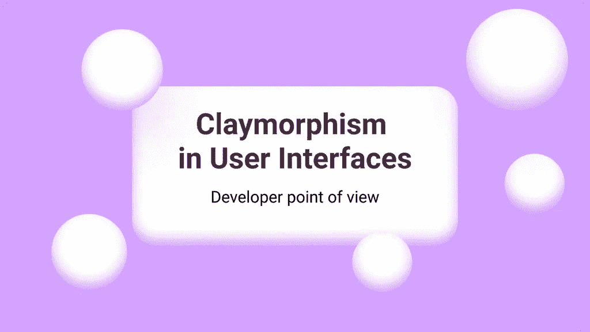
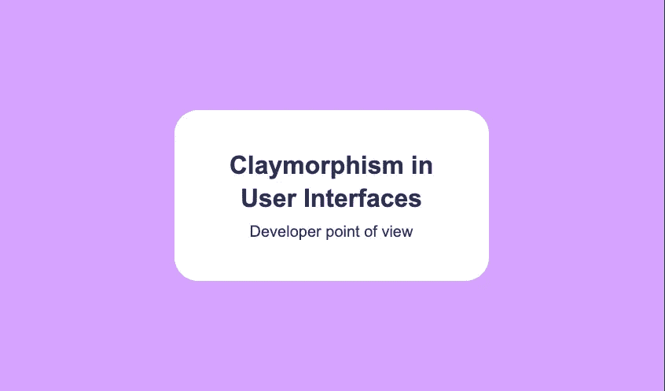
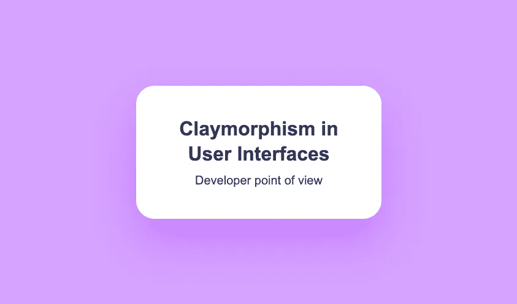
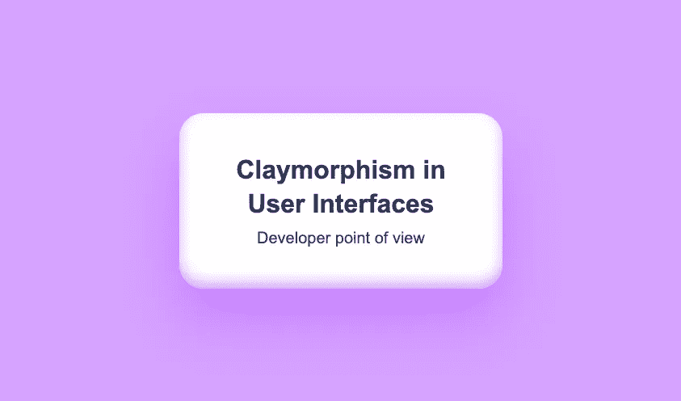
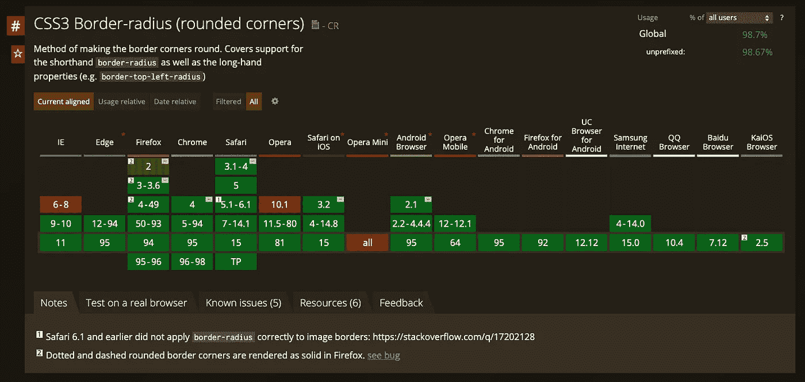
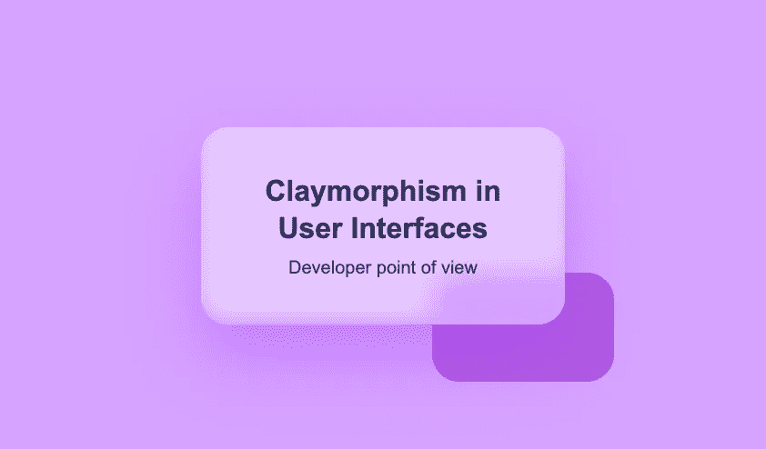

# 如何使用 CSS 创建粘土形态

> 原文：<https://betterprogramming.pub/how-to-create-claymorphism-using-css-1f57111aaa10>

## 从开发者的角度看新的 UI 设计趋势

作者图片

快到年底了，正如你所料， [Mike Malewicz](https://michalmalewicz.medium.com/) 创造了用户界面的一个趋势——Claymorphism。

这种趋势在运球和行为上越来越流行。让我从开发者的角度向你介绍 Claymorphism，并解释如何使用 CSS 创建它。

# 什么是粘土形态？

粘土形态在我们的布局中创造了一种深度错觉，它包含:

*   浅色、柔和、鲜艳的颜色
*   大圆角
*   双重内阴影
*   外部阴影

# 入门指南

本教程的要求非常低，甚至有抱负的初级前端开发人员也可以创建它。我们需要的只是 HTML 和一些 CSS 属性。

# 初始加价

让我们创建一个基本的 HTML 标记:

然后让我们为 body 标签添加一些基本的 CSS:

我们的首发出场了。现在让我们创建我们的卡片 HTML 标记，并把它放在 body 标签中:

在创建 Claymorphism 效果之前，我们可以将一些样式应用到我们的卡片上，使其看起来更好。让我们从版式、更多空间和圆角开始:

我们的结果:

厉害！现在我们的基本标记已经准备好了。现在让我们深入到盒影。

# 方框阴影—如何使用它

正如我之前提到的，粘土形态由大圆角和多个`box-shadows`组成。我们已经申请了`border-radius`，所以让我们把重点放在`box-shadow`上。

属性允许从元素投射阴影。在大多数情况下，我们只有一个阴影，但是在创造粘土形态时，我们至少需要两个！多加一个毫不费力。我们需要做的就是用逗号把它们分开，就这样！

在我的例子中，我将有一个内阴影和一个外阴影，但是你可以自由地测试它有两个以上阴影时的样子。

> 但是，嘿，艾伯特！我们如何创造内心的阴影？

很简单。我们需要在我们的阴影之前添加特殊值`inset`。这将通知我们的浏览器，这个特殊的阴影是一个内部阴影。默认情况下，我们创建外部阴影。

看看列表，`box-shadow`是由什么组成的:

*   插入物
*   偏移 X
*   偏移 Y
*   模糊半径
*   扩散半径
*   颜色

现在你知道`box-shadow`是如何工作的了。让我们把手弄脏吧。

# 粘土状阴影效果

最后，是时候创造我们的效果了。首先，我们需要添加主要的外部阴影，例如像这样:

我们已经有一张好看但很普通的卡了。

然后我们只需要添加内部阴影，就像这样:

干得好！我们已经使用 CSS 创建了粘土形态效果。

# 浏览器支持

所有的浏览器——现代的和几乎古老的如 Internet Explorer 9 或 10——都支持粘土形态的所有要求— `box-shadow`和`border-radius`。

框阴影支持:

我能用吗

边框半径支持:

我能用吗

# 粘土形态发生器

作为泥塑之旅的一部分，我们为你制作了一个[泥塑工具](https://hype4.academy/tools/claymorphism-generator)！请随意使用。

# 粘土形态+玻璃形态

是啊！我们可以将两种风格结合起来，以获得更好的效果。我们只需要添加一个背景过滤器和一些透明度到我们的白色背景。

# 2022 年的粘土形态

粘土是最好的和最新的设计趋势之一。与神经形态相反，它在可访问性方面没有问题，与[玻璃形态](http://localhost:3000/blog/glassmorphism-how-to-create)相比，所有浏览器都完美支持它。

我们练习的代号是[这里是](https://codepen.io/walickialbert/pen/ebe02d152962189c77617347da74acb1)。

我还创造了几个不同的例子:

*   [粘土矿物形态成分](https://codepen.io/walickialbert/pen/XWemYKa)
*   [粘土状和玻璃状](https://codepen.io/walickialbert/pen/GRMpGge)

*原发布于*[*https://hype 4 . academy*](https://hype4.academy/articles/coding/how-to-create-claymorphism-using-css)*。*