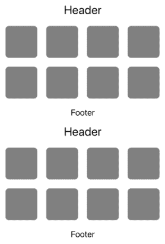
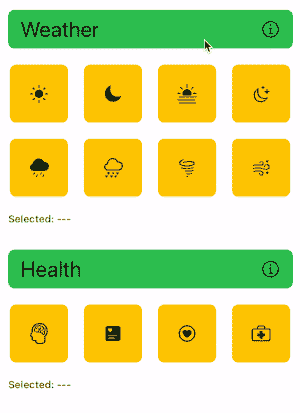

# 如何使用 UIHostingConfiguration 创建自定义页眉和页脚

> 原文：<https://betterprogramming.pub/how-to-create-custom-header-and-footer-using-uihostingconfiguration-d48b0051ae80>

## 苹果没告诉你的…


作者图片

当苹果在 WWDC 推出`UIHostingConfiguration`时，他们主要集中在展示我们如何使用它为表格和集合视图创建自定义单元格。这让我想知道是否有可能使用`UIHostingConfiguration`创建一个自定义的页眉和页脚。

经过几个小时的摸索，事实证明这是完全可行的！实现这一点的方法非常简单。事实上，数据绑定、动画和自动调整大小等特性都像是用`UIHostingConfiguration`创建的自定义页眉和页脚的魅力。

这些是一些令人兴奋的发现，我迫不及待地想与你们分享，所以让我们开始吧！

# 创建自定义页眉和页脚

## 补充意见注册

为了显示自定义页眉和页脚，我们必须首先将自定义页眉和页脚注册到集合视图。因此，让我们继续定义注册对象。

注意，我们使用`UICollectionViewCell`作为辅助视图类型。这样做将使我们能够在初始化注册对象时使用`UIHostingConfiguration`定义页眉和页脚。

`headerRegistration`和`footerRegistration`都是用相同的初始化器初始化的，只要确保传入正确的`elementKind`就可以了。

## 补充意见出列

有了这两个注册对象，我们就可以继续让定制的页眉和页脚出队了。我们将在`collectionView(_:viewForSupplementaryElementOfKind:at:)`数据源方法中这样做。

请注意，这里的`elementKind`必须与我们在注册对象初始化期间传入的`elementKind`相匹配。否则，我们将得到一个`NSInternalInconsistencyException`,原因是:

```
*The view returned from -collectionView:viewForSupplementaryElementOfKind:atIndexPath: does not match the element kind it is being used for.*
```

## 在复合布局中启用页眉和页脚

难题的最后一部分是配置集合视图的布局，以显示页眉和页脚。

如果您使用的是复合列表布局，以下是操作方法:

对于构建自定义布局的情况，您可以这样做:

好了，这就是使用`UIHostingConfiguration`创建自定义页眉和页脚的全部内容。这是我们刚刚创建的页眉和页脚的截图。



简单的页眉和页脚

# 准备好接受挑战了吗？

在这个阶段，我们基本上可以创建任何类型的布局和交互，只要它可以使用 SwiftUI 实现。这是一个带有自定义页眉、页脚和单元格的布局，我完全是使用`UIHostingConfiguration`和 SwiftUI 构建的。



自定义页眉和页脚构建`UIHostingConfiguration`和 SwiftUI

你觉得你能自己造一个吗？

这里有一些让你开始的提示:

1.  您可以使用[这篇](https://swiftsenpai.com/development/swiftui-custom-cell/)文章中介绍的概念来创建一个自定义单元格。
2.  使用单元格的`configurationUpdateHandler`用红色边框高亮显示所选单元格。点击可以了解更多[。](https://swiftsenpai.com/development/uihostingconfiguration-cell-interactions/)
3.  使用 SwiftUI 数据绑定技术用选定的符号名称更新页脚。更多关于那个[这里](https://swiftsenpai.com/development/refresh-cells-uihostingconfiguration/)。
4.  标题高度变化动画只是一个基本的 SwiftUI 过渡动画，由于 iOS 16 中`UICollectionViewCell`的自调整大小特性，不需要做额外的工作。

如果你不知何故卡住了，不要担心。你可以随时在 Github 上的这里查阅完整的示例代码[。](https://github.com/LeeKahSeng/SwiftSenpai-UICollectionView-SwiftUI)

```
**Want to Connect?**I hope you enjoyed this article. If you did, feel free to follow me on [Twitter](https://twitter.com/Lee_Kah_Seng) so you won’t miss any of my upcoming iOS development-related articles.
```