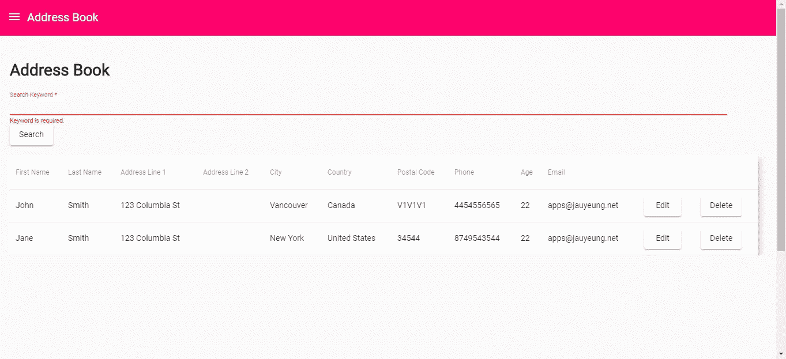

# 如何在 Angular 中创建自定义管道

> 原文：<https://betterprogramming.pub/how-to-create-custom-pipes-in-angular-96cfffbb9c4f>

## 使用 Angular 构建地址簿应用程序


[田宽](https://unsplash.com/@realaxer?utm_source=unsplash&utm_medium=referral&utm_content=creditCopyText)在 [Unsplash](https://unsplash.com/search/photos/pipes?utm_source=unsplash&utm_medium=referral&utm_content=creditCopyText) 上的照片

Angular 是一个用于构建应用程序的综合框架。它使用管道(代码片段)将一个对象映射到另一个对象。管道可以用在模板或其他代码中。

在这一部分，我们将构建一个地址簿应用程序，具有添加和编辑联系人的功能。我们还将添加一个搜索框，使用管道来搜索联系人。

这是一个简单的应用程序。它有一个在表格中列出联系人的主页。每一行都有一个编辑按钮和一个删除按钮，前者会弹出一个对话框，允许用户编辑他们的联系人，后者允许您删除当前行中的联系人。

为了开始构建应用程序，我们首先通过运行`npm i -g @angular/cli`来安装 Angular CLI。确保包括路由和使用 SCSS 的风格时，提示。然后我们通过运行`ng new template-drive-form-app`来创建项目。

接下来，我们安装一些库。我们需要一个 flux store 来简化数据传递，还需要另一个库来验证用 Angular 不容易验证的表单数据。我们使用`@ngrx/store`存储 flux，使用`ng2-validation`添加额外的表单验证功能。棱角分明的材质部件让我们的应用看起来很吸引人。我们通过运行`npm i @ngrx/store ng2-validation @angular/cdk @angular/material`来安装它们。

现在我们已经准备好构建我们的应用程序了。我们通过运行`ng add @ngrx/store`添加 flux store 样板文件。这将创建一个`reducers` 文件夹，其中包含一个`index.ts`文件。

然后我们创建我们的组件。我们运行以下命令:

```
ng g component contactDialog
ng g component contactForm
ng g component contactFormPage
ng g component homePage
ng g component topBar
ng g service contact
ng g class exports
ng g pipe searchContacts
```

这就创建了我们需要的组件和服务。`exports.ts`文件将包含我们的国家列表。

在`environment.ts`中，我们把:

```
export const environment = {
  production: false,
  apiUrl: '[http://localhost:3000'](http://localhost:3000')
};
```

这将允许我们连接到我们的 JSON 服务器 API，它允许我们将数据保存到一个 JSON 文件中，而无需创建我们自己的后端。它以 Node.js 包的形式提供。该包装的详细说明位于[这里](https://github.com/typicode/json-server)。

首先，我们添加搜索文件来过滤 contacts 数组中的条目。在`search-contacts.pipe.ts`中，我们把:

这将在 contacts 数组中查找任何包含用户给定关键字的属性。如果`contacts`是一个数组，它进行搜索，否则，它返回对象。它将搜索关键字作为第二个参数。

接下来在`contact-dialog.component.ts`中，如果上面的`ng g`命令都运行，我们应该得到，我们把:

在联系人更新后，这将为我们提供来自服务器的联系人。

在`contact-dialog.component.html`中，我们输入:

```
<h2>Edit Contact</h2>
<app-contact-form [edit]='true' [contact]='contactData' (contactEdited)='getContacts()'></app-contact-form>
```

我们将`edit`和`contact`值作为输入传递给`app-contact-form`元素。一旦联系人被更新，`(contactEdited)`事件就被发送到这个组件，它获取联系人并更新商店。

接下来在`contact-form.component.ts`中，我们放入:

这是我们返回正则表达式模式来动态验证电话和邮政编码格式的地方。它还允许我们根据之前传入的`edit`输入是否为真来添加或更新联系人。一旦保存了联系人，我们就更新存储或者向父节点发出`contactEdited`事件，然后从后端更新联系人存储。

在`contact-form.component.html`中，我们输入:

这是用于验证联系人数据的表单。`range`和`email`输入由`ng2-validation`提供。`required`属性由 Angular 提供。`#inputName=’ngModel’ name=’inputName’`需要在您的输入中进行验证。例如，在电话号码输入中，如果您提供`#phone=’ngModel’ name=’phone’`，您可以使用以下代码显示电话号码验证的错误:

```
<mat-error *ngIf="phone?.invalid && (phone.dirty || phone.touched)">
  <div *ngIf="phone.errors.required">
      Phone is required.
  </div>
  <div *ngIf="phone?.invalid">
      Phone is invalid.
  </div>
</mat-error>
```

我们用`phone.errors.required`检查是否存在`required`错误，用`phone?.invalid`检查无效格式错误。将`pattern`属性添加到表单字段中，以根据正则表达式进行验证——它可以是动态的，也可以是静态的。如果它是静态的，我们把它放入动态属性`pattern`的值中，否则，我们可以像以前一样写一个函数来返回正则表达式。

`ng2-validation`包的工作方式也是如此。我们定义了`#age=’ngModel’ name=’age’`。对于年龄字段，我们通过添加`[range]=”[0, 200]”`来定义我们希望有效的范围，然后以类似的方式检查和显示错误:

```
<mat-error *ngIf="age?.invalid && (age.dirty || age.touched)">
  <div *ngIf="age.errors.required">
    Age is required.
  </div>
  <div *ngIf="age?.errors?.range">
    Age is invalid.
  </div>
</mat-error>
```

`ng2-validation`包向`age`表单字段的`errors`对象提供了`range`字段，这使得检查数字范围变得很容易。

在`contact-form-page.component.html`中我们放入:

```
<h2>Add Contact</h2>
<app-contact-form></app-contact-form>
```

这将显示联系人表单，用于添加联系人。

在`home-page.component.ts`中我们放入:

这将获取联系人数据并将其显示在表格中，让用户单击“编辑”打开“编辑联系人表单”对话框，然后单击“删除”删除他们的联系人。

在`home-page.component.html`中，我们把:

这将显示表格。我们之前创建的用于过滤结果的`searchContacts`管道被传入。我们传递管道名和用冒号分隔的参数来使用管道——如上面模板中的`searchContacts:searchData.keyword`所示。

然后在`home-page.component.scss`中，我们放入:

```
th,
td {
  padding: 10px !important;
}table.mat-table {
  width: 95vw;
}
```

这为我们的表格单元格添加了一些填充，并改变了表格的宽度。

在`top-bar.component.ts`中，我们有:

这允许用户使用菜单按钮打开和关闭菜单。

在`top-bar.component.html`中，我们有:

在`top-bar.component.scss`中，我们添加:

这增加了图标和文本之间的间距。

然后我们在`reducers`文件夹中创建`contacts-reducers.ts`和`menu-reducers.ts`。

在`contacts-reducer.ts`中，我们把:

在`menu-reducer.ts`中，我们把:

在`reducers`文件夹的`index.ts`中我们放入:

这三个文件组成了我们用来存储联系人和菜单状态的 flux store。

在`app-routing.module.ts`中，我们把:

这使我们能够通过链接和在浏览器中键入 URL 来访问路由。

在`app.component.ts`中，我们添加了菜单和路由器出口，允许我们查看我们的页面:

在`app.component.html`中，我们把:

为了显示我们上面描述的那些元素，我们将其添加到`app.component.scss`:

这会添加一些填充并设置最小页面高度。

我们需要代码来发出获取、保存和删除联系人的 HTTP 请求。在`contact.service.ts`中，我们把:

这使得我们的要求。以上组件中使用了这些函数。

在`app.module.ts`中，我们放入:

这将添加我们运行应用程序所需的所有库和组件。

在`styles.scss`中，我们把:

引导文件用于以响应的方式显示表格，这是 Angular Material 不提供的。它是在[https://getbootstrap.com/docs/3.4/customize/](https://getbootstrap.com/docs/3.4/customize/)生成的，只检查网格系统和表格选项，提取下载的文件并把它们放在`assets`文件夹中。

最后，我们运行`npm install -g json-server`来安装 JSON 服务器，转到我们的项目文件夹并运行`json-server — watch db.json`，这样它将创建一个 JSON 文件来存储我们的数据。

最终，我们会得到这样的结果:

