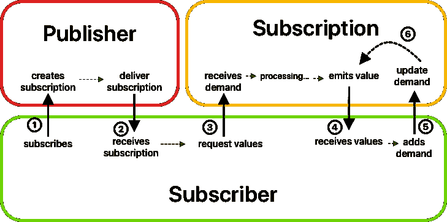

# 如何在 Combine 中创建自定义发布者

> 原文：<https://betterprogramming.pub/how-to-create-custom-publishers-in-combine-if-you-really-need-them-5bfab31b4ade>

## 如果你真的需要它们

照片由 [Jason Leung](https://unsplash.com/@ninjason?utm_source=unsplash&utm_medium=referral&utm_content=creditCopyText) 在 [Unsplash](https://unsplash.com/s/photos/newspaper?utm_source=unsplash&utm_medium=referral&utm_content=creditCopyText) 上拍摄

正如您在联合学习路径中看到的，发布者和订阅者相互合作，创建了一个强大的工具来交换应用程序内部的信息。

也许框架提供的发布者对于你的工作来说已经足够了，但是定制发布者呢？有没有可能创建自定义的，如果有，怎么做？

当然，它是，而且它并不像乍看起来那样复杂。首先，为了创建一个工作流，我们需要三样东西:

1.  出版者
2.  签署
3.  订户

使用 Combine，你看到的主要是发布者和订阅者——但是真正神奇的交流是通过**订阅**实现的。

事实上，发布者创建了一个包含所有必需数据的订阅，并将其提供给订阅者。

一旦订阅者接收到订阅并且实体之间的真实通信被创建，订阅就开始其引擎随时间处理值。

# **认购机制**

让我们看看这三个组件是如何工作的，以及它们之间是如何相互作用的。这将简化我们对定制发布者的理解，因为我们将清楚为了使异步通信工作需要什么。

1.  订阅者订阅发布者。这通常通过`sink()`方法来完成，该方法允许程序员管理完成和发布者接收的值。
2.  发布者创建订阅并将其传递给订阅者。订户通过`receive(subscription:)`方法接收订阅。
3.  既然订阅者拥有订阅，并且它和发布者之间已经签订了合同，那么它可以向发布者请求值。这是通过调用`request(_:)`发送它想要的值的数量来完成的。
4.  订阅接收需求并开始处理信息和发出值。使用订户的`receive(_:)` 方法逐个发送这些值，直到达到最大需求。
5.  订阅者从订阅中接收值，作为响应，它发送一个新的`Demand`。注意，所发送的`Demand`在先前已经发送的请求的基础上增加了它想要接收的值的数量，因为所请求的值的数量可以增加或保持不变，但永远不会减少。
6.  一旦`Subscription`接收到`Demand`，它将再次开始整个处理过程，并发出值，直到满足需求。无限重复步骤 4、5 和 6。

正如您可能已经注意到的，整个交流非常简单，一旦理解，实现定制发布者是一项可行的任务。

有时，实现发布者协议本身是不必要的，同样的目标可以通过其他方式实现:

1.  你可以使用一个`PassthroughSubject`，例如`Subject`的子类，通过调用它的 `send(_:)`方法来发布值
2.  每当你更新主题的值时，使用一个`CurrentValueSubject`来发布。实际上，`CurrentValueSubject`是一个主题，它包装了一个值，并在值改变时发布一个新元素。
3.  在属性上使用`@Published`注释，以便属性获得一个发布者，该发布者在属性值改变时发出一个事件。这种方法在 SwiftUI 中被大量使用。

如果您需要一个定制的 publisher 来满足您的需求，最简单的方法是创建一个 Publisher 名称空间的扩展。

让我们试一试。

假设您想要创建一个新的操作符，因为标准的操作符没有实现您需要的功能。举一个更具体的例子，假设您想要[从 RxSwift](https://github.com/ReactiveX/RxSwift/blob/master/RxSwift/Observables/Sample.swift) 中重新创建一个操作符，这是您可能知道的另一个 Swift 声明性框架。

操作符所做的是:获取两个发布者，合并它们，删除重复的，并发出输出。

最复杂的是方法签名，但是不要担心，它比你想象的要简单。首先，它返回一个`AnyPublisher`，其输出和失败类型与您正在处理的当前发布者相同。

**提示:使用 AnyPublisher 作为返回类型是一个很好的选择，因为当链接操作符时，很容易使签名变得复杂。**

接下来，因为必须比较两个发布者的输出，所以输出必须采用等价的协议。注意通用用法是如何应用的。我们想让它通用化；否则，运营商就失去了与任何类型的发行商合作的通用性。

函数的主体很简单:我们将发布者与另一个作为参数传递的发布者组合起来，然后调用另外两个基本操作符:`removeDuplicates`和`map. eraseToAnyPublisher(_:)`方法允许操作符被转换为前面推荐的`AnyPublisher`。

你看到这有多容易了吗？那么一个全新的出版商呢？

为了让这个例子更清楚，如果你熟悉来自`URLSession`类的`dataTaskPublisher()`，我们将尝试重新创建同样的行为，创建一个新的发布者和一个新的订阅。

请注意，您可以创建一个新的发布者，而不是一个新的订阅者，但是问题可能会出现，因为您失去了处理订阅者需求的能力，这使得联合生态系统的实现变得棘手。

# **订阅**

让我们从创建订阅开始，扩展`Publishers`枚举。

正如我们在订阅机制中看到的，订阅对象从`Publisher`传递到`Subscriber`等等。这个场景使类，而不是结构，更适合我们的需要，因为我们想通过引用传递它，而不是制作副本。

在类签名中，我们根据标准`URLSession`方法返回的内容，指定`Input`类型为`Data`，指定失败为`Error`。

我们需要一个`URLRequest`来处理(我们也可以使用一个 URL 并进行不同的实现)和一个订阅者，我们向其传递数据和收到的错误。

两个属性都是通过构造函数初始化的。当然，订阅者必须是可选的，因为，正如您可以想象的，它可以附加到订阅，也可以不附加，这取决于程序的当前状态。

事实上，我们还需要 cancel 方法将订阅者置为零。

在`sendRequest`中，奇迹发生了。我们在`URLSession`对象上调用普通的`dataTask`方法，并使用 map 函数将它绑定到订阅者。

# **发布者**

现在是时候创建一个发布者了。出版商基本上是一个结构。

在我们采用了发布者协议之后，我们必须定义输出和失败，在我们的例子中是数据和错误。

自定义初始化器用于实例化 URLRequest 对象，该对象携带关于要联系的服务器和配置的信息。

`receive(subscriber:)`方法是`Publisher`的核心。首先，在签名中，我们必须检查失败和输出类型，以确保`Subscriber`符合`Publisher`类型。然后创建一个新的订阅并传递给订阅者，使订阅机制工作！

最后但同样重要的是，为了确保订阅者能够从`DataPublisher`接收值，我们应该创建一个返回`DataPublisher`的方法，这样我们就可以应用例如`sink()`方法并对发布者发出的数据执行操作。

它的用法可以是这样的。

既然您已经了解了订阅机制的工作原理以及如何实现自定义发布器，那么您就可以用 iOS 生态系统中的其他组件来测试它了！

要查看本文中使用的所有代码，请访问以下页面:

[custom operator . playground](https://github.com/LoZimmero/CombinedTutorials/tree/master/CustomOperator.playground)

[custom publisher . playground](https://github.com/LoZimmero/CombinedTutorials/tree/master/CustomPublisher.playground)

如果您想探索其他主题，请访问我们在 GitHub 上的资源库:

 [## LoZimmero/联合教程

### 在 GitHub 上创建一个帐户，为 LoZimmero/CombinedTutorials 的发展做出贡献。

github.com](https://github.com/LoZimmero/CombinedTutorials)