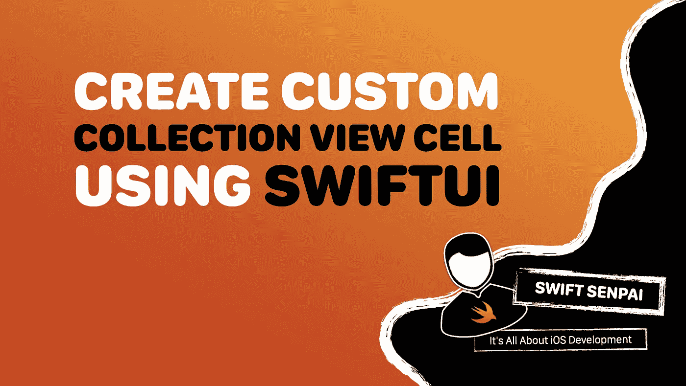
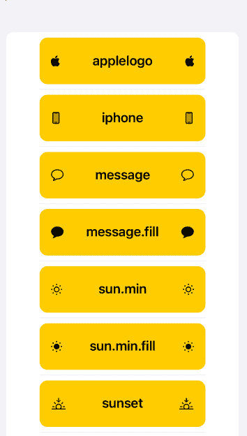
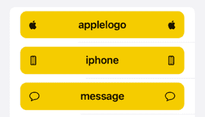
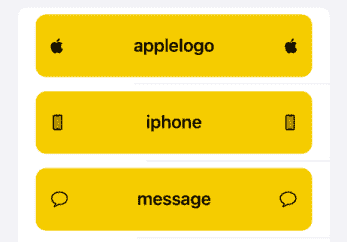
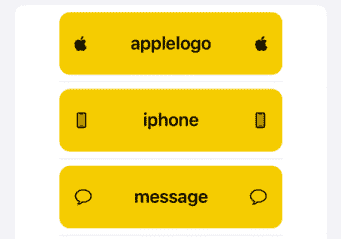

# 如何在 iOS 16 中使用 SwiftUI 创建自定义 UICollectionViewListCell

> 原文：<https://betterprogramming.pub/how-to-create-custom-uicollectionviewlistcell-using-swiftui-in-ios-16-c75350492bfc>

## 定义您自己的布局



作者图片

每当我使用故事板或 XIB 文件来创建自定义的`UICollectionView`或`UITableView`单元格布局时，我总是想，如果我能使用 SwiftUI 来定义布局，那不是很好吗？在今年的 WWDC (2022)上，苹果终于实现了这一点。

在本文中，我们将探索如何使用集合视图和 SwiftUI 构建下面的列表。



示例应用程序

在本文结束时，您将了解到:

1.  如何使用`UIHostingConfiguration`
2.  如何调整单元格高度
3.  如何调整分离器插入
4.  如何调整单元格的布局边距

这里涉及的话题很多，所以让我们直入主题吧。

# 做好准备

在进入主题之前，我们需要做一些事情。首先，将 SwiftUI 模块导入到视图控制器类中。

```
import SwiftUI
```

之后，定义以下数据类型，它们将作为我们列表的数据模型:

接下来，配置我们的集合视图以使用列表布局配置。

在上面的代码中，注意我们没有使用不同的数据源。使用 SwiftUI 创建自定义单元时，不同的数据源不是必需的。此外，由于我们正在构建的列表显示了一个静态数据集，使用传统的数据源要简单得多，也更容易理解。

最后，让我们实现所需的`UICollectionViewDataSource`方法:

注意上面代码中使用的`swiftUICellRegistration`,我们一会儿会处理它。现在，只要记住使用`swiftUICellRegistration`是我们将自定义 SwiftUI 单元与集合视图链接起来的方式。

所有这些都结束了，我们现在可以开始有趣的事情了。

# 使用 Using 配置

在 iOS 16 之前，要[创建自定义](https://swiftsenpai.com/development/uicollectionview-list-custom-cell/) `[UICollectionViewListCell](https://swiftsenpai.com/development/uicollectionview-list-custom-cell/)`，需要创建`UICollectionViewListCell`的子类，定义一个符合`UIContentConfiguration`协议的自定义配置对象，有些麻烦。

随着 iOS 16 中`UIHostingConfiguration`的引入，现在可以使用 SwiftUI 定义自定义单元格的布局和内容，无需创建`UICollectionViewListCell`子类和自定义配置对象。

基于[苹果的文档](https://developer.apple.com/documentation/SwiftUI/UIHostingConfiguration),`UIHostingConfiguration`结构符合`UIContentConfiguration`协议。因此，我们可以在小区注册期间使用它，如下所示:

从上面的代码中，您需要注意两件事。

首先，我们用于小区注册的小区类型是`UICollectionViewListCell`(不是`UICollectionViewCell`)。因为我们正在建立一个列表，使用`UICollectionViewListCell`将会获得一些有用的功能，比如:

1.  显示电池附件的能力
2.  调整分离器插入的能力(稍后将详细介绍)
3.  各种单元外观(基于集合视图的布局配置)

第二，注意我们将单元格注册定义为一个实例变量(`swiftUICellRegistration`)。正如您之前看到的，这使我们能够在集合视图的数据源方法中使用`swiftUICellRegistration`。

好了，说够了。让我们使用 SwiftUI 来定义单元格的布局和内容，以查看运行中的一切。

此时，如果您尝试运行示例代码，您将看到下面的单元格被填充。



使用 UIHostingConfiguration 创建自定义单元格布局的结果

# 进行调整

## 调整单元格高度

从上面的图像中，您应该注意到我们当前的单元格高度比我们预期的要小一点。正如我在[之前的一篇文章](https://swiftsenpai.com/development/custom-uicollectionviewlistcell-in-ib/)中提到的，`UICollectionViewListCell`是一个自我调整大小的单元格。这意味着它会根据布局和内容自动调整大小。

考虑到这一点，我们可以通过简单地增加`HStack`的高度来轻松增加电池高度。

> **注意**:在设置黄色背景视图之前，一定要设置`HStack`的边框，否则黄色背景视图高度不会相应增加。

以下是最终结果:



高度已调整的单元格

## 调整分离器嵌件

目前，分隔符的前缘与单元格中的文本对齐。这是从`UICollectionViewListCell`继承的默认行为。可惜，这不是我们想要的。

为了实现我们想要的，我们可以像这样使用`alignmentGuide`修饰符:

上述代码所做的是将分离器前缘与`HStack`前缘对齐，并将分离器后缘与`HStack`后缘对齐。以下是我们将得到的结果:


调整后的单元格分隔符插图

## 调整单元格的布局边距

默认情况下，根据 UIKit 中单元的布局边距，单元的 SwiftUI 内容从单元的边缘插入。要覆盖默认边距，我们可以使用`UIHostingConfiguration`的`margins`修改器来完成。

至此，我们的定制单元达到了它的最终形式。



内容边距已调整的单元格

现在，我们已经使用 SwiftUI 完成了自定义单元的构建，我们可以通过为自定义单元布局创建一个专用的 SwiftUI 视图来执行简单的重构。

有了这些，我们现在可以像这样创建`UIHostingConfiguration`:

注意我们如何在初始化期间通过传入`item`对象来配置`MyFirstSwiftUICell`的内容。

通过这个简单的重构，我们成功地提高了代码在创建`UIHostingConfiguration`时的可读性。此外，我们还将自定义单元格的布局转换为可重用的组件。

# 包扎

我在本文中使用的例子主要集中在创建一个定制的`UICollectionViewListCell`，但是这并不意味着您不能使用`UIHostingConfiguration`来创建一个定制的`UICollectionViewCell`。事实上，根据苹果公司的说法，`UIHostingConfiguration`被设计成能够在`UICollectionViewCell`和`UITableViewCell`上工作。

不过一定要注意`UIHostingConfiguration`只在 iOS 16 及以上版本才有。如果你的应用仍然需要支持低于 iOS 16 的 iOS 版本，你可能会考虑退回到[非 SwiftUI 方式](https://swiftsenpai.com/development/uicollectionview-list-custom-cell/)。

最后但同样重要的是，这里是[完整的示例代码](https://github.com/LeeKahSeng/SwiftSenpai-UICollectionView-SwiftUI)。

感谢阅读。

```
**Want to Connect?**Reach me out on [Twitter](https://twitter.com/Lee_Kah_Seng) if you have any questions.
```