# 如何创建自定义 UITableViewCell

> 原文：<https://betterprogramming.pub/how-to-create-custom-uitableviewcell-f4e69193bab>

## IOS 编程指南

## 有时你需要一个比现成的更复杂的用户界面


照片由 [Fabian Grohs](https://unsplash.com/@grohsfabian) 在 [unsplash](https://unsplash.com/) 上拍摄

`UITableViewCell`(又名单元格)是为 IOS 设备开发时使用最多的视图之一。它非常有用，可以根据任何开发人员的喜好轻松定制。

在苹果引入自动布局和堆栈视图的概念之前，开发人员有时会为不同的设备创建多个视图(即 iPhone vs. iPad)。

我将向您展示如何创建一个定制的自适应`UITableViewCell`，而不是创建两个单独的视图。

为了简洁起见，我创建了一个启动项目。可以在 [GitHub](https://github.com/Petey509/CustomTableViewCell) 上下载。需要具备 Swift[语言和 Xcode 编辑器的基础知识。](https://developer.apple.com/swift/)

一旦你下载了文件，打开它，里面应该有两个项目。打开启动一次。完成的项目是我们要在这里实现的最终版本。我鼓励你从创业开始。

构建并运行项目，您应该有一个包含空单元格的表格视图。这些单元格故意留空。我们的应用程序将显示演员的全名、电子邮件和评级。

我已经在解决方案中硬编码了一组参与者。我们的自定义单元格将以两种方式运行。一个用于 iPhone，另一个用于 iPad。

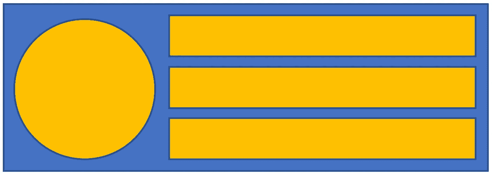

iPhone 设计布局

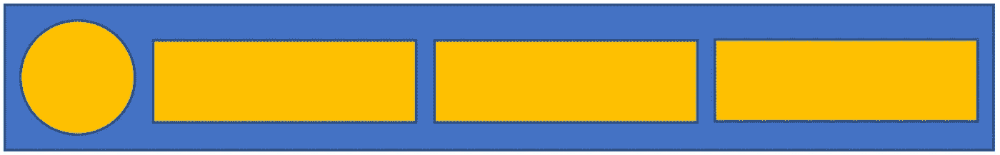

iPad 设计布局

一旦你理解了如何构造具有适应性的 UI，你就可以提出你的设计了。让我们开始吧。

添加一个新文件(Command + N)，选择*可可触摸类* >，然后选择`UITableViewCell`作为子类，并将类命名为`ActorTableViewCell`。

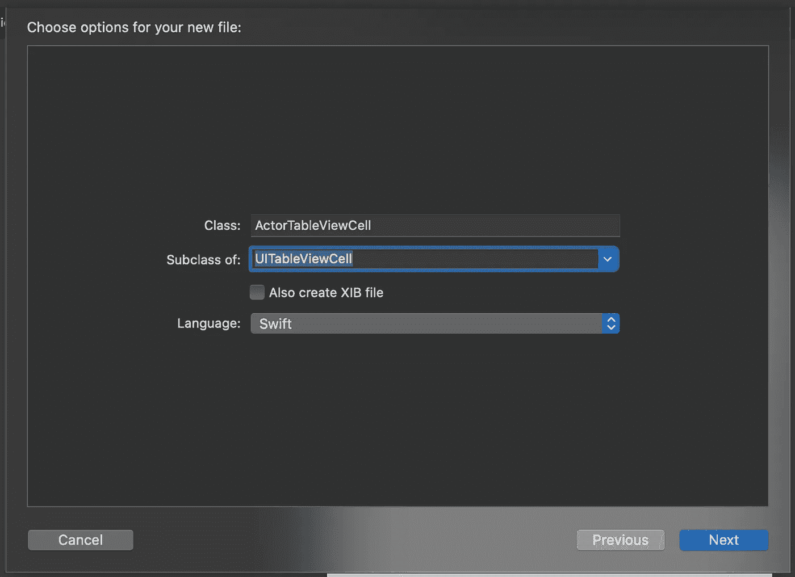

选择*下一个* > *创建*。

我们需要做一些数学计算，以确保得到我们想要的测量值。

我的 iPhone 设计标签的高度将是 44px。因此，图像尺寸将`(44*3)+(5*2) => 142` 为既宽又高。

现在我们知道了图像的尺寸，我们可以找到单元格的高度。我想在图像的顶部和底部都添加 5px。

使用 iPhone 时的桌子高度应该是`Image height+ (5*2) => 152.`对于 iPad，我们将桌子高度设置为`75`，图像的宽度和高度都是`65` = > `75-(5*2)`。

剩余的空间将用于显示三个标签。如果这有点令人困惑，那么一旦我们开始设计视图，它就会变得有意义。

让我们添加一个变量来存储我们的表格高度。将这段代码添加到您的`MainTableViewController.swift`文件中，就在`actors`变量之后。

```
var rowHeight : CGFloat!
```

在`viewDidLoad`方法中，将这段代码添加到代码行`self.actors = getActors()`之前。

```
//Assuming you're developing for only iPhone and iPad, otherwise do more checks for other Apple devicesself.rowHeight = UIScreen.main.traitCollection.userInterfaceIdiom == .phone ? 152 : 75self.tableView.rowHeight = self.rowHeight
```

构建并运行后，你会发现 iPhone 和 iPad 的单元格都比以前大了。点击`Command + Shift + L`，键入 image，并将图像视图拖动到单元格上。调整大小，直到它适合单元格。

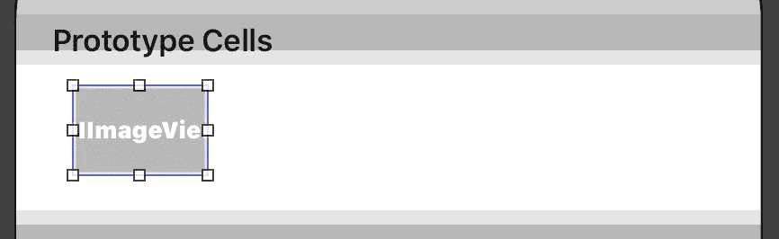

在文档大纲中，选择图像视图，按住 Command，然后将鼠标拖到内容视图上。

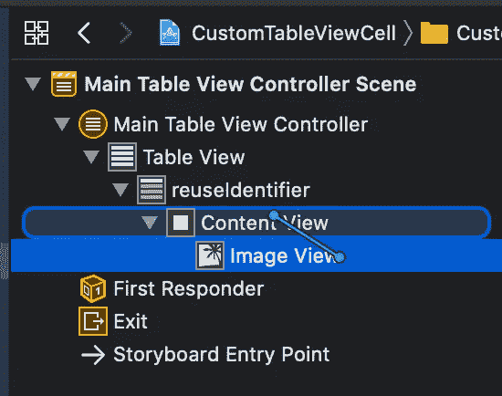

您应该会看到弹出菜单。按住命令并选择*到容器*的前导/顶部/底部空间。

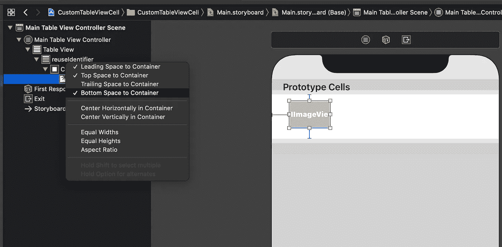

现在，您的图像视图下应该有三个约束。选择所有三个，并将属性检查器中的常数值设定为 5。

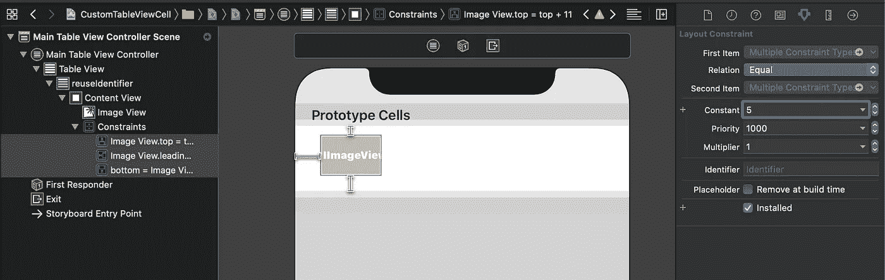

我们已经覆盖了图像的高度，现在我们需要设置宽度。

选择图像并添加约束。如果你不熟悉约束按钮，它在主编辑器的右下方，看起来像一艘小飞船。

您应该看到一个弹出菜单，单击宽度，并将值设置为 142，然后单击“添加约束”按钮。

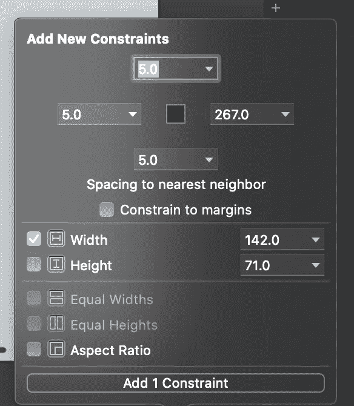

这个值将适用于所有设备尺寸，我们需要告诉它使用`65`的 iPad。

单击图像下方的约束，单击属性检查器中*常量*左侧的`+`符号，并选择*常规*作为宽度和高度。将值设置为`65`。

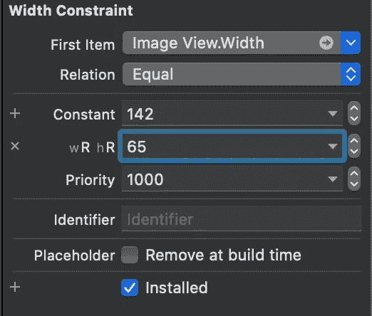

好了，我们完成了图像约束。

点击`Command + Shift + L`并输入`label`。将三个标签拖到单元格上，并将它们的背景设置为黄色。

为了方便起见，让我们在`Main.Storyboard`中增加单元格的高度。不要担心，当应用程序加载时，该值将被`viewDidLoad`方法覆盖。添加标签后，您的单元格应该如下所示。

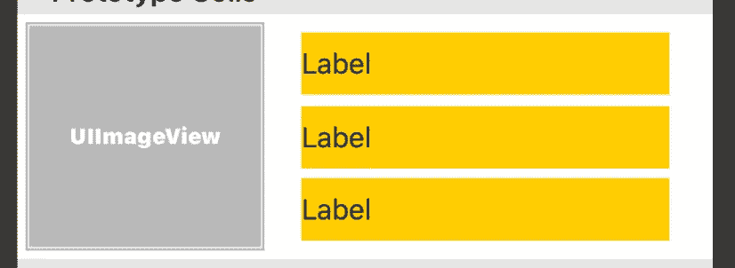

我们的设计正在进行中，但是在我们开始填充值和查看 UI 的自适应部分之前，还有一些工作要做。

选择所有三个标签，并将它们嵌入到一个`UIStackView`中。如果您不熟悉堆栈视图，右下角的按钮看起来像框中的向下箭头。

在*文档* *轮廓*中，折叠图像视图，然后展开堆栈视图。

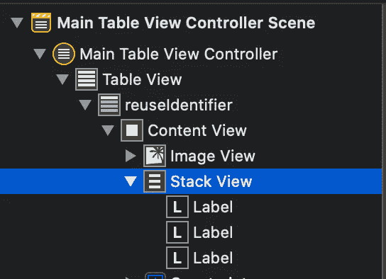

按住 Command 并拖动鼠标到内容视图，你应该看到一个弹出菜单，一旦你放开鼠标。按住命令并选择*容器顶部/尾部/底部空间*。

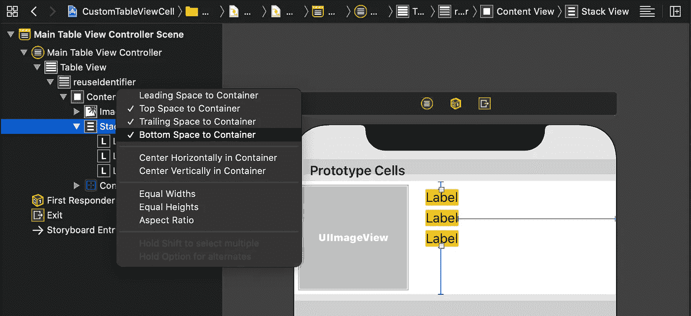

展开约束，选择刚刚添加的约束，在属性检查器中将常量值设置为`5`。再次点击常量旁边的+号，选择*常规*的宽度和高度。将该值设置为`15`。

所有的约束现在都应该被设置为`5`。但是如果您选择 iPad，这三个约束的值将变为`15`。

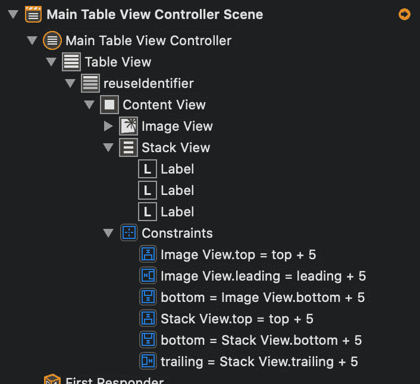

选择堆栈视图并按住命令，然后将鼠标拖向图像视图。

你应该会看到一个弹出菜单，点击*水平间距*。将常量值设置为`10`，点击+号，将宽度和高度都设置为*常规*，然后将值设置为`20`。

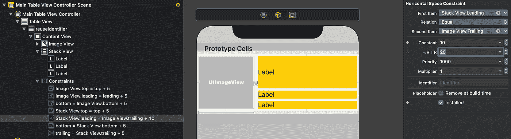

再次选择堆栈视图，在属性检查器中，将*分布*设置为*填充均匀，* *间距* 设置为`5`。点击*轴*旁边的+号，选择*常规*的宽度和高度，并将数值设置为*水平*。


为了查看我们已经完成的 UI，选择 image 视图并将背景设置为黄色，就像您对标签所做的那样。

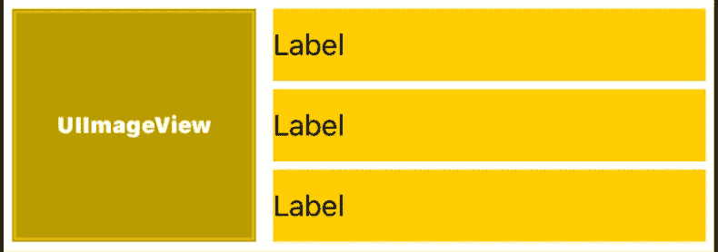

在 iPhone 和 iPad 模拟器上构建和运行。图像还不是圆形的，但是我们会在填充单元格时解决这个问题。构建并再次运行，你应该有下面的 iPhone 图片。

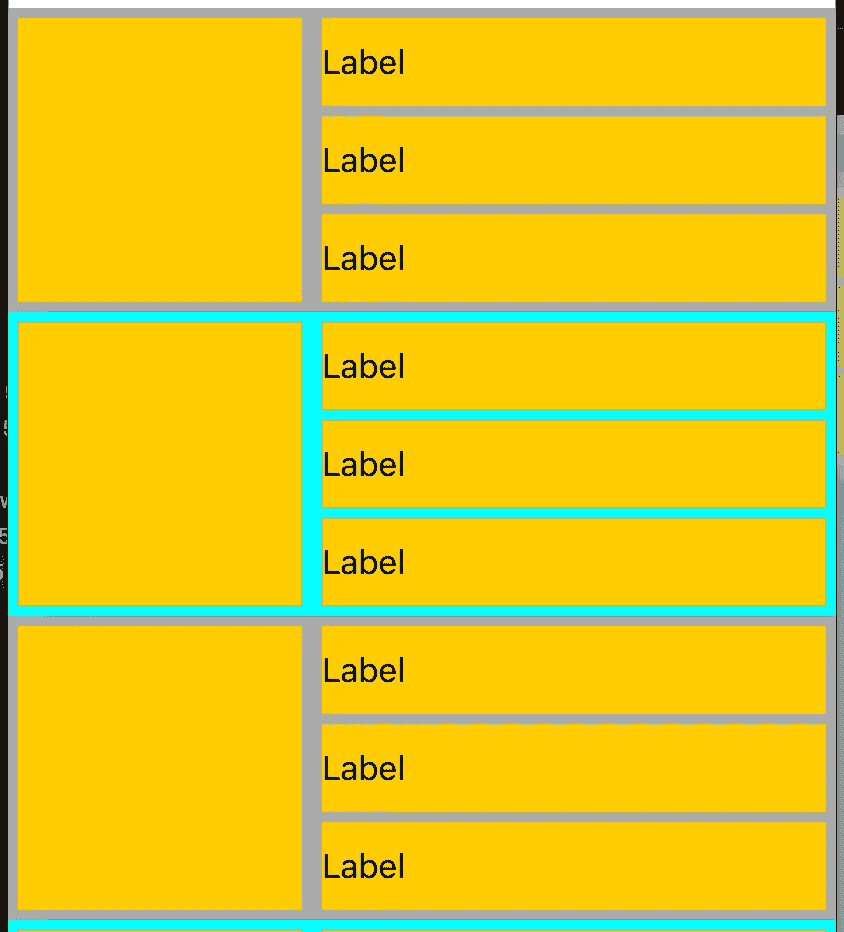

您还应该看到下图中的 iPad。

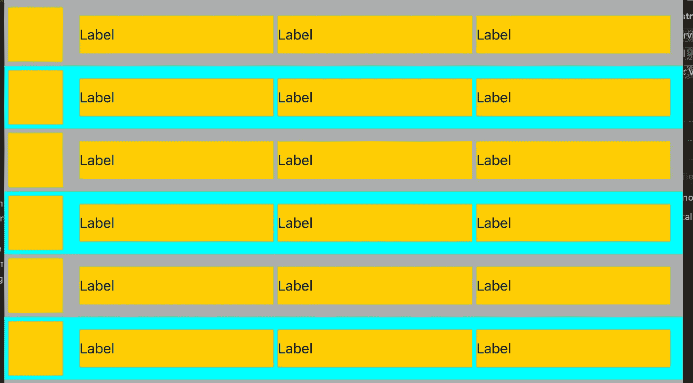

我们都完成了用户界面。让我们把它连接到我们的数据源。

向主区域添加一个新编辑器。在左边的编辑器中，选择`ActorTableViewCell`文件并删除类中的所有内容。它现在应该看起来像这样。

```
import UIKitclass ActorTableViewCell: UITableViewCell {}
```

在右边的编辑器中，选择`Main.Storyboard`。

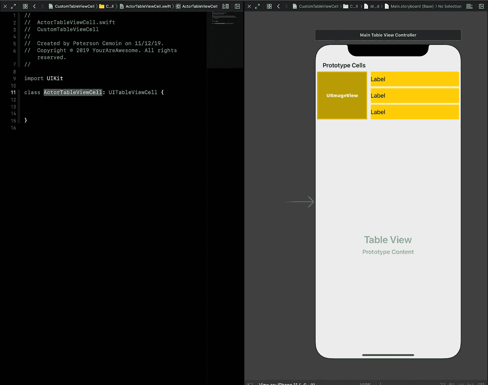

选择单元格，并在身份检查器中将类名设置为`ActorTableViewCell`。

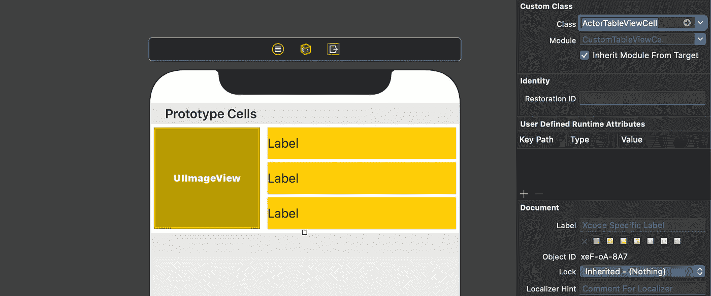

现在我们的用户界面连接到了我们的类，我们可以在类中添加用户界面元素来表示我们的用户界面。选择第一个标签，按住 Command 键，向左拖动鼠标，然后放开。您应该会看到一个弹出菜单。

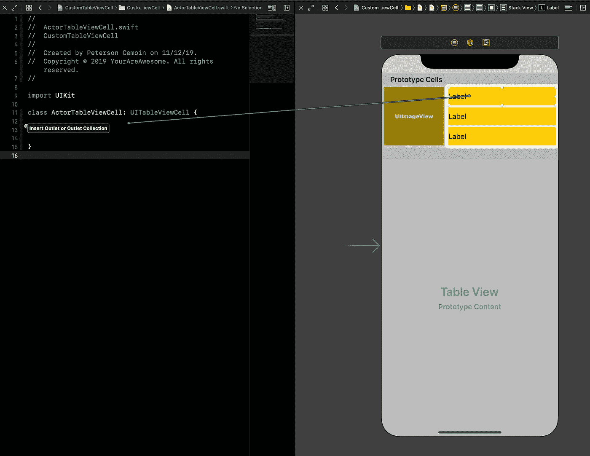

命名为`fullName`。

对剩余的标签和图像重复该过程。分别命名为`email`、`rating`和`actorImage`。你的`ActorTableViewCell`现在应该是这样的。

```
import UIKitclass ActorTableViewCell: UITableViewCell {@IBOutlet weak var fullName: UILabel!
   @IBOutlet weak var email: UILabel!
   @IBOutlet weak var rating: UILabel!
   @IBOutlet weak var actorImage: UIImageView!}
```

我们已经将我们的 UI 连接到我们的类，并且准备开始填充 tableview 以查看单元格中的实际值。

打开`MainTableViewController`文件。我们将在`cellForRowAt`方法中添加所有需要的东西。首先，去掉这条线。

```
cell.backgroundColor = indexPath.row % 2 == 0 ? UIColor.lightGray : UIColor.cyan
```

现在让我们添加代码来填充图像和标签。用这些代码行替换方法中的所有代码。

```
//cast the cell to an ActorTableViewCell
let cell = tableView.dequeueReusableCell(withIdentifier: "reuseIdentifier", for: indexPath) as! ActorTableViewCell//get our cell data
let actor = self.actors[indexPath.row]//set values
cell.actorImage.image = UIImage(named:"\(actor.firstName)_\(actor.lastName).jpg")
cell.fullName.text = "Full Name: \(actor.firstName) \(actor.lastName)"
cell.email.text = "Email: \(actor.email)"
cell.rating.text = "Overall Rating: \(actor.rating)"//check if ipad to make transform image to a circular shapeif(UIScreen.main.traitCollection.userInterfaceIdiom == .pad){
   cell.actorImage.layer.cornerRadius = cell.actorImage.frame.width / 4
   cell.actorImage.layer.masksToBounds = true
}return cell
```

构建并运行，现在您应该看到 iPhone 的如下内容:


这是给 iPad 的。

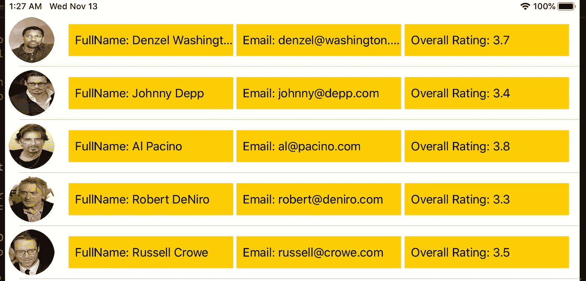

这就是全部了。谢谢你陪我走到最后。现在你知道如何使用`UITableViewCell`，让你的设计更有创意。请记住，永远享受编码的乐趣。下次见。

注意:如果遇到问题，您也可以在先前下载的同一文件夹中打开已完成的项目。