# 如何用 DBDesigner 快速直观地创建数据库模式

> 原文：<https://betterprogramming.pub/how-to-create-database-schemas-quickly-and-intuitively-with-dbdesigner-f92678a0b319>

## 我们将通过创建新的数据库模式来演示它是如何工作的

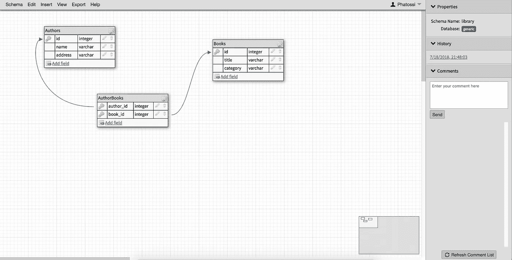

开发一个项目最重要的部分之一就是在头脑中有一个清晰的最终目标。

我们需要知道该项目的目标受众，以及它将包括的功能。这意味着我们需要尽可能了解业务逻辑，然后根据需要实现所有特性。

在为应用程序创建数据库模式时，DB Designer 是一个很好的工具。它允许您创建任意数量的表(就我而言)。

您可以将任何数据类型属性添加到您创建的任何表中。

您还可以将某些属性用作外键。这样，当您分别设置主键和外键时，您可以看到您试图创建的数据库的表之间的关系。

你可以使用你的电子邮件创建许多项目，并在任何你想的时候回到他们身边。您还可以通过电子邮件邀请您的同事，让他们与您合作准备该方案。

当您有了数据库模式的初始版本后，可以将其导出为 SQL 脚本，用于以下数据库技术:

*   [PostgreSQL](https://www.postgresql.org/)
*   [SQLite](https://www.sqlite.org/)
*   [MySQL](https://www.mysql.com/)
*   [MS S](https://www.microsoft.com/en-us/sql-server/sql-server-2019)
*   [甲骨文](https://www.oracle.com/index.html)

# 示范

让我们首先创建一个新的数据库模式来演示它在实践中是如何工作的。

我们可以从一个新的空白模板开始，也可以使用现有的模板。

我们将在这里演示一个空模板，这样我们就可以看到其中包含的一些特性。否则，对于现有的模板，您可能不会注意到它们。

首先，我们需要创建一个新的模式。我们的例子使用了`Generic`数据库类型，我们称之为`library`。

所以，我们需要转到*模式* > *新建*，一个新的窗口将会弹出:

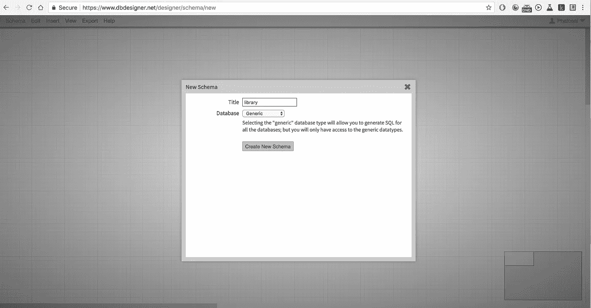

这是之后我们应该看到的图像:

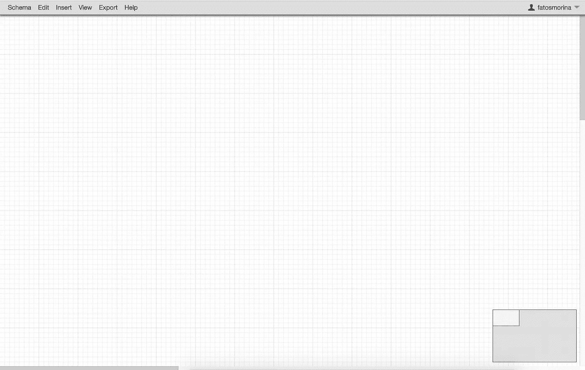

然后，我们需要向我们的模式中添加新的表，这可以通过右键单击网格上的任意位置，并选择`Table`选项来完成:

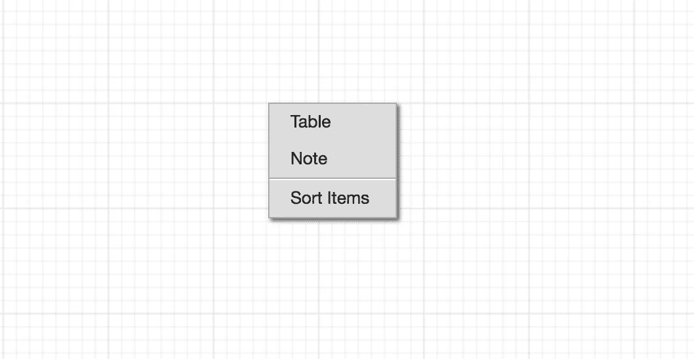

现在，我们需要向表中添加字段。我们所要做的就是转到*添加字段*，之后会出现一个新窗口。

在其中，您可以选择类型，还可以为新的表列设置一些约束:

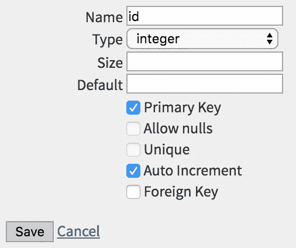

这里我们可以看到添加几列后的样子:

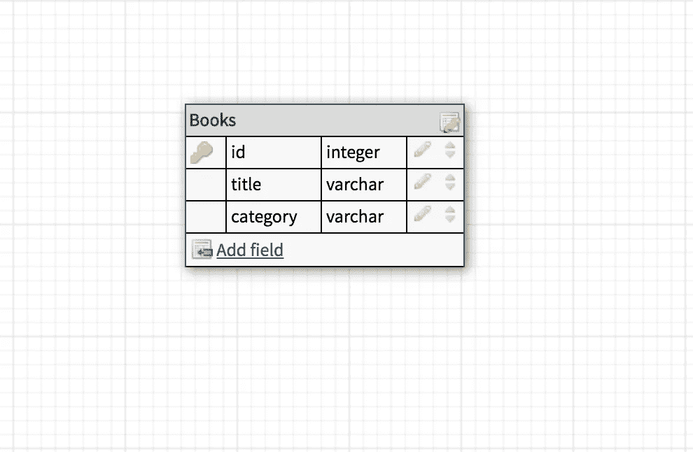

然后，我们可以添加表之间的关系。

我们将以在两个表:`Authors` 和`Books` *之间创建一个*多对多*关系为例。*

为此，我们首先需要创建一个名为`AuthorBooks` *、*的新表，在其中我们分别添加引用`Authors`表和`Books` 表的外键。

这里我们有与`Books` 表的联系:

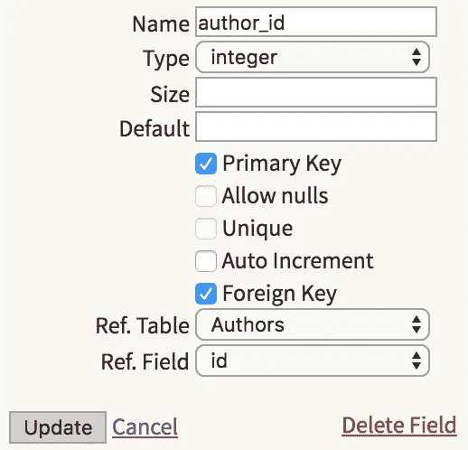

完成后，我们应该会看到类似下面的模式:

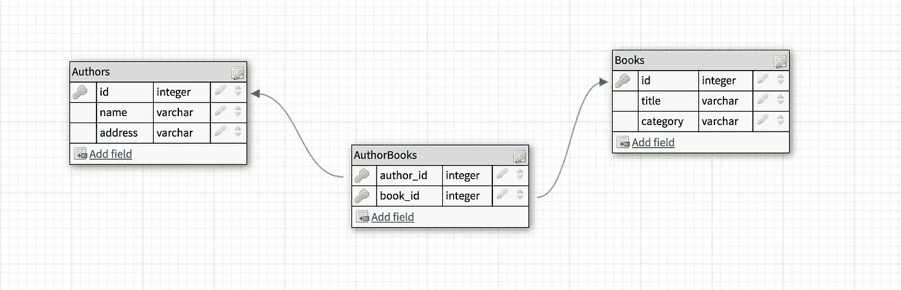

DB Designer 的一个非常好的特性是可以灵活地在网格中移动表格:

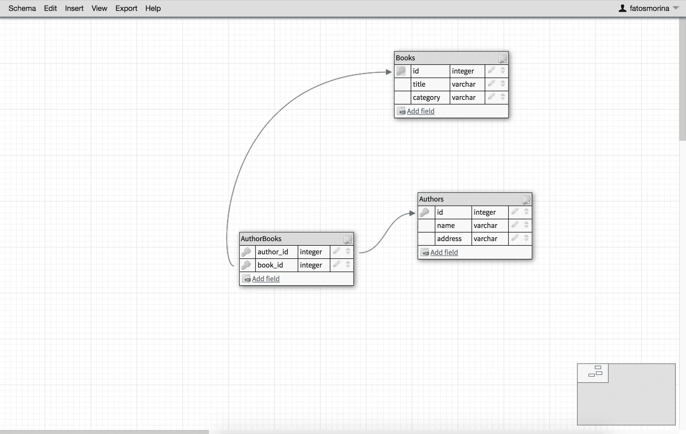

在免费版本中，我们还可以与多达五个合作者共享该模式。

我们只需转到*模式>共享*，一个新窗口将会弹出，如下所示:

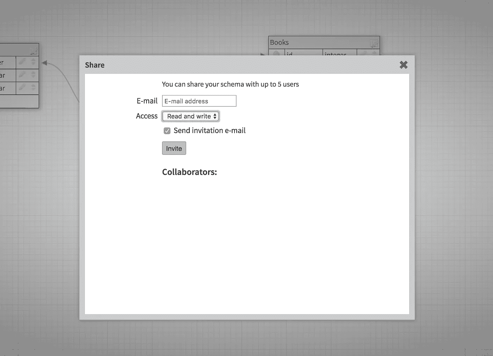

我们可以通过*导出>图像*将该模式保存为图像。

我们也可以生成相应的 SQL 脚本，如下所示:

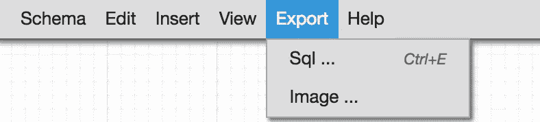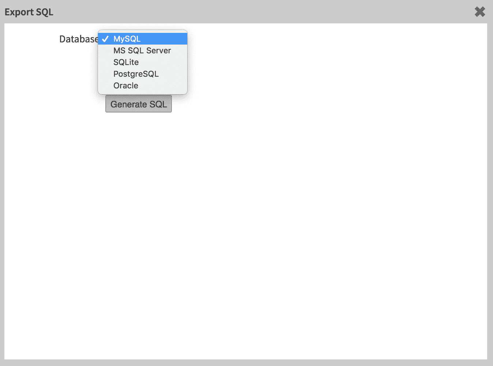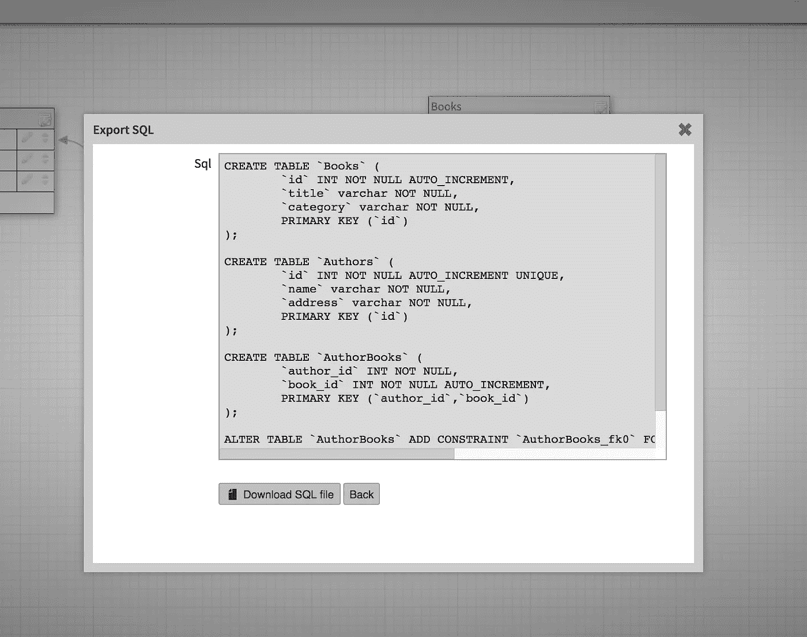

我们可以将自己的 SQL 导入到模式中，并以图形方式显示出来:

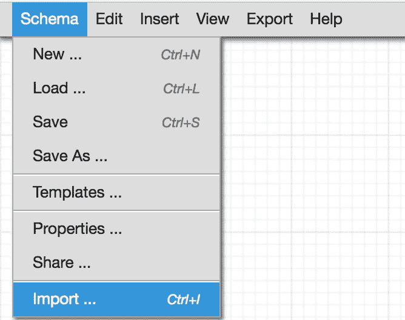

# 结论

我在和一个同事结对编程时听说了这个工具，我发现它真的很有帮助。我希望你也能从中受益。

DB Designer 还有其他功能，我绝对推荐你试试。