# Xcode 中的开发/暂存/生产配置

> 原文：<https://betterprogramming.pub/how-to-create-development-staging-and-production-configs-in-xcode-ec58b2cc1df4>

## 可扩展 IOS 应用架构的组成部分

## 使用。不同环境的 xcconfig 和 config.plist 文件

[汉森卢](https://unsplash.com/@hansonluu?utm_source=unsplash&utm_medium=referral&utm_content=creditCopyText)在 [Unsplash](https://unsplash.com/s/photos/device-environment-different?utm_source=unsplash&utm_medium=referral&utm_content=creditCopyText) 上拍照

在一个项目中，人们经常在不同的环境中开发。例如，在开发期间，所有的服务器请求都将针对`Dev`服务器，之后针对`Staging`服务器进行测试，最后针对`Prod`服务器。

或者可以使用不同的测试场景，例如，在开发期间只模拟请求，并且应该在每个应用程序开始时使用准备好的测试数据填充数据库。为此，您不希望一直更改代码。😫

> 使用配置文件轻松交换依赖于环境的数据。

这可以用不同的方法来完成。

顺便说一句，谢谢你[回复](https://medium.com/u/b8653b12a7c4#--responses)推动我找到更好的解决方案！😊👍

顺便说一下，这是“可扩展的 iOS 应用架构系列的[部分”中的一篇文章。](https://medium.com/@sven.korset/pieces-of-a-scalable-ios-app-architecture-7c182f9dcd2c)

# 过时的老方法

这种方法使用不同的项目目标将适当的配置文件复制到包中。它可以工作，但是有一些缺点，稍后会谈到。因此，如果您对如何**而不是**进行配置不感兴趣，请继续阅读“新推荐方法”一节。😉

对于这种方法，您需要创建几个目标:一个用于正常开发、调试和测试的**开发目标**(开发)和一个**生产目标**(生产)，它只需要在上线时构建最终的应用程序。

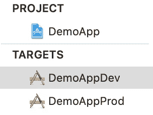

使用多个目标的好处是允许您为开发构建使用不同于生产构建的包标识符，因为有两个 *info.plist* 文件。

然后，您还可以创建两个配置文件。一个只包含在开发目标中，另一个包含在生产目标中。不需要代码转换！😁

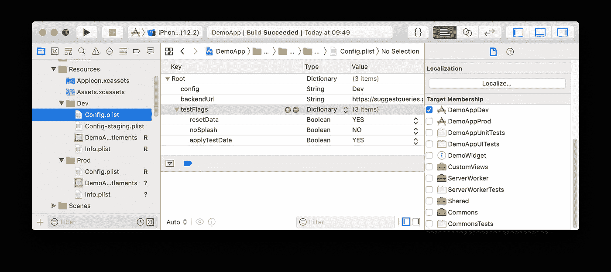

开发目标中的 Config.plist

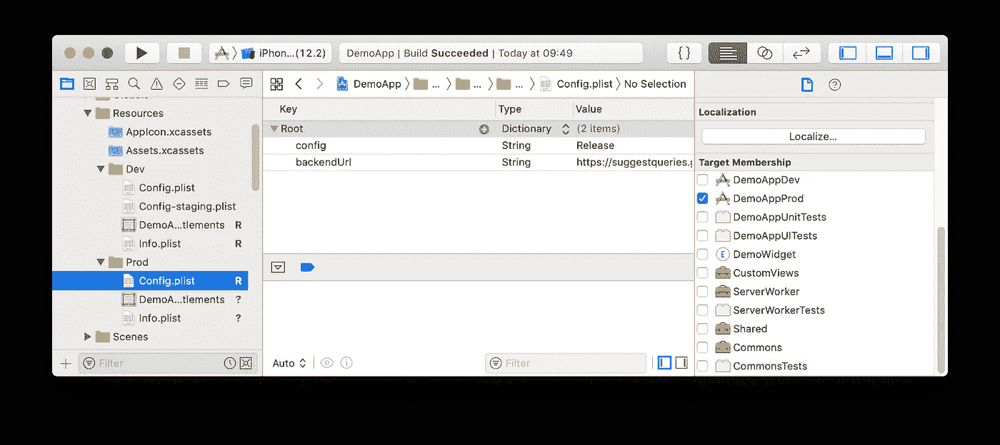

生产目标中的 Config.plist

使用一点粘合代码来解释命令行参数，然后您可以简单地在同一个目标内切换不同的配置文件，例如加载一个 *dev* 或 *staging* 配置文件进行调试。

但是，只为不同的配置创建新目标有一些缺点:

1.  项目的`.pbxproj`文件长度增加了一倍，更大的项目文件可能会降低 Xcode 的速度。
2.  项目文件中的合并冲突现在需要在更多位置解决。
3.  人们可能会忘记将新文件添加到两个目的地。

在我看来，最后一点是一个特别的问题，因为没有 CI，问题出现得晚。然后翻遍所有文件寻找被遗忘的复选标记就很繁琐了。😔

# 更好的方法

正如 [Piotr Gorzelany](https://medium.com/u/7114b3d7b439?source=post_page-----ec58b2cc1df4--------------------------------) 在他的文章 [iOS 项目最佳实践和工具](https://medium.com/@piotr.gorzelany/ios-project-best-practices-and-tools-c46135b8116d)中解释的那样，您可以使用*项目级配置*。然后，您必须编辑*方案*，在*构建配置*的*运行信息*选项卡中选择*调试*、*发布*或*准备*。

根据选择的配置，加载 *Configuration.plist* 文件的另一部分。问题是所有配置的所有数据都必须在一个文件中。这意味着整个文件被交付到生产版本中，并且可能包含敏感的开发数据。😨

如果只发送需要的数据会更好。而且最好有一个解决方案，不需要一直修改方案。😩

# 推荐的新方法

这种方法依赖于*。每个配置的 xcconfig* 文件、*方案*和 *Config.plist* 文件。

## 设置配置

在*项目设置*的*信息* — *配置下，*使用加号按钮添加一个新的配置。您应该选择“Debug”作为复制的基础，并选择“Staging”作为名称。

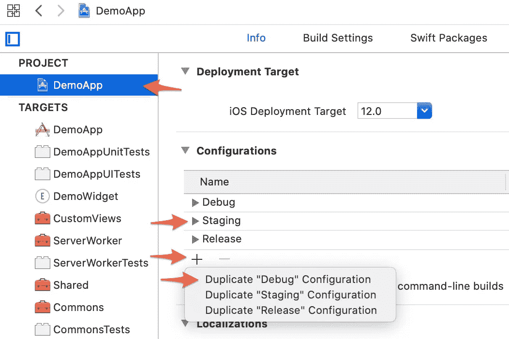

创建新的配置条目

通过*文件—新建—文件… —配置设置文件*添加三个*。xcconfig* 文件。它们被命名为“Development.xcconfig”、“Staging.xcconfig”和“Production.xcconfig”。

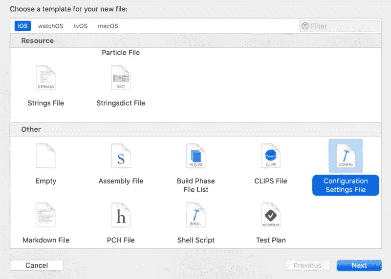

创建新的“配置设置文件”

同时，您还可以为这三种配置创建三个“Config.plist”文件。如果您将它们保存在各自的目录中，这些文件甚至可以具有相同的名称。

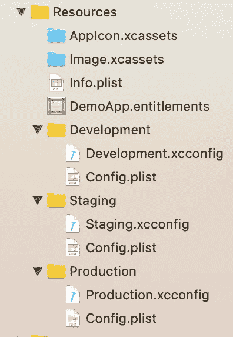

三种配置的三个 xcconfig 文件

但是，这些文件不应该添加到目标中——否则，就不清楚哪些文件现在在包中，哪些文件将被覆盖。稍后会详细介绍。

所以*。xcconfig* 文件也被*配置*使用，你必须将它们指定为基础。为此，您可以在*项目设置*中展开相应的配置，并为相应的配置选择适当的基础。

在“调试”配置中，例如，“开发”。还应该为“登台”和“发布”执行此操作，以映射到“登台”和“生产”。

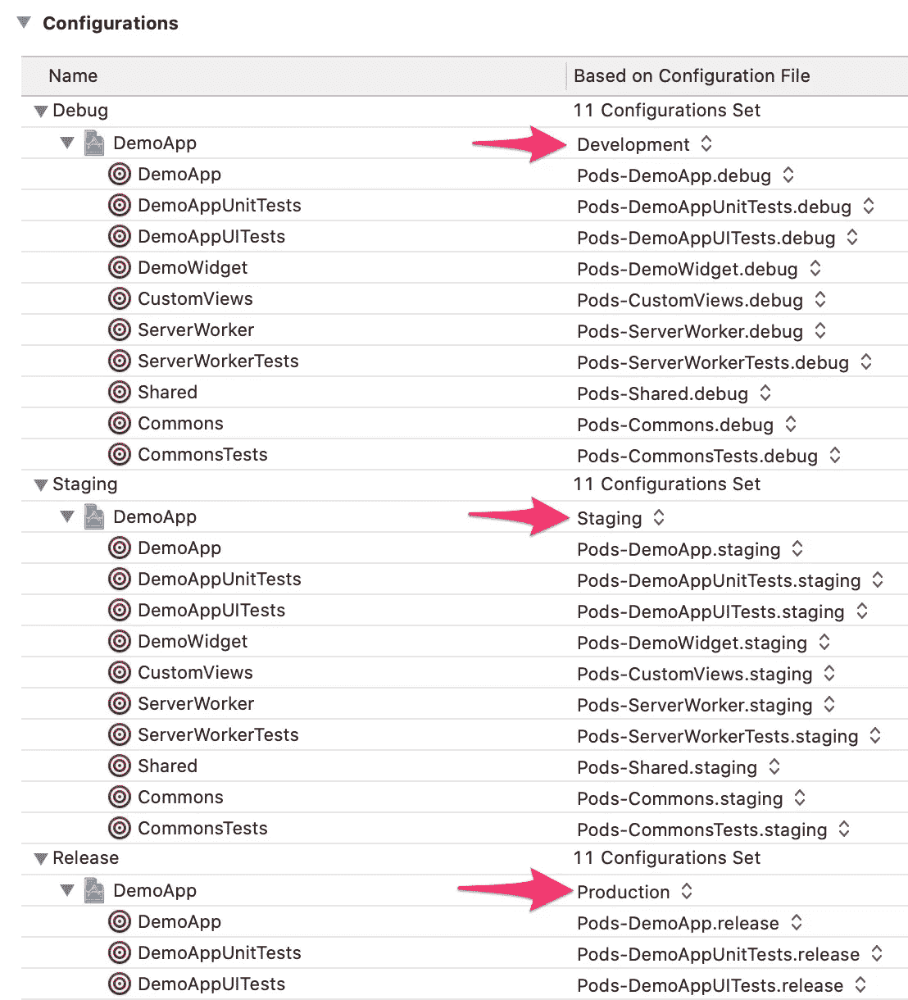

设置“基于配置文件”

如果您对 *CocoaPods* 有问题，您可能需要删除“Pods”目录和“Podfile.lock”文件，并通过`pod install`重新安装。现在，项目应该重新构建。😅

## 使用。xcconfig 文件

*。xcconfig* 文件现在已经集成并使用了，但是仍然是空的。😙

可用于输入 *Info.plist* 条目、*构建设置*和*自定义设置*。例如，您可以在 *Development.xcconfig* 中输入以下内容:

`XCC_BUNDLE_NAME = Demo D`

`XCC_CONFIG_PATH = Development/Config.plist`

这创建了两个变量，您可以在*构建阶段*和 *Info.plist* 中使用。变量名是任意的，但是您应该注意可能的冲突。这就是为什么我用 *XCC* 作为 *XCodeConfig* 的前缀。

在 *Info.plist* 中，在“Bundle name”下输入值`${XCC_BUNDLE_NAME}`。此后，设备上的应用程序图标名为“演示 D”。如果您在其他配置文件中添加适当的条目，例如，*试运行*的“Demo S”和*生产*版本的“Demo ”,您可以立即看到设备上当前的版本。😌

第二个变量应在*构建阶段*的单独脚本中使用。为此，使用加号按钮和条目“新运行脚本阶段”，在*构建阶段*下的*项目设置*中创建一个新的脚本条目。例如，新条目可以命名为“复制配置”并包含一个简单的`cp`命令，该命令只将适当的 *Config.plist* 复制到*生成的*目录中。

确保新的“复制配置”脚本条目在“依赖项”/[CP]Check Pods manifest . lock”之后和“编译源代码”之前。

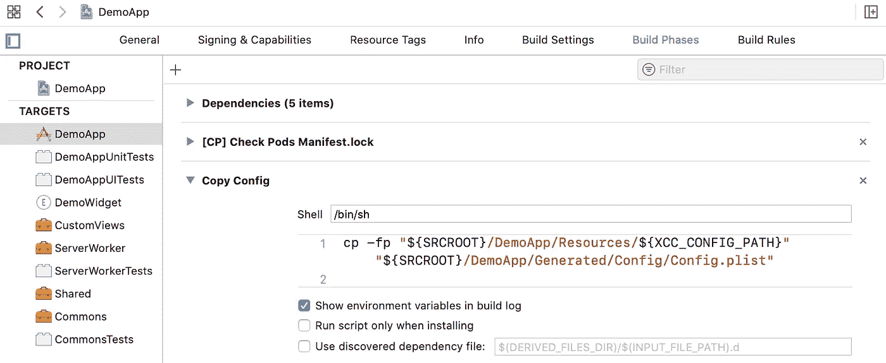

复制配置脚本

注意，这里配置中定义的变量与`${XCC_CONFIG_PATH}`一起使用。通过*配置*，可以确定应该复制哪个*列表*。

在*输出文件*下，您可能还需要输入目标文件，以确保下一阶段仅在文件被实际复制时才开始。

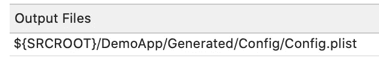

复制配置脚本输出文件

现在，只有*生成的*目录中的 *Config.plist* 必须集成到目标中，因为它应该被复制到*包*中。

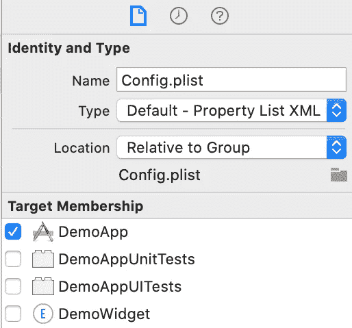

Config.plist 目标成员

根据所选择的*配置*，相应的 *Config.plist* 将在*构建阶段*被复制到*生成的*目录中，然后被复制到 app 的*包*中。

## 配置切换方案

为了选择各自的*配置*，人们不希望不断地调整*方案*。最好为每个*配置*创建一个*方案*，然后简单地在*方案*之间切换。

通过*产品* — *方案* — *管理方案…* ，可以新建*方案*。这里你总是选择相同的目标，但是根据*配置*将*方案命名为*。

为每个配置创建方案

对于每个*方案*，您必须在“构建配置”下选择各自的*配置*。因此，对于*分段方案*，选择*分段构建配置*。

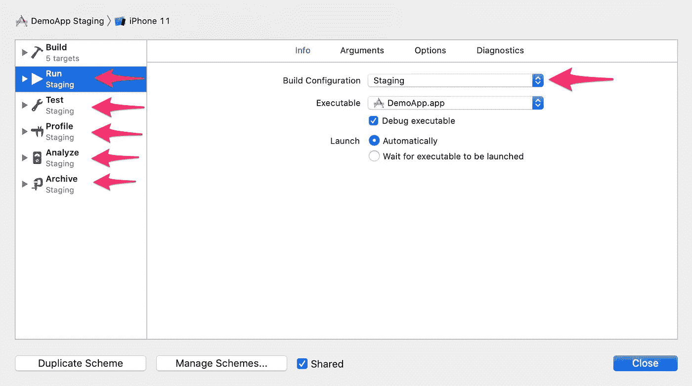

选择构建配置

如果您已经为所有*配置*配置了*方案*，您现在可以轻松地在它们之间切换，并始终使用相应的*配置*。😀

切换方案

## 解码配置文件

现在你已经有了通过*方案*启动的合适的*配置*和 app 的*包*中正确的 *Config.plist* ，你也应该利用它了。😋

*Config.plist* 文件的内容可以通过*可解码*结构中的 *PropertyListDecoder* 轻松解码。在 *DemoApp* 项目中，你可以在*共享*框架中找到 *ConfigLoader* ，将 *Config.plist* 映射到 *Configuration* struct。

如你所见，*配置*结构将*测试标志*声明为可选，因此它们不必包含在*生产*版本中。只有必要的数据在*生产*版本中。😘

然而，*开发*和*登台*环境不仅可以使用不同的 *BaseURL* s，还可以使用不同的 *TestFlags —* 例如，在开发期间使用模拟的服务器请求。

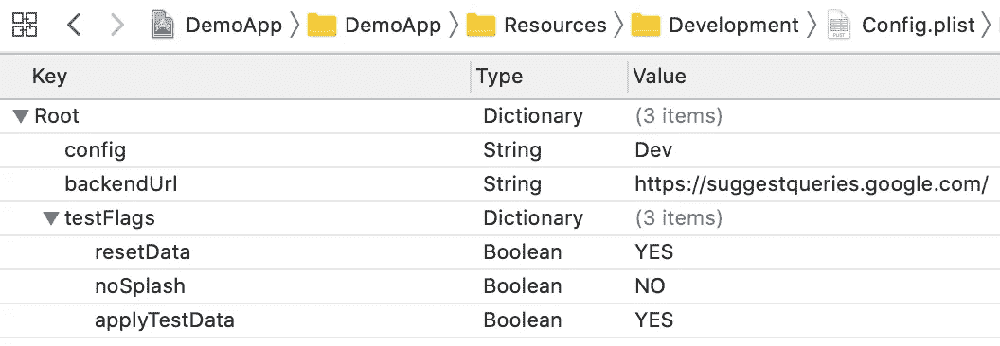

开发配置列表

由于结构的原因，*配置*是类型安全的，并且当由*依赖*提供时，可以很容易地在代码中使用。

# 编译时的想法

运行时当前正在加载 *Config.plist* 。对于损坏的配置文件，这可能会导致应用程序由于抛出异常而崩溃。😅

如果你在应用程序启动后很早就开始加载配置文件，那么当你启动应用程序进行测试时，它就会崩溃。在我看来，这已经足够好了，因为配置不应该有问题。即使是这样，你也应该在每次发布后相对较快地收到通知，并被迫解决它。

难道不可能在编译时捕捉错误吗？例如，使用像 [SwiftGen](https://github.com/SwiftGen/SwiftGen) 这样的代码生成器，您可以在*构建阶段*将 *plist* 文件转换为 Swift 代码，然后进行类型安全调用，并且不会出现运行时崩溃。🧐

然而，这种方法存在一些问题:

1.  当前的 SwiftGen 模板使用字符串字典解析嵌套级别——即， *testFlags* 将通过字符串键解析，并且不再是类型安全的:`configuration.testFlags[“noSplash"]`
2.  您可以修改模板，但这并不容易，需要维护工作，甚至可能更改 SwiftGen 生成器代码。在这里你要问问自己是否真的值得。
3.  根据*配置*，是否将*测试标志*转换为代码——即在*开发*中，常量`static let testFlags: [String: Any]`被创建，但在*部署中*未被创建，甚至*未作为可选*。这将在*版本*中产生相应的编译器错误。修复这些问题很可能会导致不干净的解决方法。😓

这就是为什么我认为在运行时加载*配置*的方法更好，只要加载发生在应用程序启动之后。CI 服务器上的一个小的 *UITest* 应该能够快速自动地检测可能的配置文件损坏用例。所以没必要维护 SwiftGen。😁