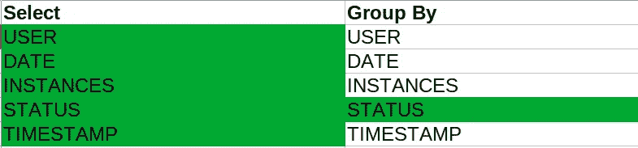

# 如何在 Spring 数据中创建动态查询

> 原文：<https://betterprogramming.pub/how-to-create-dynamic-queries-in-spring-data-355ff69e81d0>

## 如何使用 JPA Criteria API 编写完全动态的查询


奥斯卡·伊尔迪兹在 [Unsplash](https://unsplash.com?utm_source=medium&utm_medium=referral) 上拍摄的照片

最近，我遇到了一个复杂的问题，我必须创建一个完全动态的查询。因为找到解决方案有点耗时，所以值得在一篇专门的文章中写出来。希望对别人有帮助。

## 方案

考虑以下情况:

您有一个包含 5 列的实体。`group by`子句根据用户输入而变化。例如，假设有一个 UI，用户可以在其中选择要选择的列以及如何对它们进行分组。

例如:



作者选择的列的示例

用户已经选择了绿色字段。

假设您的应用程序产生以下 JPA 查询。它有什么问题？

```
select sr.user, sr.timestamp, **sr.status**, sr.date, sr.instances from SERVER_RECORD sr where sr.user = 'user123' group by **sr.status**;
```

它将显示一个错误，说明其余的列，即“*用户、时间戳、日期、实例*”，没有包含在`group by` 子句中或者没有聚合:

```
Column ‘{the column name}’ is invalid in the select list because it is not contained in either an aggregate function or the GROUP BY clause
```

在`select`子句中没有`aggregate`的所有列都需要在`group by`部分中。

在这篇文章中，我将向你展示一种解决这个问题的方法。

*本教程假设你已经熟悉了* [*Java 持久性标准 API*](https://en.wikibooks.org/wiki/Java_Persistence/Criteria) *。*

让我们开始吧！

# 项目解决方案

为了说明这种情况，让我们创建一个简单的例子。假设您想要查询名为`SERVER_RECORD`的表中的记录。下面是实体类:

ServerRecord 实体

让我们命名将查询数据`ServerRecordFinder` 并获得`EntityManager`实例的服务:

创建记录查找服务

让我们编写一个返回记录的方法:

getRecords()方法第一部分

由于我们没有 UI，我们将对用户输入进行硬编码，以便进行演示:

选择部分:

*   `IMESTAMP`，`USER`

分组依据部分:

*   `DATE`

让我们构建查询:

getRecords()方法第二部分

select 部分从用户输入中获取选中的列，并将它们放入`Selection`列表中。

这就是`getSelectedColumns(root)`方法的内容:

*   `alias`方法非常重要**——这就是我们如何在将结果映射到实体时引用别名。**
*   **我们将选择列表传递给`multiselect`查询方法。**
*   **`where`子句向`criteriabuilder`添加谓词。在这个例子中，我们想要查询用户*= "*XYZ*"的记录。***
*   **在最后的查询部分，我们构建了`group by`子句。请注意，我们将`group by`值与`select`值相结合。这确保了没有集合的每个选择都包含在`group by`零件中。**

**现在该创建一个`TypedQuery`并执行它了:**

*   **`query.getResultList()`方法返回一个包含查询结果的`Tuple`。**
*   **创建一个新方法来访问`TupleElement`。`getAlias()`方法收集我们之前定义的所有别名。**

**现在，我们可以遍历查询结果并将其映射到`ServerRecord`实体:**

**这就是`getValueByColumnName()`方法的样子:**

**你可能想知道这个方法的目的是什么。记住，我们为`select`子句定义了一个动态选择列表。因此，它可能不包含所有列。所以，如果你试图使用`tuple.get(“some alias name”)`，而它并不存在，它会抛出这样一个异常:**

```
java.lang.IllegalArgumentException: Given alias [some alias] did not correspond to an element in the result tuple at org.hibernate.jpa.spi.CriteriaQueryTupleTransformer$TupleImpl.get(CriteriaQueryTupleTransformer.java:93)
```

**因此，我们只需要设置那些列在`selectedResultColumns`集合中的值。否则，我们将属性值设置为`null`以跳过它。**

**最后，生成的查询如下所示:**

```
select sr.TIMESTAMP, sr.USER from SERVER_RECORD sr where sr.USER = 'xyz' group by sr.TIMESTAMP, sr.USER, sr.DATE;
```

# **总结**

**在本教程中，您学习了如何编写高级动态 JPA 查询。**

**让我们来看看关键点:**

*   **我们使用 [CriteriaQuery](https://docs.oracle.com/javaee/7/api/javax/persistence/criteria/CriteriaQuery.html) 和 [CriteriaBuilder](https://docs.oracle.com/javaee/7/api/javax/persistence/criteria/CriteriaBuilder.html) 来构建一个 JPA 查询。**
*   **我们为`select`子句中的列分配了别名。**
*   **我们通过引用别名将元组查询结果映射到实体。**

**这个例子的完整代码片段可以在[这里](https://gist.github.com/kirshiyin89/17af57c97598350521e8ecc3631afa3d)找到。**

**希望这篇教程有所帮助。感谢您的阅读，祝您编码愉快！**