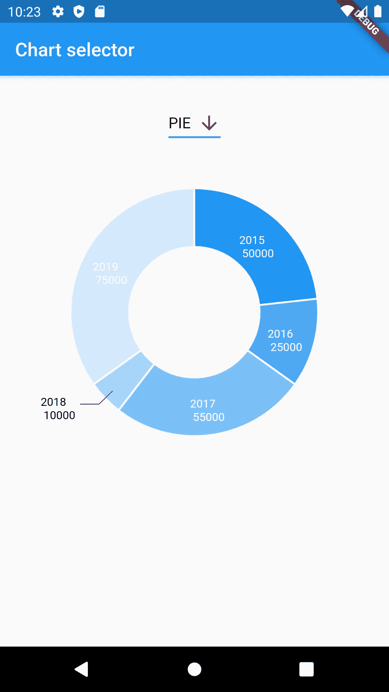
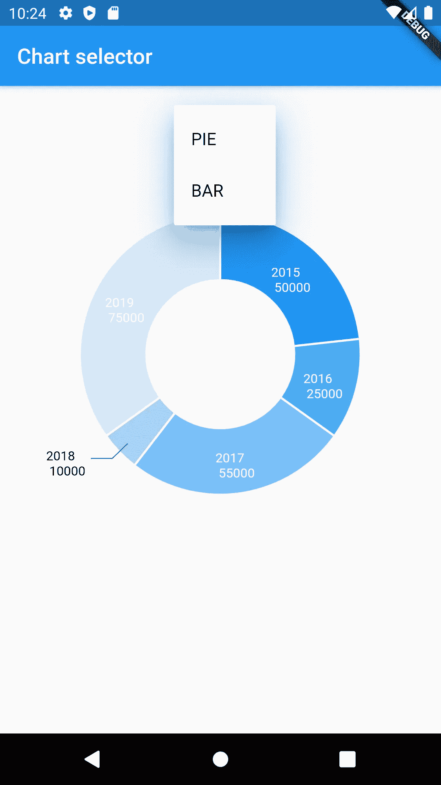
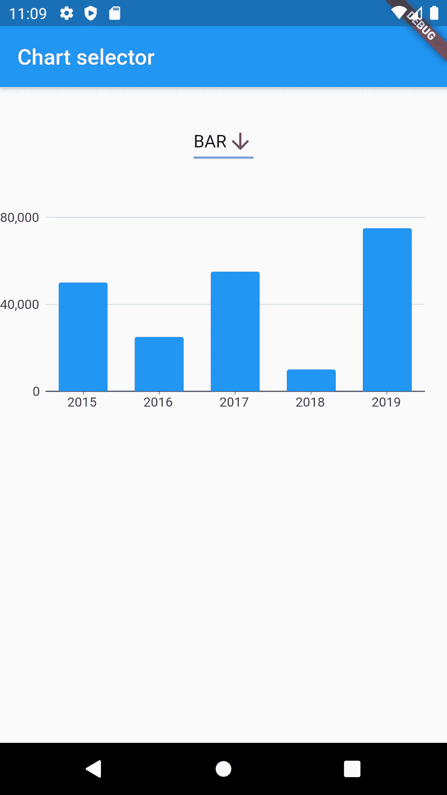

# 如何在 Android 上创建颤振图表

> 原文：<https://betterprogramming.pub/how-to-create-flutter-charts-on-android-5a75b5fc337c>

## 在抖动图表中显示来自 Android 后端的数据


卡洛斯·穆扎在 [Unsplash](https://unsplash.com?utm_source=medium&utm_medium=referral) 上的照片

在本教程中，我们将使用 [charts_flutter](https://pub.dev/packages/charts_flutter) 库来构建不同类型的图表，并显示来自 Android 后端的数据。

这个库得到了积极的支持，并提供了一个大型的在线图库，您可以根据自己的需要选择图表类型。实现是相似和简单的。

为了演示如何将 [Flutter](https://flutter.dev/docs) 与您的 Android 应用程序集成，我将向您展示如何创建一个饼图和一个条形图。

我们开始吧！

# 创建 Android 项目

## 先决条件

由于这是一个 Android 项目，我使用 Android Studio 作为 IDE。我已经安装了旋舞和飞镖插件。我还设置了一个 Android 模拟器来测试代码的变化。

## 准备后端

*   创建一个新的颤振项目，并选择一个颤振应用。然后包含 [Kotlin](https://kotlinlang.org/docs/reference/) 作为平台语言。
*   打开`MainActivity.kt`文件，在新窗口中选择“在 Android Studio 中打开进行编辑”。客户端和平台代码将位于两个独立的窗口中。
*   用我们的代码替换文件的内容:

注意，我们需要提供一个`MethodChannel`。它必须与 Flutter 的`MethodChannel`相匹配，我们将在后面进行配置。这样，我们可以从客户端发送对应于平台端方法的消息。我们还可以在平台端接收方法调用，并将结果发送回前端。

这里我们指定了一个方法`getData()`，它将从客户端调用。这是您通常获取数据的地方，例如，从 SQLite 数据库获取数据。如何检索数据由您决定。为了简单起见，我们将硬编码一些值。

假设您想要显示 2015 年到 2019 年之间的费用。我已经在一个`HashMap`里放了一些数据。

我们已经完成了平台部分。

## 准备前端

在单独的 Android Studio 窗口中导航到项目中的`lib`目录。

*   首先，让我们通过在`pubspec.yaml`文件中添加一个新的依赖项来导入 charts_flutter 库:

```
charts_flutter: ^0.9.0
```

*   让我们通过创建一个名为`dto.dart`的新 Dart 文件来创建我们的 DTO:

我们只需要一年的时间和一笔图表费用。为了按年份降序显示数据，我们将使用`compareByYear(LinearExpenses expenses)`方法。

*   通过创建一个名为`piechart.dart`的新 Dart 文件来实现饼图:

你看，我们在这里定义了`MethodChannel`。

因为我们将调用一个异步方法来保持 GUI 的响应，所以我们需要从后端返回一个`FutureBuilder`和我们的费用列表。

我选择了一个带有自动标签定位的圆环饼图。如果标签适合图表，它将显示在内部；否则，在外面。您可以通过设置`ArcLabelPosition`来更改该属性。

通过定义`arcWidth`，饼图呈现出一个甜甜圈的形状。如果省略该属性，将得到一个简单的饼图。

在呈现图表时,`animate`属性创建一个动画。这给它增添了一种美丽的效果。你甚至可以指定动画的持续时间。

*   通过创建一个`barchart.dart`文件来实现条形图:

*   为图表准备创建一个`util.dart`文件。
*   这是饼图的代码:

*   条形图的实现略有不同:

注意它返回的是`List<charts.Series<LinearExpenses, String>>`，而饼状图返回的是`List<charts.Series>`。

*   从`main.dart` 文件中删除自动生成的内容，替换为我们的内容。

我们需要这些进口品:

*   让我们也为我们的图表类型创建一个`enum`,因为它更优雅:

```
**enum** ChartType { **PIE**, **BAR** }
```

*   然后让我们创建`MyApp`和`MyHomePage`小部件:

*   创建`_MyHomePageState`小部件:

这里我们定义了相同的平台通道。

我们将有一个下拉菜单，在这里我们可以选择我们想要显示的图表类型。默认值为`PIE`。

通过调用我们的`getData()`方法，`_getAsyncData()`方法将从平台端检索我们想要显示的结果。

*   让我们构建我们的`MyHomePage`小部件:

因为我想在同一个屏幕上显示多个小部件，所以我使用了一个带有两个`Columns`的`Container`。一个是下拉菜单，另一个是图表。

*   这是如何创建下拉列表:

注意，Dart 的`enum`将显示类似`ChartType.BAR`的值。然而，如果我们提取名称，看起来会更好，在本例中是“PIE”和“BAR”这就是我使用`split()`方法的原因。

当用户从列表中选择一个值时，调用`onChanged()` 方法，我们根据选择改变图表的类型。

*   粘贴以下代码以创建图表:

就是这样！现在让我们开始应用程序并测试它。

# 测试应用程序

使用 Android Studio 中的 Run 按钮在模拟器或真实设备上运行代码。

第一个屏幕应该是这样的:



显示饼图的我的电脑截图

现在让我们改变图表的类型:



演示下拉功能的电脑截图



我电脑上显示条形图的屏幕截图

# 结论

我们已经到了本教程的结尾。现在，您已经知道如何从 charts_flutter 库中实现图表，并从您的 Android 应用程序中检索数据。

如果你需要这个项目的完整源代码，你可以在下面的链接参考中找到。

感谢您的阅读，祝您编码愉快！

# 参考

*   [https://github.com/kirshiyin89/flutter_charts_demo](https://github.com/kirshiyin89/flutter_charts_demo)
*   [https://flutter . dev/docs/development/platform-integration/platform-channels](https://flutter.dev/docs/development/platform-integration/platform-channels)
*   [https://Google . github . io/charts/flutter/example/pie _ charts/auto _ label](https://google.github.io/charts/flutter/example/pie_charts/auto_label)