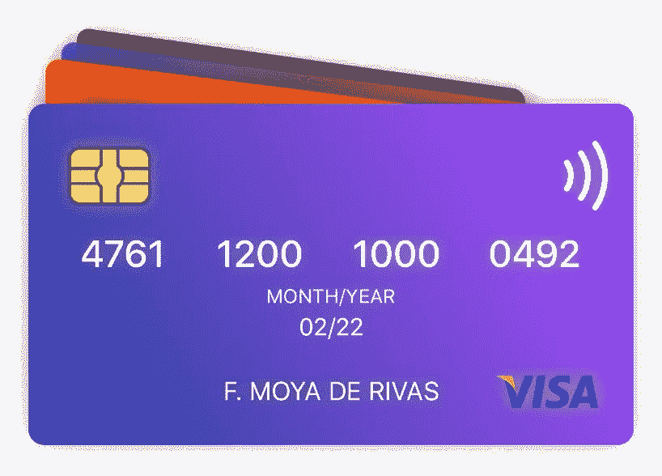
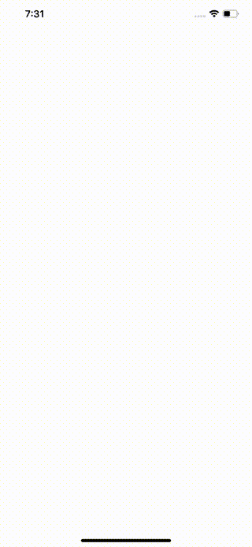
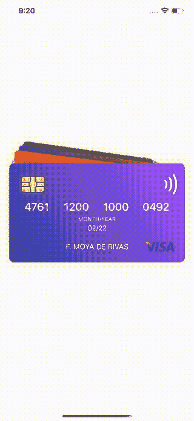
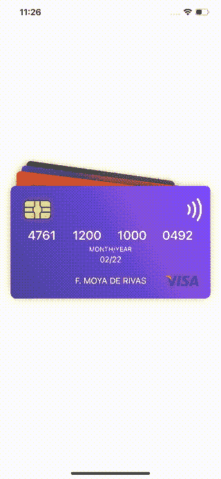

# 如何在 SwiftUI 中创建有趣的卡片动画

> 原文：<https://betterprogramming.pub/how-to-create-fun-animations-in-swiftui-1c08adcb93ce>

## 你的想象力是唯一的限制


照片由[乔舒亚·柯尔曼](https://unsplash.com/@joshstyle?utm_source=unsplash&utm_medium=referral&utm_content=creditCopyText)在 [Unsplash](https://unsplash.com/?utm_source=unsplash&utm_medium=referral&utm_content=creditCopyText) 拍摄

*注:这里用的银行卡都是假的，当然*

# 介绍

iOS 13 发布已经有几个月了，尽管在我们的应用程序中完全支持还为时过早，但还是有必要看看这个新版本中引入的两个主要框架:SwiftUI 和 Combine。毫无疑问，它们是 iOS 发展的未来。

在过去的几个月里，我一直在玩 SwiftUI。即使我觉得还缺少一些东西，我还是惊喜地发现定制用户界面和制作动画是如此简单。在 UIkit 中需要大量代码的事情，在 SwiftUI 中只需几行代码就可以完成。最棒的是，它进行得既顺利又迅速！它绕过核心动画，直接进入金属。

忘掉 UIkit，继续前进，因为你已经落后了，伙计！

# 银行卡:快速概览

[银行卡](https://github.com/fermoya/BankCards)是您可以使用 SwiftUI 做什么的一个小例子。有一天，我突然有了灵感，开始着手做这件事。有时候，老实说，想出一个好主意来尝试一个新的框架比实现更困难；我相信你抓到我了。

如果你看一下我的回购中的[启动项目](https://github.com/fermoya/BankCards/tree/master/starter)，有几个文件你可能想先检查一下，因为它们是我们将要处理的:`Wallet.swift`和`WalletView.swift`。第一个模型是一个钱包，基本上包含了一堆卡片，并公开了助手方法。第二个示例将卡片一张一张地堆叠起来，并应用一些 UI 更改来漂亮地显示您钱包中的卡片:

WalletView.swift 片段

结果是这样的:



WalletView.swift

# 动画您的钱包过渡

正如我之前提到的，SwiftUI 让你构建非凡的设计变得极其容易。那么它是如何工作的呢？SwiftUI 在后台使用 Combine，并提供了三个属性包装器(Swift 5.1 中的新功能)来帮助您完成这个过程。它们基本上会告诉视图有些东西发生了变化，这将触发视图更新。这些属性包装是:

*   `@State`:它代表了一个视图属性，保存了视图所依赖的一些状态。
*   `@ObservedObject`:这是一个由视图观察其属性的对象。
*   `@EnvironmentObject`:与`@ObservedObject`相似，但是视图及其子视图可以全局访问。

我们开始工作吧！现在，钱包显示在屏幕上，没有任何动画——没有发生什么事情。我们为什么不做个过渡来展示钱包呢？声明一个新属性`isPresented`，并将其初始设置为 false:

```
@State var isPresented = false
```

如果`isPresented`为真，更改`ZStack`中的代码以显示卡片。然后，使用`onAppear`切换标志。

建议切换以展示卡片

现在，添加一个隐式动画来制作`CardView`过渡的动画:

过渡 WalletView 子视图

1.  调用`transition`,这样每当一张卡被添加到`WalletView`时，它就被呈现为向上移动，同时淡入。
2.  使用`animation`隐含地说明每个卡片及其子视图应该如何动画。

另一种方法是使用明确的动画:

```
withAnimation {
     self.isPresented.toggle()
}
```

但是为了简单起见，我们将总是使用默认的动画，尽管有不同的延迟(您稍后会看到)。

完成后，您应该会看到这样的内容:



# 拖动你的卡片来整理你的钱包

我们的钱包现在看起来更好了，但还不够好。这是我们现在要做的。我们将使我们的`CardView`可拖动，这样我们就可以通过向上或向下拖动前面的卡来对钱包中的卡进行排序。为此，我们需要向第一个`CardView`实例添加一个`DragGesture`:

将 DragGesture 添加到第一张卡片

`DragGesture`配有两块。每当`DragGesture`更新它的翻译时`onChanged`被调用，而每当手势完成时`onEnded`被调用。我们将在后面的卡片上禁用用户交互，这样只有第一张卡片是可拖动的。

我们将在本节中使用的文件中已经定义了一些属性和助手方法。看一看`offset(for:)`:

```
private func offset(for card: Card) -> CGFloat {
    guard !wallet.isFirst(card: card) else { return draggingOffset }
    let cardIndex = CGFloat(wallet.index(of: card))
    return cardIndex * Self.cardOffset
}
```

这是根据卡片在钱包中的位置来偏移卡片的函数。`dragginOffset`在文件顶部声明，并初始化为`0`。我们将使用`onChanged`来更新它的值:

```
self.draggingOffset = value.translation.height
```

哦，等等！我们得到一个错误:


`WalletView`和 SwiftUI 中的任何其他`View`都是一个`struct`，这意味着它们是不可变的。幸运的是，SwiftUI 允许我们修改它们的属性，只要我们用`@State`包装它们。

```
@State var draggingOffset: CGFloat = 0
```

这将触发一个动画视图更新，这是我们隐式延迟的。前往`ForEach`内心的你`WalletView`添加:

```
ForEach(self.wallet.cards) {
    // code here
}.onAppear {
    self.shouldDelay = false
}
```

这将使帮助器方法`transitionDelay(card:)`在`ForEach`出现后返回`0`。不要忘记包装`shouldDelay`以消除编译器错误:

```
@State var shouldDelay = true
```

最后，使用`onEnded`将`draggingOffset`设置回`0`:

```
onEnded ({ _ in
    self.draggingOffset = 0
})
```



可拖动卡片

现在，要对钱包中的卡进行排序，请将以下代码添加到`onEnded`:

```
let newCards = [card] + Array(self.wallet.cards.dropLast())
self.wallet.cards = newCards
```


拖移以排序卡片

# 最后一步:点击一张卡片，将它放到最前面

为了完成本教程，让我们给我们的卡添加一个`TapGesture`来将拾取的卡带到牌堆的前面。首先，去掉这条线

```
.disabled(!self.wallet.isFirst(card: card))
```

并修改`DragGesture` `onChanged`和`onEnded`以使只有前卡仍可拖动:

```
onChanged ({ _ in
    if self.wallet.isFirst(card: card) {
        // code here
    }
})
.onEnded ({ _ in
    if self.wallet.isFirst(card: card) {
        // code here
    }
})
```

现在，使用`onTapGesture`再次对卡片进行分类:

```
.gesture(
    DragGesture()
        // ...
).onTapGesture {
    let newCards = self.wallet.cards.filter { $0 != card } + [card]
    self.wallet.cards = newCards
}
```

构建并运行。没有得到你期望的结果？尝试用`@State`包裹`wallet`。还是什么都没有？事情是这样的。`WalletView`不知道它必须更新。我们需要为`wallet`、`@ObservedObject`添加不同的包装器:

```
@ObservedObject var wallet: Wallet = Wallet(cards: cards)
```

编译器应该在这一点上抱怨:*在“ObservedObject”上引用初始值设定项“init(wrappedValue:)”要求“Wallet”符合“ObservableObject”*

转到`Wallet.swift`并执行`ObservableObject`:

```
class Wallet: ObservableObject {
    // ...
}
```

然而，SwiftUI 到底应该观察什么呢？我们需要明确哪些属性应该被观察，或者换句话说，哪些属性将被发布:

```
@Published var cards: [Card]
```

构建并运行。这一次我们应该有预期的结果。

# 从这里去哪里？

你可以做很多事情来改善你的钱包体验。starter 项目附带了额外的变量`isDragging`和`firstCardScale`，您可以使用它们来丰富您的动画。试着使用这些变量(或者你可能想到的其他变量)来改变`rotationEffect`、`offset`、…或者任何其他修改器。

看看我在本教程的[最终版本](https://github.com/fermoya/BankCards/tree/master/final)中所做的改进。



回购的最终版本

# 结论

SwiftUI 是一个非常强大的工具，它将使您的生活更加轻松，并将使您的设计更上一层楼。以下是一些优点:

*   它使用金属，因此速度非常快，非常平稳。
*   简单易用。
*   与 XIB 或故事板的基本代码相比，它是可以理解的。冲突可以更容易解决。
*   比编码约束更易读。
*   较少的代码行

另一方面，这里有一些缺点:

*   它是相当新的，所以它是不断变化的。
*   一些在 UIkit 中经常使用的视图在 SwiftUI 中没有对应的视图。比如`UICollectionView`或者`TextView`。
*   集成到您的应用程序中，因为 SwiftUI 仅受 iOS 13+支持。

# 资源

*   [学习用 SwiftUI 制作应用](https://developer.apple.com/tutorials/swiftui/tutorials)
*   [SwiftUI 示例](https://www.hackingwithswift.com/quick-start/swiftui)