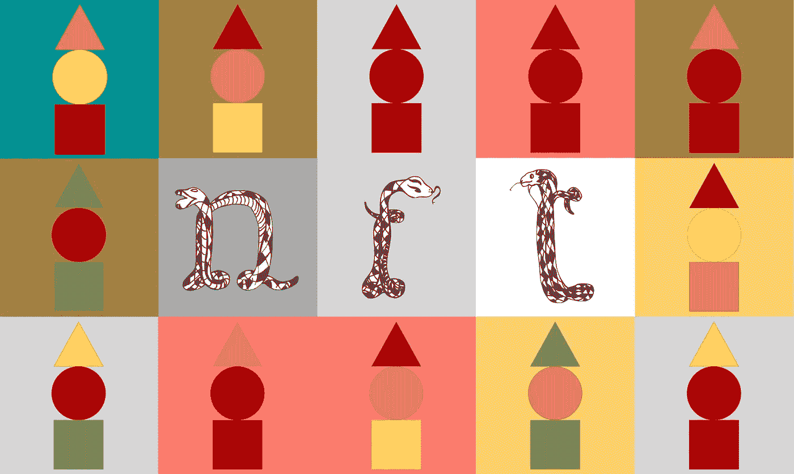
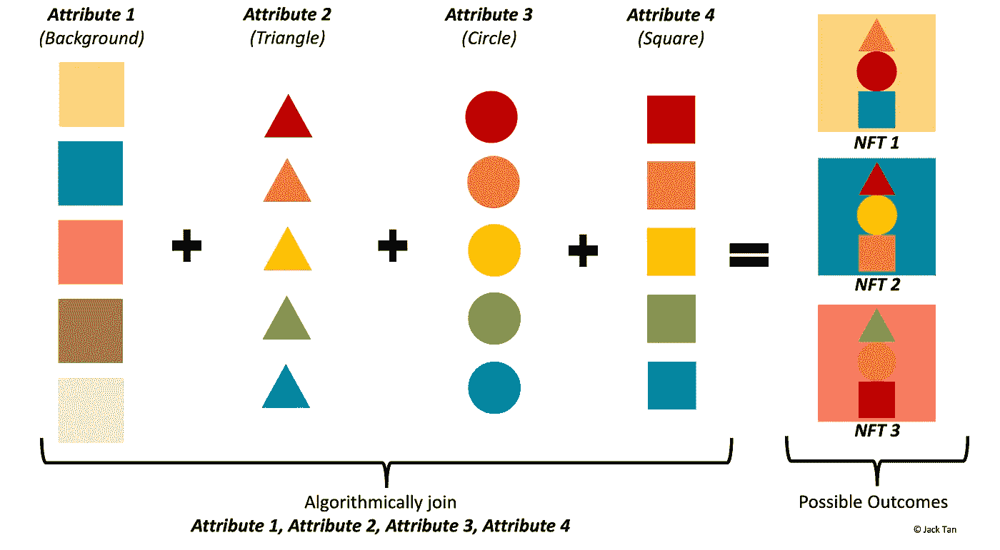
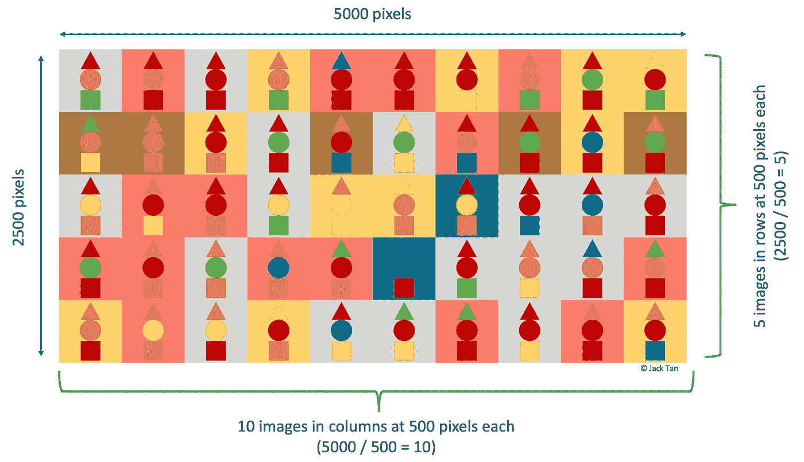

# 如何用 Python 创建生成性 NFT 艺术

> 原文：<https://betterprogramming.pub/how-to-create-generative-nft-arts-with-python-28e6015ccc70>

## 你所需要的只是一个能上网的浏览器和一些创造力

作者自我图解。

从[加密朋克](https://opensea.io/collection/cryptopunks)到[无聊猿游艇俱乐部](https://opensea.io/collection/boredapeyachtclub)，NFT 最近在区块链行业掀起波澜，并成为与加密货币齐名的下一个大事件。随着[的名人代言](https://www.lifestyleasia.com/hk/culture/the-arts/celebrity-nfts-cryptocurrency-metaverse/)和[各种高调非物质艺术作品令人瞠目结舌的销售](https://influencermarketinghub.com/most-expensive-nfts/)，创造非物质艺术作品的兴趣从未如此强烈。

> **NFT** 是**不可替代令牌**的简称。它是以数字分类账形式存储在区块链上的不可互换的数据单位。这些数据单元充当与之相关联的对象的所有权证明，这些对象可以被创建、交易和拥有。这些物品可以是真实的，也可以是虚拟的，但通常都是独一无二的、稀有的。与加密货币不同，每个令牌都是独一无二的，不能互换。想象一下，美元等同于比特币，而 NFT 等同于蒙娜丽莎。每张一美元的钞票可以换成等值的另一张一美元的钞票，但是蒙娜丽莎的画像永远只能有一张。

大多数 NFT 是由算法生成的类似主题艺术的大型集合。可以有许多算法方法来生成 NFT，本教程将带你通过使用 Python 的[怪异鲸鱼](https://opensea.io/collection/weirdwhales)集合流行的方法之一。

# **理解生成性 NFT 艺术**

大多数生殖 NFT 艺术都有一套基本的属性或特征，这些属性或特征可以随机组合在一起，创造出一件独特的艺术作品。以[隐朋克](https://opensea.io/collection/cryptopunks)为例，有 [5 种基本朋克类型](https://www.larvalabs.com/cryptopunks/attributes)(外星人、猿、僵尸等)。)和 [87 个可能属性](https://www.larvalabs.com/cryptopunks/attributes)(豆豆、香烟、耳环等。).这些属性也可以通过编程来调整，以显示某些字符的稀有性。

本教程使用原始图像(作为属性)来创建算法生成的艺术。每个属性也可以根据稀有程度进行调整。作者自我图解。

在本教程中，我们将使用三种简单的形状——三角形、圆形、正方形和五种不同颜色的背景作为属性(或特征)进行演示。这些是用 PowerPoint 创建的简单几何图形。然而，如果你希望创造像素化的艺术，类似于流行的[隐朋克](https://opensea.io/collection/cryptopunks)或[怪鲸](https://opensea.io/collection/weirdwhales)，你可以使用 [Pixlr](https://pixlr.com/x/) 。重要的是要注意，个人特征应该是可互换的特征和透明的背景，如 PNGs，以便多个特征可以很容易地分层在一起。

# **用 Python 编写 NFT 艺术代码**

Python 代码是在[笔记本](https://github.com/jackty9/NFT_tutorial_python/blob/main/How_to_create_NFT_arts_with%C2%A0Python.ipynb)中使用 [Google Colab](https://colab.research.google.com/) 开发的，因为它可以在任何网络浏览器上运行(Chrome、Firefox、Safari)。本教程中使用的笔记本和所有图像文件可以在 [Github](https://github.com/jackty9/NFT_tutorial_python) 上找到。

这个 pythonic 笔记本有 4 个主要组成部分:

1.  设置——包括导入必要的库和上传原始图像，用作 NFT 艺术的特征
2.  定义个体特征的分布，即使用权重确定每个特征的稀有程度
3.  定义函数以生成作为 NFT 艺术的新图像
4.  输出生成的图像

## 片段 1

简要说明:

第 2 行: [Pillow](https://pillow.readthedocs.io/en/stable/) (PIL)是一个 Python 图像库，允许我们将多个图像合成一个。

第 3 行: [random](https://docs.python.org/3/library/random.html) 允许根据分配的权重随机挑选特征。

第 4 行: [json](https://docs.python.org/3/library/json.html) 对生成的 arts 的元数据进行解码和编码。

第 5 行: [os](https://docs.python.org/3/library/os.html) 创建目录来存储生成的作品。

第 7–9 行:克隆 Github repo，主要是加载本教程的原始图像文件。

## 片段 2

简要说明:

第 4–14 行:每个特征都被赋予了一个本地名称以及稀有性权重。

第 19–47 行:创建字典是为了将指定的本地名称与 Github repo 中的实际文件名相匹配。

## 片段 3

简要说明:

第 3–4 行:为要生成的总图像声明一个变量。

第 6 行:声明一个存储输出特征的列表。

第 8–22 行:定义一个函数，根据先前定义的权重从每个类别中随机选择特征。第 19-22 行特别检查选择的特征是否重复以确保唯一性。

第 25–30 行:生成特征组合并输出到第 6 行定义的列表中。

第 32–36 行:分配一个“令牌 ID”用于元数据和文件命名。

## 片段 4

简要说明:

第 1–2 行:为要生成的图像创建一个目录。

第 4–20 行:一个 for 循环，指向原始图像并合成它们，然后使用之前在代码片段 3 中定义的 tokenID 以 png 格式输出它们的文件名。

## 可选编码

[笔记本](https://github.com/jackty9/NFT_tutorial_python/blob/main/How_to_create_NFT_arts_with%C2%A0Python.ipynb)也包含一些可选代码，可以在带有`##OPTIONAL`注释的块中找到，它们很好，但可以在不影响编程功能部分的情况下省略:

1.  如果所有图像都是唯一且不重复的，则验证并打印的功能。
2.  每个生成的艺术作品的元数据的字典打印输出
3.  计算每个特征的总出现次数。
4.  生成一个 JSON 文件，其中包含所有已生成艺术的元数据。
5.  压缩所有生成的艺术文件并下载到本地。

# **奖励——一幅拼贴杰作**

生成数字艺术的另一种创造性方法是将多个图像结合起来创建拼贴画。最著名的 NFT 艺术之一是一幅由皮普尔创作的拼贴画，名为 [***Everydays:前 5000 天***](https://en.wikipedia.org/wiki/Everydays:_the_First_5000_Days)*，在本文写作之时，它是有史以来第二贵的 NFT 艺术作品，以[【6930 万美元](https://www.forbes.com/sites/abrambrown/2021/03/11/beeple-art-sells-for-693-million-becoming-most-expensive-nft-ever/?sh=7e86f1922448)。*

**

*使用本教程生成的拼贴画。作者自我图解。*

*在本教程中，我们将创建一个 5000×2500 像素的拼贴使用生成图像早些时候生成。每张图片的大小都被调整为 500×500 像素的方形，然后以 10×5 的排列组合在一起，创造出由 50 张图片组成的最终拼贴画。当然，这些技术细节可以根据您的需要进行更改和调整。*

*下面是制作拼贴画的代码:*

*由于大多数代码都带有注释，不言自明，所以我们不会逐行解释。由于代码的随机性，你的拼贴看起来可能与上面的插图不同。*

# ***结论***

**

*由[乔舒亚·沃罗尼耶基](https://unsplash.com/@joshua_j_woroniecki?utm_source=medium&utm_medium=referral)在 [Unsplash](https://unsplash.com?utm_source=medium&utm_medium=referral) 上拍摄的照片*

*恭喜你！现在，您已经使用 Python 创建了自己独特的生成艺术。概括地说，本教程涵盖了如何根据现有的不同属性集，用算法对 NFT 艺术进行编程。*

*为了升级你的游戏，你甚至可以通过算法生成你的属性。这可以通过使用数学表达式来确定属性来实现，例如，您可以随机确定本例中使用的形状的大小或方向。*

*另一个值得一提的语言是[处理](https://processing.org/)，这也是一个类似素描本的软件，用来编码视觉艺术。许多受欢迎的 NFT 艺术作品都是通过加工产生的，包括 [Fidenza](https://opensea.io/assets/fidenza-by-tyler-hobbs) 和其他许多可以在[艺术板块](https://www.artblocks.io/)上找到的收藏。*

*现在，让你的创造力尽情发挥吧！*