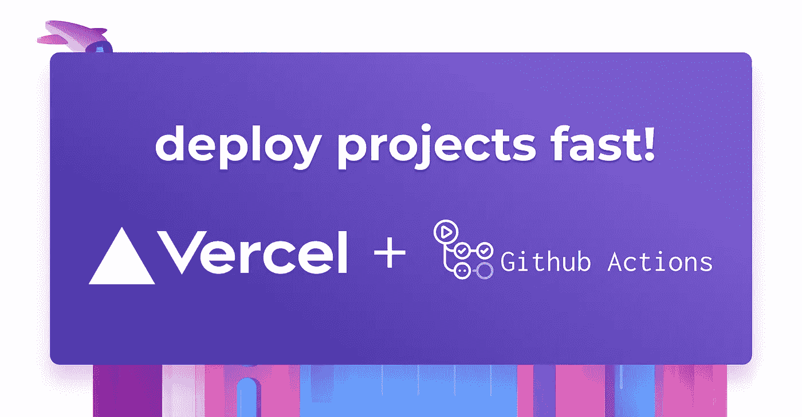

# 如何为 Vercel 部署创建 GitHub 操作

> 原文：<https://betterprogramming.pub/how-to-create-github-actions-for-vercel-deployment-aa10d240aab6>

## 更容易、更快速地创建项目



作者图片

Vercel 是最好的托管服务之一，因为它的简单性和适应性。它允许您尽可能快地托管您的项目，只需很少或不需要设置。当 Vercel 与 GitHub 一起用于项目部署时，事情变得更加有趣。当一个新的更新被推送到 GitHub 时，这支持自动化的代码部署，简化您的 CI/CD 工作流程。

# 什么是 GitHub 动作？

GitHub Actions 是一个 CI/CD 平台，用于自动化您的构建、测试和部署工作流。您可以使用工作流构建和测试存储库中的每个拉请求，或者您可以将合并的拉请求部署到生产存储库中。

GitHub Actions 使您所有软件活动的自动化变得简单，它现在包括世界一流的 CI/CD，允许您定制代码审查、分支管理和问题分类。

# GitHub 动作如何与 Vercel 一起工作

GitHub 动作使用 [Vercel](https://vercel.com/) 自动部署你的 GitHub 项目，提供预览部署 URL 和自动定制域更新。当您在 GitHub 上创建一个新的 Vercel 项目，并在每个分支上启用自动部署时，Vercel 会观察分支上的每个推送，并在默认情况下进行部署。如果 Vercel 已经构建了一个先前的提交，那么当前的构建将被取消，以构建最近的提交，这样您就可以一直部署最新的变更。

*   测试选项 1:分叉模型
*   测试选项 2:tmate

# 测试 GitHub 动作的问题是

## GitHub 行动在行动

为了演示如何使用 GitHub 操作将应用程序部署到 Vercel，我创建了一个简单的 React 项目并将其推送到我的 GitHub 存储库中。将存储库克隆到您的计算机上，然后继续操作。

## 配置 Vercel

要用 Vercel 设置 GitHub 动作，您需要一个 Vercel **项目 ID** 和**组织 ID。**为此，运行下面的命令并按照提示进行操作:

```
vercel
```

上面的命令会生成一个`**.vercel/package.json**` 文件，你的`**projectId**`和`**orgId**` 就是在这个文件中生成的。

或许，你可以告诉 Vercel，当你把代码推送到 GitHub 时，不要触发项目部署。这样，GitHub Actions 工作流只有在发布、推送到特定分支或工作流上的手动触发时才会被触发。为此，在您的项目根目录中创建一个`**vercel.json**`文件，并添加以下配置:

```
{
 "github": {
   "enabled": false,
   "silent": true
 }
}
```

接下来，您需要在 Vercel 上生成一个[令牌](https://vercel.com/account/tokens)，以便能够在 GitHub 操作上使用 CLI。生成令牌后，复制令牌并将其保存在安全的地方。你以后会需要它的。

然后把你的项目推送到 GitHub。推送完成后，转到 GitHub 上的项目。在 settings 选项卡中，点击“ **Secrets > Actions** ”并将 Vercel 凭证添加到您的项目中。在**动作**页面上，点击**创建存储库密码**按钮并添加以下密码。

*   `**VERCEL_ORG_ID**`:这是项目根目录下`**.vercel/package.json**`文件中的`**orgId**`。
*   `**VERCEL_PROJECT_ID**`:这是项目根目录下`**.vercel/package.json**`文件中的`**projectId**`。
*   这是你生成的威瑟尔令牌。

创建上述凭证后，我们应该准备好配置工作流了。

# 配置 GitHub 工作流

将 Vercel 您的 Vercel 凭证添加到您在 GitHub 上的项目后，继续配置 GitHub 工作流，以支持持续和连续的部署。为此，在项目根目录中创建一个`**.github/workflows/deploy.yml**` 文件，并添加下面指定的配置:

现在提交更改并将您的代码推送到 GitHub。一旦代码被推送，GitHub 动作将触发自动部署。

# 结论

在本教程中，您已经学习了如何设置 GitHub 操作来将项目部署到 Vercel。您了解了什么是 GitHub 动作，以及它们如何与 Vercel 一起工作。现在你已经了解了 GitHub 和 Vercel 是如何协同工作的，可以随意浏览一下[更多的配置](https://github.com/marketplace/actions/deploy-to-vercel-action)来添加到你的项目中。