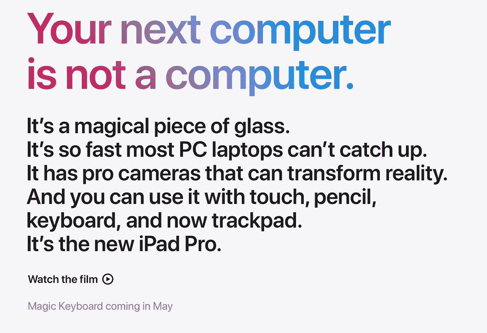
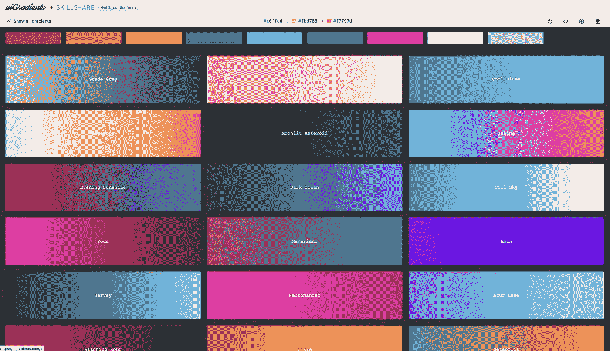
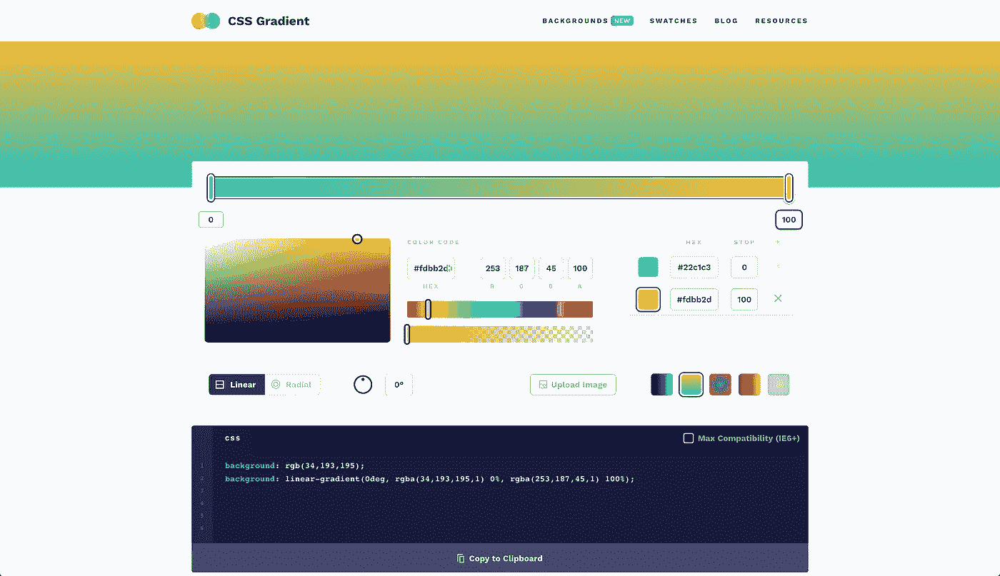
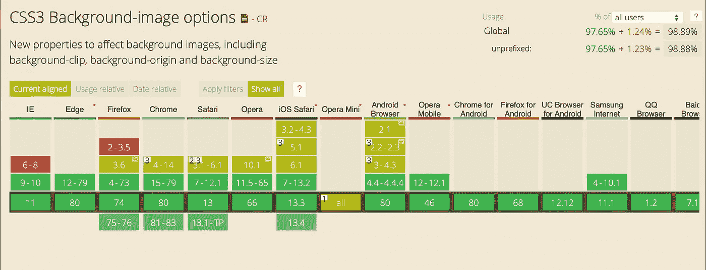

# 如何创建苹果 iPad Pro 页面上的渐变标题

> 原文：<https://betterprogramming.pub/how-to-create-gradient-titles-like-apples-ipad-pro-page-a0647ec83e51>

## 使用 CSS 自己构建它们



来源:[苹果 iPad Pro](https://www.apple.com/ipad-pro/)

不知道你有没有看过新的 iPad Pro——我觉得太棒了！但我想谈谈苹果产品页面，就像新的 iPad Pro 一样，我是它的忠实粉丝。我注意到他们有一些很酷的带有渐变背景的标题…

我做的第一件事是尝试选择文本。在早期，图像是用 JavaScript 通过`<canvas>`标签创建的，所以文本是不可选择的。但令人惊讶的是，我可以选择文本！

我检查了苹果是如何制作渐变背景的。在这篇文章中，我也将教你这样做。

# 背景-剪辑:文本

你所需要做的就是在标签上放置一个背景图像或渐变以及一些其他属性:

```
h1 {
    background-clip: text;
  -webkit-background-clip: text;
  color: transparent;
    background-size: cover;
    background-image: url('https://images.unsplash.com/photo-1557682224-5b8590cd9ec5?ixlib=rb-1.2.1&q=80&fm=jpg&crop=entropy&cs=tinysrgb&w=800&fit=max&ixid=eyJhcHBfaWQiOjF9');
}
```

我们得给 Safari 加个前缀`-webkit-background-clip`，不然就不行了。对于 Chrome 和 Firefox，它会工作得非常好。

# 背景渐变

为了使它更轻便，我们可以使用 CSS 背景渐变:

```
h1 {
    background-clip: text;
  -webkit-background-clip: text;
  color: transparent;
    background-size: cover;
    background: linear-gradient(147deg, rgba(249,15,216,1) 0%, rgba(245,67,119,1) 26%, rgba(252,28,28,1) 50%, rgba(255,195,13,1) 75%, rgba(114,251,89,1) 100%);
}
```

有几个生成器可以帮助你制作这些渐变。

## ui 梯度



如果你需要绝妙渐变的灵感，[uiGradient.com](https://uigradients.com/#MegaTron)是个很好的资源。

## CSS 渐变



[CSS 渐变](https://cssgradient.io/)让你用一个简单的编辑器创建复杂的 CSS 背景渐变。完成后，您可以复制 CSS 并将其粘贴到代码中。

# 例子

我用 CSS 背景剪辑创建了一个演示。如果您需要渐变图像，请检查自由图像的 Unsplash。

我想在这里也包括你的例子！如果你用`background-clip: text;`做了一些很酷的东西，在评论中添加链接，这样我就可以把它们包括进来，以激励其他人。

# 浏览器支持



根据 caniuse.com 的说法，所有主流浏览器都支持它，甚至从 IE9 开始。

Safari 不支持`<button>`元素的`-webkit-background-clip: text;`。但是你可以把`<span>`放在`<button>`里面得到同样的结果。(来源:[canisue.com](https://caniuse.com/#feat=background-img-opts))。

*快乐编码！🚀*

# 结论

我发现浏览器程序员努力支持各种新的 CSS 特性。我希望这会给你的 CSS 工具箱带来一些新的可能性。

我很期待看到你用它做的所有很酷的东西！

# 阅读更多

[](https://medium.com/undefined-developer/you-picked-the-wrong-side-of-the-javascript-war-583e64fe9c74) [## 在 JavaScript 战争中，你站错了队

### 没有人会赢！

medium.com](https://medium.com/undefined-developer/you-picked-the-wrong-side-of-the-javascript-war-583e64fe9c74) [](https://levelup.gitconnected.com/typescript-for-beginners-97b568d3e110) [## 初学者打字稿

### 从头开始学习 TypeScript 的实用方法

levelup.gitconnected.com](https://levelup.gitconnected.com/typescript-for-beginners-97b568d3e110) [](https://levelup.gitconnected.com/3-lessons-from-developer-job-rejections-334327a0c66c) [## 开发人员拒绝工作的 3 个教训

### 即使困难重重，也要坚持到底！

levelup.gitconnected.com](https://levelup.gitconnected.com/3-lessons-from-developer-job-rejections-334327a0c66c) [](https://medium.com/better-programming/how-to-create-gradient-titles-like-apples-ipad-pro-page-a0647ec83e51) [## 如何创建类似苹果 iPad Pro 页面的渐变标题

### 使用 CSS 自己构建它们

medium.com](https://medium.com/better-programming/how-to-create-gradient-titles-like-apples-ipad-pro-page-a0647ec83e51)