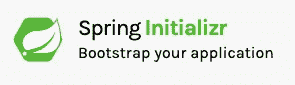
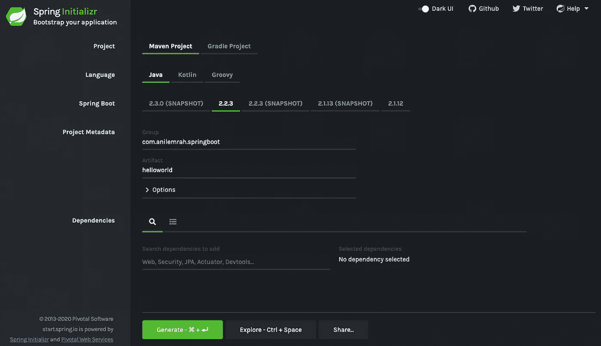
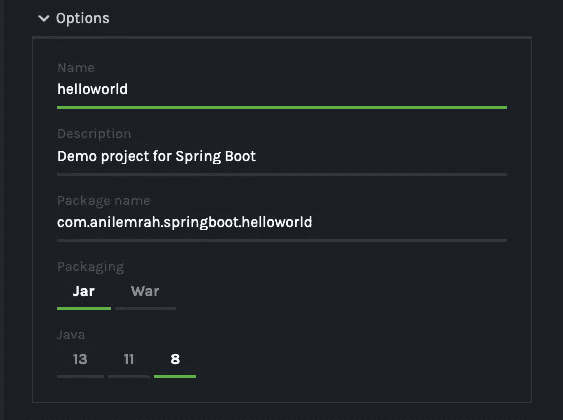
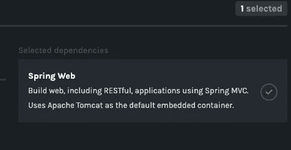
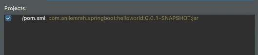
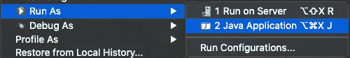
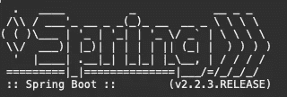
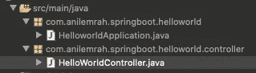
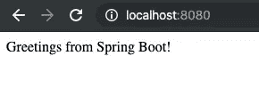

# 如何用 Spring Boot 创建 Hello World 应用程序

> 原文：<https://betterprogramming.pub/how-to-create-hello-world-application-with-spring-boot-spring-initializr-cdc4f97e3718>

## 使用 Spring Initializr 为你的下一个大应用程序创建基础

谢尔盖·佐尔金在 [Unsplash](https://unsplash.com?utm_source=medium&utm_medium=referral) 上拍摄的照片

嗨伙计们！在本文中，我们将创建一个基本的“Hello World！”最简单的例子。以便您可以将该应用程序用作您的应用程序的模板。

当然，有很多不同的方法可以做到这一点，但我们将使用最简单的方法。

我们开始吧！

我们将使用[春初名](http://start.spring.io)。这是一个自动为我们创建基础项目的工具，包括所选择的语言、版本和依赖项。

此外，您可以指定您的项目元数据，如果它是一个 [Maven](https://maven.apache.org/) 或 [Gradle](https://gradle.org/) 项目！

让我们一起来参观[春季初始化日](http://start.spring.io)。

这里，我们将选择 *Maven 或 Gradle project* 来创建一个。就我而言，我选择 Maven。

之后语言有三个选项，分别是 Java、 [Kotlin](https://kotlinlang.org/) 和 [Groovy](https://groovy-lang.org/) 。我在这里选择 Java。

然后是 Spring Boot 版本。当我写这篇文章的时候，我选择了最新的稳定版本 2.2.3。

然后，您可以设置项目元数据。在“选项”部分，您可以设置项目的具体细节。在我们的例子中，比如像 JAR 或 WAR 这样的打包，还有你项目的 Java 版本。

我将把它们保留为默认值。

最后，让我们添加依赖项。在本节中，您可以为项目添加依赖项。

在我们的例子中，我们将只添加 Spring Web。这将为我们的“Hello World”应用程序添加必要的依赖项。做完这些之后，让我们点击这个页面下面的按钮。让我们生成！

如果您单击该按钮，一个. zip 文件将被下载到您的计算机上。解压并打开你最喜欢的 IDE。在我们的例子中，将会是[日蚀](https://www.eclipse.org/ide/)。

因此，此时，我们需要将这个项目导入到我们的 IDE 中。

文件->导入-> Maven ->现有的 Maven 项目。

并从目录中选择我们的文件。这将检测我们刚刚创建的 Maven 项目。

点击*完成*。这将创建我们想要构建的项目。

创建后，Maven 将为我们下载依赖项和所有东西，这可能需要一些时间。请等到 Maven 为您完成这项工作。

一切准备就绪后，选择您的项目，右键单击->运行方式-> Java 应用程序。如果你看到下图，一切都为你准备好了！你的第一个 Spring Boot 项目成功了。

因为 Spring Boot 有一个内置的服务器，Tomcat，你不需要建立一个新的服务器。你只需要逃跑，仅此而已。Spring Boot 将为你启动 Tomcat。

你可以登陆 [http://localhost:8080/](http://localhost:8080/) 查看你的申请。

如果你看到了，不要担心！这对于我们的情况来说是正常的，因为我们还没有做任何编码。让我们通过展示一些基本的文本来完成我们的例子。让我们创建一个作为控制器的新包。

之后，让我们创建一个新的类，`HelloWorldController`。我们将创建一个简单的方法，在主页上显示基本文本。

这个方法基本上是一个控制器，当有人在使用我们的应用程序时请求“T2”时，它将调用方法“T1”。让我们再次运行应用程序并测试我们的方法。

干得好！您已经成功运行了第一个 web 应用程序，它向您显示了一些文本！您可以从该点继续前进，并使用该应用程序作为起点。

如果您想下载源代码，可以在下面的存储库中找到它:

 [## anilemrah/MediumSpringBoot

### 此时您不能执行该操作。您已使用另一个标签页或窗口登录。您已在另一个选项卡中注销，或者…

github.com](https://github.com/anilemrah/MediumSpringBoot) 

目前就这些。我希望这篇文章能帮助你，如果你有任何问题或建议，请给我留言。谢谢你的时间。希望在接下来的文章中见到你！