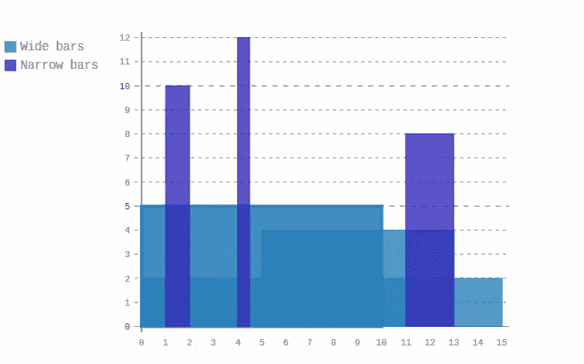
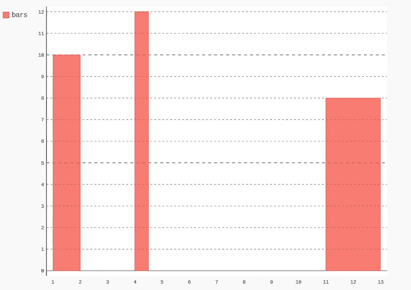
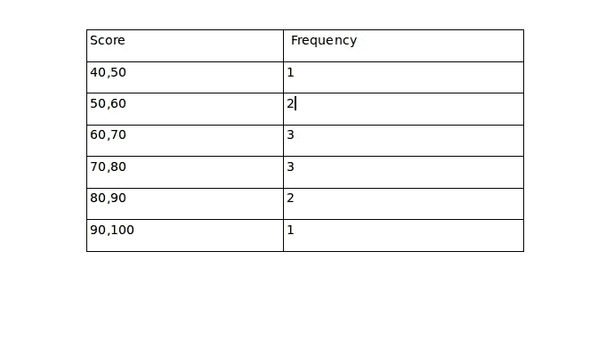
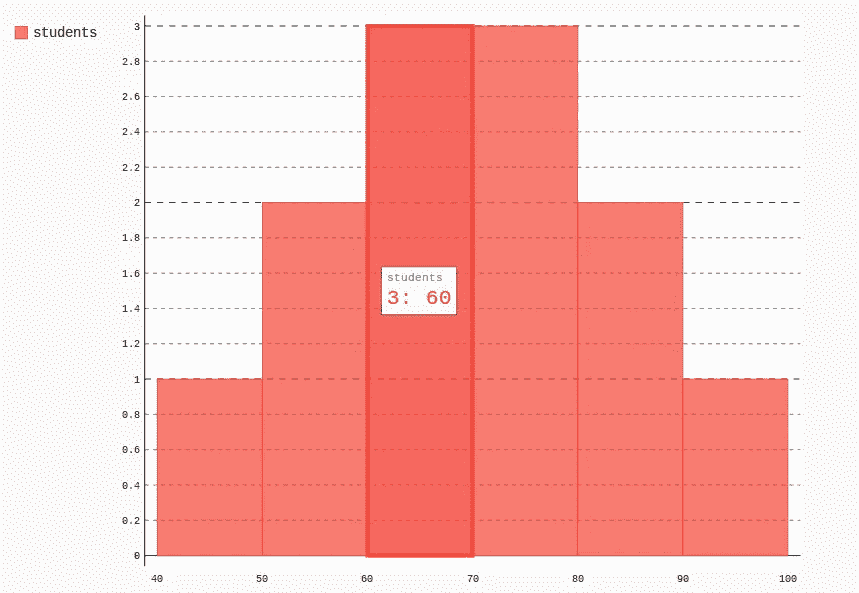
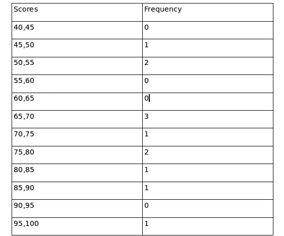
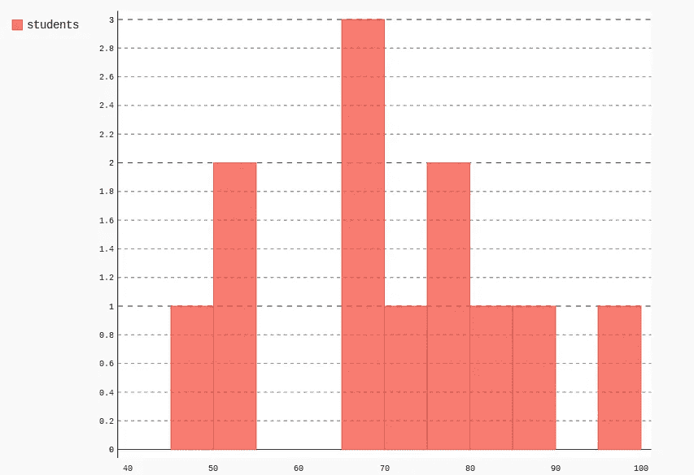
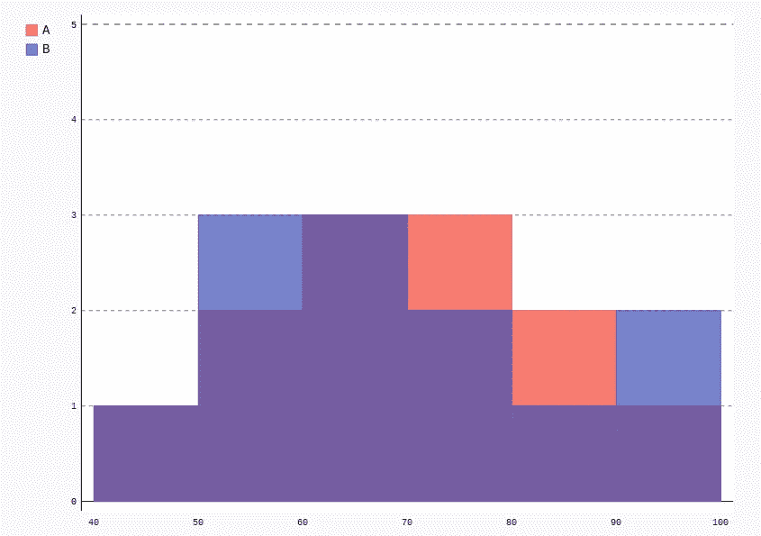
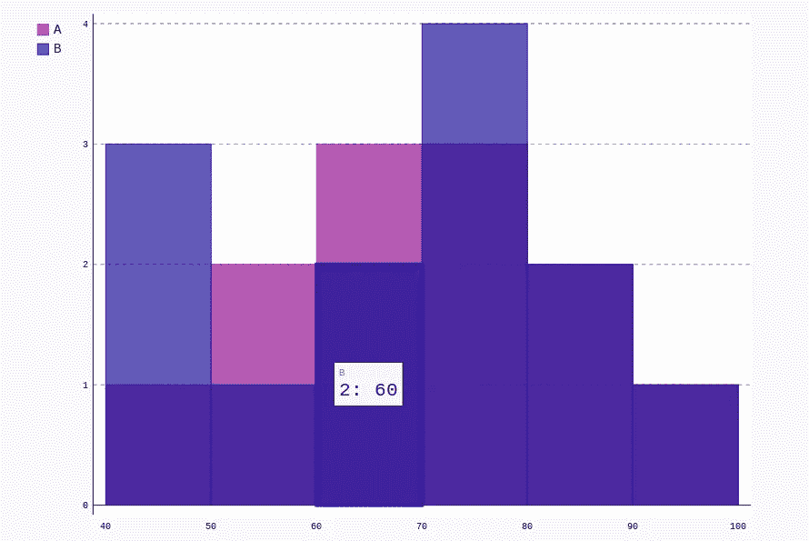
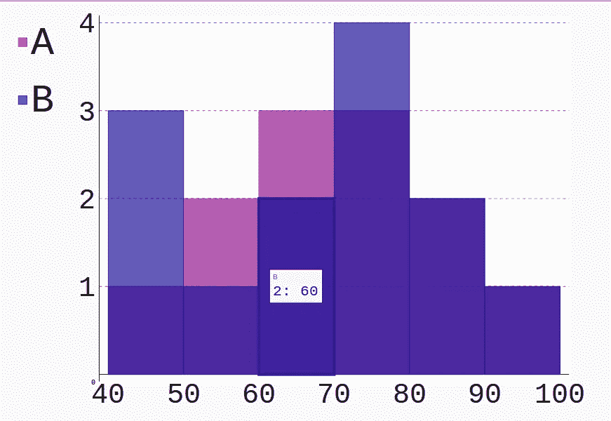

# 如何在 Pygal Python 中创建直方图

> 原文：<https://betterprogramming.pub/how-to-create-histograms-in-pygal-python-e0bca3d4e87d>

## Pygal 简介


卢克·切瑟在 [Unsplash](https://unsplash.com/s/photos/histogram-chart?utm_source=unsplash&utm_medium=referral&utm_content=creditCopyText) 上的照片

可缩放矢量图形(SVG)是一种图像格式，它以 XML 格式定义基于矢量的图形。在本教程中，您将了解如何开始使用 [Pygal](http://www.pygal.org/en/stable/) ，这是一个 Python SVG 图形绘制库。您还将学习如何使用 Pygal 库绘制直方图。

# Pygal 简介

Python 中有许多可用于图表的库(例如 [Matplotlib](https://matplotlib.org/) 和 [seaborn](https://seaborn.pydata.org/) )。尽管大多数库并不复杂，但大多数 Python 图表开发人员都需要一个简单易用的库来快速构建 Python 应用程序。

Pygal 库提供了比其他图表库更多的图表选项。它包括世界地图、漏斗图、雷达图和箱线图。它还包括预构建的主题和样式，除非您想定制，否则不必定制。Pygal 还与 web 开发集成得很好，尤其是与 Flask 和 Django。

Pygal 作为一个数据科学库，支持创建 SVG 格式的图形。SVG 格式在数字项目中很流行，因为它可以创建交互式显示和下载图像格式的图形，特别是 PNG 格式的图形。

# 安装 Pygal

Python 中提供了 Pygal，安装它非常简单:

```
pip install pygal
```

确保您的计算机上安装了 pip。

要测试安装是否成功，请打开 Python 解释器，并发出以下命令。

```
import pygal
```

如果没有出现错误，则安装成功。

如果您想使用 Pygal 的最新版本，也可以从官方的 GitHub 存储库中克隆它。

```
pip install git+https://github.com/Kozea/pygal
```

# 为什么是派戈尔？

让我们来看看您可能更喜欢使用 Pygal 的一些原因:

## 1.容易理解

Pygal 库非常容易理解，因为它比 Matplotlib 和其他绘图模块的导入更少。让我们通过用 Pygal 和 Matplotlib 编写绘制图表所需的代码来进行比较。

用 Pygal 画一个图表。

在 Matplotlib 中绘制图表。

正如您在上面看到的，在 Pygal 中绘制图表只需要四行代码和一次导入，相比之下，Matplotlib 需要更多的代码和更多的导入。

## **2。更少的依赖性**

Pygal 库也不需要任何依赖关系，这可能会让新开发人员感到困惑。

## **3。灵活输出**

图表库输出是 SVG，这是一种高度灵活的 HTML5 和其他印刷媒体输出类型。SVG 格式也是可伸缩的，可以在不损失质量的情况下调整大小。

# 入门指南

*直方图*是给出数据定量分析的条形图。

直方图更多地处理数据分布，并告诉我们每个类别中有多少个项目。同样重要的是要注意，直方图代表一个连续的数据集，因此，在直方图定义的数据中没有间隙。下面显示了一个直方图和构建直方图的原始数据的示例:



直方图的一个例子

# 创建直方图

数据可视化以图表或图形的形式解释信息。在本教程中，您将看到如何使用 Pygal 库创建直方图。让我们首先用预定义的值创建一个简单的直方图。

创建一个名为`histogram.py`的文件，并添加以下代码:

在上面的代码中，首先导入 Pygal 库，创建一个 histogram 对象，然后向 histogram 对象添加值。最后一步是将创建的直方图呈现为 SVG 文件。

生成的图形存储在与文件`histogram.py`相同的目录中。所以继续吧:用你的浏览器打开它，你应该会看到如下所示。



创建直方图

# 加载动态数据

上面的值是预定义的；让我们假设您已经有了一些想要通过直方图呈现的数据，如下所示。

在本例中，您有一些学生在测试中的分数数据，如下所示:

`46,78,51,52,83,87,69,71,65,67,76,98`

首先要做的是通过将分数范围分成区间来分析这些数据。从上面的数据来看，最高值是`98`，最低值是`46`。

最简单的方法是用 10 的间隔来表示数据点；因此，结果分析将是:



数据表

现在您已经完成了分析，您将在直方图中表示数据。您通常希望沿着 *X* 轴显示分数，沿着 *Y* 轴显示频率。首先，您需要导入 Pygal 库。

```
import pygal
```

从 Pygal 库中创建一个`Histogram`对象。

```
hist = pygal.Histogram()
```

一旦有了`Histogram`对象，就需要给`Histogram`对象分配 *X* 轴和 *Y* 轴的值。

```
hist.add(‘students’, [(1, 40, 50), (2, 50, 60),(3, 60, 70), (3, 70, 80), (2, 80, 90), (1, 90, 100)])
```

现在您需要将`Histogram`渲染成一个 SVG 文件。这是将 SVG 图像渲染到文件的方法:

```
hist.render_to_file(histogram1.svg)
```

最终的代码应该如下所示:

您已经创建了第一个直方图。导航到主脚本所在的目录，您应该看到保存为`histogram.svg`的图形。用浏览器打开它，它应该显示如下:



直方图截图

# 调整我们的直方图

我们的直方图看起来有点厚；让我们把间隔频率改为至少一个`5`。所以我们的数据看起来像这样:



直方图数据分析

完整的代码如下所示:

然后，您继续表示数据，就像您在前面的示例中所做的那样，如下所示。



柱状图

或者，您可以在同一个图形上绘制两个直方图。假设你想比较同一次考试中两个班的成绩，数据如下:

`96,54,76,92,63,64,66,59,77,56,87,42`

根据多少学生得分在规定分数之间，我们的分析如下所示:

```
scores |frequency
[40,50] | 1
[50,60] | 3
[60,70] | 3
[70,80] | 2
[80,90] | 1
[90,100] | 2
```

填充数据后的完整代码如下所示:

在上面的代码中，您额外增加了 X 轴*和 Y 轴*上的值，所以直方图没有定义在两个刻度上显示的值。结果如下所示:**



最终直方图

# 自定义样式

您也可以将自定义样式添加到直方图中。例如，添加颜色时，需要导入 Pygal style 属性。

```
from pygal.style import Style
```

接下来，定义自定义样式以指定条形图的颜色，并指定图表的背景颜色。

```
style = Style(colors=(‘#991593’, ‘#201599’))
```

将自定义样式应用于直方图:

```
chart = pygal.Bar(style = custom_style)
```

保存以上更改并刷新文件。您应该能够查看呈现了自定义样式的直方图，如下所示。



样式直方图

此外，您可以添加其他样式选项，包括透明度、字体系列、图例和背景，如下所示:

```
style = Style(colors=(‘#991593’, ‘#201599’),label_font_size=39,opacity=’.7',legend_font_size=54)
```

刷新文件，您应该会看到您的更改生效。



更多样式

# 导入数据

JSON 是一种流行的数据存储格式。让我们假设您有一些 JSON 格式的数据，这些数据已经废弃或从其他来源获得，您希望用这种数据绘制一个直方图。数据像`data.json`一样存储在文件中。

```
[{“frequency”: 1,“min”: 40,“max”: 50},
 {“frequency”: 2,“min”: 50,“max”: 60},
 {“frequency”: 3,“min”: 60,“max”: 70}, 
 {“frequency”: 3,“min”: 70,“max”: 80},
 {“frequency”: 2,“min”: 80,“max”: 90},
 {“frequency”: 1,“min”: 90,“max”: 100}
]
```

因为您将从 JSON 文件加载数据，所以需要导入 JSON 库。

```
import json
```

从`.json`文件中加载 JSON 数据。

```
with open(‘data.json’,’r’) as file:
    data = json.load(file)
```

从 Pygal 库中创建一个`Histogram`对象。

```
histogram = pygal.Histogram()
```

通过从 JSON 数据对象中读取列表形式的频率，设置 *X-* 和 *Y* 轴的值。

```
x_labels_ = [x[‘frequency’] for x in data]
y_labels_ = [x[‘min’] for x in data]
```

将`labels`数据分配给`Histogram`对象。

```
*# x axis* hist.x_labels = x_labels
*# y axis* hist.y_labels = y_labels
```

将数据添加到`Histogram`对象。

最后，将直方图 SVG 图像呈现到文件中。

```
hist.render_to_file(‘histo.svg’)
```

# 结论

在本教程中，您了解了如何使用 Pygal，这是一个 Python SVG 图形绘制库。您了解了如何向同一个图形添加多个直方图，以及如何定制条形图样式。

使用 Pygal，您可以绘制不同类型的图表，如折线图、条形图、直方图、 *XY* 图、饼图、雷达图、箱线图、点图、漏斗图、立体图、仪表图、金字塔图、树形图和地图。

创建图表的过程和命令也类似于创建直方图。例如，这是用 Pygal 创建简单折线图的代码。