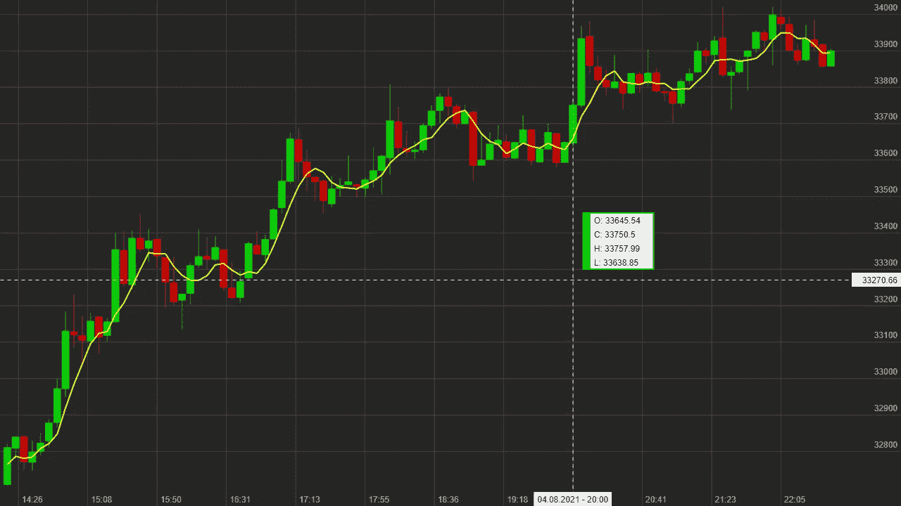
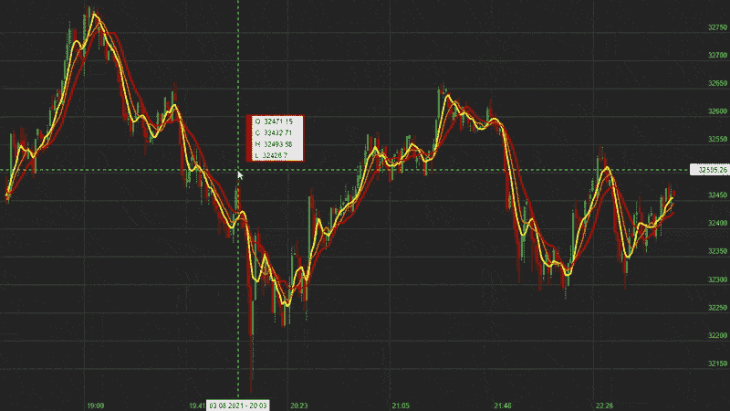

# 如何用 JavaScript 创建带有实时比特币数据的交互式蜡烛图

> 原文：<https://betterprogramming.pub/how-to-create-interactive-candlestick-charts-with-real-time-bitcoin-data-in-javascript-fb20166b4fe0>

## 使用币安 API 传输实时加密货币价格

带有实时比特币数据的交互式蜡烛图，图片由作者提供。

随着今年早些时候 [GameStop 做空](https://www.cnbc.com/2021/01/22/gamestop-soars-nearly-70percent-trading-briefly-halted-amid-epic-short-squeeze.html)和[比特币的价格记录](https://www.cnbc.com/2021/03/13/bitcoin-surpasses-60000-in-record-high-as-rally-accelerates-.html)，蜡烛图充斥着新闻，我意识到我不知道如何阅读它们。所以几周前，我终于读完了它们，并了解到它们实际上很容易理解。

每当我了解一个新主题时，我最喜欢做的事情之一就是为它创建我自己的定制工具。自己编程是深入理解任何主题的最好方法之一。因此，[我创建了一个简单的 JavaScript 类来在 HTML 画布上绘制蜡烛图](https://levelup.gitconnected.com/creating-candlestick-charts-in-javascript-116ea2d6f7dd)。

然而，我的第一个解决方案只能绘制静态图表，没有交互性，因此无法使用它来显示实时价格数据。为了补救这种情况，我做了更多的工作，添加了缩放和技术指标，并通过[币安 API](https://binance-docs.github.io/apidocs/spot/en/#introduction) 将其连接到实时 WebSocket 烛台流。

# 更新烛台图表类

在显示任何实时数据之前，我必须在我的烛台图表类中添加对它的支持。

以前，它只支持静态烛台值，没有办法动态更新它们。因此，我添加了一个新的`updateCandlestick( candlestickID , open , close , high, low )`函数来更新给定烛台的值。

下一步是实现放大和缩小图表的能力。如果你真的想高效地使用蜡烛图，这是一个非常重要的特性。

你可能会放大观察，但当你必须决定是买还是卖一项资产时，你可能会缩小观察价格在更长时期内的发展。幸运的是，通过改变绘制的烛台的起始索引，添加缩放变得非常容易。例如，从索引 0 开始绘制所有烛台，如果您只想绘制最后 100 个烛台，则从`candlesticks.length-100`开始。

最后，我在烛台图表类中添加了对技术指标的支持。我想以这样一种方式实现它们，一旦我对它们有了更多的了解，我就可以添加更多的。我对结果很满意，虽然我到目前为止只实现了移动平均线，也许还有更复杂的情况，我的系统不能很好地工作。

每种技术指标都必须实现一个回调函数的接口，当蜡烛图改变时，这些函数会自动调用。

例如，当添加一个新的烛台时，我们需要计算新数据点的移动平均值。因此，烛台图表类为其所有技术指标调用`onAddCandlestick( candlestickChart , candlestickID )`,在该函数的 MovingAverage 实现中，我们可以计算最后 n 个样本的平均值，并添加一个新的数据点。

因此，如果我了解到一个新的技术指标，我想添加到类中，我需要做的就是实现这个接口，它应该是一个即插即用的解决方案。

# 流式实时数据

随着适当的实时支持添加到我的烛台图表，终于是时候流一些实际的烛台数据。我正在使用[币安 WebSocket 市场流](https://binance-docs.github.io/apidocs/spot/en/#websocket-market-streams)直接从他们的交易所获取实时市场数据。然而，我们还需要在页面加载时获取最近的价格历史，这样我们就不会从零开始。

幸运的是，我们也可以为此使用币安 API。API 为您正在寻找的任何类型的数据提供了市场数据端点。在我们的例子中，我们感兴趣的是[烛台/克莱恩端点](https://binance-docs.github.io/apidocs/spot/en/#kline-candlestick-data)。

我们在这里使用的两个 API 都是公共的，这意味着您不需要 API 密钥来使用它们(尽管每个 IP 都有限制)。顺便提一下，我是币安 API 的忠实粉丝。它被很好地记录和完成。看起来仅仅通过 API 就可以控制你的整个账户，我希望更多的公司关注他们的 API。

让我们看看 CandlestickStream 类。相关功能有 start()和`onMessage()`。当我们开始这个流时，我们首先调用静态烛台 API 来为我们的符号和间隔获取最近的 500 个烛台。当我们得到它们时，我们用这些值初始化烛台图表，并启动 WebSocket 连接。

现在，我们将每 2 秒钟收到一条实时消息，更新我们的烛台。在 onMessage()回调函数中，我们查看收到的烛台的时间戳值。如果图表中最后一根蜡烛线有相同的时间戳，我们就更新它。如果没有，这意味着一个新的烛台已经开始，所以我们也添加一个新的烛台到我们的图表。现在我们有一个完全工作的实时比特币烛台流，你可以坐下来，满怀希望地看着你的投资飞向月球。

放大和缩小实时蜡烛图，图片由作者提供。

# 使用

使用`CandlestickStream`类非常简单。我们需要做的就是创建一个类的新实例，告诉它我们想要哪个符号和区间，然后开始流:

# 例子

我在我的网站上添加了一个例子，用 5 分钟的烛台显示比特币的欧元价格:[实时比特币烛台](https://pingpoli.de/bitcoin-chart/)。

# 结论

我非常喜欢创建自己的自定义数据可视化，而不仅仅是使用第三方解决方案。

由于我最近回到了加密领域，我想实现一个烛台图表类，并将其连接到实时市场流。

这样，我可以完全控制可视化，并根据自己的喜好进行定制。如果您是一名程序员，并且对加密货币感兴趣，我强烈建议您也创建自己的定制解决方案。从你自己的程序里看着价格上涨，是双倍的满足感。

# 资源

*   [pingpolicandlestickchart . js](https://gist.github.com/pingpoli/bff235522221a9e865af9ee311ec11fb)
*   [CandlestickStream.js](https://gist.github.com/pingpoli/8c57e539e61b950aca8d4f58ec187154)
*   [pingpoliWebSocket.js](https://gist.github.com/pingpoli/b39bbb8481832bf4c0522dd8d57dd839) (我的 WebSocket 包装器)
*   [币安 API](https://binance-docs.github.io/apidocs/spot/en/#introduction)

你喜欢这样的内容吗？[加入 Medium](https://pingpoli.medium.com/membership) 可以无限制访问所有故事，支持我和其他作者。如果你通过此链接注册，你的一部分会员费将归我所有。