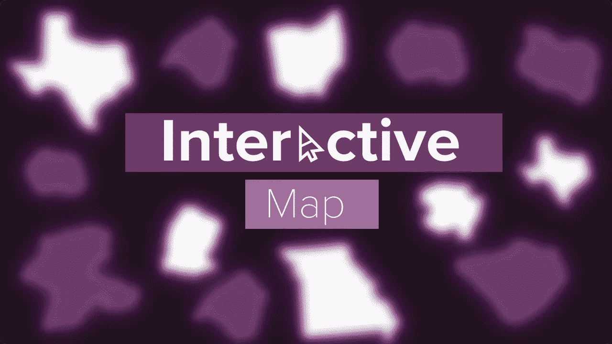
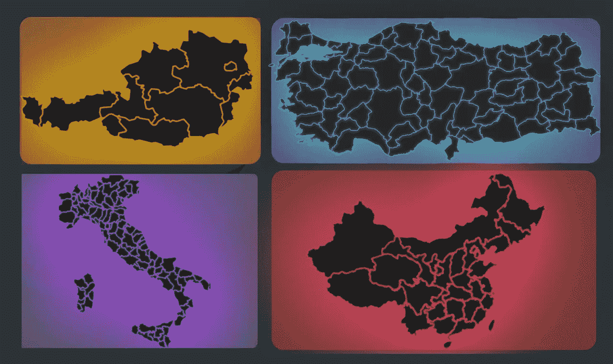
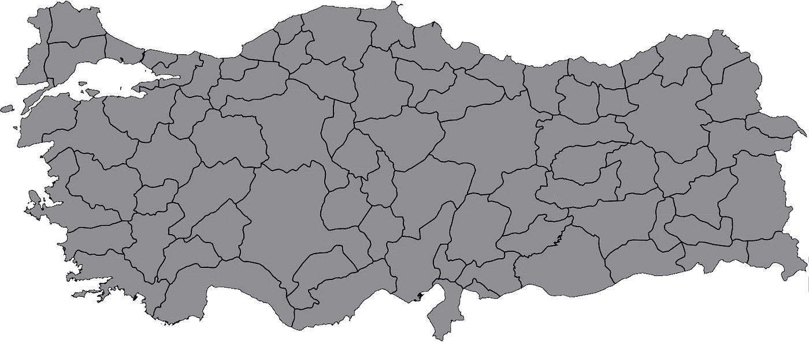
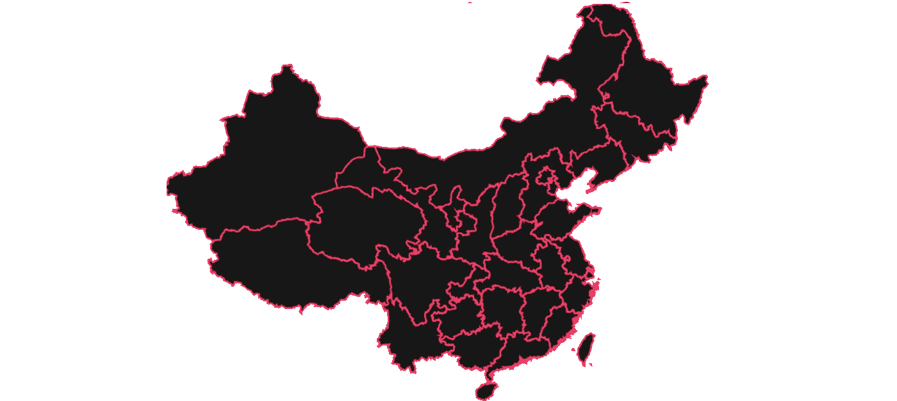
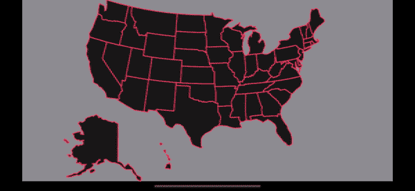
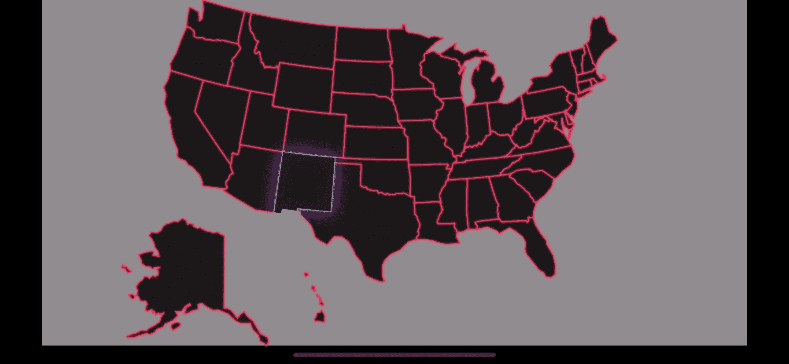

# 如何使用 SwiftUI 创建交互式地图

> 原文：<https://betterprogramming.pub/how-to-create-interactive-maps-using-swiftui-1c49732e2950>

## 了解如何使用 SwiftUI 创建令人惊叹的交互式地图和 SVG



作者图片

在 Android 中，如果你想画一个交互式的地图，你可以使用`GeoChart`，或者其他很多这方面的图表库。但是当涉及到`Swift`，尤其是`SwiftUI`，几乎没有真正的方法可以建造这样的东西。

这就是 [InteractiveMap](https://github.com/GrandSir/InteractiveMap) 库的用武之地。



使用 InteractiveMap 创建的地图

**注意**:尽管这个库支持大多数 SVG，但是 SVG 解析算法并不是完美的形式，所以它会导致一些 SVG 出现问题。

欢迎在我的 GitHub 上参与这个项目:

[](https://github.com/GrandSir/InteractiveMap) [## GitHub—GrandSir/Interactive Map:Swift 和 SwiftUI 的交互式地图库！

### 在 SwiftUI 中交互使用基于 SVG 的地图的库。仅适用于。基于 svg 的地图允许你修改所有的…

github.com](https://github.com/GrandSir/InteractiveMap) 

# 将 InteractiveMap 添加到 Xcode 项目中

首先，你必须安装库。`InteractiveMap`仅支持 Swift 包管理器，因此只需转到`File` → `Add Packages…`，然后输入 URL:

```
[https://github.com/GrandSir/InteractiveMap](https://github.com/GrandSir/InteractiveMap)
```

让我们跳到有趣的部分，看看 InteractiveMap 是如何渲染地图的！

# 使用交互式地图

要使用 InteractiveMap，您必须使用`InteractiveMap`视图并指定一个 SVG 名称。



一张简单的土耳其地图

`InteractiveMap`是一个`View`,它返回一个以`PathData`为参数的可迭代闭包(就像`ForEach`,但是是一个定制的闭包),它包含了所有关于路径 aka 形状的信息。

出于几个原因，这是必需的:首先，为了在`Map`中定制`Paths`，您必须以某种方式访问它的数据。因此，`PathData`给你五个属性自定义形状。

`id`、`name`、`boundingBox(bounds of the path)`、`svgBounds(bounds of the original SVG)`和`path(information needed for drawing operations)`

足够的信息。现在让我们来看看如何自定义地图。

# 基本定制

用于基本自定义，如笔画、路径颜色、笔画宽度等。`InteractiveShape`有一个叫做`.initWithAttributes()`的修改器



定制的中国地图

好吧，太棒了！但是等等，这个库叫做 InteractiveMap。互动性在哪里？

确实如此。目前，您无法点击地图或对地图执行任何操作。但是，由于 InteractiveMap 库是用 SwiftUI 原生编写的，SwiftUI 的威力开始显现。

# 高级定制和交互性

至此，我们不得不离开`.initWithAttributes`，自己编写定制方法。



但是等等，那看起来有问题？有什么问题？

嗯，确实出现了一些问题。首先，`InteractiveShape`相互重叠。因此，一些路径站在其他路径的后面，导致难看的外观。

另一个问题实际上并不是问题，但是目前，路径上没有动画。所以，当你点击另一个路径时，光晕会立即消失。这也不优雅。

# 修复问题

为了解决第一个问题，我们必须为路径指定一个`zIndex`。这是一个`SwiftUI`修改器，根据其`zIndex`告诉哪个`View`应该被定位在顶部或后面。

为了解决第二个问题，我们可以在`SwiftUI`中使用`.animation`修饰符。



平稳和伟大的

感谢阅读！敬请关注更多内容。