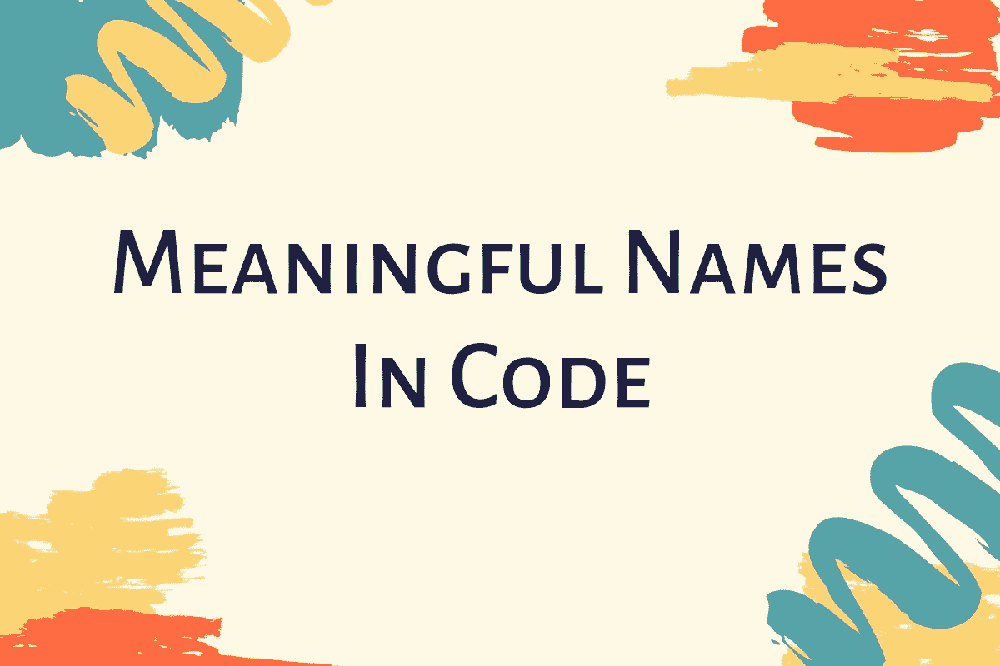

# 如何在代码中创建有意义的名称

> 原文：<https://betterprogramming.pub/how-to-create-meaningful-names-in-code-20d7476537d4>

## 创造好名字可以遵循的简单规则

作为一名开发人员，你花了大量的编码时间来制作变量和考虑合适的名字。到处都是名字。你命名文件、类、方法和变量。

因为我们花了这么多时间给事物命名，所以把它做好真的很重要。在这篇文章中，我将向你展示一些简单的规则，你可以遵循这些规则来创造一个好名字。在代码中命名事物本身就是一种艺术！

# 使用透露意图的名字

让名字暴露他们的意图说起来容易做起来难。你有多经常遇到变量名不能告诉你任何关于它们的意图的事情？

一个很好的经验法则是:如果一个名字需要注释，那么它就不会暴露其意图。

下面这段代码是一个不透露意图的变量:

变量`$s`没有揭示任何东西。它不会唤起一种时间流逝的感觉。最好选择一个名称来指定测量的内容和测量单位。

下面例子中的一个变量名会更好。

选择揭示意图的名称可以使理解一段代码更容易，因此也更容易维护。

选择好的名字需要时间，但节省的时间比花费的时间多。

让我们看看下面的例子:

为什么很难说出`getList`函数是做什么的？没有复杂的表达式。代码被适当地缩进和格式化。只使用了三个变量，没有什么特别的东西。

现在看一下`getOddNumbers`功能。你看到这个函数和`getList`函数做的一模一样吗？

请注意，代码的简单性没有改变。它仍然有完全相同数量的操作符和变量，以及完全相同数量的嵌套层次。唯一改变的是代码变得更加清晰。

通过一些简单的名称更改，很容易就能知道这段代码是做什么的。

# 避免虚假信息

你应该避免留下模糊代码含义的错误线索。

避免使用与本意不同的误导性词语。例如，不要将一组产品称为`productList`，除非它实际上是类型`List`的对象。这可能导致错误的结论。更好的名字应该是`products`。

可能你能找到的最糟糕的变量名是大写的`O`和小写的`L`。这是因为它们看起来很像 0 和 1。

注意不要使用细微差别的名字。发现一个文件中的`SomeMethodForEfficientHandlingOfFiles`和另一个文件中的`SomeMethodForEfficientStorageOfFiles`之间的细微差别需要多长时间？乍一看，这些名字看起来一样。

# 进行有意义的区分

数字系列命名不是有意命名的好方法。这样的名字是不提供信息的，因为它们没有为代码作者的意图提供任何线索。

让我们看下面的例子:

当`$arr1`和`$arr2`被重命名为`$source`和`$destination`时，这段代码会更好读。

# 使用你能发音的名字

如果你不能念出一个名字，你就不能在听起来像个白痴的情况下讨论它。这实际上很重要，因为编程的一部分是社会活动。很有可能每个人都知道一个他们不会发音的变量名。

假设我们有一个名为`$xsq`的变量名，这是贵公司一个非常重要的缩写。想象一下和一位同事的对话:

“哎，那个变量 *eks ess kjew* 呢？”

“你是说访问队列？”

一些开发人员会尝试将变量发音为一个单词。其他人会拼出这个单词。

# 使用可搜索的名称

由一个字母组成的名字存在不容易被定位的问题。

这同样适用于数字常量。数字常量可以用常量变量代替。当你搜索代码时，数字 8 会给你带来很多麻烦。

然而，用一个常量`MAX_BLOCKS_DISPLAYED`来代替它会使事情变得容易得多。

单字母名称的唯一用例是用于短方法中的局部变量。

# 成员前缀

不要使用成员前缀。

例如，一些开发人员习惯在所有私有成员前加下划线。不要。你的类和方法应该足够小，以至于你不需要这些前缀。

作为一种选择，你可以使用一个 IDE(或者安装一个插件)来根据变量的作用域给变量着色。

把你的代码想象成一个露营地——让它比你发现它时更干净。

# 结论

这就是如何在代码中创建更有意义的名称。

如果您有任何反馈、问题或希望我写另一个与编程相关的主题，请随时留下您的评论。

这篇文章的灵感来自罗伯特·c·马丁写的《干净的代码》一书，我强烈推荐你阅读这本书。