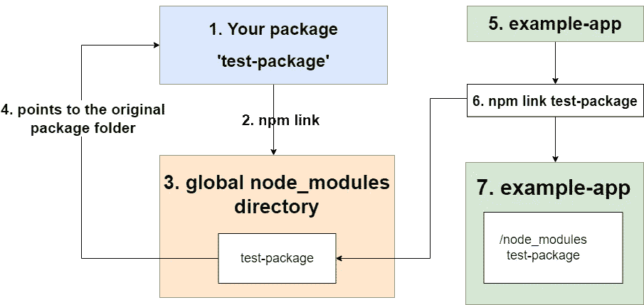

# 如何创建现代 NPM 包

> 原文：<https://betterprogramming.pub/how-to-create-modern-npm-packages-7c41cf610156>

## 掌握从创建基本包到 CI/CD 和 ES6 支持的所有方法


来源: [Freepik](https://www.freepik.com/vectors/icons)

NPM 让 javascript 生态系统中的代码共享和重用变得容易。NPM 包也允许你在你的私有项目之间共享代码。因此，您不必在多个项目中复制/粘贴和维护代码。

本教程将帮助您了解您是在创建您的第一个包，还是想要增强您现有的包。

在继续之前，我假设您对 javascript、git 和 npm 有基本的了解。另外，如果您没有 npm 帐户，[现在就创建一个](https://www.npmjs.com/signup)。

# 教程的要点

*   创建一个基本包
*   本地测试包(包链接)
*   将包发布到 npm
*   管理包更新、版本控制和重新发布
*   ES6 支持
*   发布的 CI/CD 工作流

# 创建基本包

创建一个基本包相当简单，由以下步骤组成。

## 1.创建包目录

```
mkdir test-package
```

切换到根目录

```
cd test-package
```

## 2.初始化 git

使用 git 不是必须的，但它使包更容易维护，并让其他人检查您的代码并做出贡献。我们将在教程的后面使用 GitHub 动作，所以我建议你也使用 GitHub。

```
git init
git remote add origin git://git-remote-url
```

我们在 npm 包初始化之前初始化 git，以便 npm 在执行`npm init`时自动为`package.json`选择 git 远程 URL，并最终将其显示在 npm 的包页面上。

## 3.初始化 npm

json 是告诉 NPM 你的包是做什么的方法。`name`和`main`字段为必填项。每个包名应该是唯一的。如果您想要的软件包名称已经存在，那么您可以创建一个以您的 npm 用户名为前缀的作用域软件包。例如

我们将创建一个作用域包

```
npm init --scope @your-npm-username
```

如果您想创建一个未打包的包，您也可以这样做。

使用上面的命令，让我们给我们的包命名为`test-package`，入口点为`index.js`。package.json 将如下所示

现在，当我们发布我们的包时，它将在以下 URL 可用。

```
[https://npmjs.com/package/@your-npm-username/test-package](https://npmjs.com/package/@your-npm-username/test-package)
```

## 4.添加自述文件

这不是必须的，但是要加上去，这样别人才能理解你的包装。

```
touch README.md
```

增加以下内容

## 5.添加包装代码

我们已经用 git 和 npm 配置了我们的包。是时候将实际功能添加到我们的包中了。

为了简单起见，我们将只添加两个函数。在您的包的根目录下创建一个文件`index.js`,并将下面的。

记住，在上一步中，我们将入口点设置为`index.js`。所以当有人从我们的包中导入任何东西时，npm 会查看这个文件。

我们的包的功能很简单，但这并不重要，因为对于任何类型的 javascript 包，过程都是一样的。

您的文件夹结构应该如下所示

# 本地测试包(包链接)

如果你想马上发布你的包，你可以跳过这一部分。通常，您应该在发布到 npm 之前进行测试。

若要在本地测试包，请从包的根目录运行以下命令。

```
npm link
```

这将在全局文件夹中创建一个符号链接，链接到执行`npm link`命令的包。简单地说，您的包代码将被移动到您的全局 node_modules 所在的目录中，但是作为一个到包的原始位置的快捷方式。



NPM 包装链接

现在，假设你有另一个应用程序，你想使用你的`test-package`作为依赖。你要做的就是

```
npm link test-package// OR, if you created a scoped package in the previous stepnpm link @your-npm-username/test-package
```

这将告诉 npm 在全局 node_modules 文件夹中寻找一个包`@your-npm-username/test-package`，如果找到了，NPM 将使用它。

然后你可以在你的应用中使用它

示例应用程序中的 test.js 文件

注意，我们没有发布/安装我们的包，只是链接了它。所以运行`node test.js`会在控制台中打印 3。这就是在发布之前测试包的方式。

# 将包发布到 NPM

现在，我们已经创建了我们的包并在本地测试了它。是时候发布到 npm 注册表了。为此，运行以下命令

```
*// By default, npm tries to publish a private package*
npm publish --access public
```

一旦上面的命令完成。您可以像使用其他 npm 软件包一样下载和使用该软件包

```
npm i @your-username/your-pacakge-name
```

# 管理更新、版本控制和重新发布

每次对包进行更新时，都应该在 package.json 文件中发布一个包含更新版本的新版本。

让我们更新一下代码

索引. js

提交您的更改并更新 package.json 中的`version`属性。您可以从编辑器中手动更新该属性，但是 npm 提供了一种更好的方法。

```
npm version patch
```

上面的命令会将 package.json 中的包版本从`1.0.0`更新为`1.0.1`，并且还会提交一个 git。

现在，运行`npm publish`来重新发布包，运行`git push`来将更改推送到 GitHub。

## 语义版本控制

NPM 遵循[语义版本化](https://semver.org/)。下面是如何使用语义版本化来指定包的更新类型

*   补丁发布:当你修复一个 bug 时使用它，例如，它将`1.2.1`更新为`1.2.2`
*   次要版本:当您添加新功能并确保它不会破坏任何以前的功能时，请使用此版本。例如，它将`1.2.2`更新为`1.3.0`
*   主要版本:当你对你的包做突破性的改变时使用它。例如，它将`1.3.0`更新为`2.0.0`

可以使用以下 npm 命令来实现这一点。

```
npm version major|minor|patch
```

# 添加 ES6 支持

我们可能希望在源代码中使用最新的 JavaScript 特性，比如 ES6 模块的`import/export`语法。

所以，我们要做的是

*   创建一个`src`文件夹来保存我们的 ES6 代码
*   在名为`lib`的文件夹中添加 babel，将我们的 ES6 代码转换成 ES5
*   添加`.npmignore`，类似于`.gitignore`，但忽略`src`目录而不是`lib`

让我们创建一个新目录`src`并将我们的`index.js`文件移到这里。修改该文件的内容以使用 ES6 语法。

带有 ES6 代码的 src/index.js

现在让我们将 babel 安装为一个开发依赖项

```
npm i -D @babel/core @babel/cli @babel/preset-env
```

在包的根目录下添加一个`.babelrc`文件，内容如下。

。巴勒克

将以下脚本添加到 package.json 中。我们告诉 babel 获取我们`src/index.js`中的所有内容，将其转换为 ES5，并将输出放在名为`lib`的新目录中

此外，我们的入口点现在将指向编译后的 es5 代码。

现在，设置。吉西诺和。npmignore 文件

。gitignore

。npmignore

要发布更新的包，请执行以下操作

*   运行`npm run build`,你会看到一个目录`lib`,里面有你的 ES5 代码
*   提交您的更改并运行`npm version patch`
*   运行`npm publish`将包发布到 npm，运行`git push`将更改推送到 GitHub

# 发布包的 CI/CD 工作流

为了避免每次更新我们的包时都创建 build 并运行`npm publish`,我们可以使用 CI/CD 管道来完成这项工作。

其思想是，每当我们将任何提交推送到主分支时，我们将触发一个工作流，该工作流将获取我们的包的最新源代码，并尝试将其推送到 npm。

在你的项目根目录下添加`.github`目录，在里面创建一个`workflows`目录，并制作一个文件`publish.yml`

文件夹结构

并在其中添加以下内容。

在第 31 行，你可以看到我们使用了 npm 秘密，这个秘密告诉 NPM 我们在工作流环境中的身份。在以下位置为您自己生成发布访问令牌

```
[https://https://www.npmjs.com/settings/your-username/tokens/create](https://www.npmjs.com/settings/haseebanwar/tokens/create)
```

由于令牌是敏感信息，我们没有将它硬编码到我们的工作流文件中，而是保存在 GitHub 的存储库 secrets 中。因此，GitHub 可以安全地将其传递到我们的工作流中。

您可以在这里为您的存储库创建新的密码

```
[https://github.com/your-username/repository-name/settings/secrets/actions/new](https://github.com/haseebanwar/test-pkg/settings/secrets/actions/new)
```

现在，在这样做之后，提交您的更改，运行`npm version patch`，并将更改推送到 GitHub，转到 Actions 选项卡，您将看到一个正在运行的工作流，它会将我们的包发布到 npm。

注意:不要忘记在你的文件夹中添加`.github/`文件夹。npmignore 文件。

这里是我们刚刚制作的包的[代码库](https://github.com/haseebanwar/test-package)和 [npm 页面](https://www.npmjs.com/package/@haseebanwar/test-package)。

# 下一步是什么？

对于更高级的包，我们可以设置 ESLint，或者不同种类的构建，比如 UMD，但是这些需求会随着你创建的包的性质而变化。很多时候，我们所做的都是必须的。

我在这里提到了它们，所以如果你愿意，你可以深入研究它们。也许我以后会写那些。所以，请继续关注，并在评论中让我知道你的反馈。

感谢阅读。