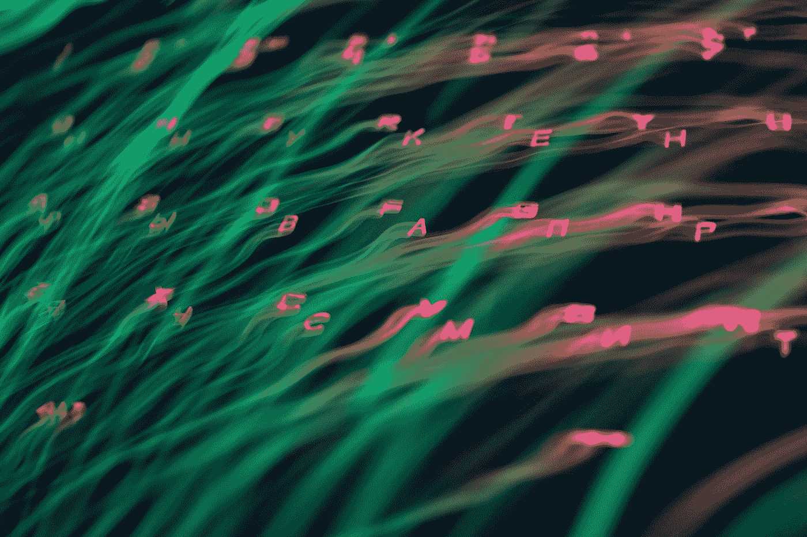
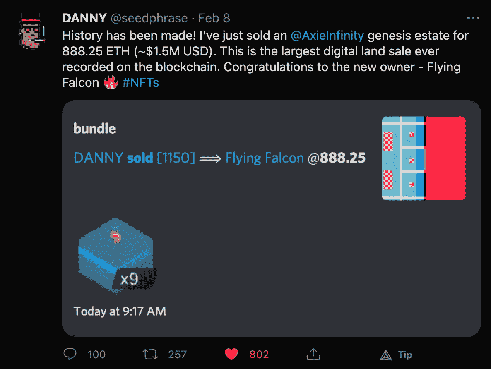
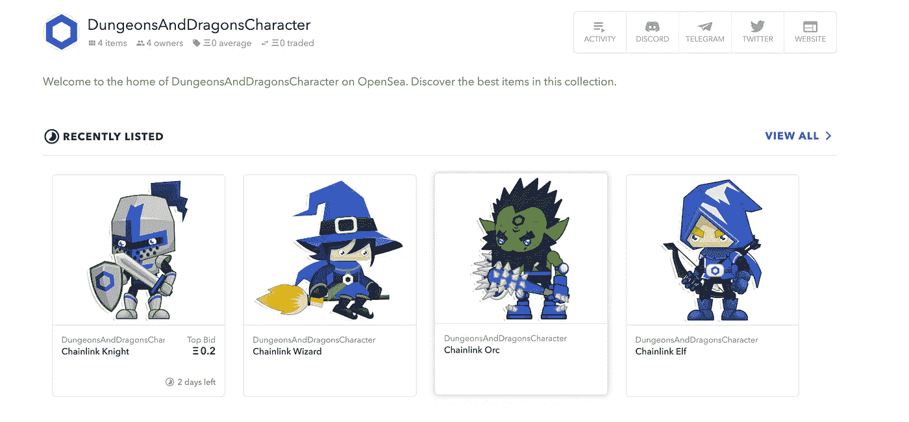
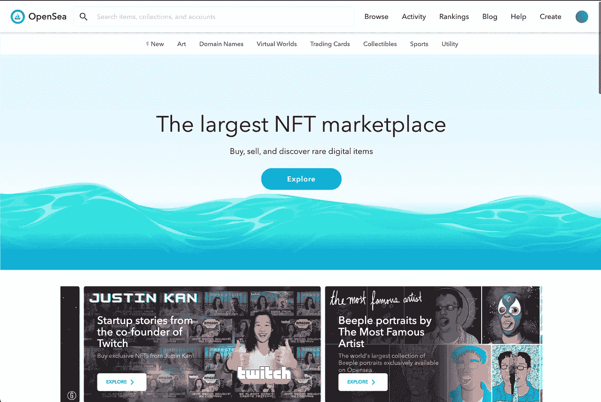

# 如何创建具有可靠性的 NFT

> 原文：<https://betterprogramming.pub/how-to-create-nfts-with-solidity-4fa1398eb70a>

## 一个光荣的指南，建设和创造 NFTs，ERC-721 标准，创造收藏品，艺术，和任何类型的独特的资产链。



Anton Maksimov juvnsky 在 [Unsplash](https://unsplash.com?utm_source=medium&utm_medium=referral) 上的照片。

[NFTs](https://eips.ethereum.org/EIPS/eip-721) (不可替代的代币)是智能合约领域炙手可热的新兴力量。如果 2020 年是 DeFi 年，那么至少 2021 年初属于 NFTs。NFT 是一种类似于 [ERC20](https://www.investopedia.com/news/what-erc20-and-what-does-it-mean-ethereum/) 的令牌标准。

不可替换的令牌意味着它是一个独一无二的令牌，没有其他令牌与之相似。这与 ERC20s 截然不同，ERC20s 是可替代的。可替换的意思是“可替换的”或“可互换的”例如，无论你用什么样的美钞，你的美钞都会值 1 美元。美元钞票上的序列号可能不同，但钞票是可以互换的，因为无论如何它们都是 1 美元。

有很多 ERC20s，像 MKR、AAVE 和 SNX。NFT(或者 ERC721s)也不是很多。事实上，每一种只有一个，因此它是独一无二的。这些可以被构建和编程来做任何你想做的事情，就像常规的智能合约一样，但它们具有加密证明的真实性，因为它们的部署历史将始终得到保证。这解决了许多问题，特别是对于艺术界的人来说，破译一件艺术品的真实性。这还可以解决版税问题，创建数字身份符号，允许游戏应用程序互操作，等等。

# 他们现在在哪里？

它们很有价值。最近，Axie Infinity [刚刚以大约 150 万美元](https://www.blockchaingamer.biz/features/14926/most-expensive-game-nft-digita-assets/)的价格出售了 9 块土地。



由 [@seedphrase](https://twitter.com/seedphrase/status/1358918272767324160) 发推文。

人们对此非常兴奋。区块链和智能合约的出现使得非功能性交易成为一种新的尝试，人们正在用它们来建造令人惊叹的东西。

所以让我们来教你所有你需要知道的关于 NFTs 的知识。

# 标准

正如我们提到的，NFT 从 [ERC721 令牌标准](https://github.com/OpenZeppelin/openzeppelin-contracts/blob/master/contracts/token/ERC721/ERC721.sol)开始，它的语法与 ERC20s 的语法相似，只是稍有改动。

为了让你的合同被认为是 NFT，它所要做的就是遵循这个标准。我们只需将标准引入我们的合同中，这样就很容易做到，这样我们就不必每次想做新的产品时都要重新发明轮子。我的意思见下面的代码。

NFT 有一个`tokenURI`变量，我们稍后会谈到，它们有一个`tokenId`到其所有者的映射，其中每个令牌都有自己的“所有者”。这使它们不同于 ERC20s，ERC20s 只有一个地址到余额的映射。ERC721s 仍然允许人们转移令牌、设置令牌上的权限等等。按照惯例，这是一个轻量级标准，因此我们可以用它来构建我们想要的任何东西。

这就是事情变得真正不同的地方。元数据。当你进入 open sea(NFT 一个很受欢迎的市场)时，你可以看到一堆图片。因为 NFT 在区块链上，所以它们所有的数据都应该在链上，对吗？不完全是。

在链上存储数据会变得非常昂贵，而且 art 并不以其小尺寸著称。以太坊和智能合同开发人员意识到，即使上传 1MB 的图像也可能会导致他们的银行账户破产，因此他们想出一种无需上传整个图像即可展示艺术的方法。

作为一种变通方法，大多数 NFT 都有所谓的`tokenURI`。这是 NFT 所有图像方面的全球唯一标识符。这使得给予 NFTs 视觉效果更加容易。URI 是一个统一的资源标识符，它可以是一个 HTTPS API 调用，通过 IPFS，或一些其他类型的唯一标识符。该元数据如下所示:

它们是 JSON 文件，具有:

*   `name`
*   `description`
*   `image`
*   `attributes`

这些通常存储在 API 或 IPFS 中。

现在，如果你和我一样，你会想，“等等……这意味着图像来自一个集中的位置。这违背了我部署到区块链的目的。”

# 链上元数据与链外元数据

在我看来，如果你想让你的 NFT 做一些有趣的事情，它需要有链上属性。几个例子包括，如果你想给他们像在*口袋妖怪*的战斗统计，某种类型的稀有统计，或者让他们有密码保证稀缺。属性必须是链上的。

现在，NFT 平台没有很好的方法来可视化链上属性，所以你只需要用你创造的 NFT 创建一个`tokenURI`。



图片来自 [OpenSea D & D 人物](https://opensea.io/collection/dungeonsanddragonscharacter)。

对于`tokenURI`，最流行的方法之一是使用 [IPFS](https://ipfs.io/) 来存储你的数据。你将把数据上传到那里，然后使用一个锁定服务来确保数据永远保存在那里。我很期待我们的智能合约平台和我们的存储之间能够实现更好的互操作性。

*提示:这符合我的区块链全栈理论。智能合约平台在前面，Chainlink 在中间，dStorage 在后面…但那是另一个话题了。*



图片来自 [OpenSea](https://opensea.io/) 。

说实话，我一开始觉得 NFT 很蠢。话又说回来，我也是那种曾经认为艺术很愚蠢的人…但我必须记住，我喜欢音乐、电影和视觉效果好的游戏，所以如果我说我不喜欢艺术，我就是一个伪君子。NFT 解决了艺术界面临的版税和真实性问题。我们现在有一个分散的审计服务。如果你想使用某人的作品，你可以在网上看到关于这件作品的一切。

Nyan 猫的最初创造者以 300 ETH 的价格出售了它的 NFT 版本。真实性是有价值的。如果你创造了惊人的东西，稀缺中就有价值。这就是为什么我认为拥有 Chainlink VRF NFTs 是如此惊人，因为你可以创造如此罕见的收藏品，可能只有你有机会。当有人在这些平台上制作口袋妖怪类型的游戏时，我很兴奋。这些非传染性疾病将会长期存在。

有大量的 NFT 平台[价值暴涨](https://coinmarketcap.com/nfts/)，我们可以用它们做一些真正酷的东西。

再来看看我在[布朗尼](https://eth-brownie.readthedocs.io/en/stable/)平台上做的`nft-mix`。如果你也想要一个展示如何上传到 IPFS 的端到端演示，看看我们创建的 Chainlink 博客，上面展示了这些可爱的龙与地下城的小角色。查看描述以了解代码和相关的博客。

让我们看看一个简单 NFT 的代码。所有的代码都可以在 GitHub 的`[nft-mix](https://github.com/PatrickAlphaC/nft-mix)`回购上找到，而 [*龙与地下城*的代码也可以在 GitHub 上找到](https://github.com/PatrickAlphaC/dungeons-and-dragons-nft)。

要全面了解以上所有内容，请随时查看我们在 youtube 上的视频。

NFTs 的光辉指南

# 简单的 NFT 合同

这是扩大 NFT 合约的最简单方法。这是松露、安全帽和布朗尼的语法，在混音中不起作用。我喜欢使用[openzeplin](https://github.com/OpenZeppelin/openzeppelin-contracts)合同，因为它们很好，并且拥有我们通常需要的所有工具。因此，请务必安装这些软件:

```
npm install @openzeppelin/contracts
```

我们创建了一个带有`DOG`符号的令牌，其名称为`Dogie`。然后我们可以用`createCollectible`函数铸造尽可能多的`DOGs`，每次我们这样做时，它都会存储一个新的`tokenId`。我们所需要做的就是传递一个`tokenURI`，它只是任何指向元数据 JSON 格式的 URL/URI:

```
{
  "name": "Name",    
  "description": "Description",    
  "image": "URI",    
  "attributes": []
}
```

这很好，但是让我们升级。如果你想浏览一下简单的 NFT，看看这个视频。

坚固性中的简单 NFT 部署

# 高级 NFT 合同

现在我们正在谈话！这一个使用[链环 VRF](https://docs.chain.link/docs/get-a-random-number) 给我们的 NFTs 随机统计。在这种情况下，我们使用随机性给我们的狗一个随机品种！

当我们这次调用`createCollectible`时，我们实际上向一个 Chainlink oracle 发送了一个请求，以返回一个经过加密验证的随机数。这样，我们就不会有任何可能破坏游戏公平性的篡改行为。该请求是异步的，我们必须等待 Chainlink oracle 使用随机数进行第二次事务处理。

一旦 Chainlink oracle 完成，它就用它的随机数调用`fulfillRandomness`函数，这就是铸造 NFT 的过程。映射用于确保最初点击`createCollectible`函数的人成为 NFT 的所有者。这就是我们如何开始制作具有难以置信的强大功能和真正稀缺性的动态 NFT。

有关高级 NFT 的演练，请查看此演练。

以下是完整的演练:

这只是一个高级的例子:

先进的 NFT 部署

# 结论

NFT 很牛逼。欢迎留下任何评论或问题，我们将很快交谈！