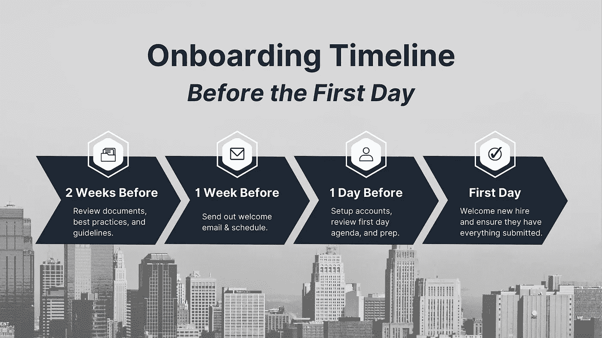
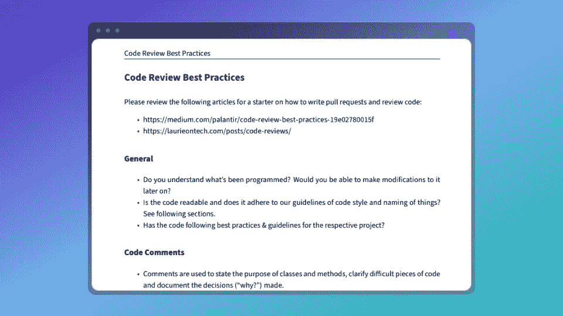
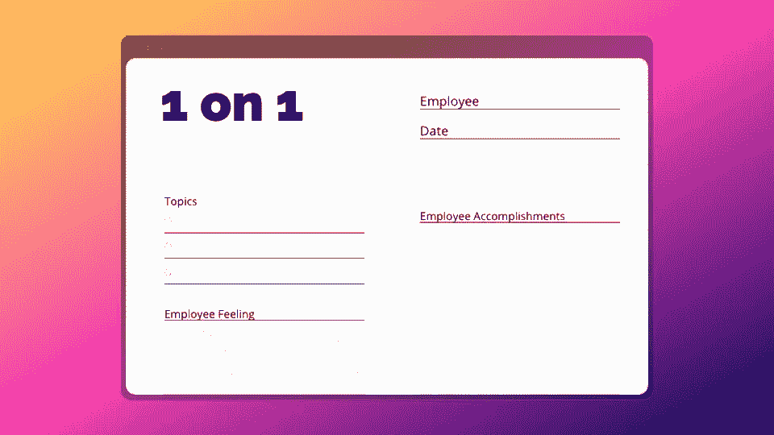

# 如何创建完美的开发人员入职计划

> 原文：<https://betterprogramming.pub/how-to-create-perfect-software-developer-onboarding-plan-4a549a0a3040>

## 软件经理帮助新员工成功的简单技巧

如何制定完美的入职计划来帮助新开发人员成长|作者图片

作为经理，你有责任帮助新员工融入公司文化，并在新的岗位上取得成功。从新员工的第一天起就投资于他们的发展，可以为他们在组织中的长期成功做好准备。

最好的方法之一是创建一个开发人员入职计划。通过遵循明确的入职计划，您可以帮助新的软件工程师适应他们的新角色，并在您的组织中取得成功。

# 什么是软件开发人员入职计划？

软件开发人员入职计划是一个文档，它概述了一个新的软件工程师在您的组织中取得成功的步骤。许多组织不经常招聘，因此，入职过程可能是随意的。

没有一个[强大的入职计划](https://www.apollotechnical.com/why-onboarding-is-important/)，软件工程师可能很难联系到他们的队友，学习技术，&最终也不会有生产力。由 [Brandon Hall Group](https://b2b-assets.glassdoor.com/the-true-cost-of-a-bad-hire.pdf) 所做的研究得出结论:“拥有强大入职流程的组织能够将新员工保留率提高 82%，将生产率提高 70%以上。”

[创建并正确利用开发人员入职计划](https://www.apollotechnical.com/why-onboarding-is-important/)确保新的软件工程师拥有他们从第一天起就感到成功的工具。定期与新的软件工程师进行沟通也有助于确保他们走上正轨并达到预期。

在制定入职计划之前，您需要了解对该角色的期望，以及一名成功的软件工程师在您的组织中是什么样的。通过这样做，您可以根据组织的特定需求定制入职计划。

入职在开发人员第一天上班之前就开始了

# 新开发人员入职培训在第一天之前开始

新开发人员的入职流程应该在他们第一天工作之前开始。通过让新员工了解公司、团队和项目的最新动态和信息，你可以帮助他们顺利过渡，并帮助他们在开始工作时立即投入工作。

此外，提前提供资源和培训材料可以帮助新开发人员在第一天感到有所准备和自信。通过采取这些步骤，你可以从一开始就为新员工的成功做好准备。

## 定义一个成功的软件工程师在你的组织中是什么样子的

创建开发人员入职计划的第一步是定义一个成功的软件工程师在您的组织中是什么样子的。为角色确定清晰的价值观和目标将有助于你完善你的入职计划，强调什么是关键，什么是干扰。

要做到这一点，你需要了解对这个角色的期望和期望的技能。您可能需要考虑的一些问题包括:

*   这个角色需要什么样的技能？
*   成功需要哪些[软技能](https://morethancoders.com/essential-skills)？
*   什么是公司文化？
*   这个角色还需要什么样的期望？

对这些问题的回答将有助于你清楚地了解一个成功的软件工程师在你的公司是什么样子的。一旦您记录了您的期望，您可以将这些传达给新员工，以确保他们对什么是值得关注的有明确的期望。

## 为第一周制定计划，包括第一天的详细日程

对于新的软件工程师来说，第一周是至关重要的。在这一周，他们将逐渐适应公司文化，并开始理解新角色的期望。因此，为他们的第一周制定一个计划至关重要。

入职计划应包括详细的第一天日程。一般来说，第一天包括:

*   到达时间
*   设备讲义和设置
*   任何公司和个人会议

您必须在员工第一天上班前将此时间表发给他们。有了这个计划可以避免第一天对做什么和什么时候做感到紧张。

> 为新员工提供第一周的明确日程，为他们在组织内的工作方式定下基调。

对于一个新开发人员来说，第一周是为他们在公司的剩余时间定下基调的关键，所以他们必须清楚地了解对他们的期望。会议、项目和任务都应该适当地组织和计划，以便新员工可以专注于编写代码和学习平台。

## 向新员工发送培训资源

除了为新员工提供第一周的计划，我还会发送最佳实践和技术概述文档，帮助新员工熟悉团队的运作方式。

提供有关最佳实践、基本系统架构和行业术语的详细信息，可以帮助新员工在紧张或不确定会遇到什么情况时做好准备。

培训资源应包括:

*   详细的公司和部门信息
*   培训视频，包括产品演示
*   编码最佳实践
*   语言和工具文档
*   行业和组织术语

由于许多人利用学习和准备来处理有压力的新情况，你可以通过在新员工开始工作之前为他们提供所需的工具来给他们带来安全感。

# 为软件工程师工作的前 30 天、60 天和 90 天制定一个计划

在为新软件工程师入职的头几个月制定计划时，重点帮助他们过渡到公司文化以在新角色中取得成功是至关重要的。

在前 30 天，你应该着重帮助新员工适应新环境，并开始理解他们的新角色。员工应该专注于学习技术堆栈和一般业务功能。不要过分逼迫员工引导讨论并做出贡献；围绕角色最关键的方面设定期望。

在第 30 天到第 60 天之间，经理应该优先帮助新员工更加适应他们的新角色和职责。在此期间，员工应该拓展更多的领域，开始参与甚至领导讨论(如果职位需要的话)。应该鼓励员工积极贡献，甚至让队友承担责任。

最后，在第三个月，你应该专注于帮助新员工成为一名高效的团队成员。不要像团队中的其他人一样精确地塑造员工；相反，帮助他们确定如何改善团队和组织的文化。这个月是新员工产生持久影响和发展文化的机会。

在最初的 90 天里，作为经理，你应该专注于支持员工，而不是相反。如果员工感到安全并得到支持，他们更有可能做出高水平的贡献。

# 与新的软件工程师建立定期的联系

与新的软件工程师建立定期检查，以确保他们理解公司的目标并达到预期。这些签到可以是每周一次、每两周一次或每月一次，这取决于个人的需求。

在这些登记过程中，您应该讨论以下主题:

*   新的软件工程师如何适应他们的新角色？
*   他们面临哪些挑战？
*   他们取得了哪些进步？
*   他们想达到什么目标？

这些签到是你向新的软件工程师提供支持和指导的机会。此外，这也是你确保新员工符合你期望的机会。

定期与员工一对一是了解新员工表现的最佳方式。

确保你不总是主导谈话的人。你应该努力帮助你的员工在与你讨论他们的成功和挑战时感到舒适。

这些[检查对于帮助新的软件工程师与他们的经理建立关系并找到解决任何问题或困惑的最佳方式是必不可少的](https://www.vectorly.team/vectorly-blog/benefits-of-one-on-one-meetings)。

# 随时准备回答任何问题或解决任何新软件工程师的顾虑

让自己有时间回答新软件工程师的任何问题或解决他们的任何顾虑，是帮助他们在您的组织中取得成功的不可或缺的一部分。

新员工可能对公司文化、他们的角色或你对他们的期望有疑问。他们也可能担心自己能否在新的岗位上取得成功。

你必须能够回答任何问题或解决任何新的软件工程师的关注。要做到这一点，你可以安排定期报到、在办公时间上班，或者为新员工设立一个专用的电子邮件地址来联系你。

此外，如果你能为新员工创造一个欢迎和支持的环境，也会有所帮助。创造一个友好的环境包括有一个导师项目，举办社交活动，或提供职业发展机会。

# 了解如何帮助新员工取得成功

让新的软件工程师入职是帮助他们成功的重要部分。从新员工的第一天起就投资于他们的发展，可以为他们在组织中的长期成功做好准备。

做到这一点的一个方法是创建一个开发人员入职计划。这个计划应该包括一个详细的第一天时间表，一个关于最初 30 天、60 天和 90 天的计划，以及与新软件工程师的定期检查。此外，您应该能够回答新软件工程师的任何问题或解决他们的任何顾虑。

虽然制定入职计划既耗时又乏味，但好处远远超过成本。通过遵循这些步骤，您可以创建一个开发人员入职计划来帮助新员工在您的组织中取得成功。

*感谢阅读！敬请关注更多内容。*