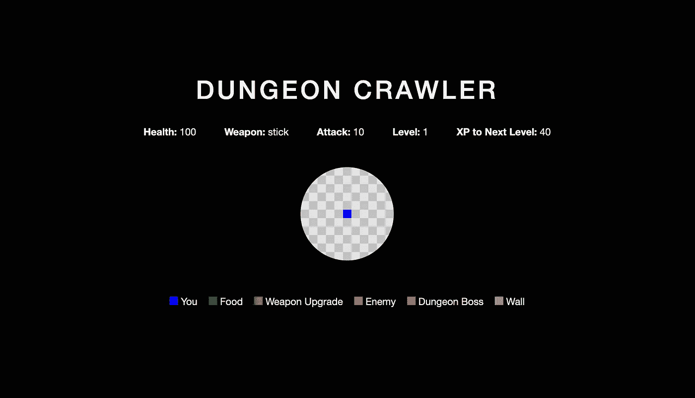
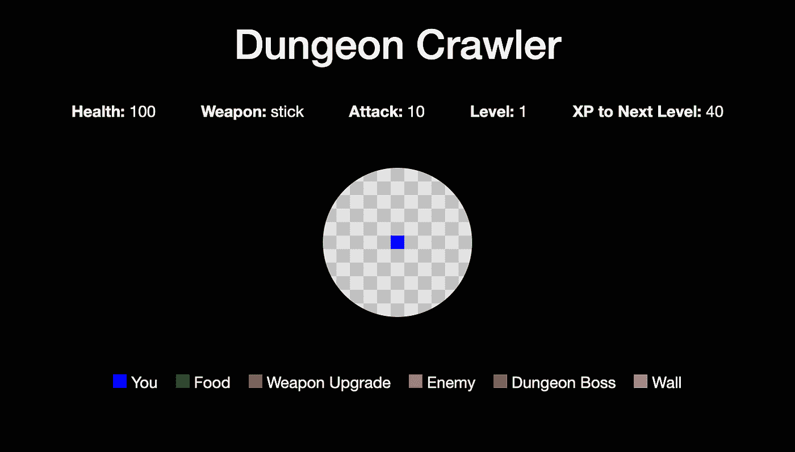
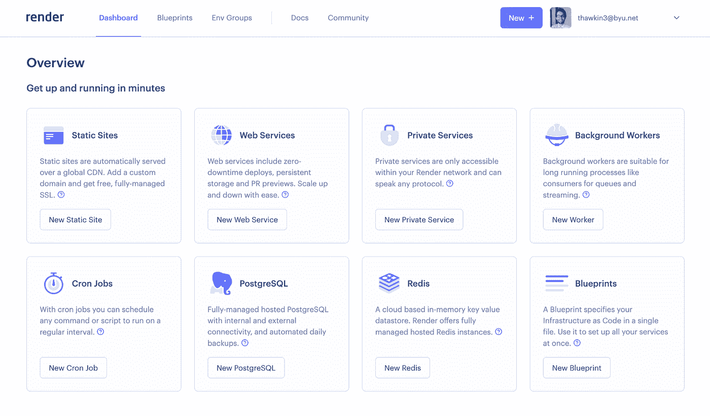
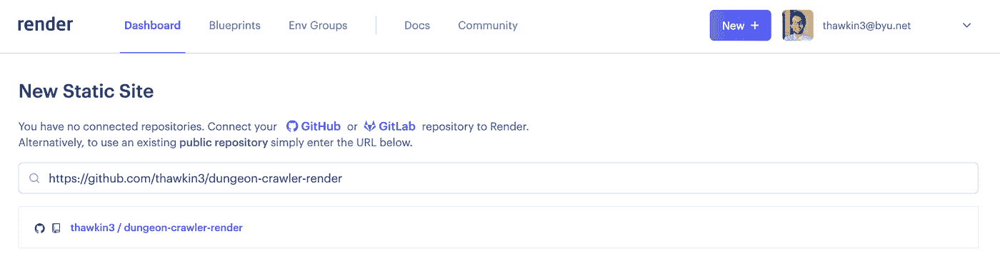
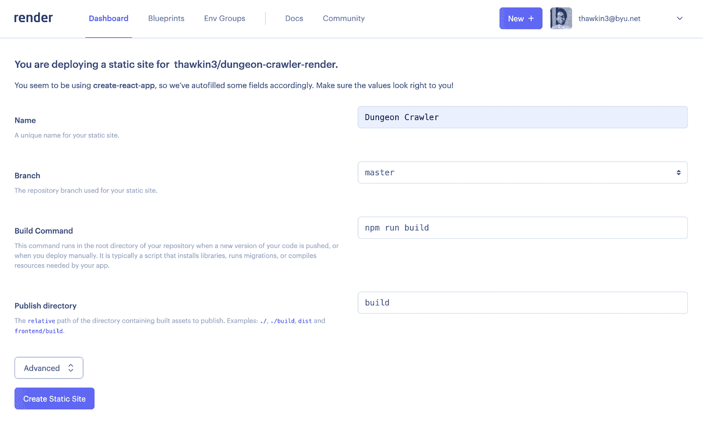
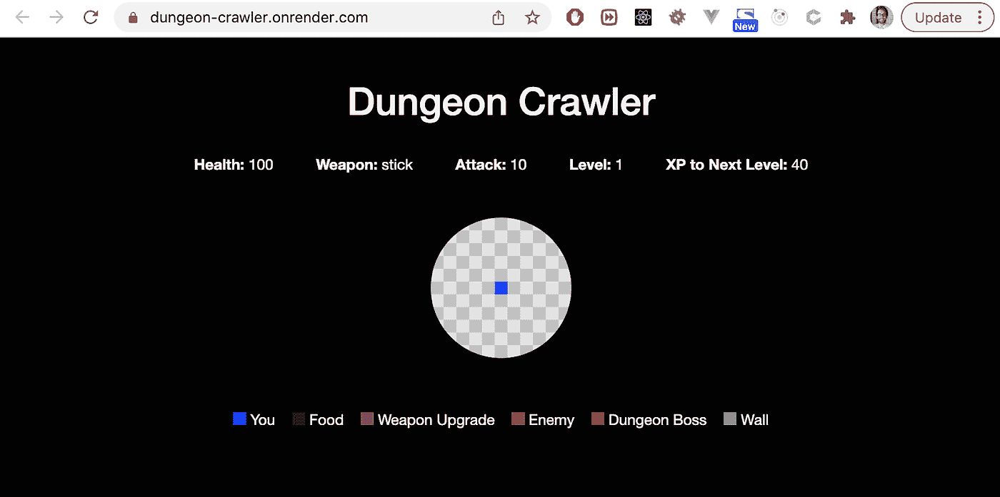
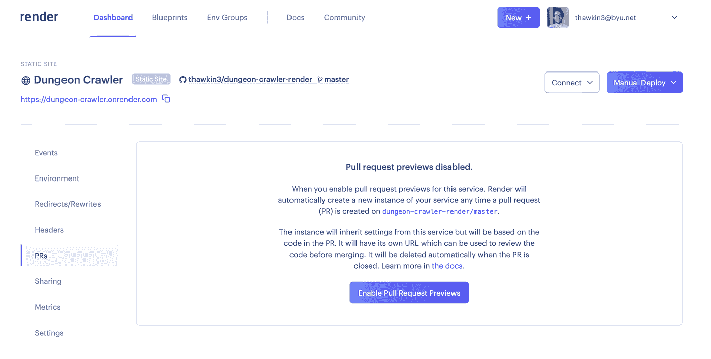
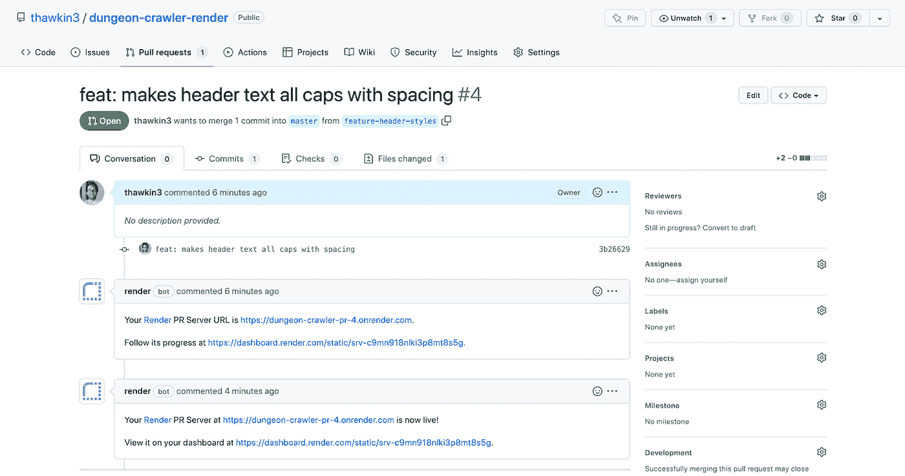
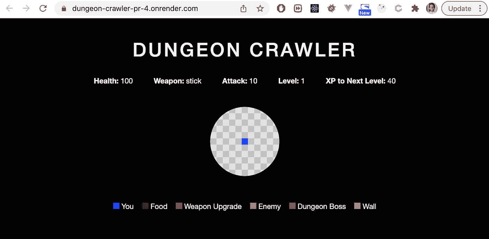

# 如何使用 Render 创建公关审查应用程序

> 原文：<https://betterprogramming.pub/how-to-create-pr-review-apps-with-render-fe5e78a073ae>

## 让可视化代码审查更容易！

地牢爬虫演示应用

在合并拉取请求之前，代码审查是必不可少的。让另一个工程师检查代码更改是一种常见的做法，如果您配置了一个持续集成(CI)管道来运行 linters 和单元测试以自动捕捉问题，那就更好了。

对于 UI 更改，直观地检查应用程序中的更改也是一个好主意。这样做可能需要审阅者签出分支并在其计算机上运行应用程序。根据应用程序架构的复杂程度，在本地运行应用程序可能只需要一个命令，或者可能需要几个步骤和相当多的时间。

拉式请求审核应用程序通过在预览环境中部署应用了拉式请求更改的应用程序版本来帮助简化这一过程。现在评审者不需要自己把代码拉下来！

学习[选择架构和推动理论](https://en.wikipedia.org/wiki/Nudge_theory)的学生知道，如果你想增加想要的行为，你需要让想要的行为变得容易。公关审查应用程序就是这样做的！通过使可视化审查变更变得简单，PR 审查应用程序使代码审查者更有可能真的这样做。

在本文中，我们将了解如何使用 [Render](https://render.com/) 配置公关审查应用，这是一个平台即服务(PaaS)解决方案，允许您在云中构建和运行应用。

# 演示概述

地牢爬虫演示应用

让我们使用 React 应用程序进行演示。这个应用程序是一个地牢爬虫游戏，其中我们的英雄蓝色方块探索一个地牢并与敌人战斗，直到他找到并击败地牢老板。这个应用程序只包含前端代码，所以它非常适合作为一个静态网站托管。你可以[在 GitHub 上查看代码](https://github.com/thawkin3/dungeon-crawler-render)或者[在这里玩游戏](https://dungeon-crawler.onrender.com/)。

现在，假设我们想对我们的应用程序进行更改。我们将创建一个新的分支，在本地进行更改，上推该分支，然后创建一个拉请求，将其合并到主分支中。如果一个评审者想要直观地检查我们的更改，他们可以拉下分支，在他们的机器上本地运行应用程序，只需用`npm install`安装依赖项，用`npm start`启动应用程序。

为了使可视化审查更加容易，让我们配置 repo，以便在每次提交新的 pull 请求时创建一个审查应用程序。

# 渲染入门

我们首先要用 Render 创建一个新帐户。我用我的邮箱注册了一个账户，然后连接了我的 GitHub 账户，但是如果你愿意，你也可以直接用 GitHub 认证。

创建帐户后，我们可以选择创建一个新的静态站点:

选择创建新的静态站点

选择此选项将提示我们输入希望连接的现有 GitHub 存储库的 URL:

连接 GitHub repo

然后我们可以提供一些关于项目的细节，指定名称(“地牢爬虫”)、主分支(`master`)、构建命令(`npm run build`)和输出目录(`build`)。然后，我们将单击表单底部的“创建静态站点”。

静态站点配置详细信息

这样，Render 将首次构建和部署我们的应用程序。就这么简单！我们的地牢爬虫应用程序现在在 https://dungeon-crawler.onrender.com[公开发布。](https://dungeon-crawler.onrender.com)

渲染托管的地牢爬虫应用程序

# 使用 Render 配置公关审查应用程序

现在，我们已经连接了我们的 repo，并且我们的应用程序部署了 Render，让我们[设置 PR review 应用程序](https://render.com/docs/pull-request-previews)(或者 Render 称之为“拉请求预览”)。为此，我们可以单击“PRs”选项卡，然后单击“启用拉式请求预览”按钮。

启用带渲染的拉式请求预览

这应该是所有你需要为你的回购启用公关审查应用程序。然而，如果你在使用 GitHub 认证时遇到问题，你可以按照 [Render 的故障排除指南](https://render.com/docs/github#troubleshooting)寻求帮助。在我的例子中，我需要仔细检查我是否给了 Render 权限来与我的地牢爬虫 repo 进行交互，然后我就可以开始了。

现在，让我们创建一个新的 pull 请求来看看这个 review 应用程序的运行情况！

我们将创建一个新的分支，对应用程序的头部做一个小的更改，提交和推送更改，然后创建一个新的拉请求，将我们的更改合并到主分支中。

一旦我们创建了一个新的拉请求，Render 将在 PR 上发布一条评论，说它正在为我们创建一个新的评论应用程序。一旦点评应用程序完成部署，Render 将发布第二条评论，通知我们点评应用程序可以查看了。

GitHub pull 请求上的评论，带有查看应用程序的链接

我们可以点击我们的公关审查应用程序的链接，瞧，变化就在那里！注意地址栏中点评 app 的网址:`https://dungeon-crawler-pr-4.onrender.com`。

地牢爬虫应用程序托管在一个公关审查应用程序上

我们的标题文本现在全部大写，并应用了一些额外的字母间距。审核应用程序使我们或任何其他审核者快速验证更改确实很好地显示出来变得非常简单。

当我们批准并合并拉动请求时，PR review 应用程序被销毁，因为它不再需要。之后，Render 将看到新的提交合并到主分支中，并将我们应用程序的最新版本部署到主 URL:[https://dungeon-crawler.onrender.com](https://dungeon-crawler.onrender.com)。

你应该注意到，这些公关审查应用程序非常适合静态网站和查看对单个资源所做的更改。如果你有一个更复杂的应用程序，需要一个完整的测试环境，包括后端服务器、数据库或其他资源，你应该看看 Render 的[预览环境](https://render.com/docs/preview-environments)，它可以处理更复杂的设置。

# 结论

几分钟之内，我们就能够使用 Render 部署我们的应用程序，并配置我们的 repo 来为每个拉取请求创建审阅应用程序。这个过程不仅对我们来说很容易建立，而且对每个在 repo 中工作的开发人员来说，它也使得代码审查更加容易。

我们的公关审查应用程序通过消除必须在本地运行应用程序的摩擦，使直观审查变更变得简单。有了这样的设置，我们巧妙地促使代码审查者更加彻底。