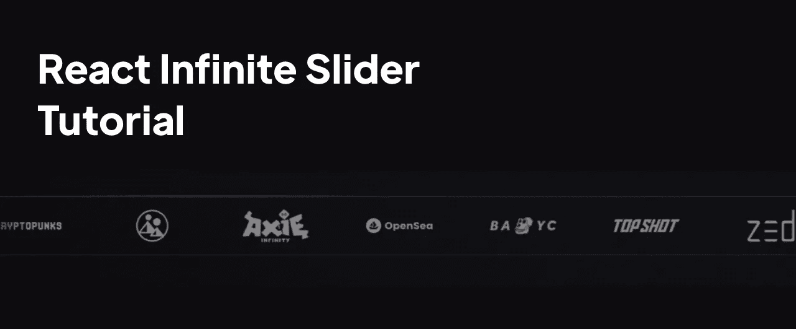
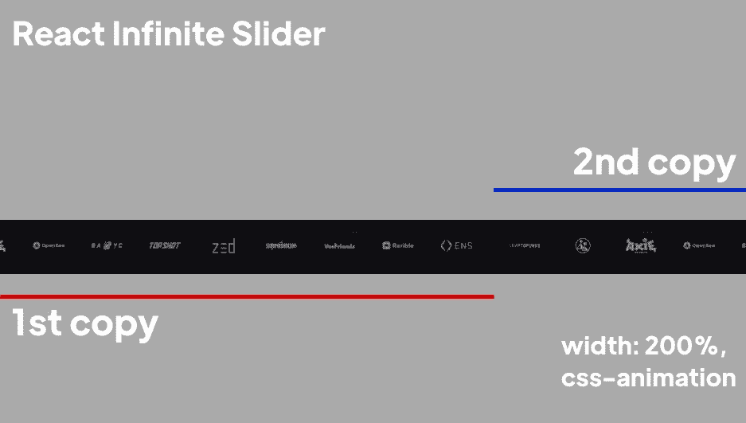

# 在 React 中创建一个无限滑块

> 原文：<https://betterprogramming.pub/how-to-create-react-infinite-slider-22b76cbd7a9>

## 另外，避免使用第三方库。



无限滑块

你有没有创建过带有不同合作伙伴标志的无限滑动条，或者其他什么东西？

我不知道你是怎么想的，但我在这种情况下的做法是最有可能在网上搜索一些库，然后直接使用它。这种方法有几个问题:

*   **第三方依赖:**如果库停止维护，将来可能会出现错误，
*   **比需要的项目规模更大:**因为不是你创建组件，你不能控制包的大小，如果你只使用一个库，它应该不会改变你的应用程序的性能太多，如果你使用 10 个不同的库，情况就不同了。
*   **太复杂:**有趣的是，第三方库通常比我们需要的简单的东西复杂得多，所以在这种情况下改变一些东西会更困难

今天，你将一劳永逸地学习无限滑块是如何工作的，以及如何自己实现它。

# 1.无限滑块是如何工作的？

重要的事情先来。在编码部分之前，我们先了解一下无限滑块是如何工作的。听说一个形象胜过千言万语，所以:



滑块工作功能

1.  创建滑块的两个副本:因为我们想让它移动，我们实际上需要一个溢出。当它达到 100%时，我们将直接开始动画，这将我们带到下一个点
2.  **使其宽度为 200%，或者是你最初想要的两倍:**当它达到主宽度的一半时会复位。我知道你可能认为它不会那么简单，如果它直接跳到开头，我会发现的。的确如此。
3.  **无限动画化**

# 2.编码(有趣的部分)

正如你所看到的，如果你这样说，这并不难。现在你将学习如何编码。我要粘贴完整的代码，我们将通过它。

我这里用的是顺风，但是如果你没用过也不用担心。不言自明。

## **第 1 部分—集装箱**

```
<div className="w-[200%] h-20 border-t border-b border-gray-600 overflow-hidden relative">
```

您需要创建的第一件事是一个整体容器。我说的是**不会**动的那个。你可以像我在这里一样用边框来设计它。这是一个包含我们的滑块的 div。

## **第 2 部分—内部容器**

```
<div className="w-[200%] flex items-center h-20 justify-around absolute left-0 animate gap-20 animate">
```

正如你所看到的，这个 div 与第一个 div 相似，主要区别在于。那是将被动画化的一个。动画本身超级简单。

这里需要考虑一件事。你想让左边的百分比(在这个例子中是 100%)是你在容器中指定的宽度的一半(在我们的例子中是 200%)。这是必要的，因为我们的滑块移动到-100%，然后它重新启动，所以它需要是容器宽度的两倍。

## **第三部分—内容**

这里我们只是迭代一个给定的数组来显示图像。记住我们需要两个相似的列表。

## **第四部分——最终结果**


决赛成绩

代码产生了一个滑块，你可以在上面看到，在我看来这很恶心🔥。

# 摘要

在本文中，您已经学习了如何用 50 行代码创建一个无限滑块。如果你想要一个摘要，你需要创建一个不会被动画化的容器，它将负责保存内容，第二个容器将被动画化，以及两个你想要呈现的内容列表。就是这样。