# 如何用 CSS 网格创建响应式数据表

> 原文：<https://betterprogramming.pub/how-to-create-responsive-data-tables-with-css-grid-9e0a37394450>

## 创建自己的中等统计和收入分析工具

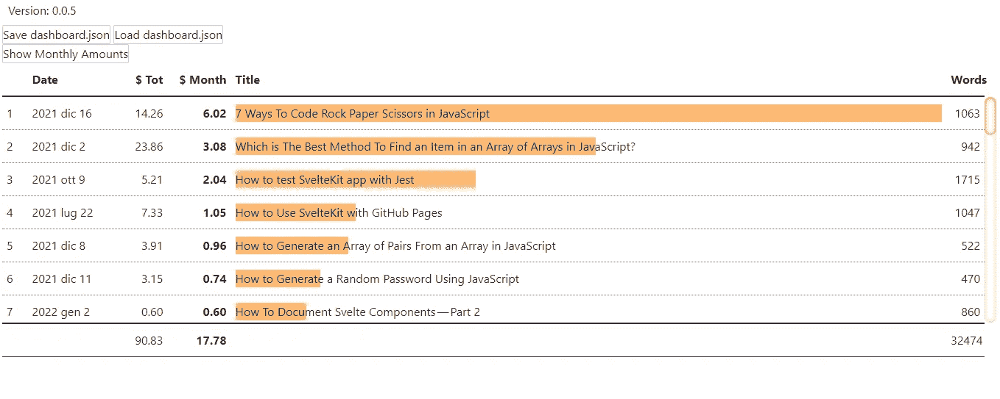

桌子是相当复杂的东西。自从 HTML 出现以来，它们就存在了，并且带来了一些严重的问题。它们非常适合显示少量数据，但当数据增长时会变得相当复杂。

我不得不为我最近的一个项目调查这个(与[如何使用中等统计](https://javascript.plainenglish.io/how-to-get-medium-stats-with-javascript-and-svelte-part-1-a1d08b96799e)有关)。我选择的解决方案涉及到 CSS 和网格布局模块的使用。这是我的文章和我的论点。

但是在开始一个我想要达到的结果的图像之前:

# 介绍

第一步是寻找已经存在的东西。有一些有趣的文章值得一读:

*   [带有 CSS 网格的响应式数据表](https://medium.com/evodeck/responsive-data-tables-with-css-grid-3c58ecf04723)
*   [如何使用网格布局模块用纯 CSS 创建响应式表格](https://www.freecodecamp.org/news/https-medium-com-nakayama-shingo-creating-responsive-tables-with-pure-css-using-the-grid-layout-module-8e0ea8f03e83/)
*   [使用 CSS3 Flexbox 的真正响应表](https://hashnode.com/post/really-responsive-tables-using-css3-flexbox-cijzbxd8n00pwvm53sl4l42cx)

由此我开始思考如何创建我的表。

首先，当然，我需要数据。我决定不在本文中使用虚构的数据，因为最好的学习方法是解决一个真实的问题。我的问题是:我有一些关于我中等收入的数据。我该如何分析它们？

但是数据本身我就不说了。目前我只需要知道他们是如何组织的。我决定把它们组织成一个数组。该数组的每个元素都是由以下属性组成的对象:

我不在乎展示每一处房产。我感兴趣的是有一种简单的方法来决定观看和订购哪些。为此，我需要另一个数组，这次由这样的对象组成:

这些属性是:

*   `key`，表中要显示的属性
*   `title`，列的名字
*   `type`，数据的类型(数值型，日期型，字符串型，布尔型、...)
*   `width`，列的宽度。如果不存在，则解释为`auto`
*   `align`，列的对齐

# 创建简单的表格

表格在 CSS 中。但是为了有效地使用它，我需要一些东西来自动地将各种数据插入到表中。我决定使用 [Svelte](https://svelte.dev/) :它允许我将 JavaScript 代码、HTML5 部分和表格样式保存在一个文件中。同样为了加速 CSS 的编写，我使用了 [Tailwind CSS](https://tailwindcss.com/) 类。

我首先创建导入表数据和标签的道具:

我写 HTML 部分:

显然结果很糟糕:

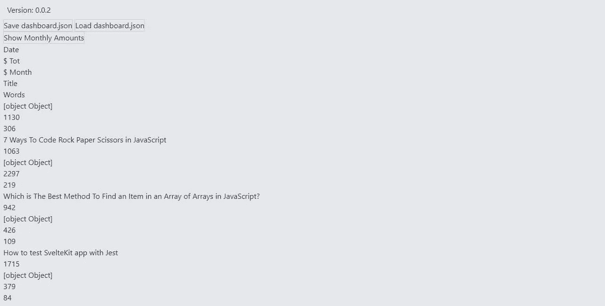

我需要添加一些风格，使它像样。我首先将一切定义为 CSS 网格:

然后我加粗了第一行，这一行有各列的名称:

最后我添加一条线来划分表格的每一行:

结果稍微好一点，但仍然没有用:

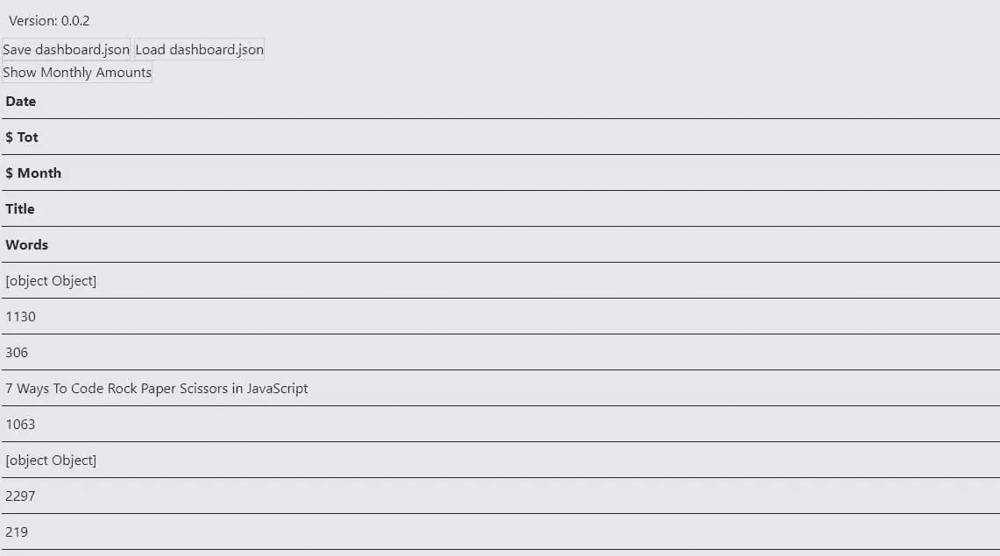

我需要使用 [grid-template-columns](https://developer.mozilla.org/en-US/docs/Web/CSS/grid-template-columns) 属性来定义应该有多少列。

不久前，我解释了如何创建`headers`道具。列的数量就是数组中元素的数量。

最后出现了一个类似桌子的东西:

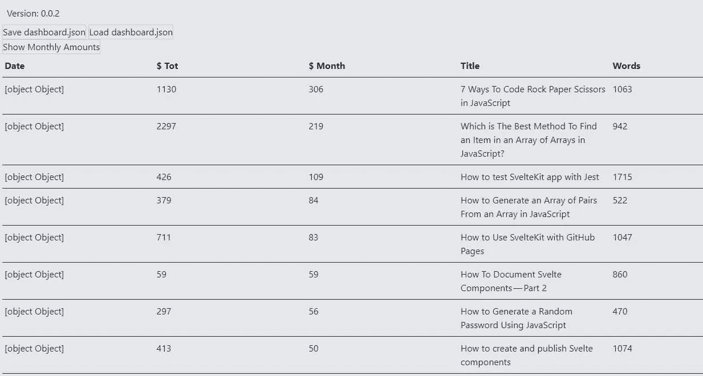

有一点我不喜欢:柱子都是一样的大小。让一些列变小，让带有文章标题的列变大更有意义。为此，我使用了每个`label`的`width`属性:

现在桌子漂亮了一点。

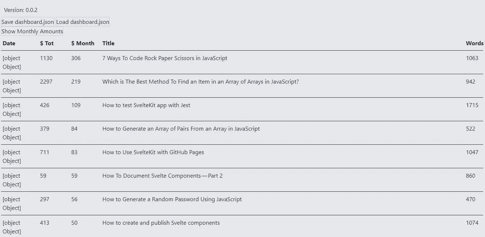

然而，一些关键问题仍然存在。首先，有些值没有出现，有些值的格式不正确。我添加了一个函数来解决它们:

我编辑 HTML

这修复了错误的格式:

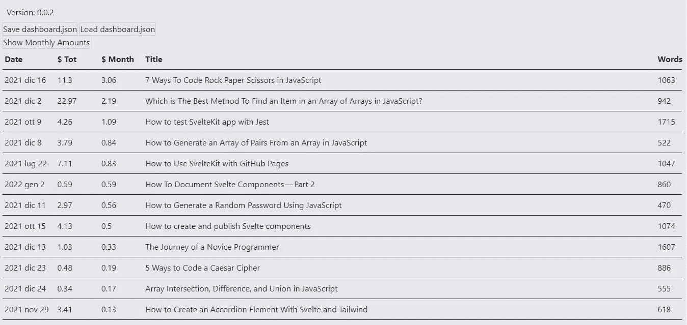

以类似的方式，我可以更正列的对齐方式:

# 保持页眉可见

这对于数据很少的表来说很好。但是有几行数据的时候就有问题了。向下滚动列标题会消失，使其难以阅读。为了保持第一行不变，我必须修改 HTML 部分的结构和 CSS 样式。我首先添加一个`header`标签和一个`section`标签:

这个想法是为带有数据行的部分设置一个最大高度，然后添加一个侧滚动条来滚动数据。为此，我首先需要更改`article`的`display`属性:

`header`和 `section`反而变成了`grid`:

`section`可以有一个垂直滚动条。

为了保持最后一列的对齐，我应该自定义滚动条。详情我推荐阅读 [CSS 历书——滚动条](https://css-tricks.com/almanac/properties/s/scrollbar/):

我还缩短了`header`的宽度:

所有这一切的结果是第一个固定行位于顶部的表格:

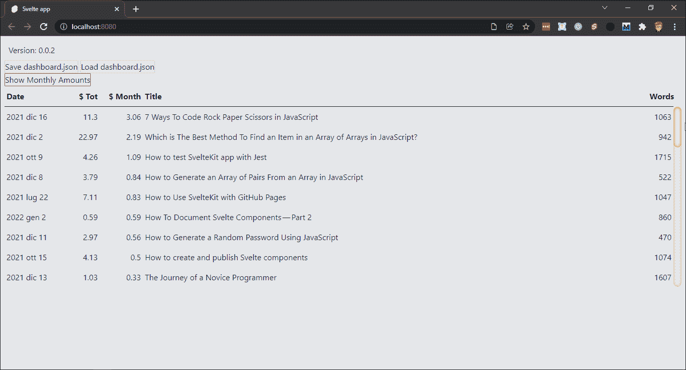

# 添加总计行

我需要的另一件事是一行总数。因为特别是当我添加一个过滤器系统时，可以方便地立即看到选择的值是多少。为此，我向表中添加了一个`footer`:

我知道，我还没有定义`totals`。但是我必须决定在哪里以及如何计算总数。最简单的方法是增加第三个道具。

所以我定义了这种类型的道具:

我修改了 HTML 代码来格式化这些值:

这让我得到了这样的东西:

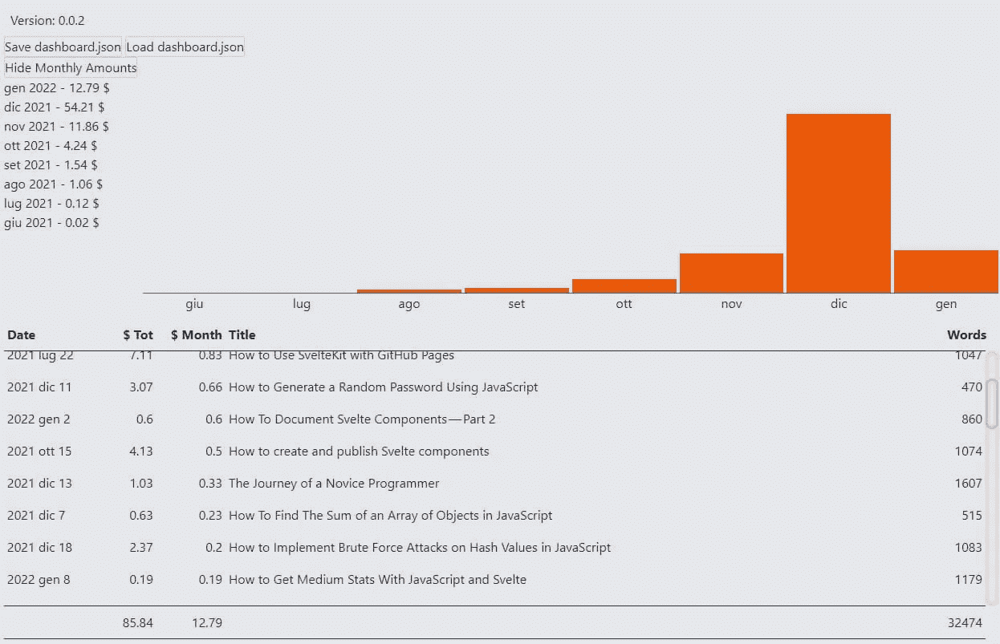

# 对数据进行排序

一个有用的特性是对数据进行排序的能力。

有各种方法可以实现这一点。我可以在表外添加按钮，或者添加一个基于鼠标的控件。我想使用上下文菜单按升序或降序排序。

也许我会在另一篇文章中更深入地讨论它，但是用 Svelte 创建一个上下文菜单是很容易的。目前我只推荐这个回复:

*   [细长:上下文菜单](https://svelte.dev/repl/3a33725c3adb4f57b46b597f9dade0c1?version=3.25.0)

目前，我创建了一个非常简单的组件。首先，我需要几个图标(`SortAscending`和`SortDescending`)作为按钮。

然后用几个道具来管理屏幕上的位置:

还有必要了解什么时候应该显示菜单，什么时候不应该显示:

我使用 [createEventDispatcher](https://svelte.dev/docs#run-time-svelte-createeventdispatcher) 来设置我需要的事件:

然后，我添加了一些事件，以便在我们单击页面的其他元素时隐藏上下文菜单:

最后，我添加了一些 CSS 样式:

综合我得到的一切:

现在剩下的就是将它插入到表中。我决定在每次点击单元格时激活上下文菜单，而不仅仅是在列标题中:

这是一个最小的上下文菜单，但已经足够了:

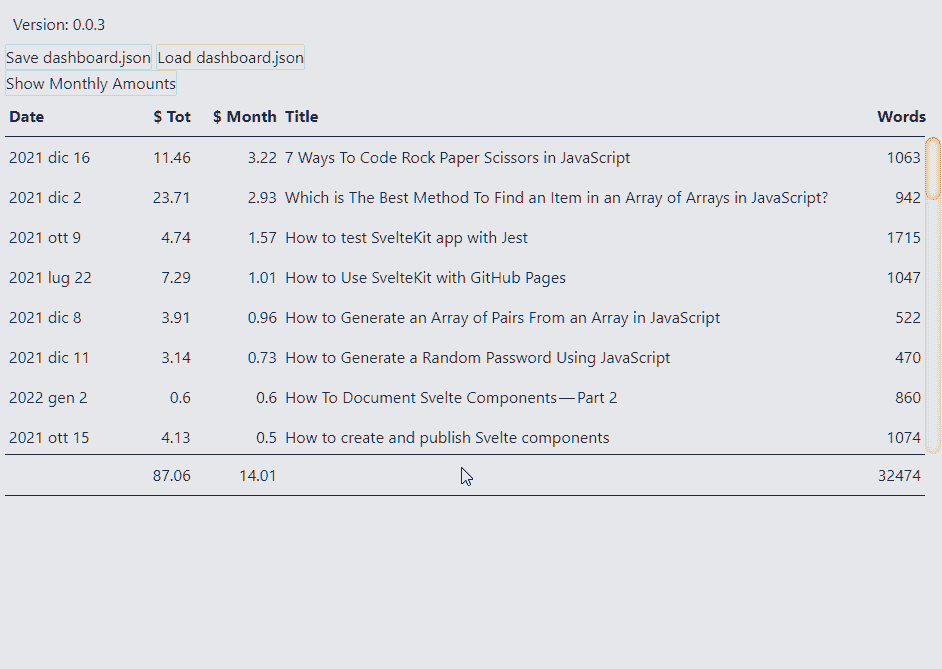

如果我点击图标，什么也不会发生。因为我没有将任何函数与这两个命令关联起来。我需要回到牌桌，添加另一个道具:

我还需要两个函数来对值进行升序和降序排序:

最后，我更新了 HTML 代码

现在，我可以对各个列进行排序:

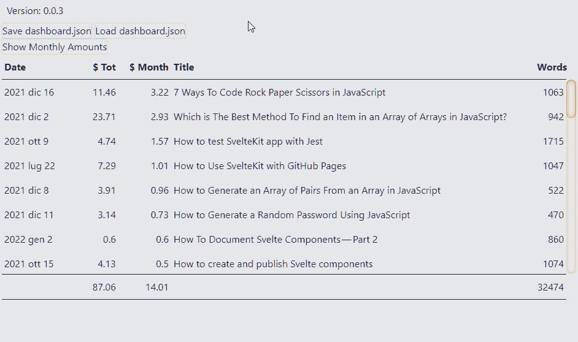

# 添加一些颜色

就其效果而言，还有一个问题。我们并不清楚选择了哪一列，或者鼠标放在哪一行。为了解决这个问题，我可以使用几行 CSS。

让我们从台词开始。我认为最快的方法是添加一个包含该行所有元素的元素:

我调整样式以保持相同的格式:

然后，当然，我添加了悬停效果:

对于列，我使用`cellData`变量来管理样式。首先，当上下文菜单不可见时，我确保避免不需要的样式:

然后我添加一个指令[类:名称](https://svelte.dev/docs#template-syntax-element-directives-class-name)

我添加样式:

这允许我使上下文菜单效果可见:

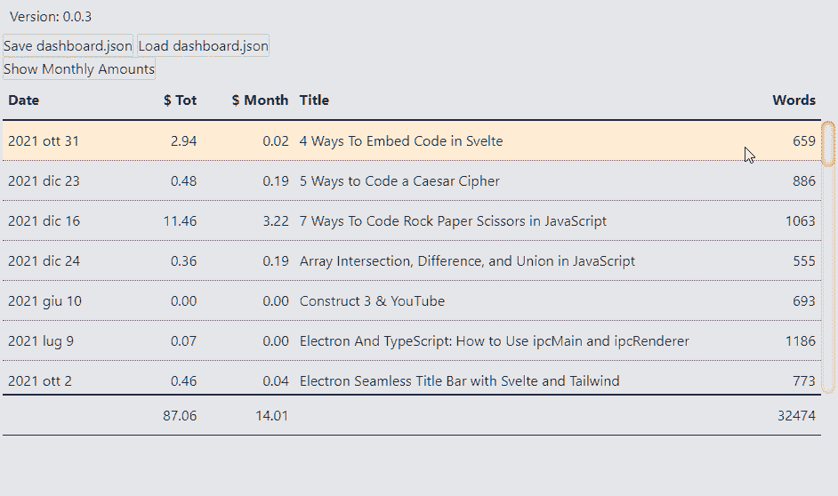

# 添加图表

数字和文字很好，但还有另一个方面让我感兴趣:用图形表示一些值的能力。添加条形图很简单。我使用标题单元格中的空间。

我首先设置几个道具:

我想根据指示值按比例给线条上色。为此，我需要最大值:

然后我创建一个函数来定义样式:

最后，我修改了单元格的 HTML 代码:

我明白了。

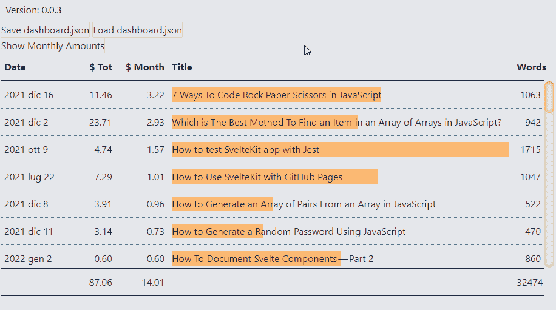

# 选择要显示的数据

我想自定义要在图表中使用的列的选择。我通过添加另一个按钮来修改上下文菜单:

我必须用一些东西来表示何时显示按钮，因为不是所有的数据都可以用图形表示。例如日期或文本。我在列列表中添加了一个`chartsColumns`变量

然后我添加一个函数来选择数据:

有一个问题:我如何知道我正在查看哪些数据？可以有各种方式。目前，我认为突出这个专栏就足够了，也许可以用粗体。

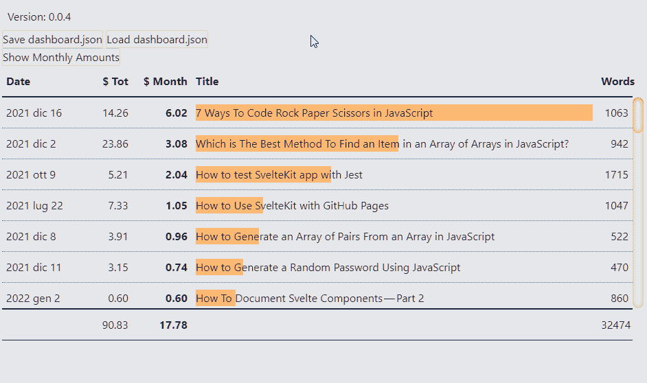

# 给线条添加数字

还有最后一个细节:行号。只需给斯维特的`#each`循环添加一个索引:

然后我修改`gridTemplate`变量来创建相应的列:

只需要几行代码就可以实现这一点:

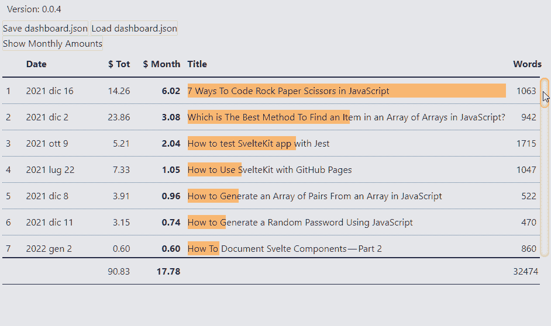

# 将表格动画化

最后，我可以添加一个动画，以便在我们对表格进行排序时更加明显。为此，我使用了 [animate:fn](https://svelte.dev/docs#template-syntax-element-directives-animate-fn) 指令:

通过这种方式，我使订单操作可见:

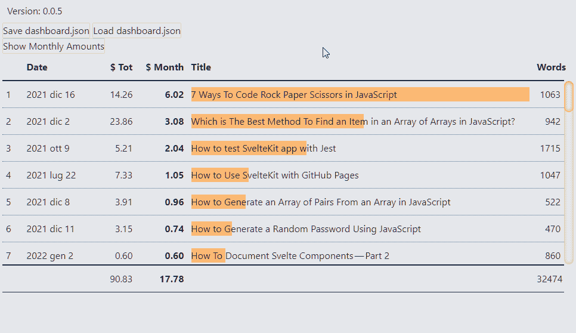

好了，暂时就这些了。我仍然需要考虑是否以及如何管理过滤器和分组。也许以后我会说的。

然而，至于代码，我正在处理的库是 [el3um4s/medium-stats](https://github.com/el3um4s/medium-stats) 。这是一项正在进行的工作，代码相当脏。然而，它可能是有用的。

感谢阅读！敬请关注更多内容。

***不要错过我的下一篇文章—报名参加我的*** [***中邮箱列表***](https://medium.com/subscribe/@el3um4s)

 [## 通过我的推荐链接加入 Medium—Samuele

### 阅读萨缪尔的每一个故事(以及媒体上成千上万的其他作家)。不是中等会员？在这里加入一块…

el3um4s.medium.com](https://el3um4s.medium.com/membership)