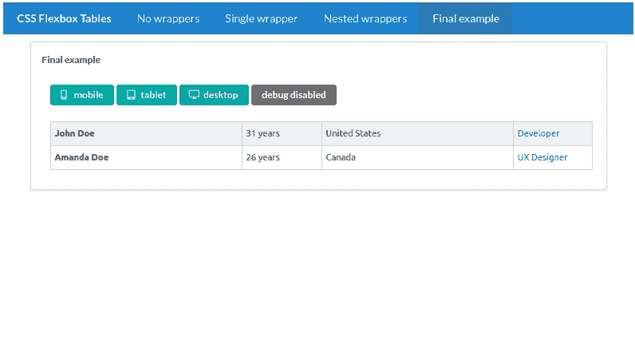
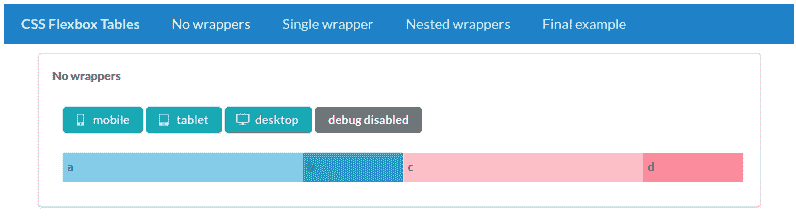
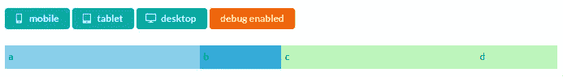
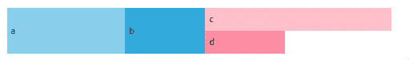
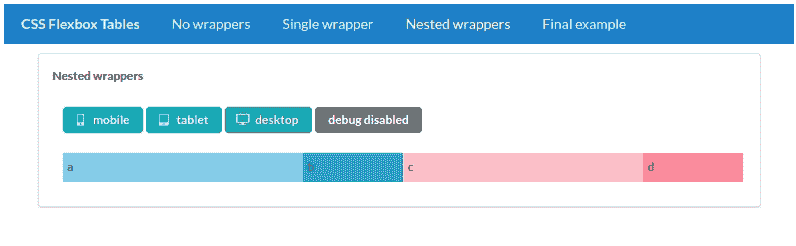
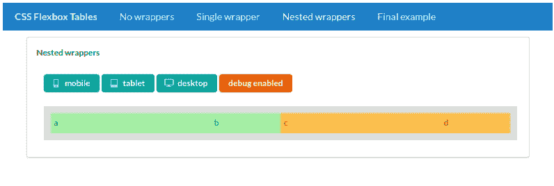
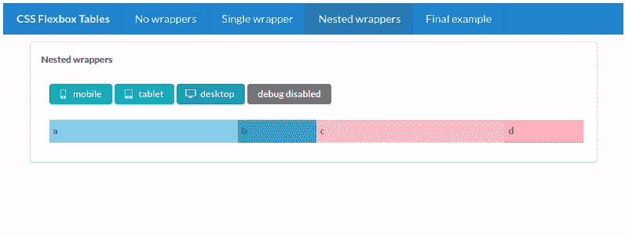
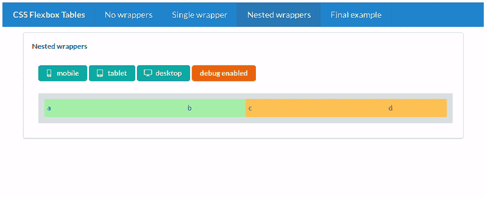

# 如何使用 Flexbox 和 React 创建响应式表格

> 原文：<https://betterprogramming.pub/how-to-create-responsive-tables-with-flexbox-and-react-d6b58574333b>

## 通过一些 CSS 和少量简单的 React 组件，您可以轻松地定制响应式表格


我们今天将创造什么！作者照片。

像 [Bootstrap](https://getbootstrap.com/) 和 [Semantic UI](https://semantic-ui.com/) 这样的流行框架都有组件，你可以用它们来创建响应性的表格或网格。但是使用这些解决方案也有不利的一面。首先，他们会强迫你在应用程序中使用这些框架——或者至少是其中的一部分——以及由此产生的所有开销。

更重要的是，定制这些现成组件的行为并不总是容易的。

今天，我将向您展示从头创建响应式表并不难。通过一点 CSS ( [Flexbox](https://developer.mozilla.org/en-US/docs/Learn/CSS/CSS_layout/Flexbox) )、一些媒体查询和一些非常简单的 React 组件，您可以创建任何您想要的表格，并且它会以您想要的方式改变每个断点的形状。你将拥有完全的控制权。

最重要的是，这将是一次很好的锻炼。

有了大量的动画 gif，没有什么能阻止你继续阅读。尽情享受吧！



动画:我们将解释创建这个例子的每个细节。

# Flexbox 基础知识

创建包含一些单元格的单行(有些人更喜欢称之为列，但在本文中我将始终使用单元格)非常简单。


有四个单元格的单行。

在上图中，您可以看到一个包含四个单元格的行(DIV 元素)。该行是一个 Flex 容器:

```
display: flex;
flex-direction: row;
```

我们定义了两种类型的细胞:

*   生长细胞(A 和 C)
*   固定宽度的单元格(B 和 D)

固定宽度单元格的宽度为 100 像素，这一点永远不会改变。正在生长的单元格是柔性项目。它们一起占用了所有的可用宽度，如果没有指定，它们将平均分配这个可用宽度。

相关造型:

您可以看到增长单元格(A 和 C)的大小如何根据可用宽度而变化，而固定宽度单元格(B 和 D)保持不变:



动画:正在生长的细胞 A 和 C 改变大小。

# 反应组分

严格地说，使用 React 组件与本文完全无关，但是为了安全起见，还是定义一些吧。

目前，我们有四个单元格的行的代码如下所示:

注意第一个和第三个单元格的`grow`属性。

这是`Cell`组件的定义:

最后是`Table`和`Row`组件，它们也非常简单:

到目前为止，我们仅仅触及了 Flexbox 的基础知识。让我们潜入更深的水域。

# 垂直堆叠单元格

看看下面的动画:


当渲染为平板尺寸时，单元格 C 和 D 是垂直堆叠的！这是怎么回事？

这种行为的关键是我们的行现在包含三个单元格，而不是四个。不，这不是打印错误。下图将对此进行说明:



该行现在包含两个单元格(A 和 B)和一个包装元素(该包装元素又包含单元格 C 和 D 作为子元素)。它在图像中呈现为绿色背景色。实际上，包装器也只是一个单元格。它的行为就像我们之前描述的生长细胞一样。

因此，我们可以说，此时我们的行包含三个直系子代:

*   生长细胞(A)
*   固定宽度单元格(B)
*   包装元素(绿色背景)

这里需要注意的一点是，我们的包装器元素的行为像一个单元格，但同时，它也是一行！它毕竟有两个子(细胞)。

我们可以决定`row`(我们的绿色包装元素)应该如何呈现其子元素。默认情况下(对于桌面大小)，我们将让它的子元素相邻呈现:

```
display: flex;
flex-direction: row;
```

但是当可用宽度减少到某个断点时(例如，屏幕的宽度小于 *X* )，我们应该改变子元素的方向，使它们堆叠在彼此之上:

```
flex-direction: column;
```

媒体查询可以帮助我们:

注意，我们还为包装器内的单元格调整了`width`属性(第 11 行)。一旦包装元素中的单元格被垂直堆叠，我们必须确保它们占据了所有可能的宽度。如果我们不这样做，结果将如下所示(注意单元格 D 的行为，它的宽度固定为 100 像素):



我们的示例代码现在看起来像这样:

*注意:我不会粘贴* `*Wrapper*` *组件的代码，因为我在我的演示库中没有使用实际的媒体查询。相反，我编写了许多花哨的代码，使用了令人敬畏的*[*framer-motion*](https://www.framer.com/motion/)*动画库，因此我可以为本文创建动画 gif。但是看了前面几段应该可以自己创作了。*

# 重用包装组件

尽管如此，现在重复这个技巧并重用`Wrapper`组件非常容易。例如，除了如上所述包装单元格 C 和 D 之外，我们还可以包装单元格 A 和 B:

这将导致以下结果:



如果我们用背景色而不是单个单元格来呈现包装，您可以看到包装的行为方式:



如果你愿意，你甚至可以调整包装纸的尺寸。查看 CSS 属性`flex-grow`、`flex-basis`、`width`、`min-width`和`max-width`。在这个例子中，它们平均分配宽度。

# 嵌套包装

现在我们已经看到了两个包装器的运行，我们可以进入下一个——也是最后一个——层次。我们可以*包装包装纸*。

如前所述，包装器只是细胞。在本文中，我们选择称它们为包装器，因为这样更容易解释。但是我们可以随心所欲地筑巢。

让我们继续上面的例子:一行有两个包装器(每个包装器包含两个单元格)。我们可以用另一个包装器来包装这两个包装器(不，我以前从来没有在一个句子里用这么多“包装”这个词)，就像这样:

在第 5 行，您可以看到我们在一个移动断点上“激活”了我们的外部包装器。结果相当令人印象深刻:



让我们再具体看一下包装器(外部包装器呈现为灰色边框):



# 最后的想法

我喜欢 CSS Flexbox。它非常强大，本文中的例子只是触及了皮毛。但是正如你所看到的，它并没有那么难用。当尝试上面的例子时，您将得到一个完全可定制的响应式表。您可以完全掌控一切，了解每一个细节，并且可以按照您想要的任何方式定制堆叠。

试着尝试一下，你可以很快获得令人印象深刻的结果——不依赖于外部框架。


动画:我们应用了更成熟风格的例子。

感谢您的宝贵时间！