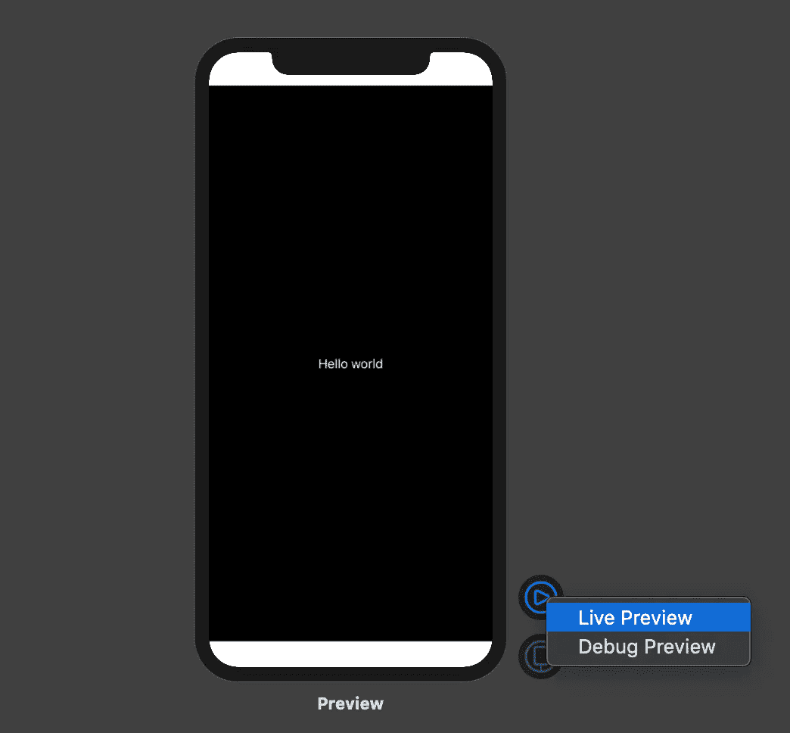

# 如何创建可以保存为 JSON 文件的可重用 SwiftUI 预览

> 原文：<https://betterprogramming.pub/how-to-create-reusable-swiftui-previews-that-can-be-saved-as-json-files-2ca7b42c9ac6>

## 为每个预览或所有预览设置亮或暗模式。选择任何设备或自定义尺寸。用一个修改器加载它们

查尔斯·德鲁维奥在 [Unsplash](https://unsplash.com?utm_source=medium&utm_medium=referral) 上拍摄的照片。

SwiftUI 预览提供了查看您的 UI 的唯一方式，而无需在模拟器或设备上构建和运行它。的确，故事板允许你看到你的约束如何布置子视图，但是你不能同时运行 Swift 代码。使用 SwiftUI 预览，您看到的是应用程序屏幕的完全初始化版本，该屏幕甚至不需要使用 SwiftUI 制作。

NSHipster 为 UIKit 提供了一个使用 SwiftUI 预览的指南[,这使得查看基于故事板或以编程方式创建的`UIViewControllers`和`UIViews`的实时版本变得很容易。](https://nshipster.com/swiftui-previews/)

SwiftUI 预览很容易创建。文件中符合 PreviewProvider 协议的任何结构都将显示在画布中。可以通过按下 option、command 和 enter 键来显示或隐藏画布(⌥⌘↩).他们可以预览任何内容，包括甚至不在同一个文件中的视图。这意味着您可以在更广泛的上下文中查看视图，比如在它所属的`List`中看到一个`List`行，其中包含从本地 JSON 文件加载的虚拟数据。

我对使 SwiftUI 预览更容易创建和使用的方法很感兴趣。虽然我目前不能修改预览的外观，但有足够多的选项，添加你想要的东西可能会花费更多的时间。如果你一次创建多个预览，它们必须在一个`Group`中，因为像任何返回`some View`的东西一样，`previews`静态属性必须返回单一类型的单个值。

最近，我一直在创建四个预览。一个是 iPhone 8，这是最后一款没有摄像头凹槽的 iPhone——至少在最近(几乎相同)的 iPhone SE 宣布之前是如此。一种是针对有凹口的 iPhone，通常是 iPhone 11 的型号之一。最后两个是 iPad，可能是 12.9 英寸的型号，也是在你考虑 iPad Mini 之前存在的三个较小尺寸之一。

# 目前需要做多少工作

默认情况下，创建四个预览需要更多的工作。

虽然我可能不需要为每个预览设置配色方案和显示名称，但是很容易看出这已经很复杂了，而且只有四个预览。如果我想在其他地方重用这个配置，我基本上需要将所有这些修饰符复制并粘贴到其他文件中。另一个问题是创建`PreviewDevice`实例需要字符串作为原始值。我首先通过创建一个将所有 iOS 13 设备列为常量的扩展`PreviewDevice`来解决这个问题。

# 将设备作为常量添加到预览设备

现在，当编写 previewDevice 的参数时，只需键入一个点，自动完成功能就会提示所有这些设备。

在添加了所有设备的常量后，我认为用一个修改器创建多个设备的预览会很有用。如上所示，我用一个名为`previewDevices(_:)`的函数扩展了`View`，该函数接受一个`PreviewDevices`数组。该函数将`Views`放在一个`Group`中，所以我不需要担心在预览的静态属性中意外创建多个`Views`。你可能会注意到，我添加了一个名为`previewColorScheme(_:)`的函数，将配色方案设置为亮或暗。使用`.environment(\.colorScheme, .light)`修饰符可以做到这一点，但是我发现这很难记住，而且写起来有些麻烦。

此时，用最少的代码创建多个预览已经容易多了，但是你可能会注意到我的`previewColorScheme(_:)`修改器现在被应用于所有四个预览。这让我想到了一种方法来保存我想要的每个预览的所有内容，或者将配置设置为常量，或者将其保存到一个文件中。在我的例子中，我两者都做了，但是可能没有必要两者都做。在`View`扩展中，我现在有了一个名为`preview(_:, _:)`的函数，它既可以接受我的`Preview`结构的一个实例，也可以接受我的`PreviewData`结构的一个实例，该实例包含一个`Previews`数组。

这两种结构都符合 Codable 协议，这意味着它们可以很容易地与 JSON 相互转换。

# 保存和加载预览配置所需的一切

尽管这是您需要的所有代码，但是将结构和扩展移到单独的文件中会使它更简洁。

当您的项目中有代码时，您可能希望看到该代码可以创建的 JSON。通过右键单击或按住 control 键单击右下角的播放按钮来调试其中一个预览。

右键或按 control 键单击实时预览按钮可以打印到控制台，甚至可以使用断点！

当我设置代码在每次加载预览时打印 JSON 时，您应该看到打印到控制台的`PreviewData`实例的 JSON。如果你想从一个文件加载这个 JSON，从控制台复制这个 JSON，在你的 Xcode 项目中创建一个名为`previews.json`的`empty file`类型的新文件，并粘贴到那里。这应该是您需要做的全部工作，因为我已经创建了一个名为`previewDataFromFile`的静态常量，它查找具有此名称的文件。如果你给你的文件起了不同的名字，你需要相应地更新`previewDataFromFile`。

如果一切正常，你应该能够将`ContentView_Previews`中的修改器从`.preview(previewData)` 改为`.preview(previewDataFromFile)`。如果预览可以重新加载而不会失败，那么您已经成功加载了该文件。您看到的内容不会有任何变化，因为文件包含的数据与您之前预览的数据相同。然而，基于文件的方法的一个缺点是缺少实时更新。您可以修改 JSON 文件，但是您的更改不会反映在预览中，直到您对 SwiftUI 代码进行其他更改。

可以把 JSON 文件看作是存储配置的一种更持久的方式。

# 后续步骤

虽然我没有在这里介绍它，但是如果您想与他人共享配置，可以从 URL 响应中检索这些 JSON 文件。

有可能将文件解析为`[PreviewData].self`，这意味着在一个文件中可以有一组配置。这需要你将这个数组保存为一个对象，甚至可能保存为一个`PreviewDevice`类的静态常量。这将允许您使用类似于`.preview(PreviewDevice.arrayFromFile[0])`的修饰符来传递数组中的第一个`PreviewData`。