# 如何在 Heroku 上创建评论应用

> 原文：<https://betterprogramming.pub/how-to-create-review-apps-on-heroku-799f548fcc5e>

## 构建和部署评审应用程序，以实现更好的代码评审

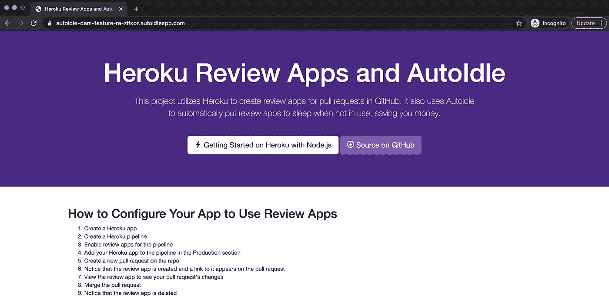

Heroku 审查应用程序和 AutoIdle 演示应用程序。作者照片。

几乎每个软件公司都为他们代码的不同阶段使用不同的环境——本地、开发、试运行、评审和生产，等等。

例如，当您进行最后一次抽查或对其运行测试套件时，您可以使用一个暂存环境来托管您将要部署到生产环境中的应用程序。或者您可以使用评审应用程序作为代码评审过程的一部分，这样评审人员就可以很容易地确认应用程序在处理包含在 pull 请求中的变更时工作正常。

试运行和审查环境与生产环境的不同之处在于，它们是临时的非面向客户的环境，仅当它们处于活跃使用状态时才需要。例如，当开发人员准备将他们的代码合并到主分支中时，审查应用程序可能存在于拉请求的生命周期中。如果拉动请求持续三天未完成，审核应用程序将在同一时间段内运行，即使工程师在审核期间可能只使用审核应用程序几分钟。

托管您的应用程序需要资金，让这些暂存和审查环境在不使用时运行就相当于把钱扔进了下水道。对于像 Heroku 这样的 IaaS 和 PaaS 提供商来说尤其如此，资源成本是按比例分配给第二个提供商的。如果这些资源的成本变得令人望而却步，资金紧张的公司甚至可能选择不使用评估应用程序，以试图节省一些资金。这很可能是任何给定的工程组织选择不使用评审应用作为他们代码评审过程的一部分的主要原因。

这就引出了下面的问题:有没有一种方法可以让我们在使用点评应用的同时，确保我们不会为不需要的资源付费？

在本文中，我们将看看如何配置一个 Heroku 项目来使用 review apps。然后，我们将添加 [AutoIdle](https://autoidle.com/) Heroku 附加组件来演示我们如何削减成本。

# 创建新的 Heroku 应用程序

首先，我们将克隆一个 GitHub repo，安装它的依赖项，并在本地启动应用程序。你可以在 GitHub 上找到[的样本回购。](https://github.com/thawkin3/heroku-review-apps-and-autoidle)

```
git clone https://github.com/thawkin3/heroku-review-apps-and-autoidle.gitcd heroku-review-apps-and-autoidlenpm installnpm start
```

接下来，我们将通过登录 Heroku CLI，创建应用程序，将其部署到 Heroku，并在我们的浏览器中打开它，将此项目转换为 Heroku 应用程序。

```
heroku loginheroku create # or `heroku create <app name here>`git push heroku masterheroku open
```

这是目前为止这个应用程序的样子:

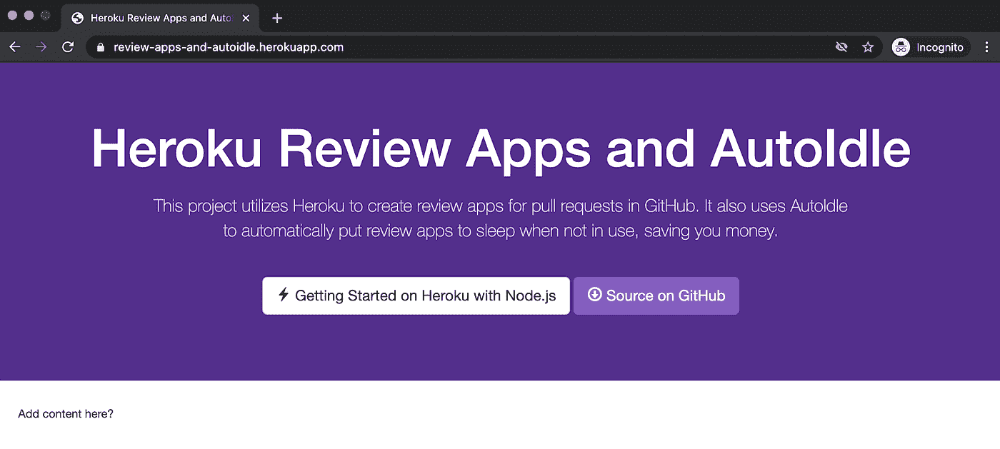

演示应用程序初始内容

你可以[在这里](https://review-apps-and-autoidle.herokuapp.com/)查看 Heroku 上托管的应用。

# 创建 Heroku 管道

现在我们有了 Heroku 应用程序，让我们[创建一个 Heroku 管道](https://devcenter.heroku.com/articles/pipelines)。在我们的 Heroku 仪表板中，我们可以单击“New”按钮，然后从下拉菜单中选择“Create new pipeline”。

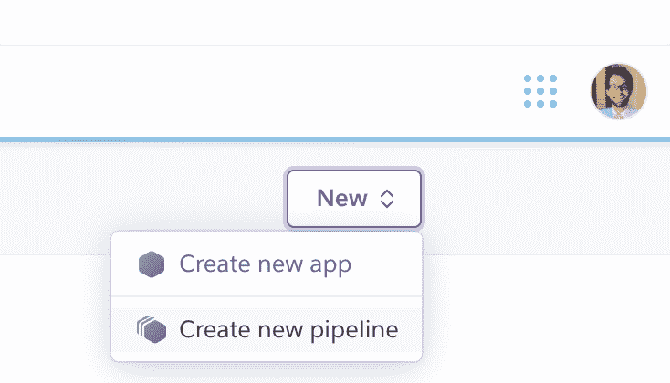

在 Heroku 建立新的管道

我们将为管道命名，将其连接到 GitHub repo，然后单击“创建新管道”

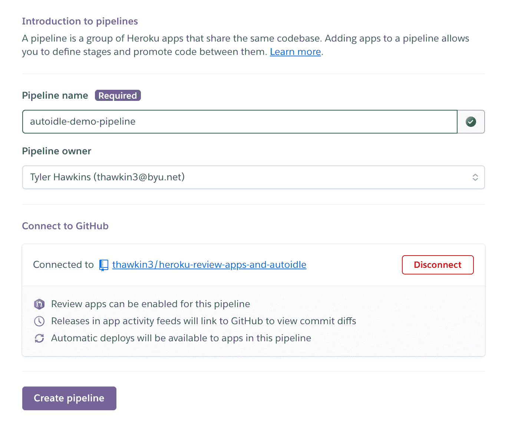

在 Heroku 配置我们的管道

# 为我们的渠道启用审核应用

随着我们的管道到位，我们现在准备好[为它启用审核应用](https://devcenter.heroku.com/articles/github-integration-review-apps)。我们只需点击“启用审核应用”按钮即可开始。

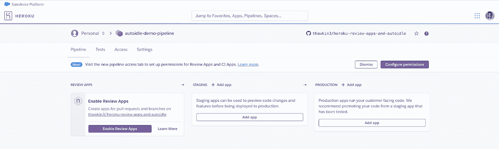

为我们的渠道启用审核应用

接下来，我们将看到一个屏幕，允许我们配置审核应用程序设置。让我们选择在 GitHub repo 上为每个新的 pull 请求自动创建新的审核应用程序。让我们也选择自动销毁任何打开超过五天的评论应用程序。

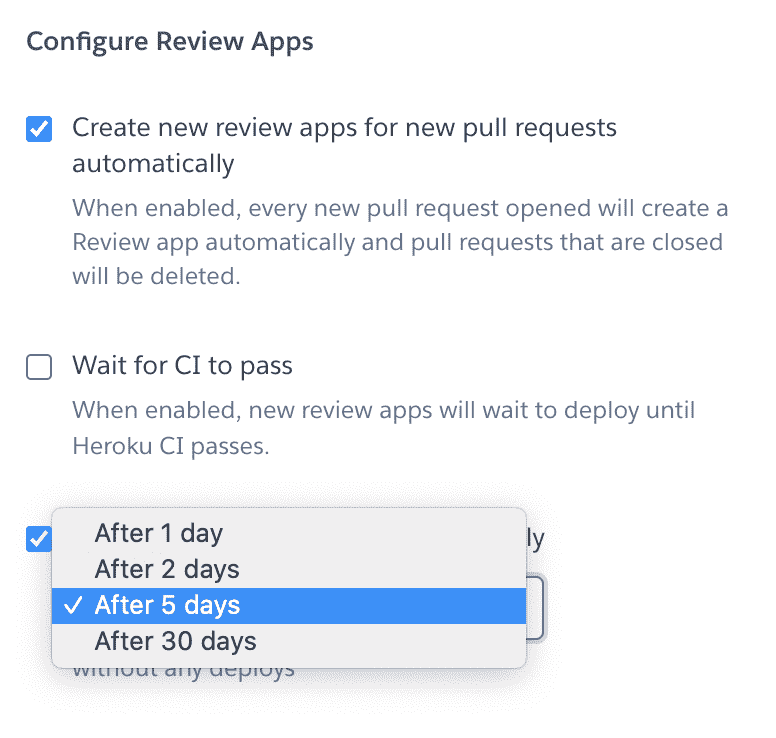

查看应用程序配置设置

完成审核应用程序设置的配置后，我们将点击屏幕底部的“启用审核应用程序”按钮来完成设置。

# 创建我们的第一个拉动式请求和审查应用程序

是时候提出我们的第一个拉动请求了。让我们创建一个新的分支，向我们的`index.html`文件添加更多的内容，提交更改，并推送到我们的分支。

```
git checkout -b feature/steps*# make changes to the `index.html` file*git add .git commit -m "feat: adds steps for creating a review app"git push --set-upstream origin feature/steps
```

然后，我们可以导航到 GitHub repo 来创建一个 pull 请求，将我们的功能分支合并到主分支中。

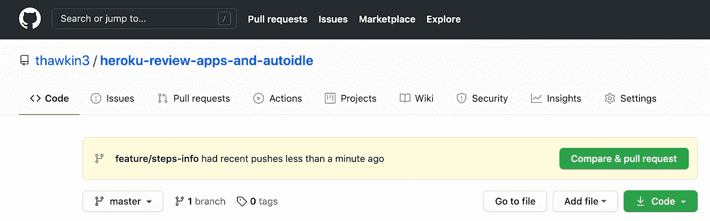

在 GitHub 中创建拉请求

填写完 pull 请求后，我们将看到一条注释，显示一个新的 review app 部署正在等待。

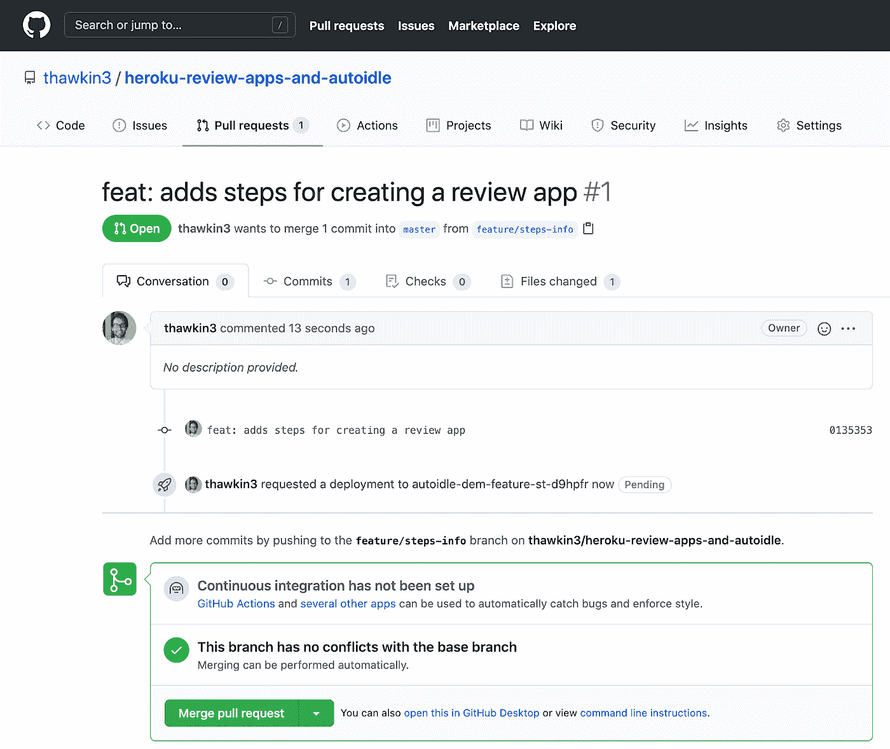

GitHub pull 请求中显示的待审核应用程序部署

多刺激啊！如果我们导航到我们的 Heroku pipeline 仪表板，我们可以看到成功部署后产生的审核应用程序。

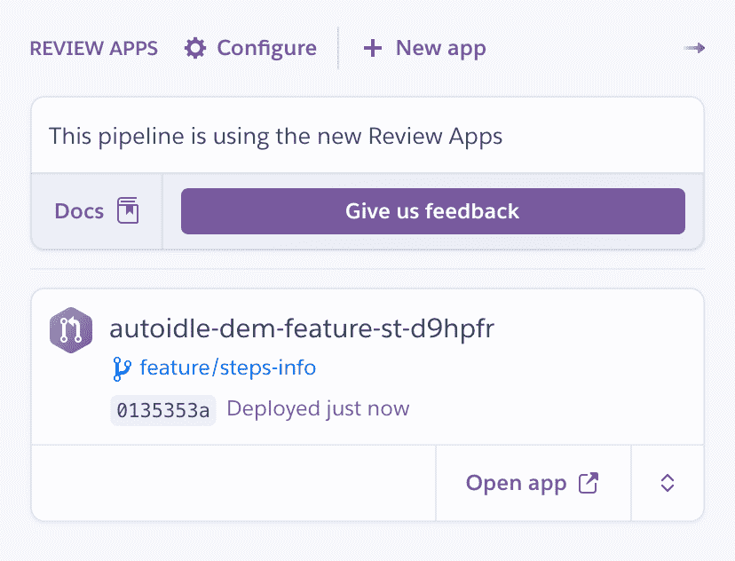

Heroku 点评 app 创建成功！

我们可以使用“打开应用程序”按钮从 Heroku pipeline 页面打开 review 应用程序，或者我们可以在 GitHub 中导航回我们的 pull 请求，找到“查看部署”按钮。

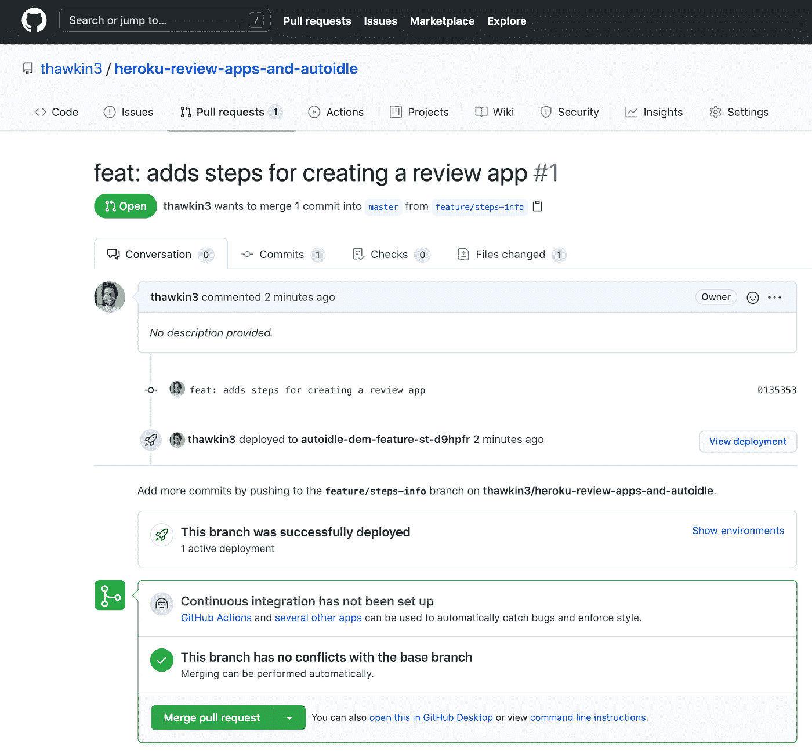

GitHub 中的“查看部署”按钮可查看查看应用程序

单击任一按钮都会将我们带到包含新更改预览的审核应用程序。

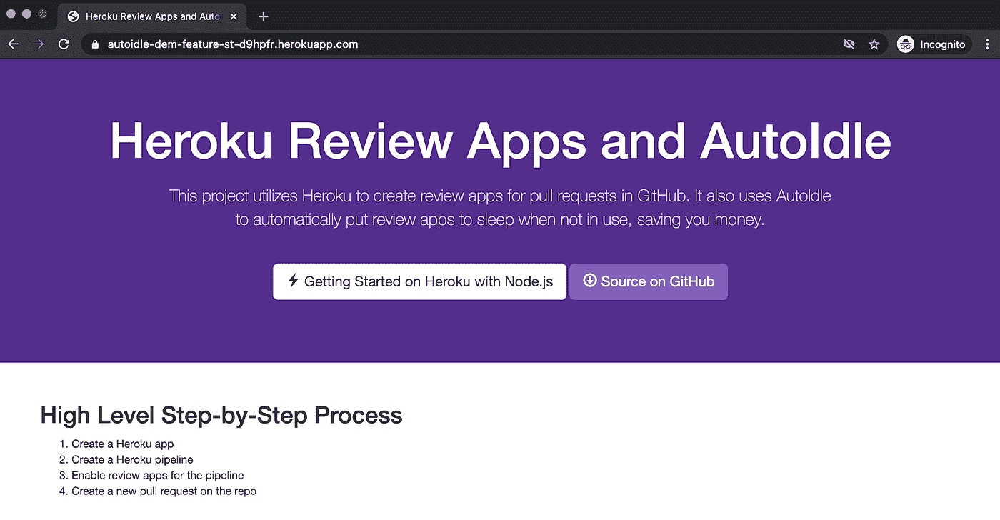

Heroku review 应用程序显示我们未完成的拉动式请求的更改

在确保我们的应用程序看起来不错之后，我们可以合并拉请求。合并代码导致 review 应用程序被销毁，现在只剩下我们的常规生产应用程序。

点评 app 是个很奇妙的东西！

在将我们的代码合并到主分支之后，我们现在可以从终端使用`git push heroku master`命令将这些代码发布到产品中。或者，对于一个更现实的场景，我们可能将我们的代码提升到一个阶段环境中，或者在合并后自动将代码部署到生产环境中。但是，出于本文的目的，我们不会考虑这些工作流设置。

# 进退两难

现在，当谈到成本时，记住几件事很重要。首先，审核应用保持活动状态，直到“拉”请求被合并或关闭，或者我们在审核应用设置中指定的最大时间段过去(您应该还记得，我们将审核应用配置为五天后自动销毁)。此外，你需要为评论应用付费，就像任何其他 Heroku 资源一样——按秒按比例计算。

想象一下，一个开发人员在一个星期五的下午创建了一个拉请求。这启动了新的审核应用程序部署。然后每个人都回家过周末，而孤独的评论应用程序却闲置不用。周一，另一个开发人员看到拉请求，审查代码，手动测试审查应用程序，批准拉请求，然后合并它。

在这种情况下，review 应用程序在整个周末都处于活动状态，这意味着您需要为它使用的资源付费，尽管在那段时间里并不真正需要 review 应用程序。实际上，在代码评审期间，评审应用程序只在短短几分钟内是必要的。

如果这听起来很糟糕，想象一下这个场景乘以数百个回购和数百个开发者。根据公司的规模，这些成本会很快增加！

如果我们可以在不使用评论应用程序时让它们休眠，那不是很好吗？

# 自动驾驶到救援

[AutoIdle](https://autoidle.com/) 是一个 Heroku 插件，它可以在 30 分钟不活动后自动将你的 staging 和 review 应用程序置于睡眠状态。当最终收到 HTTP 请求时，AutoIdle 会重新激活该应用程序。这非常适合那些不需要一直保持活跃的临时应用。

当然，生产应用程序确实需要在任何给定的时间可用，所以 AutoIdle 不应该用于您的生产环境！

# 安装 AutoIdle

我们可以通过在终端中运行以下命令将 AutoIdle 添加到我们的应用程序中:

```
heroku addons:create autoidle
```

还有…就是这样！没有更多的步骤。AutoIdle 现在已经安装好了，可以帮你省钱了。

然而，需要注意的是，上面的命令将 AutoIdle 添加到您的实际应用程序中，而不是您的审核应用程序。所以如果这个 app 是面向客户的生产 app，就不要在这里添加 AutoIdle！不过，这个命令非常适合将 AutoIdle 添加到 staging 应用程序或其他非面向客户的应用程序中，这些应用程序在不活动时可以休眠。

如果您需要删除 AutoIdle 插件，您可以随时使用以下命令:

```
heroku addons:destroy autoidle
```

因为在我们的例子中，我们只想将 AutoIdle 添加到我们的审查应用程序中，所以我们将在 repo 的根级别的`app.json`文件中指定我们的附加组件。下面的 JSON 片段指定，对于我们的`“review”`环境，我们想要使用`“autoidle:hobby”`附加组件。

```
"environments": {
  "review": {
    "addons": ["autoidle:hobby"]
  }
}
```

在 Heroku 上可以找到 [AutoIdle 计划类型的完整列表。](https://elements.heroku.com/addons/autoidle)

现在我们已经为我们的审核应用程序配置了 AutoIdle，让我们像以前一样创建另一个拉请求。一旦我们创建了拉动请求，我们的审核应用程序将自动部署。

然后，我们可以通过在终端中运行以下命令来查看 AutoIdle 仪表板:

```
heroku addons:open autoidle
```

我们的仪表板最初看起来像这样:

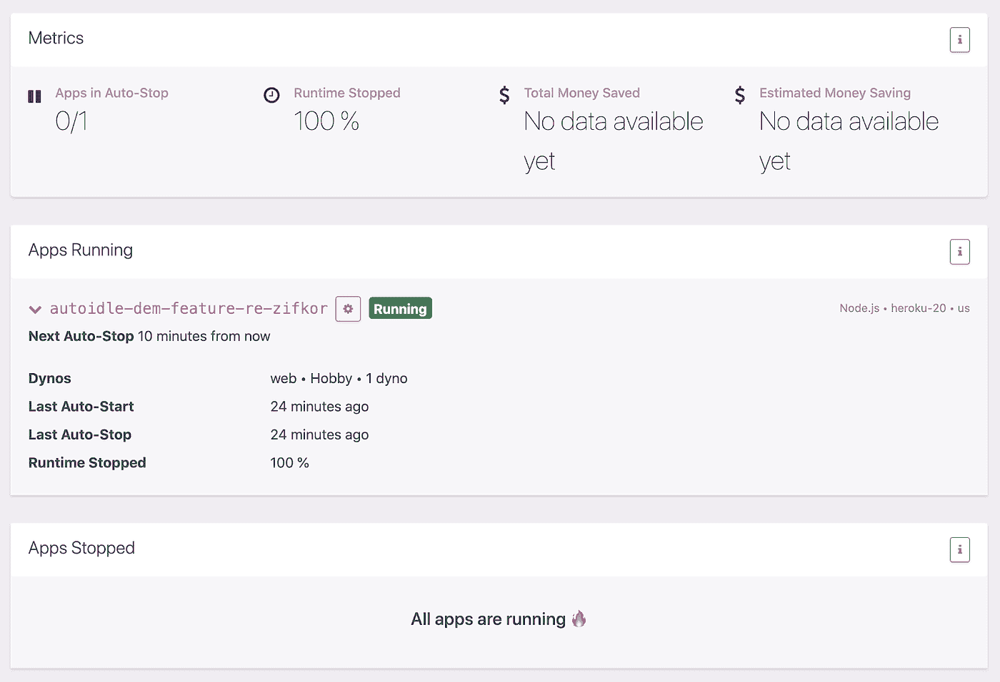

在为我们的点评应用配置 AutoIdle 几分钟后，AutoIdle 仪表盘就出现了

我们的点评应用刚刚创建，因此目前正在运行。让我们等待至少 30 分钟，不要与我们的评论应用程序交互，看看 AutoIdle 如何发挥它的魔力。

30 分钟后…我们的应用程序已被停止。不错！

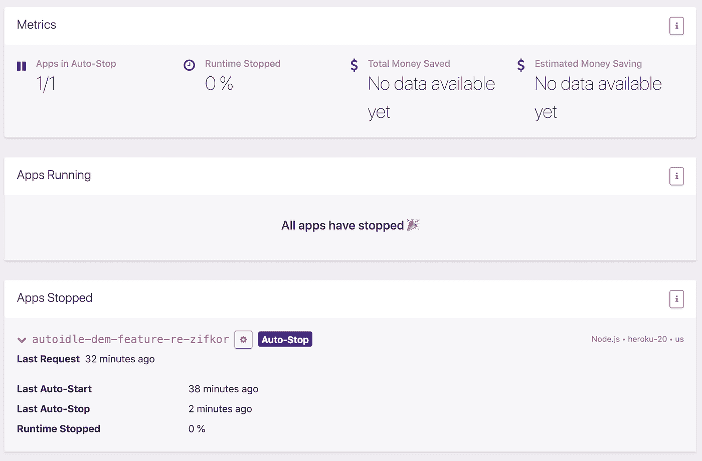

AutoIdle 已停止不活动的点评应用程序。

现在让我们再等几个小时，这样我们就可以开始看到 AutoIdle 将为我们带来的节约。我在深夜创建了这个回顾应用程序，所以让我们来看看第二天早上我检查仪表板时它是什么样子的:

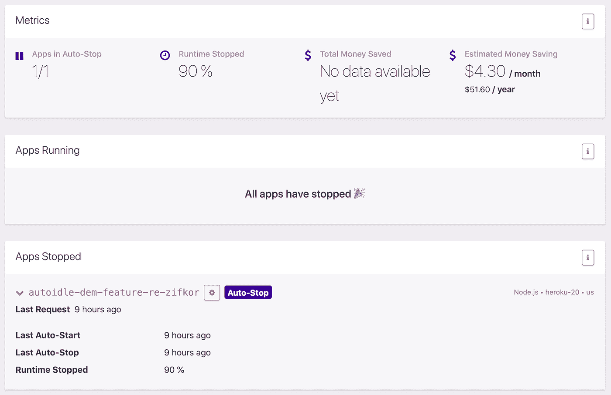

使用 AutoIdle 节省一些钱

正如你所看到的，我们的应用程序 90%的时间都是停止的(它运行了一个小时，然后在一夜之间停止了九个小时)。我们目前估计每月节省 4.30 美元。但请记住，这只是针对一个我们使用不到一天的 Hobby dyno review 应用程序。

想象一下，如果我们有 100 个评论应用。现在，我们预计每月可以节省 430 美元！很高兴知道当我们不使用我们的应用程序时，我们不会为所有这些停机时间付费！

如果我们现在试图在`herokuapp`域查看我们的点评应用，我们会看到一个错误屏幕:

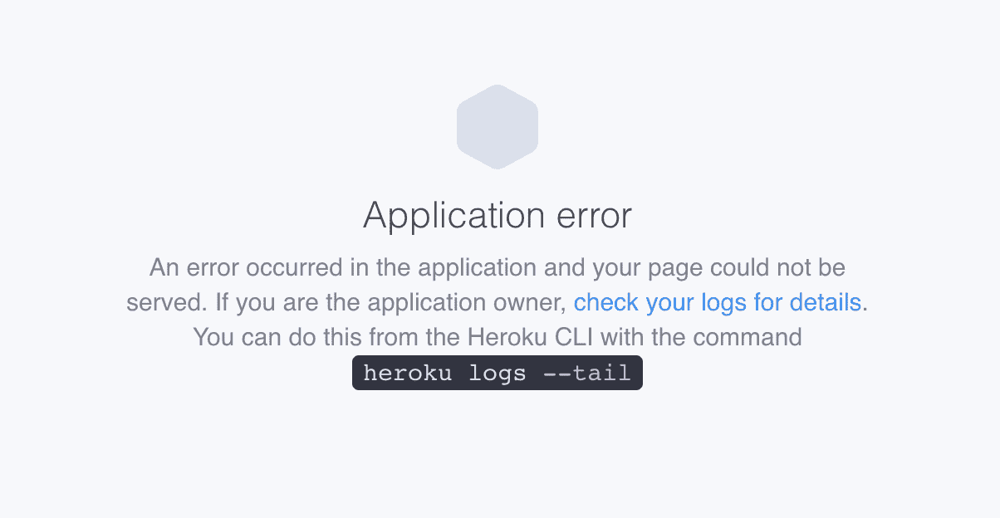

尝试查看睡眠应用程序时出现应用程序错误

这是因为我们的点评 app 还在休眠。在第一次请求后，应用程序通常需要大约 5-10 秒钟才能唤醒。这段时间过后，我们可以刷新屏幕，看到我们的应用程序再次正常工作。

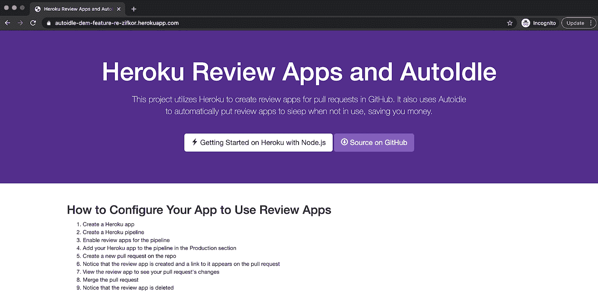

我们的点评应用再次苏醒并活跃起来

避免这个初始错误页面的一个方法是在我们的应用程序中使用`autoidleapp`域，而不是`herokuapp`域。在我们的例子中，我们可以访问`https://autoidle-dem-feature-re-zifkor.autoidleapp.com`，而不是访问`https://autoidle-dem-feature-re-zifkor.herokuapp.com`。这是同一个应用程序，但现在没有首页加载问题。

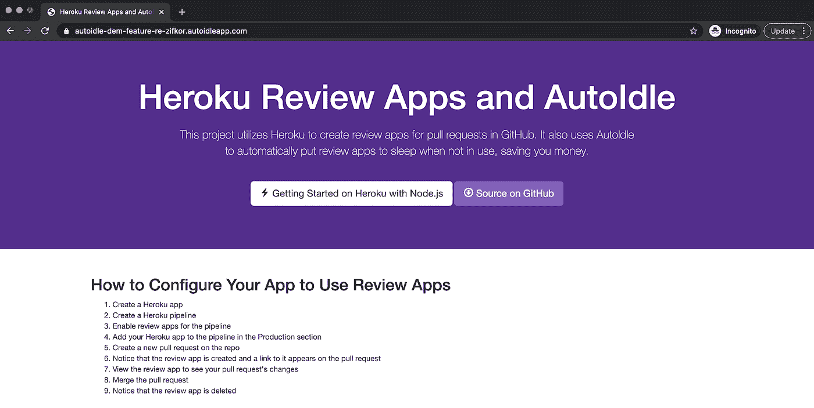

使用 autoidleapp.com 域来避免睡眠应用的首页加载错误

既然我们的审核应用程序再次激活，如果我们检查 AutoIdle 仪表板，我们会看到我们的审核应用程序不再休眠。

# 结论

审查应用程序对于在拉式请求代码审查期间验证变更非常有用。但是让它们长时间运行会花费你很多钱。

在我们的例子中，我们有一个应用程序和一个拉请求。我们还使用了一个较低层次的爱好动态。在我们的情况下，我们的成本会相对较低。但是想象一下在一家企业软件公司使用评论应用程序。数百名工程师、拉式请求和审查应用程序都使用大型 dynos 和额外的 Heroku 附加组件，成本真的会增加。

通过使用 AutoIdle，你可以只在必要的时候保持你的应用程序运行，这将大大减少你的 Heroku 账单。