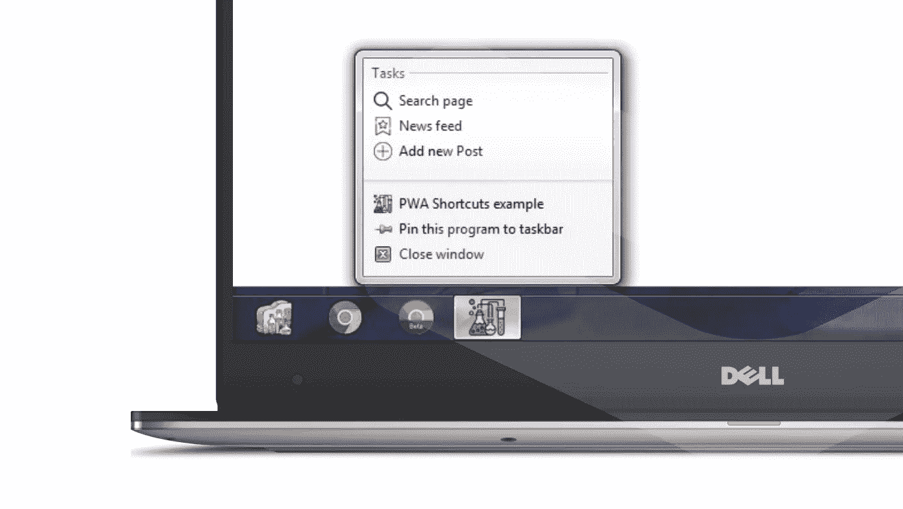

# 如何创建 PWA 的快捷方式

> 原文：<https://betterprogramming.pub/how-to-create-shortcuts-to-your-pwa-fd7bbe108e96>

## 如何让用户快速跳转到你的应用

照片由[蜜桃红·坎普斯·菲利佩](https://unsplash.com/@matfelipe?utm_source=unsplash&utm_medium=referral&utm_content=creditCopyText)在 [Unsplash](https://unsplash.com/collections/9416347/prowomen?utm_source=unsplash&utm_medium=referral&utm_content=creditCopyText) 上拍摄

你好，中号！

在本文中，我想解释并展示一个关于 PWA 新的快捷方式特性的例子。

**开始之前的注意事项:**需要 PWA 的初步知识([如何创建 PWA 并使其可安装](https://codelabs.developers.google.com/codelabs/add-to-home-screen/index.html#0))。

# 快捷方式简介

快捷方式是用户经常执行的任务列表。你自己定义这些任务。该功能将提高用户的工作效率，并增加他们对应用程序的参与度。它们还将减少访问大量位置和功能所需的点击次数。

## **用例**

*   顶级导航项目(例如，主页、时间线、订单)
*   搜索
*   数据输入任务(例如，撰写电子邮件或推文，添加收据)
*   活动(例如，与“联系人”中四个最受欢迎的联系人开始聊天)

## **看起来怎么样？**

Android 上的快捷菜单在长按 PWA 图标后出现。看起来是这样的:

Android 上的快捷方式

在 Windows 上，右键单击任务栏中的 PWA 图标可以调用快捷菜单。看起来是这样的:

Windows 桌面上的快捷方式

# 代码示例

这是通过几行代码完成的。在 web-app 清单文件中，您需要添加一个新的`shortcuts`属性(数组类型)。下面是一个例子:

`shortcuts`数组具有以下属性:

*   `name` **:** 必选。向用户显示时，应用程序快捷方式的可读标签。
*   `short_name` **:可选**。空间有限时使用的人类可读标签。建议您提供。
*   `description` **:** 可选。提供快捷操作的目的。
*   `url` **:** 必选。当用户激活快捷方式时加载的 URL。此 URL 必须存在于 web-app 清单文件的范围内。如果`url`是一个相对 URL，那么基本 URL 将是清单的 URL。
*   `icons` **:** 可选。图像资源对象的数组。每个对象的必需属性是`src`和`sizes`(`type`属性是可选的)。

目前不支持 SVG 文件，请使用 PNG。否则，建议您使用单个 192x192 像素的图标。

# 支持

应用程序快捷方式可用:

*   Android 上的 Chrome 84(目前可通过 [Chrome Dev](https://play.google.com/store/apps/details?id=com.chrome.dev&hl=ru) 获得)
*   Chrome 84 和 Edge 84 通过启用 Windows 上的标志`about://flags/#enable-desktop-pwas-app-icon-shortcuts-menu`

# 例子

Android 上的快捷方式示例

# 最终想法

我希望这篇文章是有帮助的和可以理解的。由于以下原因，快捷方式绝对值得立即嵌入到您的 PWA 中:

*   快速轻松地创建快捷方式
*   不支持这个特性的设备不会显示它(你不会破坏代码中的任何东西)

我相信很快其他浏览器也会加入对快捷方式的支持。当这种情况发生时，你会领先于其他人。

亲爱的读者，感谢您的宝贵时间！

# **资源**

*   [实时快捷键 PWA](https://pwa-shortcuts.firebaseapp.com/index.html)
*   [GitHub 回购](https://github.com/jyggiz/pwa-shortcuts)
*   [带有 Manifest.json 的要点](https://gist.github.com/jyggiz/96dccd90a7fec91acab1930ed8921a7c)
*   [快捷键解释器](https://github.com/MicrosoftEdge/MSEdgeExplainers/blob/main/Shortcuts/explainer.md)
*   [PWA 概述](https://codelabs.developers.google.com/codelabs/add-to-home-screen/index.html#0)
*   [安卓版 Chrome 开发](https://play.google.com/store/apps/details?id=com.chrome.dev&hl=ru)