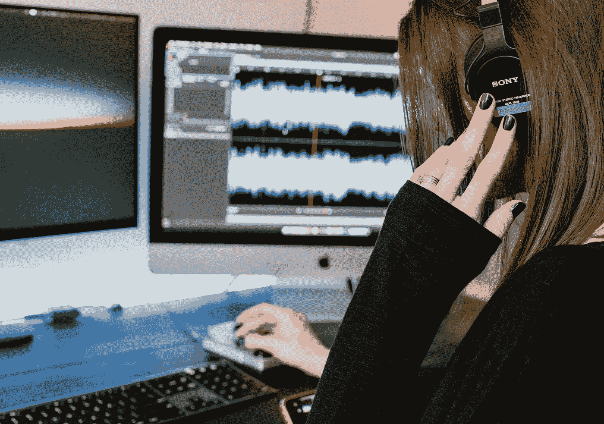
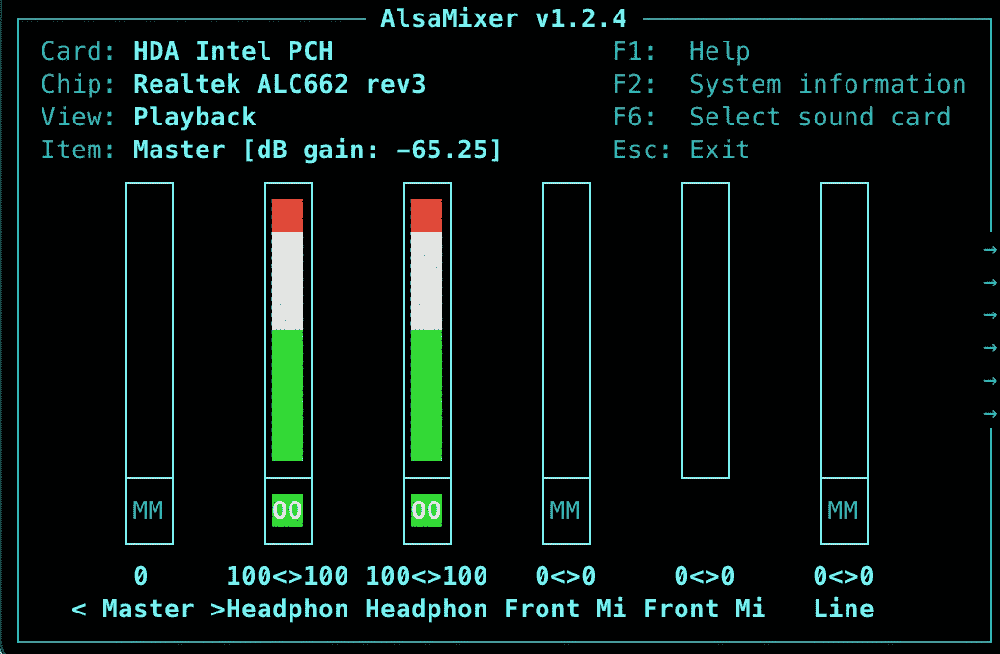

# 如何在 Linux 下创建简单的虚拟音频接口

> 原文：<https://betterprogramming.pub/how-to-create-simple-virtual-audio-interfaces-in-linux-5e4de6ac53b9>

## 没有所有开销的音频路由幸福



凯利·西克玛在 [Unsplash](https://unsplash.com/s/photos/audio?utm_source=unsplash&utm_medium=referral&utm_content=creditCopyText) 上的照片

过去在 Linux 中处理坏的音频驱动程序和设备的笨重日子已经成为过去。如今，有[的整个发行致力于声音设计和音乐制作](https://ubuntustudio.org/)。你可以获得最流行的现成发行版，并期望许多音频接口一开始就能正常工作。

但是，当您需要更多的音频路由和连接灵活性时，会发生什么呢？

有许多大型、复杂的音频框架，如用于 Linux 的 [Jack](https://jackaudio.org/) 和 [PluseAudio](https://www.freedesktop.org/wiki/Software/PulseAudio/) 。这些有这么多可配置的选项和移动部件，它会让你恶心。如果你想做的只是增加一些额外的环回接口，这就有点多余了。另外，你可能会花更多的时间来设置它们，而不是实际创建你需要的界面。

在本文中，我们将探索一种使用许多 Linux 发行版通用的音频子系统创建虚拟界面的简单方法。 [ALSA 项目](https://alsa-project.org/wiki/Main_Page)提供了一种直接、简单的方式来管理音频接口和基本配置。让我们试一试。

## 基本命令

如果你已经熟悉使用默认的 ALSA 实用程序，你可以跳过。如果您刚接触 ALSA 或需要复习，请运行这些命令，以便快速识别和管理连接的声音设备。

如果您还没有安装 ALSA 实用程序包，您会想先这样做:

```
sudo apt install alsa-utils
```

现在让我们来看看几个基本的列表命令。这些命令向您显示操作系统可以看到的连接设备。

显示所有播放设备:

```
aplay -l
```

显示所有录制设备:

```
arecord -l
```

这两个命令显示系统上可用的播放和录制设备。这有助于识别设备的名称、硬件 ID 和通道数量。您还可以在此处检查以确保任何外围设备(尤其是 USB 接口)都已正确连接。

以下命令将显示 ALSA 的混音面板。这允许您调整输入和输出级别，并对每个设备进行小的配置更改:

```
alsamixer
```



alsamixer 面板。

现在我们已经了解了一些基础知识，让我们看看如何实际创建一些环回接口。

## 加载环回模块

为了创建虚拟环回接口，我们需要将一个特殊的模块加载到 ALSA 的操作系统中。这个模块叫做`snd-aloop`，它允许你发送音频到一个接口的一边，并让它出现在另一边的输出上。这有点像连接两个组件的虚拟音频电缆。

使用这些虚拟接口，您可以执行更复杂的音频路由。您可以将音频路由到一个接口，该接口将在另一端捕捉或处理声音，或者简单地复制声音。当您可以访问相对无限数量的虚拟接口时，有大量的可能性。

让我们使用以下命令加载模块:

```
sudo modprobe snd-aloop
```

现在，如果您运行`arecord -l`或`aplay -l`，您应该会看到以下新增内容:

```
card 1: Loopback [Loopback], device 0: Loopback PCM [Loopback PCM]
  Subdevices: 7/8
  Subdevice #0: subdevice #0
  Subdevice #1: subdevice #1
  Subdevice #2: subdevice #2
  Subdevice #3: subdevice #3
  Subdevice #4: subdevice #4
  Subdevice #5: subdevice #5
  Subdevice #6: subdevice #6
  Subdevice #7: subdevice #7
card 1: Loopback [Loopback], device 1: Loopback PCM [Loopback PCM]
  Subdevices: 8/8
  Subdevice #0: subdevice #0
  Subdevice #1: subdevice #1
  Subdevice #2: subdevice #2
  Subdevice #3: subdevice #3
  Subdevice #4: subdevice #4
  Subdevice #5: subdevice #5
  Subdevice #6: subdevice #6
  Subdevice #7: subdevice #7
```

这两个接口为您提供输入和输出，以便发送和采集音频。列出的第一个设备(`device 0`)是您将音频输入路由到的设备。第二个装置(`device 1`)是你能从第一个装置听到它的地方。你发送到第一个界面的所有东西都会出现在第二个界面上。

如果您想将音频路由到第一个接口的硬件 ID，您应该这样做:

```
hw:1,0,0
```

如果您想引用第二个接口来监听它，您应该这样做:

```
hw:1,1,0
```

您可以使用`arecord`和`aplay`来测试这一点，方法是在第一个界面中播放一个 WAV 文件，并在第二个界面中收听(录制)它。

## 自定义环回接口

如果您想要创建一对以上的默认环回接口，您可以通过创建一个特殊的配置文件来轻松实现。

创建下面的文件`/etc/modprobe.d/alsa-loopback.conf`并用下面的内容填充它:

```
option snd-aloop enable=1,1,1,1 index=0,1,2,3
```

这将创建四对独立的环回接口。您可以通过在`enable`后添加或删除一个`1`并相应地添加`index`值来修改已启用接口的数量。

如果您启用了这个配置，那么确保模块在每次启动时都被加载是一个好主意。

运行以下命令以确保`snd-aloop`模块在启动时加载:

```
echo "snd_aloop" > /etc/modules-load.d/snd-aloop.conf
```

现在，每次重新启动时，您都应该加载带有自定义接口数量的`snd-aloop`模块。

## 尝试一下

如果你想测试你新发明的虚拟界面，你可以加载你最喜欢的音频应用程序，并选择它们作为输入/输出设备。如果您在命令行上工作，您也可以使用下面的命令来执行测试。

如果你需要测试文件，你可以尝试一些在 freesound.org 的免费 WAV 文件。

下面将播放一个测试文件到输入环回:

```
aplay -D hw:1,0,0 test_input.wav
```

下面将把它记录在输出回环之外:

```
arecord -D hw:1,1,0 -f S16_LE -c 2 -r 48000 test_output.wav
```

希望您现在已经实现了音频路由天堂，而没有实现更复杂的音频服务器框架的所有麻烦。如果你想了解更多关于 ALSA 的信息，你可以点击这里查看官方文件[。](https://alsa-project.org/wiki/Documentation)

感谢阅读！看看下面更多的帖子:

*   [7 个包含免费软件、工具和技巧的 GitHub 库](https://tateg.medium.com/7-github-repositories-with-free-software-tools-and-tips-53ce4aa71003)
*   [开发人员在审查代码时会犯的 10 个常见错误](https://levelup.gitconnected.com/10-common-mistakes-developers-make-when-reviewing-code-81b042c3d642)