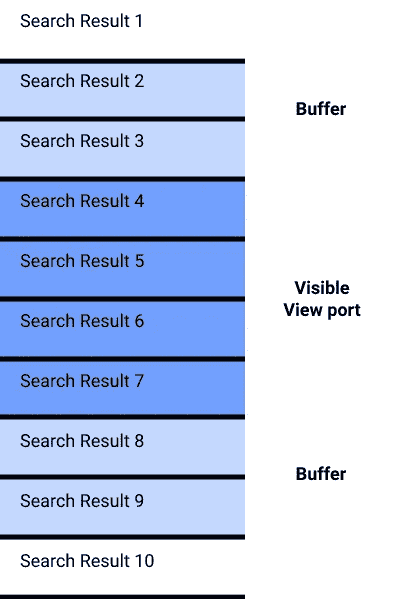
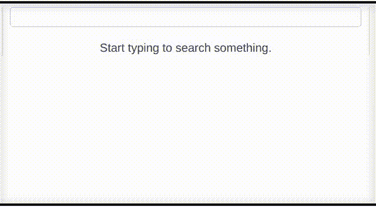

# 如何在 Vue.js 中创建流畅的无止境滚动

> 原文：<https://betterprogramming.pub/how-to-create-smooth-endless-scrolling-in-vue-js-4fc9180645ef>

## 没有任何抖动或外部库

[熊燕](https://unsplash.com/@slothxbear?utm_source=unsplash&utm_medium=referral&utm_content=creditCopyText)在 [Unsplash](https://unsplash.com/s/photos/tech?utm_source=unsplash&utm_medium=referral&utm_content=creditCopyText) 上拍照。

在这篇文章中，我将解释如何在 Vue.js 中创建一个平滑无休止滚动的页面。为了说明如何做到这一点，我将创建一个非常简单的搜索页面，您可以在上面无休止地滚动搜索结果。

我们的目标是让页面流畅、快速，并且没有潜在的性能问题。

为什么我把它叫做*平滑* 无休止滚动页面？为了让最终用户体验流畅，他们必须能够无休止地滚动页面，而不是一直等待页面加载。记住这一点，让我们从简单的应用程序开始。

首先，我们使用 vue-cli 和`vue create my-project-name`创建一个新项目。

我们需要三个组件:

*   我们的搜索页面和列表的一个通用组件
*   单个搜索结果的组件
*   加载器组件

我们将把这个组件作为虚拟滚动条的一部分，用于单独的搜索结果。我稍后会解释它的好处。

在我们的 Vue 应用程序的 HTML 部分，您会看到搜索框、在用户输入内容之前开始搜索的消息和虚拟滚动列表。

对于我们的虚拟滚动条，我们使用 [Vue 虚拟滚动列表](https://github.com/tangbc/vue-virtual-scroll-list)，这是 GitHub 上的一个 2.5K 星的项目，它可以帮助你创建虚拟滚动条(类似于 react 中的 [react-virtualized](https://github.com/bvaughn/react-virtualized) )。

由作者创作。

拥有很多 HTML 元素会让你的前端变得非常沉重。包含超过 1，500-2，000 个 DOM 元素的页面会开始滞后，尤其是在小型设备上。

想象一下，有一个无限滚动的页面，过一段时间后，它可能会有数千个父元素，每个父元素包含几个子节点。对性能的影响将是巨大的。

虚拟滚动条通过从 DOM 中移除不可见的元素来规避这个问题。唯一真正的 DOM 元素是那些可见的元素，加上上面和下面的一些作为缓冲的元素。大的填充是到该点为止所有元素的高度之和，它被添加到顶部以显示滚动条并保持平滑。

既然一切都解释清楚了，让我们开始研究迷你应用程序的 JavaScript 部分。

我们为 HTTP 请求导入组件和 axios。`lodash`也被导入，因为我们将使用它的一个助手函数。

在`<virtual-list>`内部传递了`itemComponent`属性，它需要指向将呈现单个搜索结果的组件。在我们的例子中，这就是我们现在将要创建的`SearchResult`组件。

虚拟列表将通过`source`道具，我们可以用它来呈现搜索结果的标题和描述。如您所见，我使用了`v-html`指令来呈现代码片段，因为 API 以 HTML 格式返回描述。

我们现在已经有了虚拟列表和搜索结果的基本基础，所以是时候连接 Wikipedia API 并带来一些结果了。我们将首先创建一个`search`方法，该方法将基于用户输入的文本执行搜索。

现在我们已经准备好了一个搜索函数，是时候调用它了。这个搜索方法需要被调用:

*   当用户开始在搜索框中键入时。
*   当用户向下滚动时。

让我们通过在我们的`EndlessList` Vue 组件中添加拼图的最后部分来处理这两种情况。

我们正在为`searchQuery`使用一个观察器，这样每次`searchQuery`的值改变时，我们都可以得到新的结果。正如你可能注意到的，我们还使用了一个`[debounce](https://lodash.com/docs/#debounce)` [函数](https://lodash.com/docs/#debounce)来确保`search`不是在每一个输入的字母上被调用，而是在最后一个字母之后 200 毫秒被调用。

另一个需要注意的重要事情是，我们在第一次搜索时加载两页结果，以便用户一开始有一些空间来滚动。为了保持流畅，提前加载一页很重要。

在我们的`mounted`方法中，我们添加了滚动监听器，它将再次调用 search 方法并更新页面计数。我们在滚动事件上也使用了`debounce`，但是我们将`leading`设置为`true` ，因为我们希望在*第一个*(或前导)事件之后 100 毫秒运行预期的方法，而不是最后一个(尾随)事件。

我们用`npm run serve`运行我们的 Vue 应用，这是最终结果:

# 结论

我写这篇文章的目的是帮助你看到一个无限滚动的完整例子。我本可以只展示当你接近页面底部时加载更多结果的部分，但是这并没有解释一些重要的部分。

## 1.平滑

对于终端用户来说，无休止的滚动应用程序必须感觉流畅。如果我们在页面底部加载结果，用户将不得不不断地等待结果加载，这将导致挫败感。

解决方案是在用户到达页面底部之前提前加载。

## 2.滚动性能

这个例子非常简单，但是在像脸书这样的实际应用程序中，单个部分(比如我们例子中的搜索结果)在 DOM 上占用的内存要多得多，因为它们包含更多的元素。

如果用户无休止地滚动——几分钟甚至几小时——页面会变得非常慢。但当你在脸书或 Instagram 上滚动时，你不会体验到这样的缓慢。使用的技术被称为虚拟化，它确保当您向下滚动并获得更多结果时，DOM 不包含成千上万的元素。

使用`[vue-virtual-scrol-list](https://github.com/tangbc/vue-virtual-scroll-list)`，您可以确保当用户在结果的第一页或第 100 页上滚动时，页面的效果是一样的。

## 3.事件处理

如你所见，我们使用`debounce`来滚动和输入事件。原因是我们不想为用户输入的每个字符触发大量的请求，我们也不想检查每个滚动事件，因为那会使页面变慢。

一些 JavaScript 事件被频繁触发，或者它们的事件回调需要时间来执行。在这两种情况下，使用`[debounce](https://lodash.com/docs/4.17.15#debounce)`或`[throttle](https://lodash.com/docs/4.17.15#throttle)`来限制它们被执行的次数可能是有意义的。

既然我们已经看到了一个无止境滚动应用程序的完整示例，您可以开始自己构建一些东西了。如果你想进一步试验，你可以在 GitHub 上找到[的完整代码。](https://github.com/arisp8/vue-endless-scrolling)