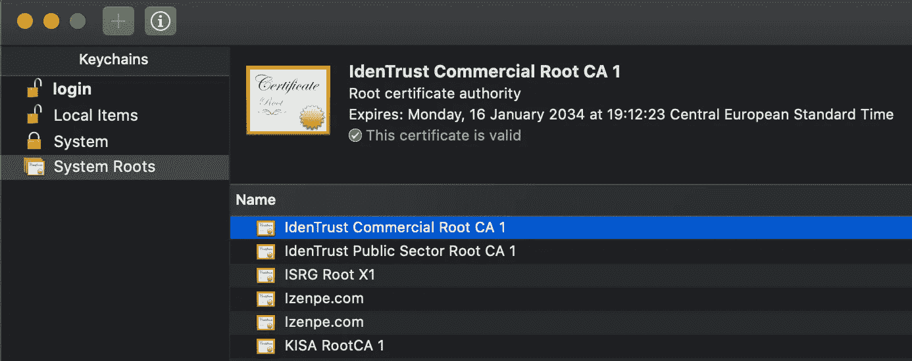
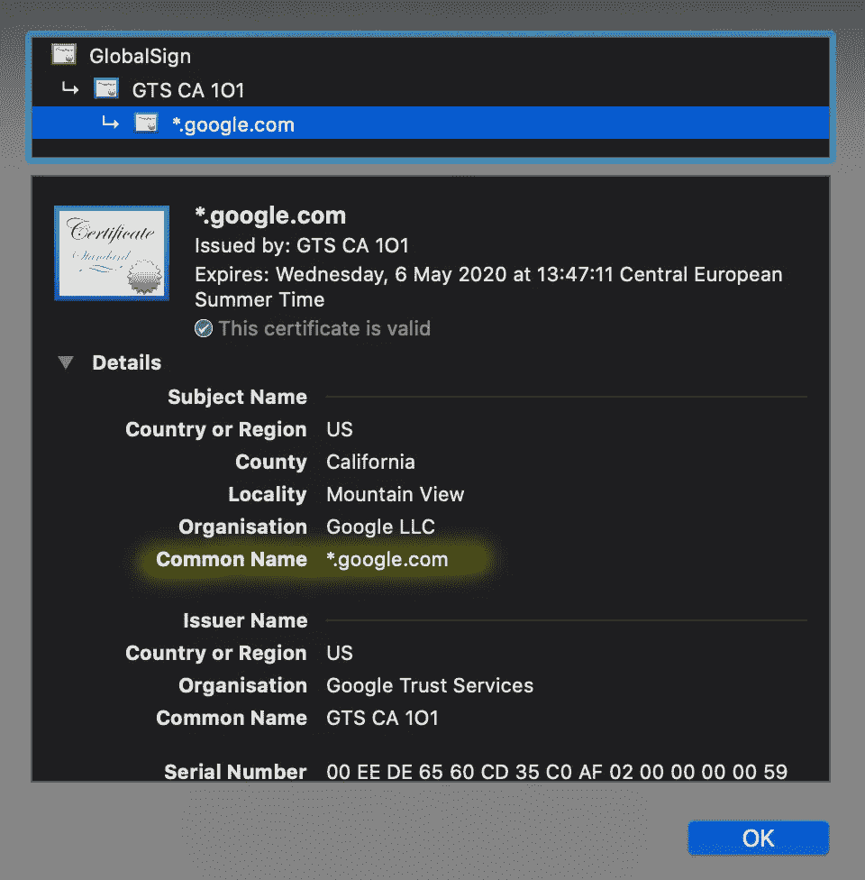
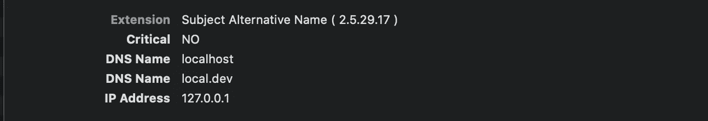
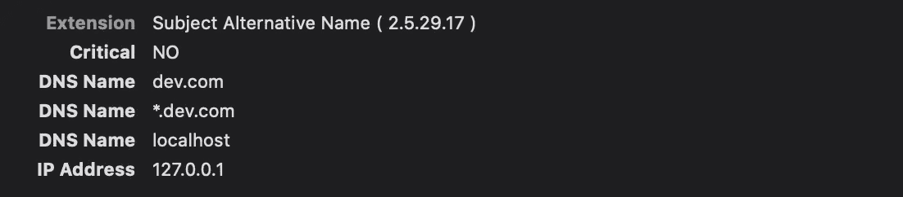

# 如何为开发创建 SSL 证书

> 原文：<https://betterprogramming.pub/how-to-create-ssl-certificates-for-development-861237235933>

## 自动生成 SSL 证书


我如何看待证书，作者创造的形象

上周，我开始实现 MQ 遥测(MQTT)代理。MQTT 是一种轻量级发布-订阅协议，用于物联网(IoT)解决方案。这个代理必须接收传感器数据，并将其重新发送给其他 MQTT 客户机。通信必须安全。

在这种情况下，安全意味着使用证书。

好了，证件，哎，又来了。我通过我的鼻子呼气，并聚集自己。我从来不喜欢和证书打交道。我在网上搜索，找到了如何生成自签名证书。“我真的应该自动化这项工作，”我记得以前有过几次这样的想法…

但是不知何故，我总是通过在终端中键入命令来创建证书。然后我继续这个项目，再也不回头。

我对证书总是又爱又恨。我从来不明白它们是如何工作的，但在开发过程中偶尔需要它们。

所以，我最终创作了这篇文章。对我来说是未来的参考。它包含了从开发人员的角度理解证书的足够细节。

除此之外，我最终自动创建了一个本地信任的开发证书。见此 [GitHub 库](https://github.com/PatrickKalkman/Developer-SSL-Certificates)。

希望你会觉得有用。

# 一点理论

我保证，只会一点点。

我们需要证书吗？

是的，我们有。我们需要证书有两个主要原因。

*   数据的安全传输。
*   发送者或接收者的标识。

## 数据的安全传输

您可以使用两种类型的加密来安全地传输数据，对称和非对称。两者各有利弊。稍后，我们将看到当浏览器使用 HTTPS 连接到网站时，浏览器会使用这两种类型的加密。

**对称加密和非对称加密有什么区别？**

我发现*对称*加密最容易理解。发送方和接收方共享一个密钥。发送者使用这个密钥来改变要发送的消息。收件人使用相同的密钥来恢复原始邮件。

对我来说，加密总感觉有点像魔法。在这种情况下，您创建了两个属于一起的键。第一个是公钥。你可以和任何想给你发信息的人分享。第二个密钥是秘密密钥。只有你需要知道。

如果使用公钥加密邮件，则只能使用私钥解密。此外，如果使用私钥加密消息，则只能使用公钥解密。纯粹的魔法。

使用 SSL 时，两种类型的加密都会用到。

## SSL 通信(简化)

当浏览器连接到使用 SSL 的网站时，浏览器会执行以下步骤。

1.  您指示浏览器通过 HTTPS 连接到一个网站。浏览器要求 web 服务器标识自己。
2.  web 服务器将其证书的副本发送回浏览器。
3.  浏览器验证证书的身份。证书中的名称与域名匹配吗？我信任签署证书的证书颁发机构吗？
4.  浏览器生成一个密码，并使用公钥对其进行加密。它从证书中检索公钥。这是不对称加密。浏览器将加密的密码发送到 web 服务器。
5.  web 服务器使用私钥解密密码。
6.  浏览器建立一个加密连接。双方都使用先前生成的密码加密和解密数据。这是对称加密。

浏览器只使用非对称加密来传输密码的原因与非对称加密的性能有关。不对称加密比对称加密慢得多。

## 发送者或接收者的身份

证书也用于识别。这样，您就可以确定您实际上连接到了正确的网站。

验证有两种方式。首先，浏览器验证 web 服务器返回的证书是否可信。这是通过确保证书由证书颁发机构(CA)签名来检查的。

设备的操作系统包含可信证书列表。

例如，请参见下面显示了 [IdenTrust](https://www.identrust.com/) 根证书的截图。IdenTrust 根证书是最常用的 CA 证书之一。主要是因为[让我们加密](https://letsencrypt.org/)证书是由 IdenTrust 交叉签名的。



macOS 上的“钥匙串访问”应用程序显示受信任的 CA 证书

浏览器使用可信证书列表来验证收到的证书是否由列表中的 CA 签名。

第二种类型的身份验证是验证证书的通用名称是否与为该证书提供服务的域相对应。



来自 www.google.com 的证书，通用名*.google.com

## 证书文件格式

存储证书有许多不同的格式。有时，我会看到文件格式使用不当。以下格式用于证书。

**PEM 格式**

隐私增强邮件(PEM)格式是存储私钥证书的最常见格式。该文件的内容是 Base64 编码的 ASCII。

文件可以有扩展名`.pem`、`.crt`、`.key`或`.ca-bundle`。为了确保该文件确实是一个 PEM 文件，打开它并检查它是否以`BEGIN CERTIFICATE`或`BEGIN RSA PRIVATE KEY`开头。

**P7B 格式**

P7B 或 PKCS#7 格式的文件也存储在 Base64 编码的 ASCII 中。

该文件的扩展名为`.p7b`或`.p7c`。P7B 格式只能用于存储证书，不能用于存储私钥。该文件格式在 Windows 和 Java Tomcat 上使用。

**DER 格式**

可分辨编码规则(DER)格式以二进制格式存储证书和私钥。文件的扩展名为`.der`或`.cer`。DER 格式经常在 Java 平台上使用。

**PKCS#12 格式**

PKCS#12 或 PFX 格式存储在二进制文件中。私钥和证书存储在一个文件中。

该文件的扩展名为`.pfx`或`.p12`。这些文件在 Windows 和 macOS 上用于导入和导出证书和私钥。

# 生成一次性自签名证书

自签名证书可以在任何计算机上生成。我用的是[OpenSSL](https://www.openssl.org/)1 . 1 版本的 macOS。OpenSSL 是一个全功能的工具包和加密库。对于大多数操作系统来说，都有现成的 OpenSSL 二进制包。

生成自签名证书需要以下步骤

*   生成私钥。
*   创建证书签名请求。
*   生成证书。

## 1.生成私钥

第一步是通过执行以下命令创建一个私钥。

```
openssl genpkey -algorithm RSA -des3 -out private-key.pem -pkeyopt rsa_keygen_bits:4096
```

`genpkey` —在这种情况下，要执行的 OpenSSL 命令生成一个私钥

`algorithm RSA` —使用哪个公钥算法。其他选项可用，如 RSA-PSS、EC、X25519、X448、ED25519 和 ED448。

`-des3` —该选项指定 OpenSSL 必须使用 Triple-DES 加密私钥。在执行命令时，它会询问使用哪个密码。

`out privateKey.pem` — OpenSSL 应该将私钥存储在一个名为`privateKey.pem`的文件中。

`pkeyopt rsa_keygen_bits:4096` —指定生成的密钥应该使用的位数。我用 4096 位。

输出文件`privateKey.pem`的格式默认为 PEM 文件。通过`genpkey`，OpenSSL 使用 PKCS #8 语法将密钥存储在文件中。

我使用`genpkey`而不是`genrsa`，因为它使用了更合理的默认值。

例如，`genrsa`的生成密钥的默认位数是 512 位。根据 2015 年 ars TECHNICA 的数据，使用一台 75 美元的亚马逊 EC2 可以在四个小时内破解。

## 2.创建证书签名请求(CSR)

CSR 就像创建证书的订单。如果您需要官方 SSL 证书，您可以将其发送给官方证书颁发机构(CA)。他们使用 CSR 生成官方证书。

但是，我们将使用这个请求自己生成一个证书，一个自签名证书。

之前，我描述了使用证书的两个主要原因:加密和身份识别。OpenSSL 会问一些问题，以了解在 CSR 中应该放入什么信息。

询问您`Common Name`的问题对于识别身份非常重要。您应该回答要使用证书的完全限定域名。这也可以是内部域、本地主机或 IP 地址。

```
openssl req -new -key private-key.pem -out csr.pem
```

`req` —创建 PKCS#10 格式的证书请求。

`-new` —生成新的证书请求。向用户询问所有需要的信息。

`-key` —要使用的私钥的文件名。私钥是在上一步中生成的。

`-out` —创建的证书请求的文件名。

OpenSSL 将询问以下问题:

*   公用名:您希望使用证书保护的 FQDN(完全限定的域名)。
*   组织:您的组织的全名。仅对可信证书重要。
*   组织单元(OU):您的部门。仅对可信证书重要。
*   城市或地区:您的组织所在的城市。
*   州或省:您的组织所在的州或省。
*   国家/地区:您的组织所在的两个字母的官方国家/地区代码。

## 3.创建自签名证书

使用第一步中的私钥和第二步中的证书请求，您可以创建一个自签名证书。以下 OpenSSL 命令创建证书。

```
openssl x509 -in csr.pem -out certificate.pem -req -signkey private-key.pem -days 365
```

`x509` —执行证书命令。

`-in` —表示证书签名请求(`csr.pem`)。

`-out` —用于保存生成的证书的文件名。在这种情况下，`certificate.pem`。

`-req` —向 OpenSSL 指示输入是 CSR。

`-signkey` —使用给定的`private-key.pem`文件对证书请求进行自签名。

`-days` —生成的证书有效的天数。正常值为 365、730 和 1095 天，以指定一年、两年或三年的持续时间。

您现在有了一个可以用于本地开发的`certificate.pem`文件。根据您的开发环境，您可能需要将证书转换为另一种格式。

对于 Node.js 开发，您可以直接使用`certificate.pem`文件。

# 创建多个自签名证书

简单地生成一个自签名证书对于一个人的项目来说非常有用。如果您有多个项目或与一个开发团队合作，为每个项目创建所有这些自签名证书并将其导入每个开发人员的证书存储区会变得很麻烦。

当然，您可以创建脚本来生成它们，但是我认为自己创建一个认证机构(CA)是一个更好的解决方案。

您可以通过创建 CA 证书来成为 CA，并使用此证书来签署您的自签名证书。您的开发团队可以信任该 CA 证书，并将自动信任所有生成的用该 CA 证书签名的证书。

要成为证书颁发机构并签署自签名证书，您必须执行以下步骤:

*   为 CA 生成私钥。
*   生成根证书。
*   为证书创建私钥。
*   创建证书签名请求。
*   创建一个证书并用 CA 私钥对其进行签名

## 1.为 CA 生成私钥

可以使用以下命令生成 CA 的私钥。

```
openssl genpkey -algorithm RSA -des3 -out private-key-ca.pem -pkeyopt rsa_keygen_bits:4096
```

该命令与为自签名证书生成私钥的命令没有什么不同。唯一的区别是文件名`private-key-ca.pem`。

该命令在当前目录下生成文件`private-key-ca.pem`。

## 2.生成根证书

使用下面的命令，我们根据上一步中生成的私钥直接生成根证书。

```
openssl req -x509 -new -key private-key-ca.pem -sha256 -days 3650 -out ca-certificate.pem
```

OpenSSL 再次询问私钥的密码短语，并询问在根证书中放入什么信息。

在这种情况下，您提供的答案并不真正相关。我唯一推荐的是向其中一个字段添加信息，这样您就可以看到这是根证书。

该命令在当前目录下生成文件`ca-certificate.pem`。

## 3.为证书创建私钥

使用我们之前使用的以下命令，我们为这个特定的证书生成一个私钥。

```
openssl genpkey -algorithm RSA -des3 -out private-key.pem -pkeyopt rsa_keygen_bits:4096
```

该命令在当前目录下生成文件`private-key.pem`。

## 4.创建证书签名请求

使用下面的命令，我们以前也使用过，我们生成证书签名请求。

```
openssl req -new -key private-key.pem -out csr.pem
```

OpenSSL 将再次询问一些问题以放入证书签名请求中。一个重要的问题是*的通用名称*。将此设置为您想要使用证书的域名或 IP 地址。

较新的浏览器使用主题备用名称(SAN)来存储 DNS 名称或 IP 地址。请参阅本文后面关于 SAN 的部分。

## 5.创建一个证书并用 CA 私钥对其签名

以下命令创建自签名证书，并用 CA 的私钥对其进行签名。

```
openssl x509 -req -in csr.pem -CA ca-certificate.pem -CAkey private-key-ca.pem -CAcreateserial -out certificate.crt -days 3650
```

`x509` —执行证书命令。

`-req`—`x509`命令需要一个证书作为输入。通过`-req`，您表示您将提供一个证书请求作为输入。

`-in` —证书请求(`csr.pem`)。

`-CA` —用于签署创建的证书的 CA 的证书。(`ca-certificate.pem`)

`-CAkey`—CA 的私钥，用于对创建的证书进行签名。(`private-key-ca.pem`)

`-CAcreateserial` —由 CA 颁发的每个证书必须包含唯一的序列号。OpenSSL 将使用的序列号存储在一个文件中，该文件与带有`.srl`扩展名的证书同名。在这种情况下，您的本地目录中会有一个`ca-certificate.srl`。

`-out` —要生成的证书的文件名(`certificate.crt`)。

`-days` —生成的证书有效的天数(`3650`)。

# 自动创建本地 CA 和证书


由[维多利亚博物馆](https://unsplash.com/@museumsvictoria?utm_source=unsplash&utm_medium=referral&utm_content=creditCopyText)在 [Unsplash](https://unsplash.com/s/photos/factory?utm_source=unsplash&utm_medium=referral&utm_content=creditCopyText) 上拍摄的照片

在前面的段落中，我向您展示了创建本地 CA 和证书所必需的 OpenSSL 命令。

如果我不尝试自动化，我就不会是一个好的开发人员。

## 使用脚本

我创建了两个独立的脚本。一个用于生成本地 CA，另一个用于生成由本地 CA 签名的证书。两者都可以在[这个 GitHub 库](https://github.com/PatrickKalkman/Developer-SSL-Certificates)中找到。

Windows 和 macOS 有不同的脚本。与前面段落中的命令的一个不同之处是，脚本使用配置文件来回答问题。

例如，在生成 CA 证书时会使用以下配置文件。它指定了来自 OpenSSL 的各种问题的答案。你可以根据自己的喜好修改答案。同样类型的配置也可用于生成自签名证书。

OpenSSL 在生成本地 ca 时使用的 ca.conf

**主题别名**

之前，我描述了使用*通用名称*来存储完全限定的域名。从版本 58 开始，Chrome 不再支持常用名检查。它将忽略该字段。

相反，SAN(主题备用名称)字段是指定您的域的正确位置。在 GitHub 存储库中，有一个名为`certificate-ext.conf`的配置文件，其中包含放入 SAN 的域和 IP 地址。

用于在证书中填充 SAN 的配置文件

您可以更改此配置文件来添加您需要的域名和 IP 地址。

使用`./generate-cert.sh`命令生成证书后，生成的证书将正确填充 SAN。



生成的证书中的 SAN 字段，与“钥匙串访问”一起显示

## 使用 mkcert

如果您不能使用前面的脚本或者想要一个更广泛的解决方案，您可以使用 [mkcert](https://github.com/FiloSottile/mkcert) 。Mkcert 由 [Filippo Valsorda](https://github.com/FiloSottile) 创建，他是 [Google Go](https://play.google.com/store/apps/details?id=com.google.android.apps.searchlite&hl=en_US) 团队的一员。

Mkcert 是一个制作本地信任的开发证书的简单工具。它在 Go 中实现，不需要任何配置。它可以在 Linux、Windows 和 macOS 上运行。

您可以通过执行以下命令在 macOS 上使用 [brew](https://brew.sh/) 安装 mkcert:

```
brew install mkcert
```

安装后，我们可以使用该工具通过以下命令创建我们自己的 CA:

```
mkcert -install
```

该工具创建一个新的 CA，并将其直接安装在操作系统的根存储中。证书的名称以`mkcert`开头，包含您用来执行 mkcert 的计算机的名称。

私有 CA 密钥和证书也存储在文件系统中。您可以通过执行以下命令来获取位置:

```
mkcert -CAROOT
```

安装新的 CA 后。您可以使用`mkcert`来生成由 CA 自动签名的证书。例如，以下命令:

```
mkcert dev.com *.dev.com localhost 127.0.0.1
```

创建对给定名称有效的证书。Mkcert 将给定的 DNS 名称和 IP 地址存储在证书的主题备用名称(SAN)部分。

生成的私钥和证书位于运行该命令的目录中。



导入生成的证书后，MacOs 上“钥匙串访问”的屏幕截图

# 我仍然对 SSL 证书爱恨交加吗？

在创建自动化脚本和撰写本文之后，我更加欣赏它们。我仍然不喜欢它们，但认为它们是稳固安全的必需品。

感谢您的阅读。