# 如何用 Python 创建电报机器人

> 原文：<https://betterprogramming.pub/how-to-create-telegram-bot-in-python-cccc4babcc30>

## 在本地部署处理私有和组消息的 bot 的分步指南


照片由 [Christian Wiediger](https://unsplash.com/@christianw?utm_source=unsplash&utm_medium=referral&utm_content=creditCopyText) 在 [Unsplash](https://unsplash.com/s/photos/telegram?utm_source=unsplash&utm_medium=referral&utm_content=creditCopyText) 上拍摄

今天的主题是在 Telegram 中设置您自己的 bot，并通过一种称为轮询的方法在本地部署它。这意味着你可以在你的服务器上开发和测试你的机器人，只要它连接到互联网。`https`不是必需的，它允许你立即启动你的项目。通过用`https`配置您的服务器并通过 webhook 将它链接到 Telegram，您可以随时扩展您的项目。

在本文中，您将学习:

*   处理来自用户的不同类型的传入消息
*   直接向用户发送消息
*   处理私人和群组消息

在撰写本文时，Telegram Bot API 有几个不同的 Python 包和接口。在本教程中，我将使用一个名为 [pyTelegramBotAPI](https://github.com/eternnoir/pyTelegramBotAPI) 的 Python 包。根据官方文件，它是:

> “…电报机器人 API 的简单但可扩展的 Python 实现。”

让我们进入第一部分，开始安装必要的模块。

# 1.设置

确保你已经在手机上安装了 Telegram。我们将通过与`BotFather`机器人交互，直接在 Telegram 中创建我们的机器人。这是 Telegram 为方便 bot 创建而创建的官方 bot。

## 搜索僵尸父亲

在手机上打开 Telegram，点击主界面右上方的搜索按钮。然后，在搜索栏中输入`botfather`。您应该会看到下面的用户界面。

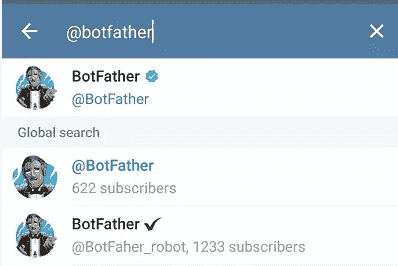

作者图片

单击旁边有蓝色勾号图标的第一个选项。图标代表`VerifiedBadge`，表示经过电报认可的机器人或信誉良好的公司或个人。您应该会看到以下用户界面:

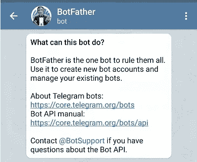

作者图片

## 与僵尸父亲互动

点击`Start`按钮，您应该会看到一个可以用来与`BotFather`交互的命令列表。

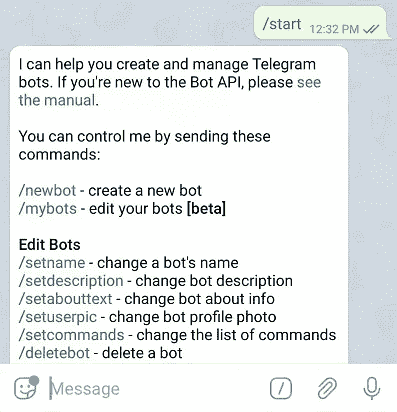

作者图片

向`BotFather`发送以下消息。

```
/newbot
```

您应该会看到以下提示，询问您的机器人的名称和用户名。

*   `name`:你的机器人的显示名称。
*   `username`:电报中所有机器人的唯一标识符。您不能使用系统中已经存在的名称。另外，它必须以 bot post-fix 结束。比如`TetrisBot`，或者`tetris_bot`。

为了简单起见，我通常对`name`和`username`使用相同的字符串。将为您生成一个新的令牌来访问 HTTP API。确保它的安全，以防止其他人使用它来控制你的机器人。

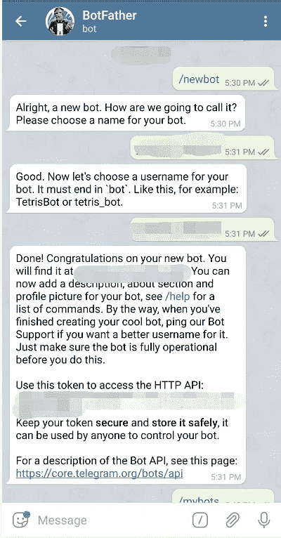

作者图片

## 群聊中的隐私

如果你打算在一个电报组中使用你的机器人，你需要了解隐私在电报中是如何工作的。默认情况下，机器人不会接收群聊中的所有消息。根据官方文件，它将只收到:

*   以斜杠`/`符号开始的命令消息(如`/help`)。
*   回复您的机器人发送的消息。
*   服务信息(从群组中添加或删除人员)。
*   来自 bot 所属频道的消息。

一般来说，Telegram 建议使用命令来与机器人交互。在同一个组中有多个机器人的情况下，您可以在每个命令后面添加用户名以防止混淆。请注意，您需要在您的服务器中自己处理和处理它:

```
/help@your_bot_username
```

在最新版本中，创建[内嵌机器人](https://core.telegram.org/bots/inline)时可以使用`@`符号——用户可以通过内嵌查询与你的机器人进行交互，而无需发送消息。然而，一个主要的缺点是您将失去提供任何动态输入的灵活性，就像这样:

```
@your_bot_username check_phone_status 012345678
```

## 配置 bot 以访问群聊中的所有消息

您可能更喜欢使用旧的约定，即机器人只有在标记了`@`符号时才会做出响应:

```
@your_bot_username hello there
```

如果是这样，您需要关闭群组隐私设置或将其设为管理员(不推荐)以允许其访问所有邮件。

为此，向`BotFather`发送以下信息:

```
/mybots
```

它会列出你所有的机器人。因为我只创建了一个机器人，所以只有一个选项可用。

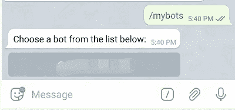

作者图片

点击想要的机器人，显示更多选项如下。点击`Bot Settings`继续。

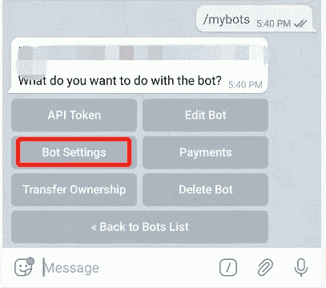

作者图片

您应该会看到一些与该组相关的选项。点击`Group Privacy`按钮。

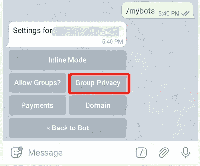

作者图片

点击`Turn off`按钮，禁用群组隐私设置。您的机器人现在可以访问群聊中发送的消息。如果您的 bot 已经在一个组中，新的更改可能不会被反映或传播。如果您遇到问题，只需将其从群中删除，然后重新添加到群中。

## 将机器人添加到群聊

有很多方法可以将机器人添加到群聊中。最简单的方法是直接从电报上做。搜索你的机器人，点击`Start`按钮开始与它对话。接下来，单击位于顶部栏的 bot 的名称。

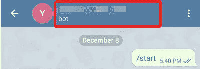

作者图片

您应该会看到下面的界面。点击界面右上角的三点继续。

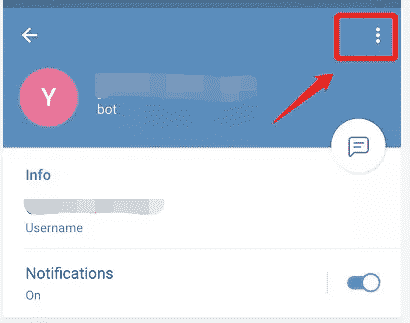

作者图片

将出现一个弹出窗口，包含以下选项。轻触`Add to group` 选项。

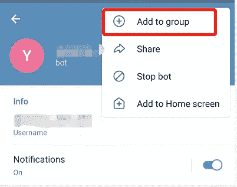

作者图片

选择所需的组并确认添加。回到群组并检查设置，以确保您的机器人可以访问群组消息。


作者图片

## 安装 Python 包

我们已经完成了电报设置，现在让我们安装本教程所需的 Python 包。在此之前，请确保您已经创建了一个虚拟环境。激活它，并在您的终端中运行以下命令。

```
pip install pyTelegramBotAPI
```

通过运行以下命令，您可以轻松验证是否已经安装了该软件包:

```
pip show pytelegrambotapi
```

以下文本将输出到控制台:

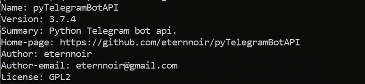

作者图片

完成安装后，进入下一节，开始编写 Python 代码。

# 2.履行

在工作目录中创建新的 Python 文件。为简单起见，我准备将其命名为`testbot.py`(相应修改名称)。

## 导入模块

在文件顶部添加以下导入语句:

```
import telebot
```

## 实例化新实例

通过传入我们之前创建的电报令牌来实例化一个新的`TeleBot`实例:

```
bot = telebot.TeleBot("YOUR_TOKEN_HERE")
```

## 格式化文本

默认情况下，`parse_mode`设置为`None`，因此文本将按原样发送。如果您喜欢基本的格式特性——比如粗体、斜体和下划线——您可以在创建`TeleBot`实例时指定。

*   `HTML`:基于 HTML 的格式。
*   `MarkdownV2`:基于降价的格式。

```
bot = telebot.TeleBot("YOUR_TOKEN_HERE", parse_mode="MarkdownV2")
```

请注意，您不能在邮件中同时使用这两种格式。在实例创建期间设置`parse_mode`会将格式传播给所有返回的响应。如果需要发送不同格式的消息，建议在创建实例时将其设置为`None`,并在发送单个消息时传递`parse_mode`参数。

在本教程中，我使用默认的`parse_mode` `None`。请随意尝试。

## 处理传入消息

让我们创建一个新的消息处理程序，它代表一组传入消息的过滤器。如果消息通过了过滤器，它将使用原始消息作为参数调用修饰函数。在撰写本文时，它附带了以下过滤器:

*   `commands`:如果`message.content_type`为`text`则返回`True`，而`message.text`:从预定义列表中出现的任何字符串开始。
*   `func`:基于`lambda`函数返回的结果。
*   `content_types`:如果`message.content_type`在预定义列表中，返回`True`。
*   `regexp`:如果`message.content_type`为`text`且`re.search(regexp_args)`为`True`则返回`True`。

这里有一个简单的消息处理程序来处理`/start`命令。当用户点击`Start`按钮后第一次与机器人交互时，会自动调用`/start`。命令是指以`/`符号开头的消息。

```
@bot.message_handler(commands=['start'])
def handle_command(message):
    bot.reply_to(message, "Hello, welcome to Telegram Bot!")
```

继续添加另一个消息处理程序，它使用代码下面的`func`过滤器。您可以定义自己的 lambda 函数，在该函数中，当消息被传递给标准时，该修饰函数将处理消息。我将把 return 设置为`True`,因为我想处理所有传入的消息。

然后，调用接受两个参数的`reply_to`函数:

*   一个代表消息的`Message`对象。它包含了相当多的[信息](https://core.telegram.org/bots/api#message)，如`message_id`、`date`、`text`等。您可以简单地传递输入消息变量。
*   一个字符串表示从 bot 返回的消息。

让我们将它设置为`message.text`,将相同的文本回显给用户。

```
@bot.message_handler(func=lambda message: True)
def handle_all_message(message):
    bot.reply_to(message, message.text)
```

请注意，消息处理程序是根据它们的声明顺序进行测试的。机器人将从第一个匹配的消息处理程序返回响应。确保将具有高优先级的消息处理程序(如命令)放在最前面。

## 投票

现在，让我们用下面的代码对我们的文件进行最后的润色:

```
bot.polling()
```

`polling`创建一个新线程，该线程调用一个内部函数来自动获取更新并将消息传递给消息处理程序。

这是一个阻塞函数，意味着它下面的代码不会被执行。确保将它放在文件的末尾。此外，不要多次调用它，否则会发生错误。如果你想扩展你的项目，用一个 webhook 代替。运行多个轮询服务器将不起作用！

`polling`函数接受以下参数:

*   `none_stop`:一个布尔值，确定发生错误时是否应该停止轮询。默认值为 False。
*   `interval`:整数表示轮询请求之间的间隔。默认情况下，它设置为 0。将其设置为高于 0 的任何其他值都会影响响应时间
*   `timeout`:长轮询超时，以秒为单位。默认值为 20。

您可以在下面的 G [ist](https://gist.github.com/wfng92/70ea1c307d67056fa1cf91335fe3fbb0) 中找到完整的代码:

# 运行您的服务器

确保终端现在指向 Python 文件所在的工作目录。确保您的机器已连接到互联网。运行以下命令启动轮询，根据需要修改名称:

```
python testbot.py
```

回到 Telegram，开始和你的机器人聊天。无论您何时私下发送消息，或者在您的机器人所属的群组中发送消息，您都应该会收到回复:

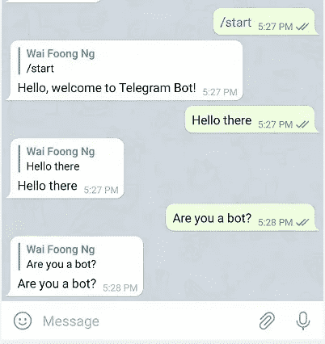

作者图片

# 区分私人信息和群组信息

通过检查`message.chat.type`变量，你可以很容易地区分私人信息和群组信息。可用选项如下:

*   私人的
*   组
*   超群
*   频道

让我们用以下控制流程修改`handle_all_message`功能:

```
@bot.message_handler(func=lambda message: True)
def handle_all_message(message):
    if message.chat.type == "private":
        bot.reply_to(message, message.text)
    elif message.chat.type == "group":
        bot.reply_to(message, "Hello to all!")
```

再次重新运行您的轮询服务，当向群组发送消息时，您应该会得到不同的响应。

# 仅在被标记时回复

现在，我们有了一个新问题:如果你将它设置为管理员或者禁用了隐私设置，我们的机器人将对聊天中的每一条消息做出响应。为了解决这个问题，设置另一个条件来限制回复，如果*且仅当*消息中的机器人被标记。用您设置的用户名替换`username_of_your_bot`:

```
@bot.message_handler(func=lambda message: True)
def handle_all_message(message):
    if message.chat.type == "private":
        bot.reply_to(message, message.text)
    elif message.chat.type == "group":
        if('@username_of_your_bot' in message.text):
            bot.reply_to(message, "Hello to all!")
```

# 处理其他内容类型

目前，我们的机器人只能回复短信。当用户发送文件或标签时，它将无法正常工作。您可以创建一个新的消息处理程序，并在列表中指定接受的`content_types`。以下代码说明了如何将相同的标签回显给用户:

```
@bot.message_handler(content_types=['sticker'])
def handle_sticker(message):
    bot.send_sticker(message.chat.id, message.sticker.file_id)
```

请注意，我使用的是`send_sticker`功能，而不是`reply_to`。这仅仅是因为`reply_to`只是一个方便的内部调用`send_message`的函数。查看[官方文档](https://github.com/eternnoir/pyTelegramBotAPI#telebot)中所有可用`content_types`及其相应功能的完整列表。

重新运行您的服务器，当您向您的机器人发送标签时，您应该会看到类似这样的内容:

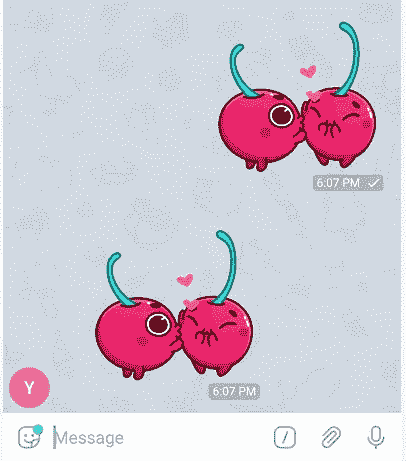

作者图片

# 结论

祝贺您完成本教程！让我们回顾一下今天所学的内容。

我们通过与`BotFather`互动，开始在 Telegram 中创建我们的机器人。我们还创建了一个新的虚拟环境，并在其中安装了`pyTelegramBotAPI`包。

在那之后，我们继续实例化一个新的`TeleBot`实例，这个实例基于我们早期从 bot 创建中获得的令牌。我们实现了一些消息处理程序来处理命令和所有传入的消息。

除此之外，我们还学会了区分私人信息和群组信息。我们可以通过在消息处理程序中指定 accepted `content_types`来轻松处理标签。

现在，你应该能够在你的机器上本地创建你自己的电报机器人，只要它连接到互联网。

感谢你阅读这篇文章——我希望在下一篇文章中再次见到你！

# 参考

*   [Github—pyTelegramBotAPI](https://github.com/eternnoir/pyTelegramBotAPI)
*   [电报机器人 API](https://core.telegram.org/bots/api)
*   [StackOverflow —如何将机器人添加到电报组](https://stackoverflow.com/questions/37338101/how-to-add-a-bot-to-a-telegram-group)
*   [StackOverflow —允许 bot 访问电报组消息](https://stackoverflow.com/questions/50204633/allow-bot-to-access-telegram-group-messages)