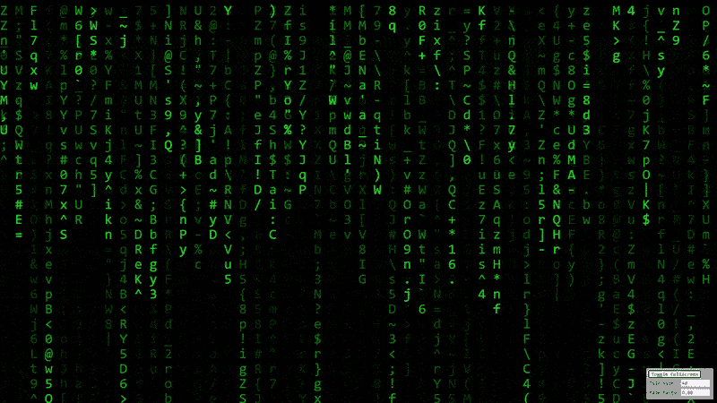

# 如何用 JavaScript 创建矩阵文本效果

> 原文：<https://betterprogramming.pub/how-to-create-the-matrix-text-effect-with-javascript-325c6bb7d96e>

## 绿色雨滴文字效果很容易用 JavaScript 和 HTML 画布实现，看起来仍然很棒



JavaScript 中的矩阵文本效果。图片作者。

矩阵文本效果是 2000 年代早期最显著的效果之一。受《黑客帝国复活》(我还没去看)上映的启发，我重新看了旧的三部曲，这让我想自己实现这个效果。事实证明，它非常容易实现，当你全屏看到它时，你(和其他碰巧路过的人)会认为你是有史以来最伟大的黑客。那么我们来看看如何用 JavaScript 创建矩阵文本效果。

# 履行

像互联网上的大多数动画内容一样，我们从 HTML canvas 元素开始。

```
<canvas id=”canvas” width=”1280" height=”720" style=”display:block; margin:0 auto;”></canvas>
```

在 JavaScript 端的`init()`函数中，我们首先保存对 canvas 元素及其 2D 上下文的引用。然后我们可以初始化矩阵效果，开始主循环。

为了初始化矩阵效果，我们必须首先定义一些全局变量，比如 tile size，它定义了网格单元和文本的大小。然后，我们将画布的总高度除以平铺尺寸，以计算每列平铺的最大数量。

我们还将画布的宽度分成几列，这样我们就可以跟踪每一列的文本。对于每一列，我们存储它的 x 位置，然后根据最大堆栈高度创建一个随机高度。最后，每一列都需要一个计数器变量，以便在效果的每一帧中进行计数。

主循环非常简单，我们只调用 draw 函数，等待 50 毫秒，然后重复。等待 50 毫秒会产生每秒 20 帧的效果，这对于这种类型的效果来说已经足够了，但是您可以随意试验时间来创建更慢或更快的下雨文本。

draw 函数稍微复杂一点，但也不过分复杂。我们首先在整个画布上绘制一个半透明的黑色矩形。这慢慢地模糊了我们在之前的帧中画的字符，并给下雨的文本一个褪色的痕迹。

然后我们遍历所有的列，选择一个随机的字符，它被画在每一列的底部。最后，我们增加堆栈计数器变量(跟踪每个堆栈的底部)，如果它大于该堆栈的最大高度，我们将计数器重置为 0，并为该列创建一个新的随机堆栈高度。

# 活生生的例子

因为这个效果比我想象的要容易创建，所以我花了更多的时间添加了平铺尺寸和淡入度的选项，所以你可以尝试不同的值，看看它们看起来怎么样。我还添加了一个按钮，让效果全屏，所以当你离开你的电脑，你可以让矩阵效果全屏，当有人走过，他们会认为你是有史以来最伟大的黑客。

[实例](https://pingpoli.de/matrix.html)


JavaScript 中的矩阵文本效果。图片作者。

# 完全码

以下是 JavaScript 中矩阵效果的完整源代码:

[这里也是带有额外选项和全屏的实时示例的完整代码。](https://gist.github.com/pingpoli/499f3aac8737039a40527263833a2453)

矩阵文本效果是 21 世纪初最具标志性的效果之一，它与黑客和广泛的计算机知识相关联。

```
Fun factI sent the link to my sister and she replied “Did you give me a computer virus with this?” (mostly joking though, she has decent computer knowledge). However, many people believe that the Matrix effect indicates hacking and is very complicated, but as you can see it’s actually very easy to create with modern JavaScript.
```