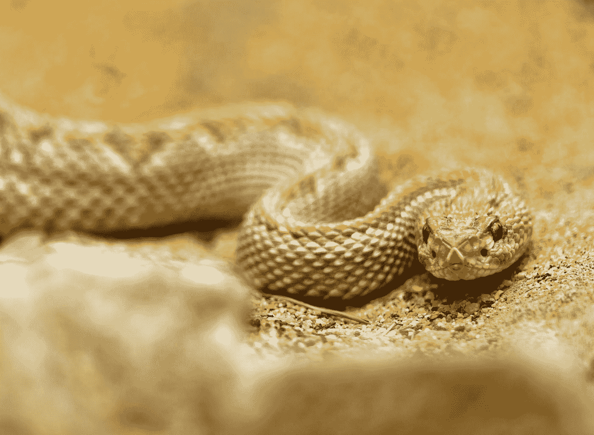
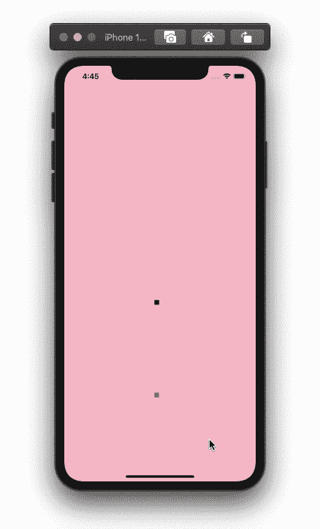

# 如何在 SwiftUI 中创建贪吃蛇游戏

> 原文：<https://betterprogramming.pub/how-to-create-the-snake-game-in-swiftui-14a7e8162bf3>

## 在 SwiftUI 中创建没有网格的经典贪吃蛇游戏

由[zdenk Macháek](https://unsplash.com/@zmachacek?utm_source=medium&utm_medium=referral)在 [Unsplash](https://unsplash.com?utm_source=medium&utm_medium=referral) 上拍摄。

# 枚举和变量

我们将检测滑动方向，让蛇不断地向那个方向移动，直到方向改变。让我们首先为方向创建一个枚举:

我们会有一个计时器来控制蛇的速度。为了让蛇更慢或更快，我们可以改变计时器的间隔。使用蛇的大小来代替网格。这将帮助我们控制蛇的位置和它的食物。我们在游戏中需要以下变量:

# 蛇形视图元素

在我们的身体里面，加一个`ZStack`。在里面，你可以为你的背景添加颜色。我们将需要另一个`ZStack`用于我们的蛇矩形和食物矩形。为了创建蛇的身体，我们将迭代保存蛇身体位置的数组。给这两个矩形我们的`snakeSize`变量的宽度和高度。我们的视图中的最后一个元素是一个文本视图，当我们的`gameOver`变量被打开时出现:

# 功能

创建一个确定矩形位置的函数。要将蛇和食物放置在一个不可见的网格中，我们需要利用蛇的大小来确定我们的视图中可以有多少行和多少列:

在我们的`ZStacks`中，我们可以添加`.onAppear`来使用上面创建的函数设置蛇和食物的位置:

创建一个函数来检查蛇是在屏幕边框的内部还是外部，检查用户滑动的方向，然后将蛇向那个方向移动:

我们可以使用下面的代码来确定用户向哪个方向滑动，该代码使用`DragGesture`来获取滑动的开始和结束位置，然后计算 x 坐标和 y 坐标之间的差异来确定滑动方向。在我们的第一个`ZStack`中添加以下函数:

我们需要添加到我们的`ZStack`中来结束游戏的是一个`.onReceieve`函数，它使用我们的定时器并更新蛇和食物的位置。当蛇在食物上面时，在我们的蛇身体位置数组中添加一个新位置，使蛇变长:

全部完成！感谢阅读。