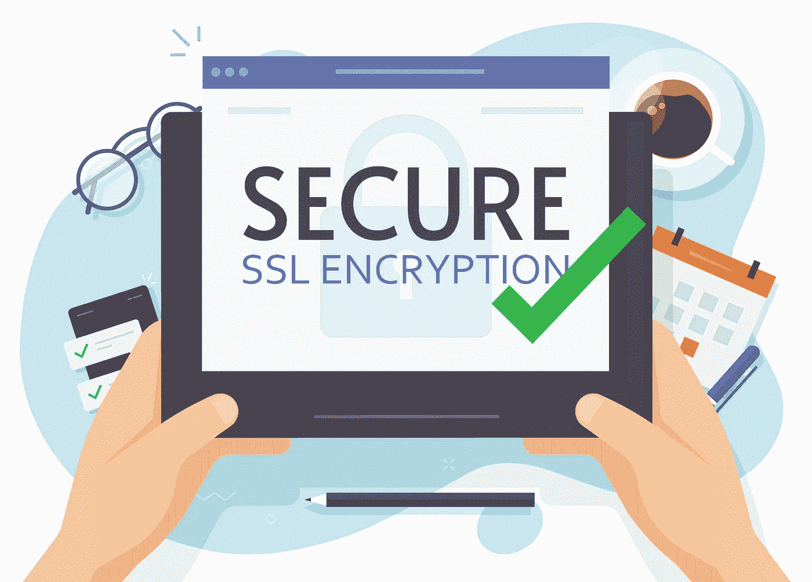
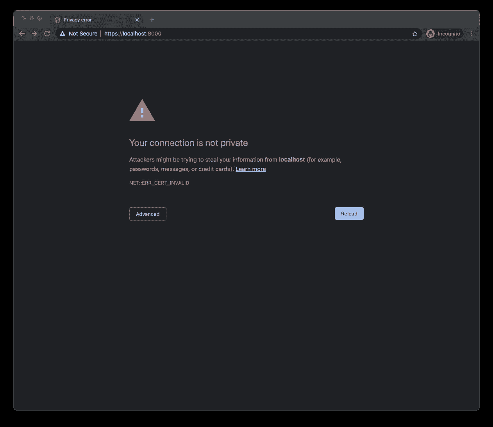
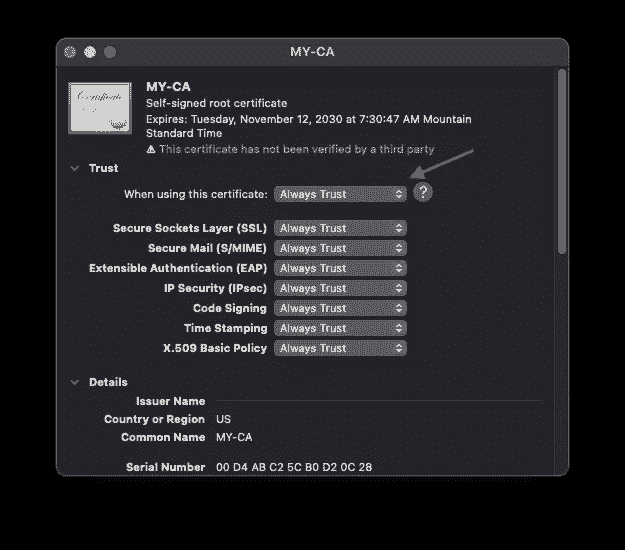
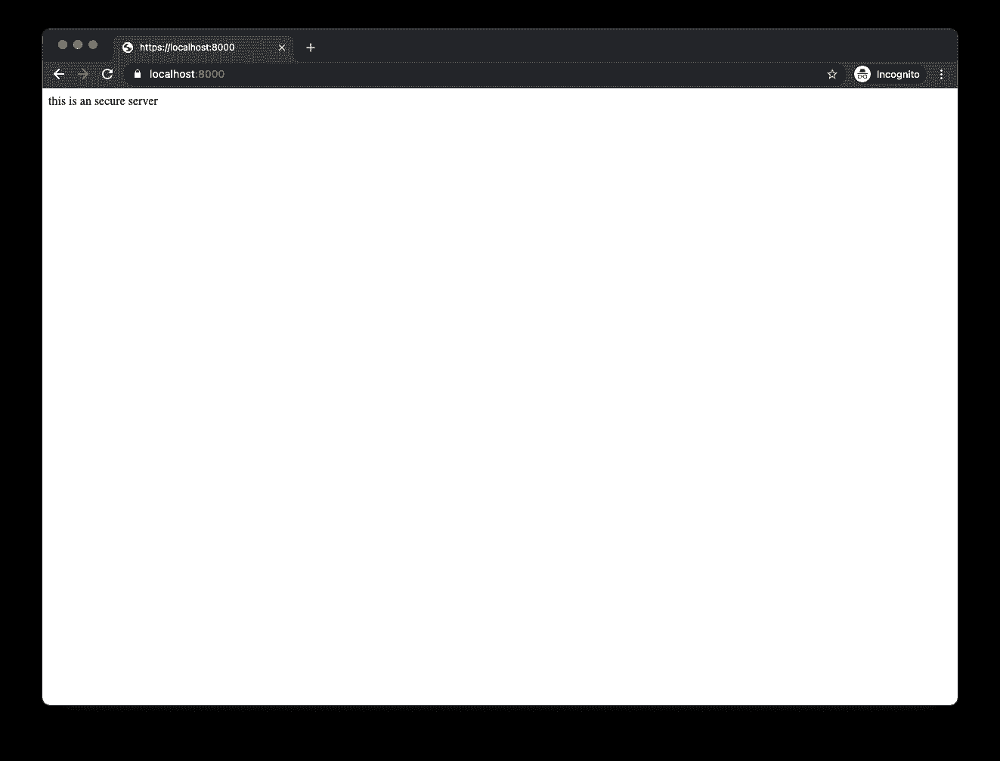

# 如何为您的本地开发创建可信 SSL 证书

> 原文：<https://betterprogramming.pub/how-to-create-trusted-ssl-certificates-for-your-local-development-13fd5aad29c6>

## 生成可信的自签名 SSL 证书，以便在本地开发中启用 HTTPS

照片由 [Freepik](https://www.freepik.com/) 设计。

你有没有发现自己需要在本地主机或其他本地域(如 local.my-app.com)上运行的应用程序中添加 HTTPS？

Web 浏览器在运行 HTTP 和 HTTPS 页面时有细微的差别。例如，在 HTTPS 页面上，任何试图从 HTTP URL 加载 JavaScript 的行为都会被阻止。这意味着，如果您使用 HTTP 进行本地开发，您可能会添加一个在您的开发机器上运行良好的脚本标记，但当您将应用程序部署到将在 HTTPS 下运行的试运行或生产时，它会中断。叹息…

别担心，我的朋友。为了避免这种问题，在您的本地环境中设置 HTTPS 非常有用，这样可以更好地镜像您的生产服务器。然而，让它工作起来可能会很麻烦。我们都不想一直看到证书警告。也就是说，如何在本地获得安全锁？

这个问题的答案是生成您自己的证书，可以是自签名的，也可以是由本地根用户签名的，并在您的操作系统的信任存储中信任它。从那里开始，在您的本地 web 服务器上使用该证书。

在本文中，我们将介绍生成本地根证书(也称为证书颁发机构)的过程。这允许您生成任意多的域名证书，但只信任一个证书——根证书。

值得注意的一个重要事实是，自 2020 年 9 月 1 日起，SSL 证书的颁发时间不能超过 13 个月(397 天)。因此，对于本文中生成的证书，我们坚持使用 12 个月。

# 生成证书

## 认证机构(CA)

1.  生成私钥和自签名证书:

*可选:您可以在* `*CN*` *中将* `*MY-CA*` *替换为您选择的其他内容。*

如果您想检查您的证书信息，您可以通过运行以下命令来输出其内容:

2.创建一个`.crt`证书文件:

## 域名证书

在大多数情况下，在证书中单独注册 localhost 就足够了。但是，如果您喜欢为本地应用程序使用自定义域名，您可以为将要创建的证书添加一个或多个备用名称。

1.  生成 x509 v3 扩展文件:

你可以按照上面的模式添加任意多的域名。

*注意:如果您没有设置任何本地域名，请更新* `*DNS.4*` *、* `*DNS.5*` *和* `*DNS.6*` *或删除它们。*

2.生成私钥和证书签名请求(CSR):

*可选:国家、州、城市和组织可自定义。*

3.生成自签名证书:

# 使用证书

您必须在为您的内容提供服务的应用程序上提供证书和私钥文件。这可能是一个本地 web 服务器，如 Apache 或 NGINX，一个本地服务，或一些其他本地工具，如 [webpack DevServer](https://webpack.js.org/configuration/dev-server/) 。

这里有几个例子:

## **阿帕奇**

## **NGINX**

## **webpack DevServer**

## **Express.js**

从您将为您的应用提供服务的任何实体配置为使用您的证书的那一刻起，您的应用将可以通过 HTTPS URL 进行访问。

按照上面的快速示例，您可以在 [https://localhost:8000](https://localhost:8000/) 上打开浏览器选项卡，查看您的内容:

等一下！我的“这是一个安全的服务器”消息在哪里？

这不是您在加载页面时希望看到的，但这是意料之中的，因为 CA 还不可信。

# 信任 CA

要获得安全锁，您的机器中必须信任新的本地 CA。这个过程因操作系统而异，对于大多数浏览器来说已经足够了。如果你使用的是 Firefox，这个过程会有所不同。

## macOS — Chrome 和 Safari

1.  双击根证书(`ca.crt`)。
2.  选择您想要的钥匙串(`login`如果您想要仅在您的帐户下信任它，或者`System`如果证书应该在整个系统范围内信任它)。
3.  添加证书。
4.  打开“钥匙串访问”(如果它尚未打开)。
5.  选择您之前选取的钥匙串。
6.  您应该看到证书`MY-CA` (它将是您作为 CN 提供给 CA 的名称)。
7.  双击证书。
8.  展开“信任”和 *s* 选择“使用此证书时”中的选项“始终信任”

9.关闭证书窗口并键入您的用户密码(如果需要)。

## Windows 10 — Chrome、IE11 和 Edge

1.  双击证书(`ca.crt`)。
2.  单击“安装证书”按钮。
3.  选择是在用户级别还是在计算机级别存储它。
4.  点击“下一步”
5.  选择“将所有证书放入以下存储”
6.  点击“浏览”
7.  选择“受信任的根证书颁发机构”
8.  单击“确定”
9.  点击“下一步”
10.  点击“完成”
11.  如果出现提示，请单击“是”

## 火狐浏览器

即使在信任存储中信任了您的 CA 证书，Firefox 仍然会给出警告。它可能会发生在 Windows 10 上，也可能不会发生，但它肯定会发生在 macOS 上。从这里开始非常简单。Firefox 将显示如下屏幕:

要进一步允许您的证书，请单击“高级…”之后，单击“接受风险并继续以确认”您知道风险。

这将只需执行一次，但它是每个本地域一次。

# 结论

生成并信任您的证书后，您应该可以顺利地访问您的本地域了！您的应用现在可以得到安全的服务，您的开发流程可以继续。回到前面的快速示例，这将是您的结果:

该网站已完全加载，Chrome 现在在 URL 旁边显示锁状符号。

我希望这篇文章有助于解决你的一个 HTTPS 障碍。如果你还想让我进一步帮助你，请在下面留言。此外，让我知道任何类似的问题，我可以帮助解决。编码快乐！