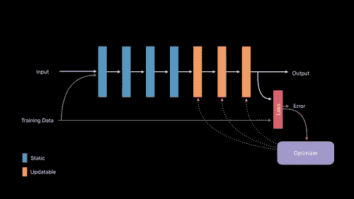
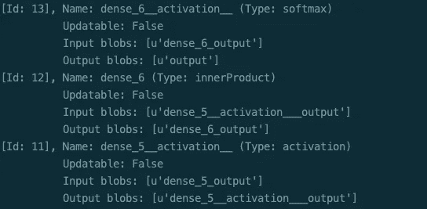
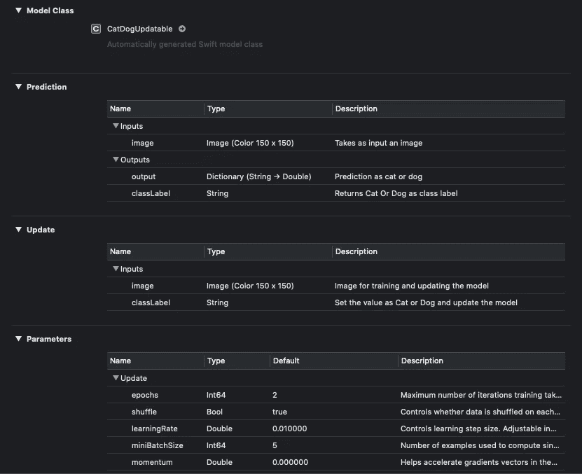

# 如何使用核心 ML 3 创建可更新的模型

> 原文：<https://betterprogramming.pub/how-to-create-updatable-models-using-core-ml-3-cc7decd517d5>

## 在 iOS 设备上重新训练模型。



来自 [WWDC 2019 视频](https://developer.apple.com/videos/play/wwdc2019/704/)

随着 2019 年 WWDC 期间 Core ML 3 的更新，Core ML 今年得到了很大的推动。在众多改进中，设备上学习最为突出。

本文的目标是向您展示创建您自己的核心 ML 3 模型的过程，这些模型可以在您的 iPhone 或 iPad 上更新。

虽然在设备上进行模型训练很有意思，但鉴于模型在 iOS 设备上进行训练需要很长时间，这是不可行的。最好的情况是，建议在设备上重新训练一个模型，特别是针对用户。

在我们开始实施之前，让我们欣赏一下 Core ML 3 为我们准备的其他更新。

# Core ML 3 的新特性

*   **70 个新的神经网络层** —新层允许将更复杂的神经网络模型转换为核心 ML，而无需编写定制层
*   **各种新模型**——像`KNN`分类器、`ItemSimilarityRecommender`、`SoundAnalysisPreprocessing`、`WordEmbedding`和`Linked Models`这样的模型只会帮助我们解决更多的机器学习问题。
*   **核心 ML API 有更多的抽象**——你不再需要为 CNN 模型转换图像为`CVPixelBuffer`。这是自动完成的。
*   **ML 模型配置** —我们现在可以根据需要配置 ML 模型。通过分配各自的`MLComputeUnits`属性，测试将模型设置为在 CPU、GPU 和/或神经引擎上运行。
*   **设备上学习** —现在您可以在设备上轻松训练/再训练您的模型。不需要从你的机器上重新编译它。

链接模型允许跨模型重用。因此，如果两个模型使用另一个模型，那么这个模型现在只需要加载一次。

# **现在让我们深入研究代码**

我们将使用分类交叉熵损失函数创建一个 Keras 与图像分类器 CNN 模型。

如果您想直接跳到 ML 的核心部分，请跳过下一节。

# 创建 Keras 图像分类器模型

该模型是用分类交叉熵损失函数编译的，因为目前它是核心 ML 3 中唯一可更新的 CNN 损失层。

我们将上述模型运行了五个时期，得到了大约 73%的准确率，这相当不错。

现在我们已经得到了 Keras 模型，剩下的就是将它转换成可更新的核心 ML 模型。

# 创建可更新的核心 ML 模型

为了创建一个可更新的模型，我们需要在模型和一些神经网络层上设置`isUpdatable`标志。

除此之外，我们需要定义训练输入、损失函数、优化器和其他参数，如核心 ML 模型上的时期和批量大小。

我们需要把`coremltools`更新到 3.0。在撰写本文时，beta 6 版本是最新的。只需使用 pip 命令来安装它:

```
pip install coremltools==3.0b6
```

## 将 Keras 转换为核心 ML 模型

## 检查神经网络层

首先，将现有核心 ML 模型中的规范加载到一个`NeuralNetworkBuilder`中。

通过检查这些层，我们可以确定需要更新的`dense_layers`。

除此之外，我们还需要为设备上培训的培训输入设置输入参数。

## 指定可更新图层、损失函数和优化器

现在，我们需要将最后两个密集层设置为可更新的，并设置损失函数输入。损失函数输入是来自`softmax`激活层的输出值(在我们的例子中是`‘output’`):



`make_updatable`方法用于使层可更新。

它需要一个图层名称列表。在我们的例子中，层是`dense_5`和`dense_6`，可从神经网络构建器属性中获得。

## 指定培训输入描述

现在我们只需要设置训练输入描述，并将我们的规范保存在一个新模型中，如下所示:

属性很重要，因为它确保了为`mlmodel`使用正确的版本号。

Core ML 3 是版本 4，所以上面的可更新模型只在版本 4 和更高版本上工作。

## 生成可更新的模型

现在我们已经指定了所有的模型规范，我们可以使用下面的代码行生成我们的模型，它可以在设备上更新:

```
coremltools.utils.save_spec(model_spec, “CatDogUpdatable.mlmodel”)
```

我们可更新的核心 ML 模型现在已经可以使用了。

让我们将它导入 Xcode 项目。您将看到与下图类似的模型描述:



从上图中可以清楚地看到，在核心 ML 3 中增加了两个新的部分，Update 和 Properties。更新部分由用于训练输入的输入描述组成。

我们上面的分类器模型有两个输出:预测类的标签和对所有(两个)类都有置信度的字典。

# 还有更多

在下一部分中，我们将在 iOS 应用程序中部署我们刚刚构建的可更新模型。

[](https://medium.com/better-programming/how-to-train-a-core-ml-model-on-your-device-cccd0bee19d) [## 如何在您的设备上训练核心 ML 模型

### “如何使用 Core ML 3 创建可更新的模型”的续篇

medium.com](https://medium.com/better-programming/how-to-train-a-core-ml-model-on-your-device-cccd0bee19d) 

这一次到此为止。我希望你喜欢阅读。