# 如何创建你的第一个 Firebase 云函数

> 原文：<https://betterprogramming.pub/how-to-create-your-first-firebase-cloud-function-8e7e3dd10abc>

## 了解如何轻松编写、测试和部署


YouTube 上 [Firebase 的照片。](https://www.youtube.com/watch?v=vr0Gfvp5v1A)

[云功能](https://firebase.google.com/docs/functions)是 Firebase 提供的强大功能，能够管理密集的后端进程和处理事件响应。减少前端应用程序中执行的重要逻辑非常有用。

在某些情况下，当用户登录应用程序时，我们可能需要发送欢迎电子邮件或验证码。另一个例子是，当用户从应用程序上传照片时，我们有时希望在照片被存储之前对其进行捕捉和修改。这些逻辑需要后台通过云功能来处理。此外，通过隐藏后端进程和 API 调用，我们的应用程序将更加安全，不会受到逆向工程的威胁。

# **使用云函数的优势**

1.  轻松集成各种 Firebase 服务，包括身份验证、实时数据库、存储、云消息等。
2.  保护服务器应用程序逻辑免受客户端渗透。
3.  零维护— Firebase 将根据请求和使用情况自动管理服务器规模。我们需要做的就是用 JavaScript 或者 TypeScript 写一个云函数，部署它。
4.  在部署到 Firebase 服务器之前，能够在本地开发中使用模拟器。

# 我们能做什么？

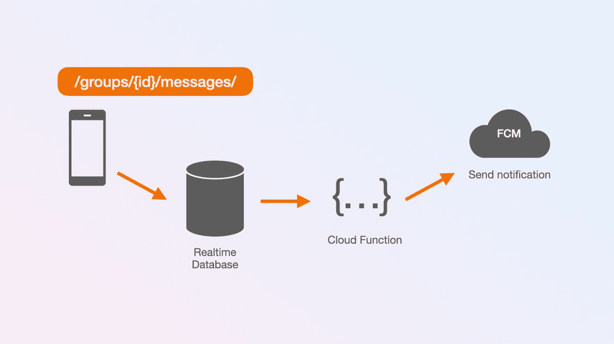

写入数据库时触发云功能。

1.  有一个监听器来管理每个访问我们数据库的事件。例如，当用户从应用程序向群聊发送消息时，我们将其存储在`/messages`节点中。但是，在保存过程中，我们可以在自定义函数中捕获事件，并向该组中的每个用户发送通知。我们还可以在将消息发送给其他用户之前对其进行过滤和净化。
2.  对数据库执行昂贵的任务或复杂的查询。当数据库中有数千甚至数百万条记录时，这非常有用。
3.  与第三方 API 或 SDK 集成，如 GitHub API、Slack、邮件服务等。
4.  使用云功能安排定期执行的任务，如每日备份和数据清理。

厉害！

现在我们已经理解了云函数背后的主要思想，让我们开始写我们的第一个。

# 我们将建造什么？

我假设您已经熟悉 Firebase [实时数据库](https://firebase.google.com/docs/database)或者至少以前学过，并且理解这个概念，包括如何存储和读取数据库。

在本教程中，我们将创建如下所述的两个函数:

1.  `addStudent()` —该功能允许我们将新的学生数据发送到服务器，并保存在实时数据库中。这个过程基本上可以在客户端完成，但我们将创建它来插入数据，以便可以通过 HTTP 请求从您的任何应用程序调用它，而无需关注使用哪种语言或框架。
2.  `getTopStudent(limit:)` —从学生列表中获取最高分的功能(您可以根据自己的需要定制)。请记住，在 Firebase 数据库中，这样的任务应该在云功能中完成，因为常见的客户端 SDK 没有良好的查询方法来执行广泛的搜索和排序——尤其是在处理大量数据和多个搜索参数时。

# 项目设置

## 1.创建 Firebase 项目和实时数据库

在开始编写函数之前，我们需要在 Firebase 控制台中创建一个新项目。我们将把它命名为“学生记录”

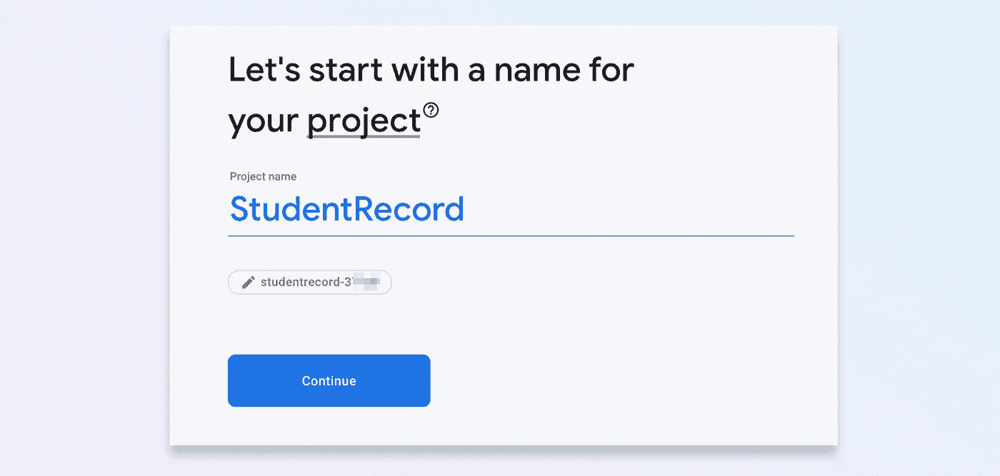

请遵循文件中[所述的完整步骤。](https://firebase.google.com/docs/functions/get-started#create-a-firebase-project)

一旦项目被创建，从左侧菜单进入“实时数据库”并点击“创建数据库”按钮，如下所示。如有必要，您可以选择使用 Firestore。

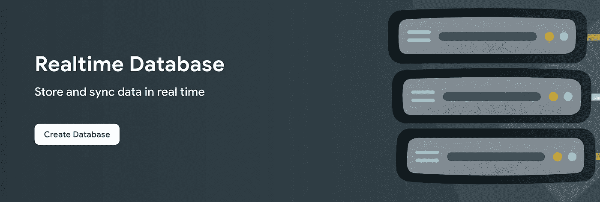

然后，您将被重定向到下面的屏幕。根据您的位置填写相应的字段。请注意，我们将使用“测试模式”规则进行初始设置。

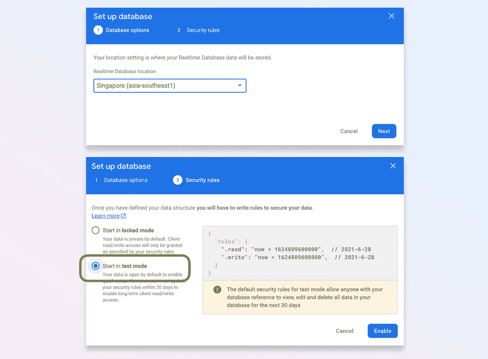

## 2.安装 Firebase CLI 工具

确保您已经安装了节点和 NPM。否则，从其[网站](https://nodejs.org/en/)下载并安装 Node.js(取决于您的操作系统)。安装后，通过检查版本来验证 Node.js 和 NPM 的安装:

```
**$** node -v
v10.15.3**$** npm -v
6.14.5
```

然后，使用以下命令安装 Firebase 工具:

```
npm install -g firebase-tools
```

## 3.初始化项目

在本节中，我们将创建一个项目，并通过命令行使用 Firebase 服务器对其进行身份验证。

首先，创建一个目录(我们将在这里创建项目)。然后，打开终端，转到该目录，并遵循以下步骤。

*   在终端运行`firebase login`命令进行认证，你将被重定向到浏览器进行登录。
*   运行`firebase init functions`，项目设置的终端会出现几个对话框。

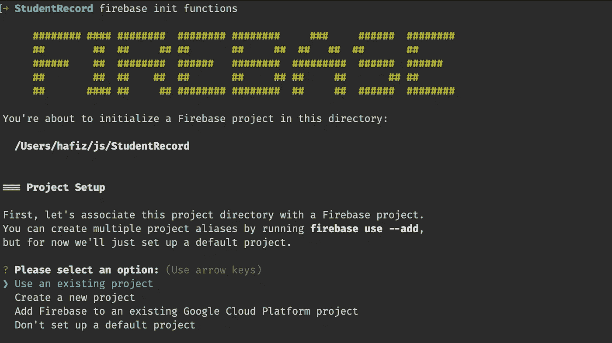

由于我们之前已经创建了项目，我们将选择“使用现有项目”选项。

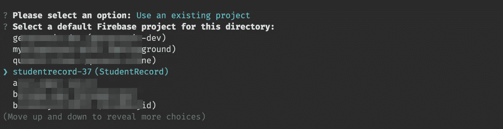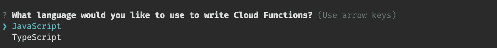

选择“JavaScript”作为开发语言。

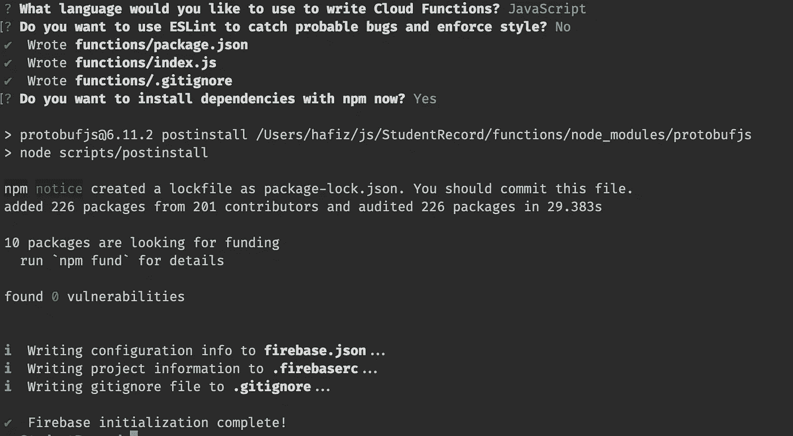

继续按“Enter”选择默认选项，直到它完全初始化。

太好了。我们已经完成了设置。这并不难，因为我们大多数人已经习惯了 Node.js 环境，而且向导非常简单。现在，尝试检查我们刚才创建的项目文件夹。它应该有如下所示的类似结构，有几个`.json`文件和一个默认的`index.js`。

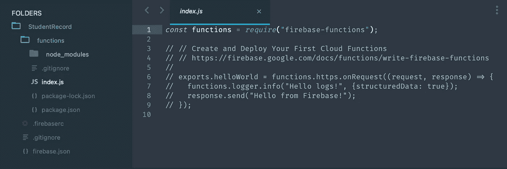

具有默认 index.js 文件的项目结构

## 4.仿真器

云函数中最好的特性之一是模拟器。我们可以构建功能，并在本地开发中快速测试它。酷！

为了测试模拟器，让我们启用“Hello World”示例代码。在您最喜欢的编辑器中打开`index.js`文件，取消对`exports.helloWorld`闭包的注释，然后保存。

函数/index.js

然后，在终端运行`firebase emulators:start`。如果成功，您将获得类似于下图所示的输出。在黄色框中，模拟器将在一个给定的 URL 上为新的`helloWorld`函数创建一个端点(项目 id `studentrecord-xxx`对于其他项目可能不同)。在我的例子中，URL 是`http://localhost:5001/studentrecord-xxx/us-central1/helloWorld`。

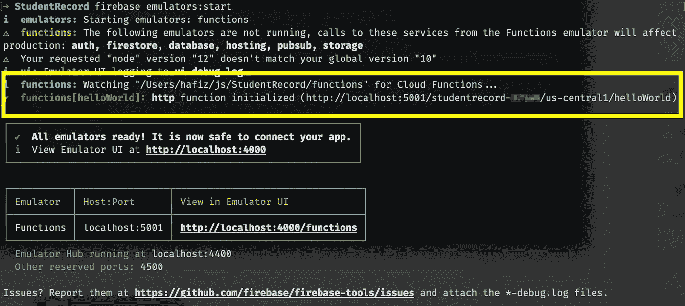

模拟器—显示添加的新端点

复制网址粘贴到浏览器、[邮差 App](https://www.postman.com/) 或[失眠](https://insomnia.rest/)查看结果。您还可以在终端中看到日志(模拟器输出)。

```
**i  functions:** Beginning execution of "helloWorld"
>  {"structuredData":true,"severity":"INFO","message":"Hello logs!"}
**i  functions:** Finished "helloWorld" in ~1s
```

哇，这真是太棒了！每次我们发送一个请求或者发生任何错误，它都会自动刷新并显示在模拟器的输出中。

您可以通过按 Ctrl + C 来终止模拟器进程。

## 可以从应用程序调用吗？

如[文档](https://firebase.google.com/docs/functions/callable)中所述，除了使用 HTTP 请求之外，根据平台和语言的不同，创建的函数也可以直接从应用程序中调用。然而，在本文中，我们只关注 HTTP 请求。

# 编码时间！

让我们继续写我们的第一个云函数。

## 函数 1: addStudent()

打开`functions/index.js`文件，添加这段代码。在这段代码中，我们添加了一个名为`addStudent()`的新函数，该函数将向 Firebase 数据库发送一个具有唯一 id 的学生对象(详细解释在注释中)。查看参考文献中的[以在实时数据库中保存数据。](https://firebase.google.com/docs/database/admin/save-data#section-set)

您可能会在模拟器日志中注意到，它会自动添加一个新的端点。同样，URL 端点在您这边会有所不同，所以在发送请求时用您的端点替换它。

```
**✔  functions[addStudent]:** **http** function initialized (http://localhost:5001/studentrecord-xxx/us-central1/addStudent)
```

现在，打开 Postman App 或者失眠，用 raw JSON 格式的`name`、`email`、`score`填充“URL”和“Body”部分。我们不能从普通浏览器发出请求，因为这个函数需要一个`POST`方法和主体中的数据。

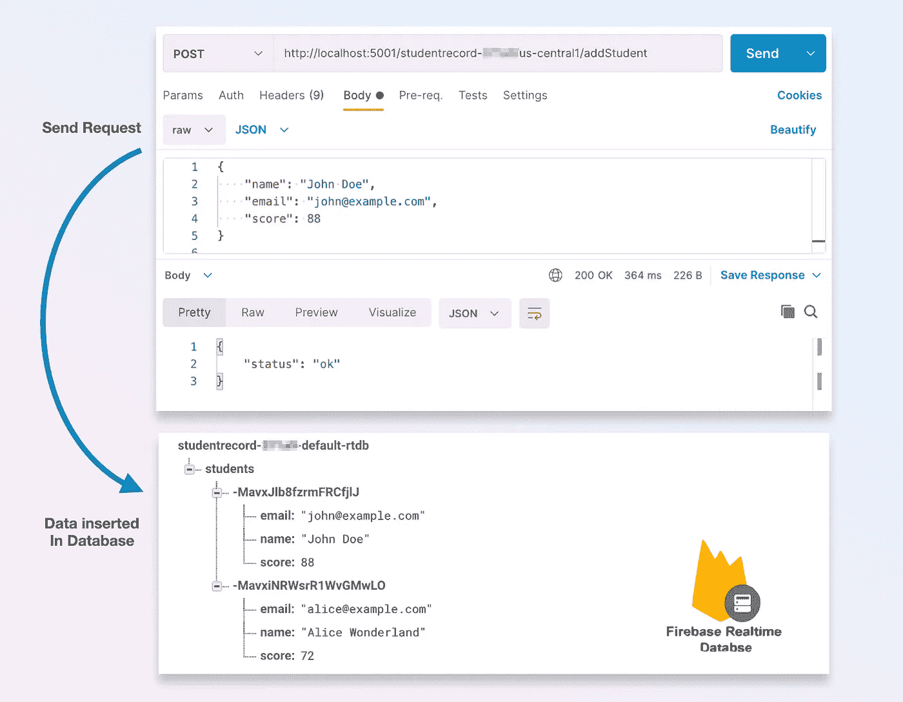

如上图所示，如果请求成功，`students`节点将被新对象填充。尝试添加更多的数据，看看有什么变化。此外，稍后测试我们的下一个函数也很有用。请注意，出于演示目的，我没有添加验证或额外的数据检查。您可以根据需要添加验证或功能。

很好，我们完成了第一个函数。让我们进行下一个。

## 函数 2: getTopStudent(限制:)

我们将继续使用`index.js`并将这段代码(新功能)附加在底部。这个函数将使用一个`GET`方法，并对返回的结果有一个限制。

您的模拟器日志应该打印新的函数 URL。使用后粘贴到浏览器或邮递员中，查询参数`limit`大于`0`。

```
**✔  functions[**getTopStudents**]:** **http** function initialized (http://localhost:5001/studentrecord-xxx/us-central1/getTopStudents).
```

查看下面的请求和结果，并尝试更改`limit`参数以查看不同大小的数组。

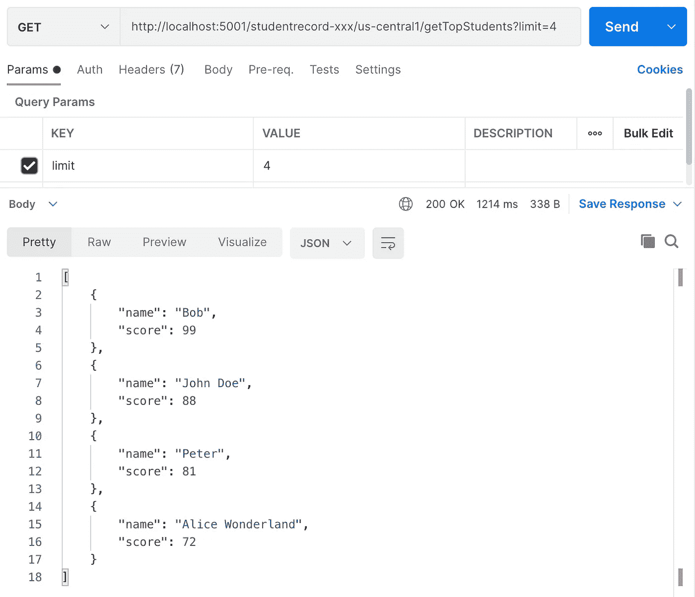

getTopStudents 终结点上的请求，结果为。

# 部署

在模拟器中测试了我们的功能之后，我们就可以部署到生产服务器上了。部署有两个主要命令。

## 1.部署文件中的所有函数

```
$ firebase deploy --only functions
```

一旦成功部署了函数，服务器将使用新的端点进行响应(非常类似于模拟器的输出)。

```
**Function** **URL (****addStudent****)**: https://us-central1-MY_PROJECT.cloudfunctions.net/addStudent**Function** **URL (****getTopStudents****)**: https://us-central1-MY_PROJECT.cloudfunctions.net/getTopStudents
```

## 2.仅部署指定的功能

这有助于避免覆盖函数。

```
$ firebase deploy --only functions:getTopStudent
```

请注意，为了能够部署到服务器中，我们需要订阅 *Blaze* 计划，如 Firebase [文档](https://firebase.google.com/docs/functions/get-started#deploy-functions-to-a-production-environment)中所述:

> “请记住，要部署到推荐的 Node.js 14 运行时环境，您的项目必须在 [Blaze 定价计划](https://firebase.google.com/pricing)中。参见[云功能定价](https://firebase.google.com/support/faq#functions-pricing)。”

干得好！我们已经学习了基本的云功能设置和实现。`index.js`的完整源代码可以在我的[摘要](https://gist.github.com/xmhafiz/058c3ccd9f021359c53cce7aff9de1a7)中下载。

# 下一步是什么？

您可以探索更多可以添加到您的函数中的功能，比如监听器(触发器)、认证和中间件。此外，云功能也可以使用 [Express.js](https://firebase.google.com/docs/functions/http-events#using_existing_express_apps) 框架用高级模块构建。Firebase GitHub [资源库](https://github.com/firebase/functions-samples)中还提供了一组包含各种模块的示例代码。

希望本文能帮助您提高开发技能。感谢阅读。非常欢迎反馈。编码快乐！

# 参考

*   [https://firebase.google.com/docs/functions](https://firebase.google.com/docs/functions)
*   [https://firebase.google.com/docs/database](https://firebase.google.com/docs/database)
*   [https://firebase . Google . com/docs/functions/schedule-functions](https://firebase.google.com/docs/functions/schedule-functions)
*   [https://github.com/firebase/functions-samples](https://github.com/firebase/functions-samples)