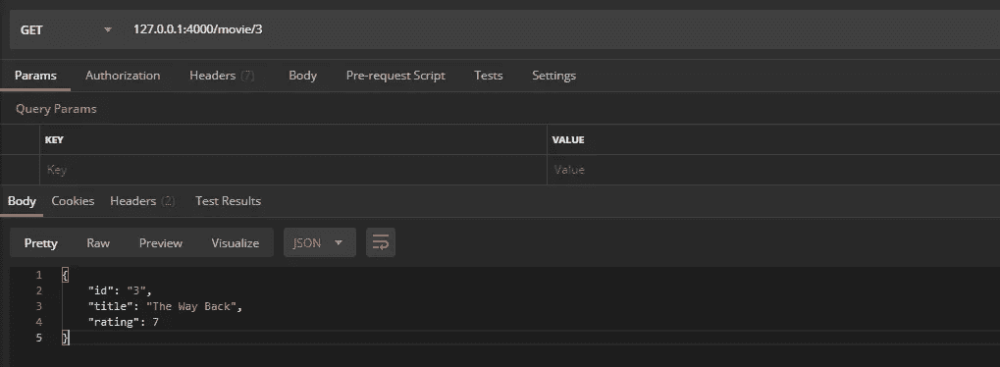
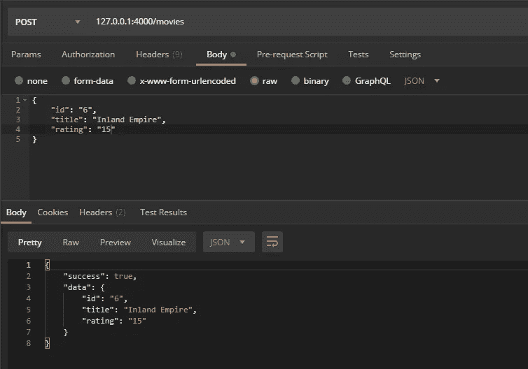
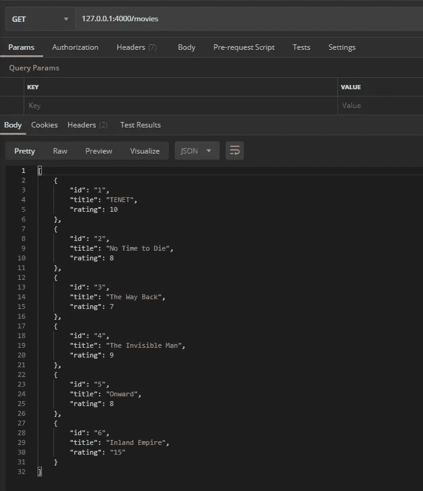
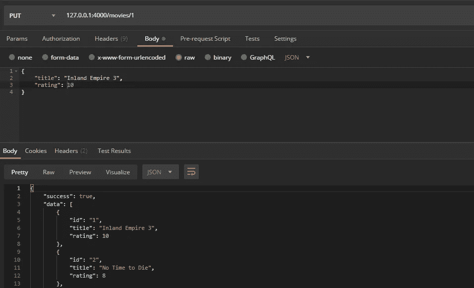
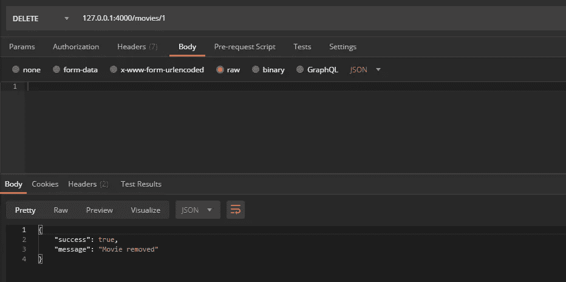
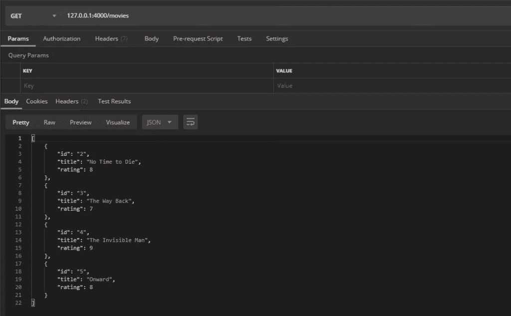

# 如何用 Deno 创建你的第一个 REST API

> 原文：<https://betterprogramming.pub/how-to-create-your-first-rest-api-with-deno-296330832090>

## Node.js 的创造者，让我们一起用它来构建我们的第一个 API


Deno 图标

在本文中，我将逐步解释如何用 Deno 创建 REST API。

安装 Deno 的[步骤就不用解释了。他们在官网上描述的非常好。对于这个例子，我用的是](https://deno.land/#installation) [VS 代码](https://code.visualstudio.com/)，为此有这个[官方插件](https://marketplace.visualstudio.com/items?itemName=justjavac.vscode-deno)存在。

# 什么是德诺？

Deno 与 Node 非常相似，但 Deno 试图做的是拥有一个更安全的运行时，并纠正 Node 的基本错误。Deno 在默认情况下是安全的。这意味着它不能访问你的硬盘，也不能访问你的网络。只有你给它，它才会有权限。另一方面，Node 一旦安装，就可以访问几乎所有内容。

例如，如果我们遵循官方指南并执行第一个命令，我们将看到它可以正常工作。

```
deno run [https://deno.land/std/examples/welcome.ts](https://deno.land/std/examples/welcome.ts)
```

但是，如果我们按照下面的例子来做，我们将会遇到一个网络访问权限错误:

```
import { serve } from "https://deno.land/std@0.52.0/http/server.ts";
const s = serve({ port: 8000 });console.log("http://localhost:8000/");
for await (const req of s) {
  req.respond({ body: "Hello World\n" });
}
```

网络权限错误:

发生这种情况是因为第一个例子不需要任何额外的访问来工作，但是第二个例子需要访问我们的网络。Deno 默认具有安全性，不允许我们这样做，除非我们授予额外的权限。

在这个例子中，您可以用`— allow-net`参数运行它，它将会工作。

文件也是如此。在这种情况下，我们需要 `— allow-read`。

# 用 Deno 创建一个 API

有什么比创建我们的第一个 REST API 更好的开始使用 Deno 的方式呢？

在这个小教程中，我将创建一个非常简单的电影数组和五种方法来列出、搜索、创建、更新和删除元素。

第一步是创建一个索引文件，在这里是`app.ts`。第一件事是加载 [Oak](https://oakserver.github.io/oak/) ，这是 Deno 的 HTTP 服务器的中间件框架。Oak 的灵感来自 Node.js 的中间件 Koa，看来他们延续了双关语。最终，它帮助我们更容易地编写 API。

这是一个相当简单的例子，几乎不言自明。服务器将监听端口 4000，并加载我们将在后面看到的`router.ts` 文件中定义的路由。在文件`./api/controller.ts`中，我将为不同的端点放置函数的定义。

是时候在`router.ts`文件中定义路线了。在这里，我们还将导入 Oak 路由器和我们将在`controller.ts`中创建的定义。

我们实例化一个路由器，并定义五个注释路由:

*   `getMovies` — 返回所有电影
*   `getMovie` —返回给定 ID 的电影
*   `createMovie` —创作一部新电影
*   `updateMovie` —更新现有电影
*   `deleteMovie` —删除电影

现在是时候创建`controller.ts` 文件来定义 API 方法和测试数据库了。

```
interface Movie {
  id: string;
  title: string;
  rating: number;
}
```

然后，电影阵列:

现在，不同的方法，从列出所有电影的方法开始。事情就是这么简单:

```
/**
 * Returns all the movies in database
 */
const getMovies = ({ response }: { response: any }) => {
  response.body = movies;
};
```

让我们来看下一个，它负责从一个我们可以作为参数传递的 ID 返回一部电影。

如果我们尝试用 [Postman](https://www.postman.com/) 发起请求，我们会看到它工作了。



轮到用`createMovie` 的方法创作电影了。代码如下:

如果我们发出测试请求，服务器将回复一条包含最近创建的电影数据的消息。



如果我们发出返回所有电影的请求，我们将看到新的电影是如何正确出现的。



轮到`updateMovie` 的方法更新电影了。代码是:

我们用 Postman 发起相应的`PUT` 请求，会得到正确的响应。



最后，我们只有`deleteMovie` 方法，在本例中，它从给定的 id 中删除一部电影。我所做的是使用 filter()来更新数组，保留所有 id 不同于发送的电影。

我们试着和邮递员一起…



实际上 id = 1 的电影就消失了。



你可以从我的 GitHub 下载这个例子的所有源代码。