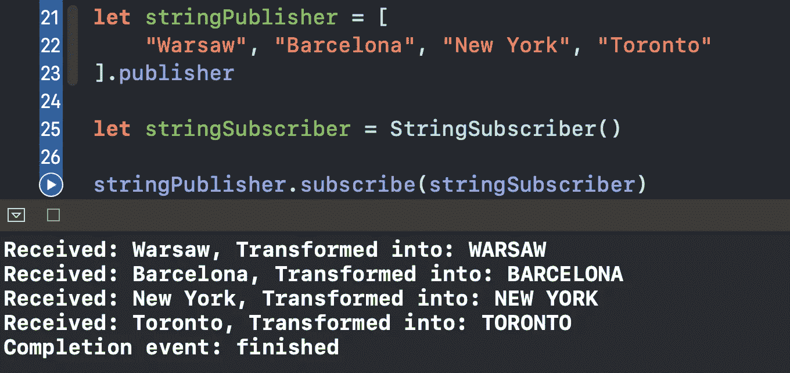
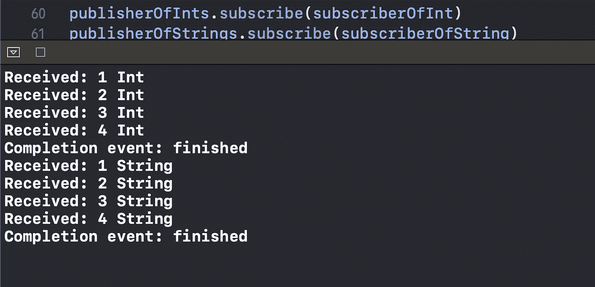

# 如何在 Swift 5 中创建自己的联合收割机订户

> 原文：<https://betterprogramming.pub/how-to-create-your-own-combine-subscriber-in-swift-5-702b3f9c68c4>

## 将逻辑封装在单独的类中

埃里克·麦克林在 [Unsplash](https://unsplash.com?utm_source=medium&utm_medium=referral) 上拍摄的照片

在本文中，我们将学习如何创建自己的组合订阅者，将值和完成处理逻辑封装到一个单独的类中。

Xcode Playground 实现的源代码可以在本文的底部找到。

# 我们开始吧

假设我们的目标是接收字符串值并打印它们的大写版本。

首先，我们需要创建一个符合`Subscriber`协议的`StringSubscriber`类:

现在我们必须提供两个类型别名，`Input`和`Failure`。`Input`代表我们从出版商那里获得的价值类型。在我们这里是`String`。我们不想接收任何`Error` s，所以我们将`Failure`设置为`Never`:

我们必须实现三个必需的方法:

*   一个指定我们的订户可以接收的值的数量的
*   处理接收到的输入并扩展订阅者可以接收的值的数量
*   处理完成事件的对象

首先，让我们指定未来值的最大数量:

我们对收到的`String`的计数没有限制，所以我们指定了一个`.unlimited`枚举案例。

现在让我们来处理输入:

因为我们已经指定了值的数量`.unlimited`，我们返回`.none`，所以最大限制保持不变。

最后，我们提供了处理完成的方法:

正如我们所看到的，我们只是打印了完成事件。

现在让我们测试一下`StringSubscriber`:

我们向一个发布者提供一组`String`然后向该发布者订阅`StringSubscriber`。

结果，我们看到了我们想要的输出:

# 使订户可以与任何类型的

你可能会想，只处理`String`对象是好的，但是我如何让一个订阅者处理任何类型的对象呢？

解决方案是使其通用化，如下所示:

要测试它，创建两个发布者并订阅它们:

我们可以看到打印出的值与预期的一样:

# 资源

GitHub gist 中提供了源代码:

# 包扎

对 Swift 的其他功能感兴趣吗？请随意查看我的其他相关文章:

*   [“Swift 中的类和静态有什么区别？](https://medium.com/better-programming/what-is-the-difference-between-class-and-static-in-swift-3493848ed831)
*   [“Swift 中的~=运算符是什么？](https://medium.com/better-programming/what-is-the-operator-in-swift-7f6bc7623023)
*   [“Swift 中的 vDSP 框架是什么？](https://medium.com/better-programming/what-is-the-vdsp-framework-in-swift-fe2539693e9a)
*   [“Swift 中的价值绑定模式是什么？](https://medium.com/better-programming/what-is-the-value-binding-pattern-in-swift-a644be3e0597)”
*   [“Swift 中的 CustomStringConvertible 协议是什么？](https://medium.com/better-programming/what-is-the-customstringconvertible-protocol-in-swift-4b7ddbc5785b)”

感谢阅读！