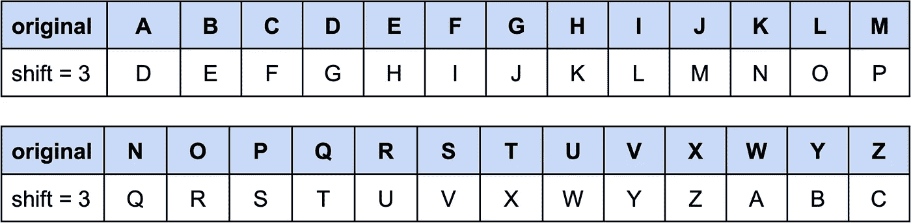
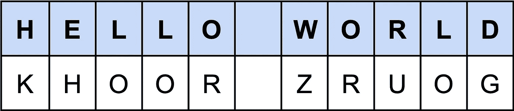

# 如何创建自己的 iOS 密码生成器

> 原文：<https://betterprogramming.pub/how-to-create-your-own-ios-password-generator-7279198917b0>

## 利用加密算法的力量


在 [Unsplash](https://unsplash.com?utm_source=medium&utm_medium=referral) 上 [NeONBRAND](https://unsplash.com/@neonbrand?utm_source=medium&utm_medium=referral) 拍摄的照片

您可能知道对所有内容使用相同的密码是不安全的，对吗？

嗯，我也知道这一点，但我只是忽略了这一风险，直到我在 2019 年收到一份通知，该通知已被泄露，因此不再安全使用。因此，我认为我可以开发一个个人算法，根据服务或网站生成我的密码。

我像个好懒骨头一样，心想:“不会每次都心算密码吧，嗯？”。这就是我如何创建一个供我个人使用的应用程序，它为每个服务生成不同的密码。

因为我喜欢这个结果，所以我决定和大家分享。


为本文创建的算法不同于我在日常活动中使用的算法，您可以使用自己的逻辑创建一个算法来生成您的密码。

为本文创建的代码基于以下结构生成密码:

```
[random number][caesar cipher capitalizing first letter][special character][random number]
```

这种结构是考虑到大多数网站而创建的，这些网站通常会要求您创建一个密码，该密码具有:

1.  数字

2.小写字母

3.大写字母

4.特殊字符

你想加什么都可以。直到这篇文章的结尾，你会看到它是多么容易。跟我来。

# 密码算法

首先，我想解释一下“密码学”是什么意思是很有趣的。这个词来源于希腊语 *Kryptos* (“隐藏的秘密”)+*graphen*(“写作”)。简而言之，就是将一个可读的信息转换成另一个显然没有意义的信息。例如:

```
HELLO WORLD = KHOOR ZRUOG
```

在上面的例子中*凯撒密码*用于编码信息，使用 3 作为*移位*。是不是太模糊了？别紧张，这是我想象的。

在下一节中，我将解释一切。虽然，在我解释这个算法之前，我想让你知道有几种技术可以用来创建你自己的密码生成器算法。其中一些是:

*   简单替代密码
*   单字母替代密码
*   维根涅尔密码
*   移位密码
*   自动密钥密码
*   韦尔纳姆密码

# 凯撒密码

与凯撒沙拉不同的是，凯撒密码之所以有这个名字，是因为凯撒大帝非常使用它。这是最经典的脚本技术之一，使用替换策略。每个字母被另一个特定的字母替换，以创建消息的“掩码”。

传统技术与 3 个字母的字母移位一起使用。这样，每个字母在加密字母表上都有对应的字母。所以，你需要做的就是用加密字母表中的匹配字母替换原来的字母。



移位 3 的凯撒密码字母表。

现在更容易相信`HELLO WORLD = KHOOR ZRUOG`了吧？看一看:



正如我所说的，传统技术使用 3 个字母的*移位*，但是你可以使用任何数字。在我将在本文中阐述的算法中，您将看到一个动态的*移动*。我们走吧，伙计们！

# 项目

要启动这个项目，你只需要从[这里](https://github.com/victorcatao/PassGen)下载。需要注意的是，这不是一个具有健壮架构的项目，因为这远不是本文的重点。为了简化项目，它是用 MVC +故事板制作的。

对于本文，您需要看一下这两个类:

*   `MainViewController` **:** 这是应用程序唯一的`ViewController`，里面有所有的视图和动作。在这个控制器中，你会发现标志`shouldUseBiometricAuthentication`控制你是否想要激活生物认证(如果你将在你的 iPhone 上安装该应用程序，强烈推荐)。此外，它还具有应用程序主要动作的逻辑:使用`Encrypter`类加密用户输入。
*   `Encrypter` **:** 这是项目最重要的一个类，是一个`[Singleton](https://medium.com/@nimjea/singleton-class-in-swift-17eef2d01d88)`。所有的密码生成逻辑都在这里。下面我们有这堂课的专属章节。

# 加密器

该类只有一个公共方法，负责加密用户输入的文本。

给定文本`Facebook`，该方法将返回生成的密码`56Jwws(104`。好吧，但是怎么做？为什么？让我展示给你看。

你也可以在这里看到整个班级。

开始之前，记住加密结构很重要:

```
[random number][caesar cipher capitalizing first letter][special character][random number]
```

为了计算第一个和最后一个随机数，该算法将类中定义的随机素数乘以参数中发送的文本大小(脸书= 8 个字符)。因此:

*   `initialNumber = 8 * 7(*firstRandomPrimeNumber*) = **56**`
*   `finalNumber = 8 * 13(*secondRandomPrimeNumber*) = **104**`

瞧啊。现在我们的加密字符串看起来像这样:

```
**56**[caesar cipher][special character]**104**
```

之后算法用用户输入的最后 4 位(`*maximumCipherSize*`常数):`book`计算凯撒密码。

为了动态工作，定义的*移位*是整个输入的大小。因此，我们用 8 的*移位*来计算“书”的凯撒密码。最终结果中使用的字符串将是这个函数的返回值，首字母大写。

```
caesarCipher(book, 8) = jwws => .capitalizingFirstLetter = Jwws
```

现在结果差不多完成了。我们基本上已经有了完整的返回字符串:

```
56**Jwws**[special character]104
```

现在只差一个特殊字符了。为了计算它，我们的类有一个带有一些特殊字符的预定义数组(`specialCharacters`)。

该算法将在列表的特定位置获取一个字符，该字符是用输入大小除以数组大小的余数计算的索引常数，以防止它试图访问数组中不存在的位置。

```
index = textSize % specialCharactersSize = 8 % 10 = 8
specialCharacters[8] = (
```

最后，我们的字符串将返回:

```
[random number][caesar cipher][special character][random number]
[**56**][**Jwws**][**(**][**104**]
56Jwws(104
```

# 现在就看你的了

简单有用吧？这篇文章的目的是启发您构建自己的密码生成器算法。

您可以将`Encrypter`类的常量更改为不同的值，并在处理字符串、数字和特殊字符时发挥您的想象力。

再见！