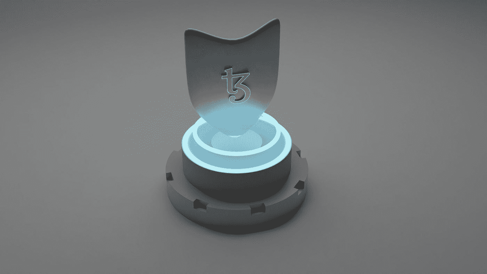
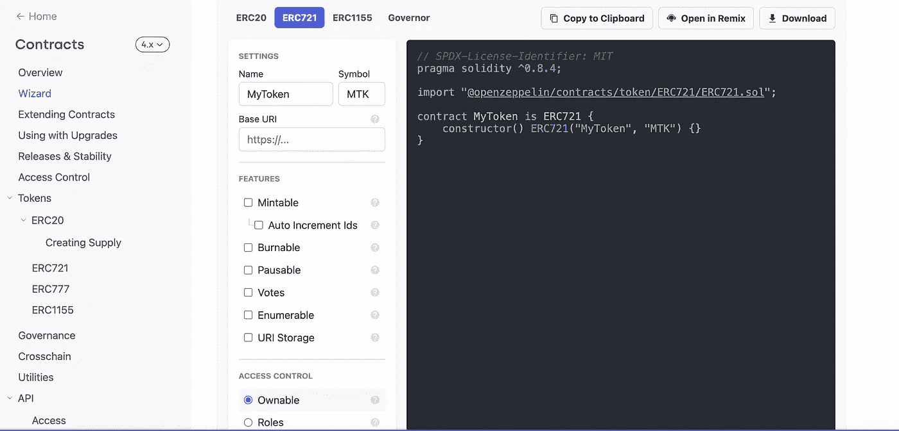
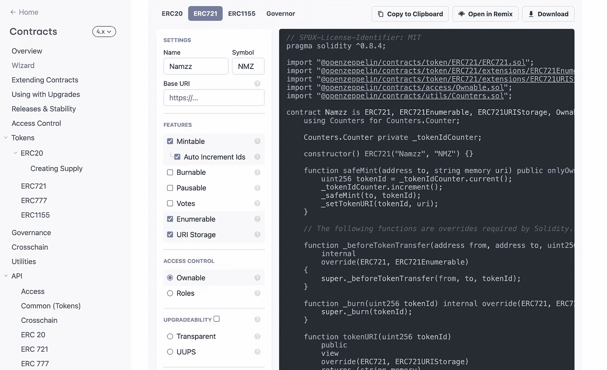
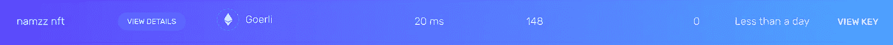
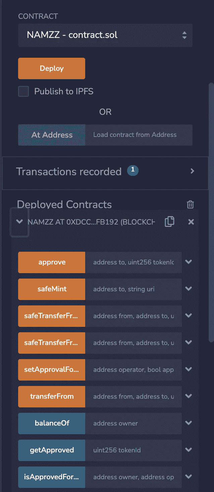
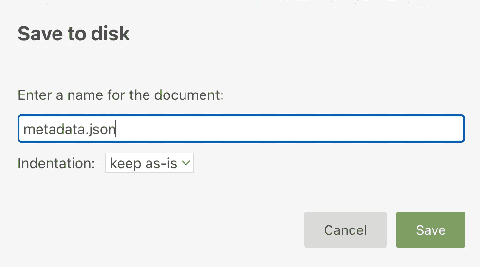
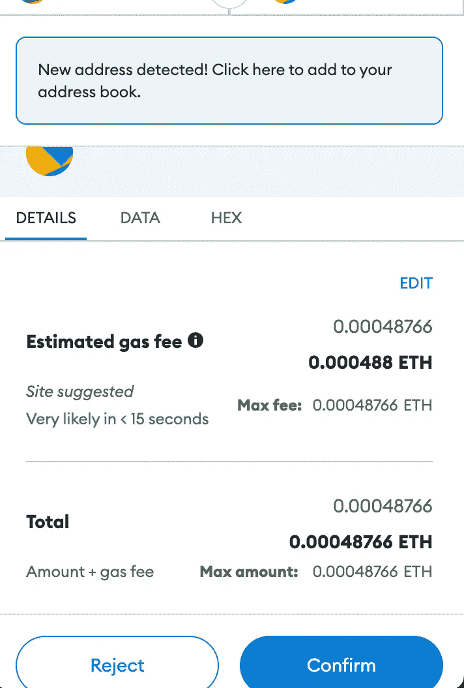
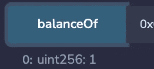

# 使用 Solidity 和 Open Zeppelin 创建 NFT 并在 IPFS 上发布

> 原文：<https://betterprogramming.pub/how-to-create-your-own-nft-smart-contract-tutorial-1b90978bd7a3>

## **在 OpenSea 上查看**



由 [Shubham Dhage](https://unsplash.com/@theshubhamdhage?utm_source=medium&utm_medium=referral) 在 [Unsplash](https://unsplash.com?utm_source=medium&utm_medium=referral) 上拍摄

随着 web3 空间在区块链舞台上继续取得重大进展，非功能性桌面和数字收藏品越来越受欢迎。Cryptokitties 和 Bored APE 等 NFT 的巨大人气推动投资者购买 ERC721 兼容的数字收藏品。

在这篇文章中，我们将指导你创建你的第一个 ERC-721 (NFT)合同的过程。

用 solidity 开发一个智能合同并将其部署在区块链上，起初听起来可能令人生畏:Solidity、安全性、gas 优化、开发人员环境和 gas 费用，只是将代码托管在区块链上需要经历的一些事情。

OpenZeppelin Wizard 等工具为开发人员提供了点击和编写功能，可以立即创建可组合的安全智能合同，与 Alchemy 等 Web3 开发工具配合使用，可以让在区块链上编写部署代码的体验变得前所未有的简单、快速和可靠。

在本教程中，您将学习如何开发和部署 ERC721 (NFT)智能合约。

# 技术堆栈

*   魔力
*   OpenZeppelin
*   再搅拌
*   以太坊

# **1。开齐柏林飞艇**

首先我们去 [OpenZeppelin](https://docs.openzeppelin.com/contracts/4.x/) ，然后在向导选项卡上，点击 ERC721。所有 NFT 都是 ERC721 令牌。



开放齐柏林 ERC-721，来源:自我

我们希望我们的令牌是可铸造的，具有可枚举和 URI 存储的特性。根据您的意愿命名您的令牌，并输入所需的符号。



可创建、可枚举、URIStorage 的代码 Source: self

# **2。混音 IDE**

现在，点击右上角的打开混音按钮。它将打开 Remix IDE 并编写代码。您可以将编译器版本更改为 0.8.4。

这里，是更新的代码，一定要在 Remix 里面改。我们需要删除 solidity 程序的 Ownable 部分，因为我们希望 ownable 之外的人也可以铸造我们的 NFT。此外，我们还将 MAX_SUPPLY 添加为 5000，以便限制 NFT。

# **3。炼金术-创造应用程序**

接下来需要报名[炼金](https://dashboard.alchemyapi.io/)。点击创建应用程序，你可以随意命名你的应用程序。我把它命名为 Namzz nft。然后点击查看键，复制 HTTPS 地址。



创建应用程序后的炼金术，来源:自我

# **4。元掩码-添加网络**

此外，我们需要通过单击 Add Network 在 Metamask 上创建我们的网络。按照你的意愿命名测试网。我把它命名为 Namzz Goerli testnet。粘贴我们从 alchemy 复制的 https URL。为 Goerli 添加 ID 为 5，并输入 ETH 作为符号。点击添加网络按钮。


网络创建，来源:self

你可以从歌尔里水龙头那里得到一些测试以太坊。这里是[环节](https://goerlifaucet.com/)。用你的 Alchemy 帐户登录并输入你的地址。你将在几秒钟内得到测试乙醚！

# **5。在 Goerli Testnet 上编译和部署 NFT 智能合同**

在 Remix 上，转到 Deploy，选择 *Injected Web3* 作为环境。它会自动连接到您的网络。你将会得到你的元掩码的地址以及平衡以太。在合同选项卡中选择您的智能合同，然后单击部署。

它将显示一个元掩码弹出窗口，要求您支付费用。点击确认并等待 10 秒钟。它将在混音中添加已部署的契约！



元掩码中已部署的协定，来源:self

# **6。格式化 NFT 元数据**

为了让 OpenSea 获取 ERC721 令牌的链外元数据，契约需要返回一个指向托管元数据的 URI。为了找到这个 URI，OpenSea、Rarible 和其他流行的市场将使用包含在`ERC721Uristorage`标准中的`tokenURI`方法。

转到 [OpenSea 开发者文档](https://docs.opensea.io/docs/metadata-standards)并复制元数据结构。粘贴到 [json 在线编辑器](https://jsoneditoronline.org/#left=local.faseci)中，根据自己的意愿编辑描述。根据 OpenSea 文档，NFT 元数据应该存储在一个. json 文件中，其结构如下:

NFT 元数据

# **7。在 IPFS 上创建和上传元数据**

现在我们已经对 NFT 元数据中包含的内容有了一个简单的了解，让我们来学习如何创建它并将其存储在 IPFS 行星间文件系统中。

转到 Filebase，并在那里创建一个帐户。验证您的电子邮件并登录。现在，我们需要点击 create bucket，这个 bucket 的名字是小写字母，我将其命名为`namzz-nft`。选择 IPFS 并创建。现在上传你想制作成 nft 的图片。点击图片并复制 IPFS 网关的网址。在 JSON 文件的 image 部分输入这个链接。

以 metadata.json 的名称保存 JSON 文件，并上传到 FileBase 中的 Bucket 上。



将 JSON 文件保存为 metadata.json，Source: self

点击你的文件，复制 IPFS 刑事调查局。

# **8。铸造你的格利测试网 NFT**

然后去混音室。**橙色方法**是实际写在区块链上的方法，而**蓝色方法**是从区块链学来的方法。

点击`safeMint`方法下拉图标，将您的地址和以下字符串粘贴到 uri 字段:

```
ipfs://<your_metadata_cid>
```

点击 transact 将创建一个 Metamask 弹出窗口，提示您支付煤气费。点击“签名”,继续铸造你的第一个 NFT！



通过元掩码进行交易

在`balanceOf`按钮中输入您的地址，然后输入您的地址。运行它——它应该显示您有 1 个 NFT。



1 NFT 可用

对 tokenUri 方法做同样的事情，插入“0”作为 id 参数—它应该显示您的 tokenURI。

太好了！你刚刚铸造了你的第一个 NFT！🎉现在是时候转移到 OpenSea 来检查元数据是否被读取了。

# **9。在 OpenSea 上查看 NFT**

导航到 [testnets.opensea.io](https://testnets.opensea.io/) 和**使用您的元掩码钱包**登录。然后点击你的个人资料图片，你应该会看到你的新铸造的 NFT。如果图像尚不可见，请单击它，然后单击“刷新元数据”按钮。

有时，OpenSea 很难识别 testnet 元数据——可能需要长达 6 个小时才能看到它。

祝贺您，您已经成功创建、修改和部署了您的第一个智能合同。铸造了你的第一个 NFT，并在 IPFS 上发布了你的照片！

感谢阅读。