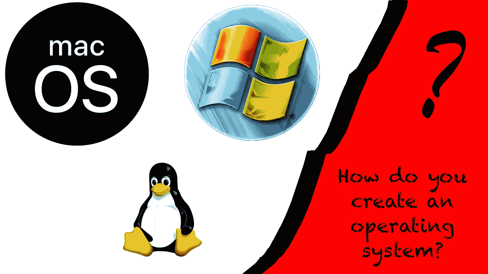

# 如何创建自己的操作系统

> 原文：<https://betterprogramming.pub/how-to-create-your-own-operating-system-bfd2545d2e6d>

## 从编程中最具挑战性的尝试中学习

从构建低级程序中学习。

如今，普通的最终用户很少考虑他们使用的操作系统。在移动设备市场，根据 [GlobalStats](https://gs.statcounter.com/vendor-market-share/mobile) 网站的报道，Android 保护伞以累计 73%的市场份额占据主导地位，而苹果的生态系统占据其余份额——同时，如果你看看个人电脑，情况大致相同，微软系统占据了所有正在使用的系统的最大份额。

就我个人而言，我不太喜欢 Windows，除了我写这篇文章的 Mac 系统之外，最接近的可行替代系统是 Linux，它在日常可用性方面甚至还没有接近。人们普遍认为，要推翻目前个人电脑市场的垄断是不可能的——这是一种我既厌恶又赞同的情绪——我也不打算做不可能的事。

然而，我确实希望通过这一系列文章来说明，对于任何级别的程序员来说，创建一个非常简单的低级程序都是一次奇妙的学习经历。

在我们开始之前，我想说的是，本文将假设您对计算机科学和编程中的一些基本和高级概念有一定程度的熟悉，例如:

*   十六进制和二进制记数法；
*   数据结构及其创建和操作；
*   算法；
*   组装；
*   以及一些更抽象的编程概念。

# 入门指南

我们将从建立一个交叉编译器开始。有一些参考资料会告诉你如何为 GCC 做这件事，尽管我将使用 LLVM 和 Clang 作为基础来编写这个系列，因为我们稍后将作为题外话深入到其他一些编程语言中。

您应该已经安装了 Git 和 CMake，因为它们在本系列中被大量使用。如果您需要下载它们，可以在以下位置下载:

*   [饭桶](https://git-scm.com/)
*   [CMake](https://cmake.org)

这同样适用于 LLVM 和 Clang，您可以通过在终端中运行以下命令来获取它们:

安装 LLVM 和 Clang。

如果您还没有 Make，那么您可以使用`-GNinja`为不同的生成器运行 CMake，比如 [Ninja](https://ninja-build.org/) ，尽管 Make 是默认的，并且是大多数基于 Unix 的系统附带的。

如果你在 Windows 上阅读这个系列，你有一些选择——你可以安装 [MinGW](https://www.mingw-w64.org/) ，一个 GNU 工具如 make 附带的最小环境，或者你可以使用 [WSL 安装](https://docs.microsoft.com/en-us/windows/wsl/install)。顾名思义，Windows Subsystem for Linux 是一个内置于 Windows 安装中的完整的 Linux 系统。

一旦我们清除了这些要素，我们就准备好进入这个故事中更令人兴奋的部分:代码！

# 初始样板文件

我们要做的第一件事是写一些汇编代码。我们不想花太多时间在汇编语言上，所以我们要创建最少的样板文件，以便让我们进入 C 环境。

我们将首先为多重引导头声明一些常量:

我们的引导程序常量。

这些常量是一些“神奇”的值，在多引导标准[中有完整的记录。](https://www.gnu.org/software/grub/manual/multiboot/multiboot.html#OS-image-format)

接下来，我们将定义一些部分。我们需要确保程序识别为内核，所以我们将从多重引导头开始，然后是 BSS，最后是文本部分，在这里我们定义了进入主函数的入口。

从 ASM 到我们的 C 代码。

这段代码使我们能够开始用我们选择的高级语言编写，在这个例子中是 C。你可以先编译它，以确保它能使用 Clang 的`as`运行。

首先，我们需要写出一些效用函数。我们需要确保我们可以写入屏幕——我们稍后将使用像素缓冲区实现——使用缓冲区和 VGA 颜色代码的组合。

我们外壳的 VGA 颜色代码。

现在我们可以创建一个非常基本的外壳:

一个非常基本的 shell 实现。

现在我们终于可以写点什么了！

我们可以编写前面提到的 main 函数，并使用我们的`writeString`函数在屏幕上打印一些东西！

你好世界！

现在，我们需要将所有东西连接在一起:

用这个链接器脚本链接我们的工作！

要构建我们的简单操作系统，首先要编译汇编代码。你可以通过运行`clang bootloader.s -o bootloader.o`来实现。

将 C 代码合并成一个文件，用`clang kernel.c -o kernel.o`编译。这将生成链接它所需的最后一部分。

你现在可以通过运行`clang -T osLinker.ld -o myos.bin -ffreestanding -O2 -nostdlib bootloader.o kernel.o`将你的内核连接在一起。

现在编译了一个非常基本的内核，你可以把它闪存到一个 u 盘上并运行它，或者你可以在一个虚拟机上运行它，比如 QEMU 或者 VirtualBox。

# 资源

作为免责声明，有些代码是从几个不同的来源借来的:

*   [OSDev Wiki](https://wiki.osdev.org/Main_Page)
*   [RedoxOS 文档](https://redox-os.org/docs/)

你可以在我的 [GitHub 库](https://github.com/jwfufa/sys3)中关注这个系列的发展。