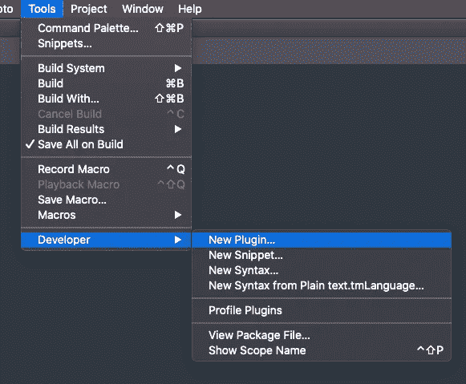
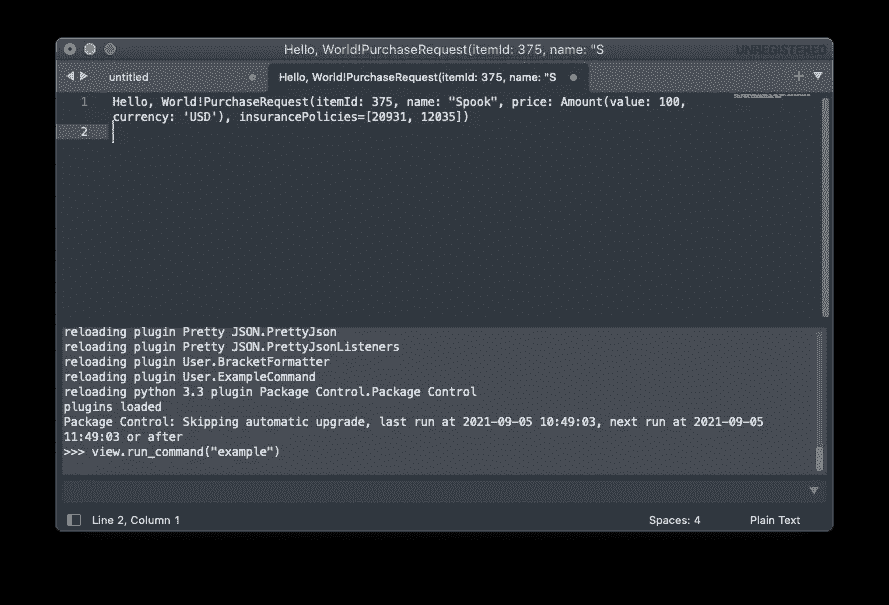
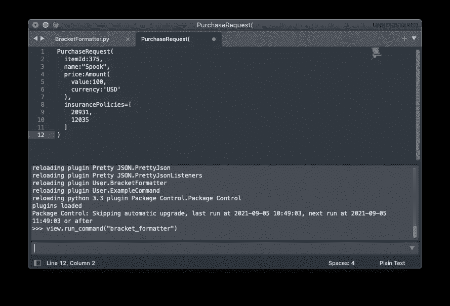
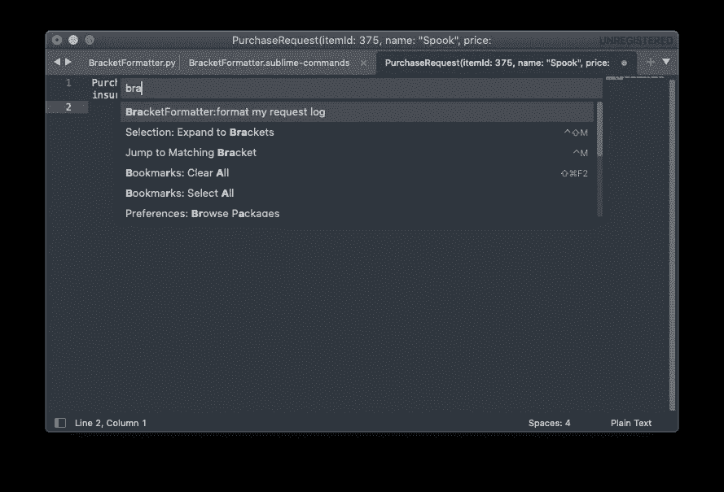

# 如何创建自己的 Sublime 文本插件

> 原文：<https://betterprogramming.pub/how-to-create-your-own-sublime-text-plugin-2731e75f52d5>

## 使用 Python 为 Sublime 文本构建自定义日志格式化程序


照片由[格伦·凯莉](https://unsplash.com/@glencarrie?utm_source=medium&utm_medium=referral)在 [Unsplash](https://unsplash.com?utm_source=medium&utm_medium=referral) 上拍摄

Sublime Text 是一个干净、快速、轻量级的文本编辑器。它对插件的丰富支持也使它具有可扩展性和强大的功能。在今天的教程中，我们将研究如何创建我们自己的插件。

# 插件思想——一个定制的日志格式化程序

假设我们有一个记录所有 API 请求和响应的日志记录器。下面是一个请求示例:

```
PurchaseRequest(itemId: 375, name: "Spook", price: Amount(value: 100, currency: 'USD'), insurancePolicies=[20931, 12035])
```

它告诉我们，我们正在用`100$`购买一个`Spook`。物品的`id`为`375`，另外还附有两份保险，保单号为`20931`和`12035`。

实际内容并不重要，但有趣的是日志数据的结构。它记录类名，比如`PurchaseRequest`和`Amount`。它还包含不同类型的括号，`()`表示类中的属性，`[]`表示数组。

现在都在一行，很难读懂。我们希望将其重新格式化为:

数据类似于 JSON，但不完全是 JSON。由于它是非标准的，很难找到一个现有的插件来满足我们的需求。所以，让我们来建造一个。

# 入门指南

通过工具>开发者>新建插件创建一个新插件。



将创建一个包含以下内容的新文件:

这个插件的名字叫做`Example`。它所做的只是插入字符串“Hello World！”在文件的最开始。

我们可以在控制台上测试它。点击查看>显示控制台(或通过 macOS 上的键盘快捷键`ctrl + ``)。在弹出窗口中，键入以下内容:

```
view.run_command("example")
```

这将调用插件并打印调试日志(如果有的话)。



运行示例插件，我们现在应该在文档的开头添加了`Hello World!`。

让我们继续建造一些真实的东西。

# 一个`Format`功能

这就像一个小小的采访编码练习。

我们需要在每个括号`(`、`{`和`[`后插入一个换行符。我们还需要在每一个结束括号`)`、`}`、`]`和逗号本身之前加一个。我们应该忽略任何现存的空格和换行。最后，我们跟踪一个计数器，以了解每行需要多少缩进。

以下是片段:

# 最终确定插件

将插件重命名为`BracketFormatter`，并使用上面的格式函数将实现替换为以下内容:

最后，将其保存为文件夹下的`BracketFormatter.py`:

```
/Users/<your_username>/Library/Application Support/Sublime Text/Packages/User
```

别忘了用你的用户名替换`<your_username>`。

至此，我们的插件已经完成，我们可以随时从控制台调用它。

```
view.run_command("bracket_formatter")
```



为了更容易运行，我们还可以创建一个`sublime-commands`。在同一个文件夹下，创建一个文件`BracketFormatter.sublime-commands`并输入以下内容:

```
[
    {
        "caption": "BracketFormatter: format my request log",
        "command": "bracket_formatter"
    }
]
```

这样，我们现在就可以像平常一样从命令面板**(MAC OS 上的键盘快捷键是`cmd` + `shift` + `P`)中运行命令了。**

****

# **结论**

**今天到此为止。这不是一个非常复杂的插件。但希望它可以作为一个切入点，或者启发你去创造一些更有趣的东西！**

**不要忘记查看官方文档[中所有可用插件 API 的列表。](https://www.sublimetext.com/docs/api_reference.html)**

**像往常一样，代码片段可以在 GitHub 上找到。**