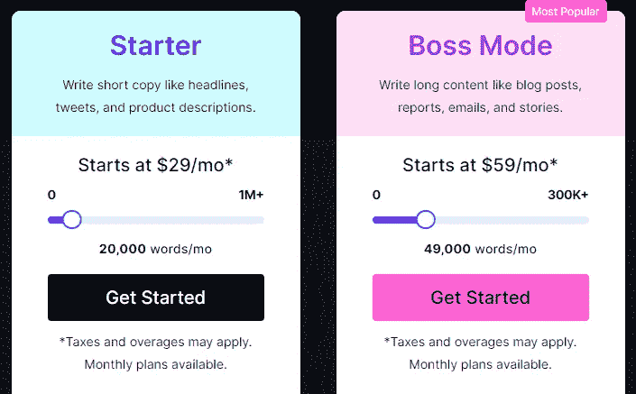
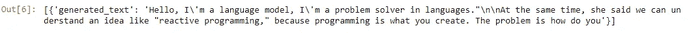
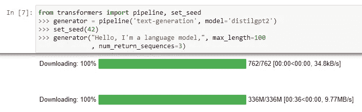
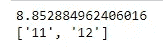
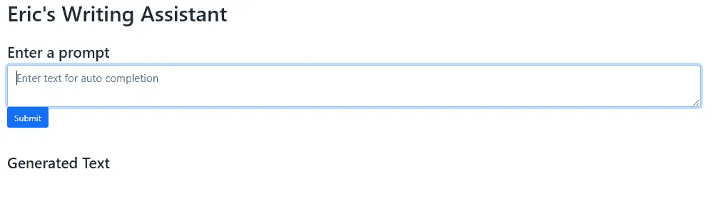
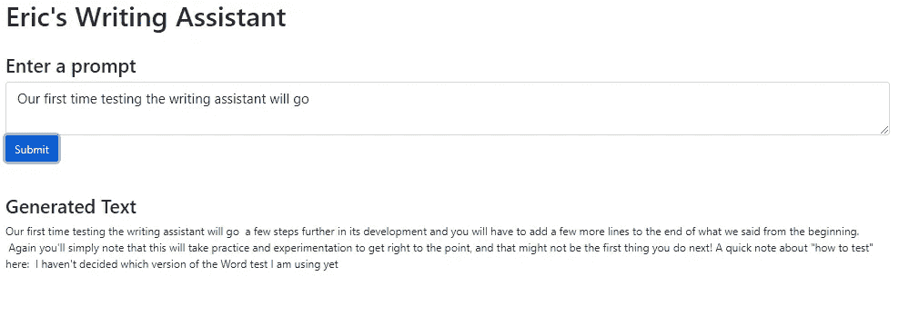
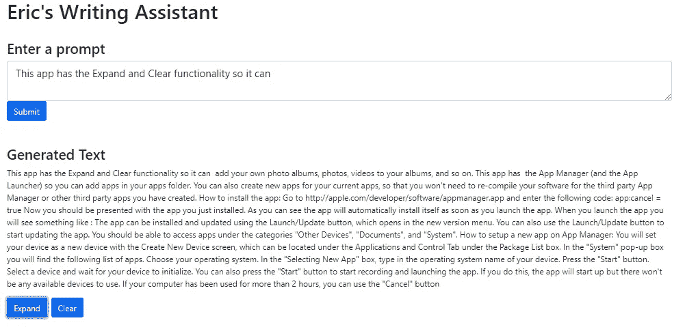
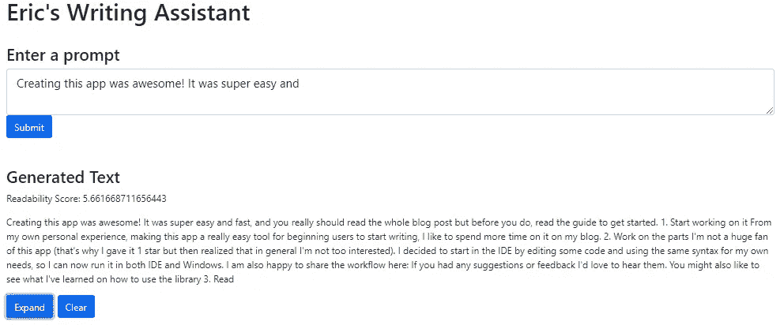

# 如何使用 Python 创建自己的写作助手应用程序

> 原文：<https://betterprogramming.pub/how-to-create-your-own-writing-assistant-app-using-python-bc9265b8e5ea>

## 只需 100 行代码，就能使用人工智能毫不费力地生成博客

## 使用 Dash 和 HuggingFace 构建一个强大的博客工具


科伦·费迪达在 [Unsplash](https://unsplash.com?utm_source=medium&utm_medium=referral) 上的照片

# 机器接管了吗？

由“人工智能”驱动的写作助手声称通过自动生成内容使你成为更好的博客作者，已经大受欢迎。他们经常利用通过机器学习创建的大量语言模型，[，像 OpenAI](https://openai.com/blog/openai-api/) 的 GPT-3。

在这篇文章中，我将向您展示使用类似于 GPT-3 的技术来创建自己的写作助手是多么容易，该应用程序还将使用传统的可读性测量方法对内容进行评分。我们将使用 Python 库 [Dash](https://dash.plotly.com/) 、 [HuggingFace](https://huggingface.co/) 和[py-可读性-度量](https://github.com/cdimascio/py-readability-metrics)。如果您已经熟悉了这些库，您可以在文章末尾找到完整的代码，以及指向我的 GitHub 的链接。

# 目录:

*   人工智能写作助手的问题
*   什么是语言模型？
*   拥抱变形金刚入门
*   可读性入门
*   Dash 入门
*   构建基本的写作助手
*   添加高级功能
*   结论和完整代码

# 人工智能写作助手的问题

像 Shortly.ai 和 Jasper.ai(正式名称为 Jarvis.ai)这样的写作辅助工具的一个最大问题是，对于你所得到的东西来说，它们可能变得相当昂贵。考虑到人工智能生成的文本通常需要手动编辑才能保持连贯，它并不像市场宣传的那样节省大量时间。再加上有些工具甚至限制生成字数或者收取超龄费！

这里以 jasper.ai 的产品定价为例。



[https://www.jasper.ai/pricing](https://www.jasper.ai/pricing)

不完全是我认为便宜的内容，我需要修改自己。如果你有兴趣了解更多我尝试过的基于人工智能的写作工具，可以看看我不久前写的这篇文章:

[](https://medium.com/geekculture/robots-to-the-rescue-online-writing-tools-that-make-blogging-a-breeze-6fc434b9ef7c) [## 机器人来拯救——让写博客变得轻而易举的在线写作工具

medium.com](https://medium.com/geekculture/robots-to-the-rescue-online-writing-tools-that-make-blogging-a-breeze-6fc434b9ef7c) 

它讨论了一些写作工具，结论是它们可以为想法的产生提供很大的帮助，但如果你希望一种不干涉的方法，就不是很好了。例如，shortly.ai 在我遇到作家受阻时帮助我提出想法。

# 什么是语言模型？

在引擎盖下，我们的写作助手将利用一个预先训练的统计语言模型，该模型是在一个大型文本数据语料库上训练的。统计语言模型是单词序列的概率分布，可以让我们预测序列中的下一个单词。想象一下，你的手机会自动预测你在短信中的下一个单词。多亏了语言模型，这才成为可能。

通过自然语言处理(NLP)和数据科学领域的进步，许多强大的语言模型都是开源的，可供任何人尝试。我们使用预先训练的模型，因为我们自己构建这些大型语言模型既耗时又昂贵，因为大型语言模型需要大量的计算机能力来训练。训练 GPT-3 花费了数百万美元，它是市场上最大、最强大的语言模型之一。

# 拥抱变形金刚入门

HuggingFace transformers Python 库是探索大型语言模型的最简单的方法之一。它简单明了的语法和公共的、最先进的模型中心使初学者可以轻松处理任何 NLP 任务，如文本生成、问题回答、语义相似性、主题建模和情感分析。

**使用 pip 安装库**

```
pip install transformers
```

如果你是 HuggingFace 和 NLP 的新手，我强烈推荐你复习免费的 HuggingFace NLP 课程。它解释了从设置新的 Python 环境到探索 transformers 库、微调语言模型以及应用 transformers 解决 NLP 任务的所有内容。

[](https://huggingface.co/course/chapter0/1?fw=pt) [## 简介-拥抱脸课程

### 欢迎来到拥抱脸课程！这一介绍将引导你建立一个工作环境。如果…

huggingface.co](https://huggingface.co/course/chapter0/1?fw=pt) 

对于我们的写作助手应用程序，我们将重点使用 HuggingFace 库的文本生成模型和函数。生成文本很简单，只需要几行代码。下面是使用 HuggingFace 管道生成文本的基本实现:

```
#import dependencies
from transformers import pipeline#instantiate generator 
generator = pipeline('text-generation', model='gpt2')#pass a prompt to the generator
generator("Hello, I'm a language model,")
```



文本生成输出

只需*三行代码*，我们就能生成文本！这就是拥抱脸的力量。请注意，生成文本依赖于一些随机性，因此即使我们使用相同的提示，您的结果也可能与我的结果不匹配。

如果没有在管道中声明语言模型，生成器默认为 [GPT-2](https://huggingface.co/gpt2) 。[查看您可以在模型中心](https://huggingface.co/models?pipeline_tag=text-generation&sort=downloads)中用于文本生成的模型列表。您可以通过传入模型参数来声明模型。如果您没有模型，它会自动下载。



下载新模型

注意，您也可以将参数传递给生成器。我们传递一个`**max_length**` 来增加输出的字数，我们传递`**num_return_sequences**` 来增加返回的输出数。

# 可读性入门

[py-readability-metrics 库](https://github.com/cdimascio/py-readability-metrics)用于生成有用的可读性分数。这允许我们更好地评估输出的复杂性。使用它的各种评分函数，我们可以确定生成的输出是否适合目标受众。

## **使用 pip 安装库**

```
pip install py-readability-metricspython -m nltk.downloader punkt
import nltk
nltk.download('punkt')
```

该库需要 NLTK 标点符号扩展`punkt`，所以一定要下载它。

使用这个库很简单，但是大多数指标至少需要 100 个单词，所以如果生成少量文本，就不能使用它们。烟雾指标也需要至少 30 个句子。

```
from readability import Readabilitytext = 'In a shocking finding, scientists discovered a herd of unicorns living in a remote, previously unexplored valley, in the Andes Mountains. Even more surprising to the researchers was the fact that the unicorns spoke perfect English.\n\nThe finding is so startling, it\'s a shock to so many who took part in the experiment.\n\n"It shows that you are not just living with a set of social norms and conventions about things with a genetic basis," said researchers Dr. Kip Thao and Dr. Hui Zhang. "Your DNA is so important that you will survive this experiment if it does not change."\n\nThe researchers took part in this research because we have these really special abilities and we are trying to find ways of not taking it for granted."<|endoftext|>'r = Readability(text)r.dale_chall()dc = r.dale_chall()print(dc.score)
print(dc.grade_levels)
```



dale_chall 可读性分数和等级级别

注意，我们可以输出可读性分数和等级级别。根据提供的文本，我们看到[戴尔·查尔测量](https://en.wikipedia.org/wiki/Dale%E2%80%93Chall_readability_formula)将它评为 11 或 12 年级的阅读水平。

他们的库包含几个不同的度量标准。[通过查看库的 GitHub repo 中的自述文件，了解关于每个指标的更多信息](https://github.com/cdimascio/py-readability-metrics)。以下是包含的指标列表:

```
r = Readability(text)

r.flesch_kincaid()
r.flesch()
r.gunning_fog()
r.coleman_liau()
r.dale_chall()
r.ari()
r.linsear_write()
r.smog()
r.spache()
```

使用可读性指标将使我们更容易评估生成的输出的可读性。有时生成的输出不是很一致，因此能够快速轻松地评估它将使整个过程更加用户友好。

# Dash 入门

Dash by Plotly 是一个基于 Flask、Plotly.js 和 React.js 编写的强大的 Python 开源框架。它抽象出了这些技术的复杂性，将它们提炼为易于应用的组件。我将提供基础知识的简要概述，但如果你是全新的 [Dash 库](https://dash.plotly.com/)或者想要深入了解所有功能，请查看我的初学者教程或网站，[pythondashboards.com](https://pythondashboards.com):

[](https://levelup.gitconnected.com/how-to-create-powerful-web-apps-and-dashboards-using-dash-2-0-a05db174f20d) [## 如何使用 Dash 2.0 创建强大的 Web 应用和仪表盘

### 使用 Python 设计多页面 Web 应用程序

levelup.gitconnected.com](https://levelup.gitconnected.com/how-to-create-powerful-web-apps-and-dashboards-using-dash-2-0-a05db174f20d) 

Dash 有一个不断发展的社区，里面充满了热情的开发者和创造者。由于该框架是开源的，[社区开发了一些非常酷的组件，可以集成到任何 Dash 应用](https://plotly.com/dash-community-components/)中。

**使用 pip 安装仪表板:**

```
pip install dash
```

# 仪表板基础

使用 Dash，您不需要从头开始编写任何 HTML 或 CSS，尽管理解每一个的基础对于用户界面(UI)设计肯定有帮助。

Dash 应用程序主要由两部分组成:

1.布局

2.复试

# 仪表板布局

布局由组件树组成，描述应用程序的外观以及用户如何体验内容。Dash 附带了多个组件库，如`dash_core_components`、`dash_html_components`和 Dash DataTable。

`dash_html_components`库中几乎每个 HTML 标签都有一个组件。`dash_core_components`库包括高级交互组件，如日期选择器、清单、输入字段、图表和下拉列表。`**Dash DataTable**`使得将可过滤的、分页的数据表集成到你的应用程序中变得容易。[查看文档，获取核心组件库的完整列表](https://dash.plotly.com/)。

## 仪表板引导组件

除了 Dash 的核心库，我还使用 Dash Bootstrap 组件库来简化网站[响应式设计](https://en.wikipedia.org/wiki/Responsive_web_design)。类似于 Dash HTML 组件库允许您使用 Python 应用 HTML，Dash Bootstrap CSS 组件库允许您添加受 Bootstrap CSS 框架影响的 Bootstrap 前端组件。

使用 pip 安装 Dash 引导组件库:

```
pip install dash-bootstrap-components
```

# Dash 回调

回调是让 Dash 应用程序交互的逻辑所在。回调是 Python 函数，每当输入组件的属性发生变化时都会自动调用。例如，想象一个网站上的按钮。单击时，会在后台触发一个回调，触发按钮的功能。可以链接回调，使一个更改触发整个应用程序的多个更新。

基本上，回调由 ***输入*** 和 ***输出*** 组成。它们也可以包括**状态**。该功能通过`app.callback` [装饰器](https://www.python-course.eu/python3_decorators.php)工作。输入和输出只是用户可以与之交互的组件的属性。例如，输入可以是从下拉列表中选择的选项，输出可以是可视化。假设我有一个州的下拉列表，当我选择 CA 时，加利福尼亚会在地图上突出显示。

# 创建写作助手应用程序

我们将从构建一个简单的 Dash 应用程序大纲开始，然后我们将逐渐添加功能，使其变得更加复杂。我们的第一个组件将是具有简单标题和输入字段的容器，然后我们将实现一个基本的文本生成器。一旦启动并运行，我们将添加一个扩展和清除按钮。最后，我们将增加可读性分数。

## 创建虚线轮廓

首先创建一个名为 app.py 的文件。导入依赖项并为 Dash 应用程序创建一个大纲，用基本布局实例化该应用程序。

```
**#import dependencies**
from dash import Dash, dcc, html, Input, Output, State, callback_context
import dash_bootstrap_components as dbc
from transformers import AutoTokenizer, AutoModelForCausalLM
from readability import Readability
import nltk**#instantiate dash**
app = Dash(__name__, external_stylesheets=[dbc.themes.BOOTSTRAP])**#create layout**
app.layout = html.Div([dbc.Container([

   ])
  ])**#run app server**
if __name__ == '__main__':
    app.run_server(debug=True)
```

注意，我们从一个`html.Div`组件和一个`dbc.Container` 组件开始布局。其余的应用程序组件将存在于该容器中。一个容器组件利用了 [bootstrap 的网格](https://getbootstrap.com/docs/4.0/layout/grid/)，增加了[的响应性，并防止组件拉伸整个屏幕](https://medium.com/swlh/dashboards-in-python-for-beginners-using-dash-responsive-mobile-dashboards-with-bootstrap-css-2a0d05a53cf6)。

下面是一个简单的组件概要，用于设置应用程序的 UI 结构。将此添加到`dbc.Container`组件中:

```
html.H1("Eric's Writing Assistant")
, html.Br()
, html.H3("Enter a prompt")
, html.Br()
, html.Br()
, html.H3("Generated Text")
, html.Div(id='my-output')
```

`html.H1`和`H3`是保存简单文本的标题组件。`html.Br`组件是一个换行符，在整个应用程序中增加了一些空间。最后，id=' *my-output'* 的`html.Div`组件将用于保存生成的文本。

通过在命令行中键入`python app.py`来运行我们目前所拥有的。这应该会显示在浏览器中:


到目前为止的写作助手应用

应用程序工作(总是一个好迹象)，所以让我们继续添加功能！

## 添加输入字段

我们需要一个输入字段，接受我们的写作提示。为了保持布局简洁，我将创建一个函数，我们可以调用它来生成我们想要包含的组件树。

将此函数添加到 Dash 实例化的上方(app = Dash…):

```
def textareas():
    return html.Div([ 
            dbc.Textarea(id = 'my-input'
                , size="lg"
                , placeholder="Enter text for auto completion")
            , dbc.Button("Submit"
                , id="gen-button"
                , className="me-2"
                , n_clicks=0)
            ])
```

请注意，我们使用了`dbc.Textarea`组件来生成一个大的文本字段。我们还包含了一个`dbc.Button`组件，这样我们就可以将提示提交给文本生成器。

在 dash 应用程序布局中，在`html.H3`组件之后调用函数。完整的代码将如下所示:

```
#import dependencies
from dash import Dash, dcc, html, Input, Output, State, callback_context
import dash_bootstrap_components as dbc
import plotly.express as px
from transformers import AutoTokenizer, AutoModelForCausalLM#create an input field
def textareas():
    return html.Div([ 
            dbc.Textarea(id = 'my-input'
                , size="lg"
                , placeholder="Enter text for auto completion")
            , dbc.Button("Submit"
                , id="gen-button"
                , className="me-2"
                , n_clicks=0)
            ])#instantiate dash
app = Dash(__name__, external_stylesheets=[dbc.themes.BOOTSTRAP])#create layout
app.layout = html.Div([dbc.Container([
        html.H1("Eric's Writing Assistant")
        , html.Br()
        , html.H3("Enter a prompt")
        , textareas()
        , html.Br()
        , html.Br()
        , html.H3("Generated Text")
        , html.Div(id='my-output')
   ])
  ])#run app server
if __name__ == '__main__':
    app.run_server(debug=True)
```

该应用程序加载后将如下所示:



到目前为止的写作助手应用

## 添加文本生成器

为了生成文本，我们需要添加一个`callback` ，它将提示作为输入，并将文本输出到 id = ' *my-output* 的`html.Div`组件。我们将使用 HuggingFace AutoTokenizer 和`AutoModelFOrCausalLM`来实现文本生成模型，而不是使用 transformers 管道。

将这几行代码添加到`textareas`函数之上。他们将实例化语言模型:

```
tokenizer = AutoTokenizer.from_pretrained("gpt2")model = AutoModelForCausalLM.from_pretrained("gpt2")
```

接下来，在`app.layout`之外创建回调。回调使用`Output`、`Input`和`State`。它们每个都需要一个`*component_id*`和一个`*component_property*`。完成的回调将如下所示:

```
[@app](http://twitter.com/app).callback(
    Output(component_id='my-output', component_property='children'),
    Input(component_id='gen-button', component_property='n_clicks'),
    State(component_id='my-input', component_property='value')    
)
def update_output_div(gen, input_value):
    gen_text = ""

    if input_value is None or input_value == "":
            input_value = ""
            gen_text = "" else:

        input_ids = tokenizer(input_value
                      , return_tensors="pt").input_ids gen_tokens = model.generate(
            input_ids,
            do_sample=True,
            temperature=0.9,
            max_length=100,
        )
        gen_text = tokenizer.batch_decode(gen_tokens)[0]

    return html.P(gen_text)
```

由于应用程序启动时的`input_value`是`None`，我们使用 if/else 语句来处理 None 并防止显示错误。当我们输入文本提示并单击 Submit 按钮时，input_value 被标记化并传递给模型。回调返回包装在`html.P`组件中的生成文本。

生成应用程序，它应该是全功能的！



写作助手 App

> 恭喜你！您刚刚完成了我们的基本写作助手应用程序。

# 添加高级功能

现在，我们已经完成了基础知识，让我们为应用程序添加一些高级功能。我们将添加一个扩展按钮，它接受新生成的文本作为提示，并根据更新后的 input_value 生成新的文本。此外，我们将添加一个 Clear 按钮来清除提示和生成的数据。最后，我们将使用可读性指标对输出进行评分。

## 添加扩展和清除

我们可以通过使用`[callback_context](https://dash.plotly.com/advanced-callbacks)`将 expand 和 clear 函数添加到我们已经有的回调中。它允许我们区分哪个按钮是最后按下的。

为了让我们的扩展函数工作，我们需要创建两个全局变量:

*   存储生成的文本的列表。
*   用于计算单击 Expand 次数的变量。

我们需要一个变量来计算点击次数，因为清除 n_clicks 状态可能是不可能的。

创建全局变量，将它们添加到`textareas`函数之上。

```
gen_text_list = []
exv = 0
```

给`app.layout`增加两个新的`dbc.Button`组件，一个用于扩展，一个用于清除。

```
, dbc.Button("Expand", id="expand-button", n_clicks=0)
, dbc.Button("Clear", id="clear-button", n_clicks=0)
```

对于每个按钮，通过将`component_id` 和`**n_clicks**`作为`component_property`，向回调添加新的输入。

```
[@app](http://twitter.com/app).callback(
Output(component_id='my-output', component_property='children'),
Input(component_id='gen-button', component_property='n_clicks'),
**Input(component_id='expand-button', component_property='n_clicks'),
Input(component_id='clear-button', component_property='n_clicks'),**
State(component_id='my-input', component_property='value') 
)
def update_output_div(gen, ex, input_value):
```

在回调函数中，在函数的开头添加一个`changed_id` 变量和逻辑来跟踪最后按下的按钮。另外，在`change_id`之后添加全局变量。

```
changed_id = [p['prop_id'] for p in callback_context.triggered][0]global gen_text_listglobal exv
```

接下来我们将使用`If`语句根据`changed_id` 变量的值来执行我们的逻辑。

```
if 'gen-button' in changed_id: 
    <our submit logic here>if 'expand-button' in changed_id:
    <our expand logic here>if 'clear-button in changed_id:
    <our clear logic here>
```

提交按钮的逻辑需要稍微改变一下。文本生成并存储在`gen_text`变量后，需要将文本追加到`gen_text_list`中进行存储。

```
if 'gen-button' in changed_id:

        if input_value is None or input_value == "":
            input_value = ""
            gen_text = ""else:
        input_ids = tokenizer(input_value,  return_tensors="pt").input_ids gen_tokens = model.generate(
                input_ids,
                do_sample=True,
                temperature=0.9,
                max_length=100,
            )
            gen_text = tokenizer.batch_decode(gen_tokens)[0]

            gen_text_list.append(gen_text)
```

Expand 按钮的逻辑看起来与 Submit 按钮几乎相同，但是它没有使用输入字段中的文本，而是使用了`gen_text_list`中最近的条目。

此外，由于提示将超过 100 个令牌，因此需要调整`max_length`参数。我创建了一个 MAX_LENGTH 变量，并将其设置为`100 + 100 * number of Expand clicks + 1 or (100 + 100*(exv+1)`。

```
if 'expand-button' in changed_id:if len(gen_text_list) > 0:
            MAX_LENGTH = 100 + 100*(exv+1)
            input_ids = tokenizer(gen_text_list[exv], return_tensors="pt").input_ids gen_tokens = model.generate(
                input_ids,
                do_sample=True,
                temperature=0.9,
                max_length=MAX_LENGTH,
            )
            gen_text = tokenizer.batch_decode(gen_tokens)[0]

            gen_text_list.append(gen_text)
            exv+=1
        else:
            html.P("no text has been generated")
```

“清除”按钮的逻辑非常简单。只需要设置`gen_text = ‘’`、`exv = 0`和`gen_text_list = []`。

```
if 'clear-button' in changed_id:
        gen_text = ''
        exv = 0
        gen_text_list = []
```

应用程序现在看起来像这样。我也用了几次扩展按钮。



# 添加可读性分数

可读性分数的实现非常简单。我们需要在布局中的`*my-output*` Div 上方添加一个新的`html.Div` 。

```
, html.Div(id='readability-score')
```

将这个新组件作为回调的另一个`Output`添加到第一个组件的正下方。另外，将其添加到回调的 return 语句中。

```
Output(component_id = 'readability-score', component_property='children'),....callback logic stuff...return html.P(gen_text), html.P(f"Readability Score: {score}")
```

最后，在将 gen_text 添加到列表之后，向 Submit 按钮和 Expand 按钮添加一个 if/else 语句。

```
if len(gen_text.strip().split(" ")) >100:
     print(len(gen_text))
     r = Readability(gen_text)
     fk = r.flesch_kincaid()
     score = fk.score

 else: 
     score = 'Not 100 tokens'
```

为了避免出现错误消息，该逻辑会检查令牌字符串是否大于 100。如果是，则生成分数。否则，它将返回一条消息。

这是最终应用程序的样子:



写作助手 app

# 最后的想法和完整的代码

创建一个写作助手可以在一个下午用不到 100 行代码完成。我们创建了一个 Dash 应用程序，它接受输入，基于该输入生成文本，扩展该文本，并对其可读性进行评分。

虽然我们的应用程序没有 Shortly 或 Jasper 的所有功能，但如果有动力，我们可以继续添加它们。我们甚至可以使用 GPT-3 API！最终，我认为最好是节省你的钱，使用像 HuggingFace 提供的语言模型这样的免费工具，即使它们功能不那么强大。

您可以在下面我的 GitHub 资源库中找到完整的代码:

[](https://github.com/bendgame/WritingAssistantApp) [## GitHub-bend game/writing assistant app:Code for medium 教程如何创建写作助手…

### 此时您不能执行该操作。您已使用另一个标签页或窗口登录。您已在另一个选项卡中注销，或者…

github.com](https://github.com/bendgame/WritingAssistantApp) 

```
Thank You!*If you enjoyed my work,* [*follow me on Medium*](https://medium.com/@erickleppen) *for more!*[*Get FULL ACCESS and help support my content by subscribing*](https://erickleppen.medium.com/membership)!*Let’s connect on* [*LinkedIn*](https://www.linkedin.com/in/erickleppen01/)*Analyze Data using Python? Check out my* [*website*](https://pythondashboards.com/)
```