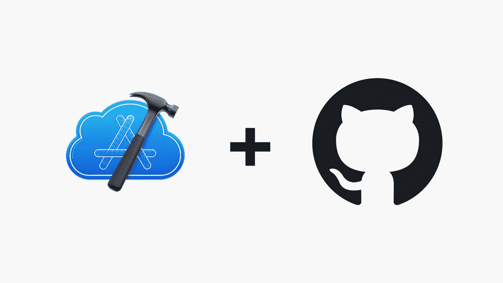
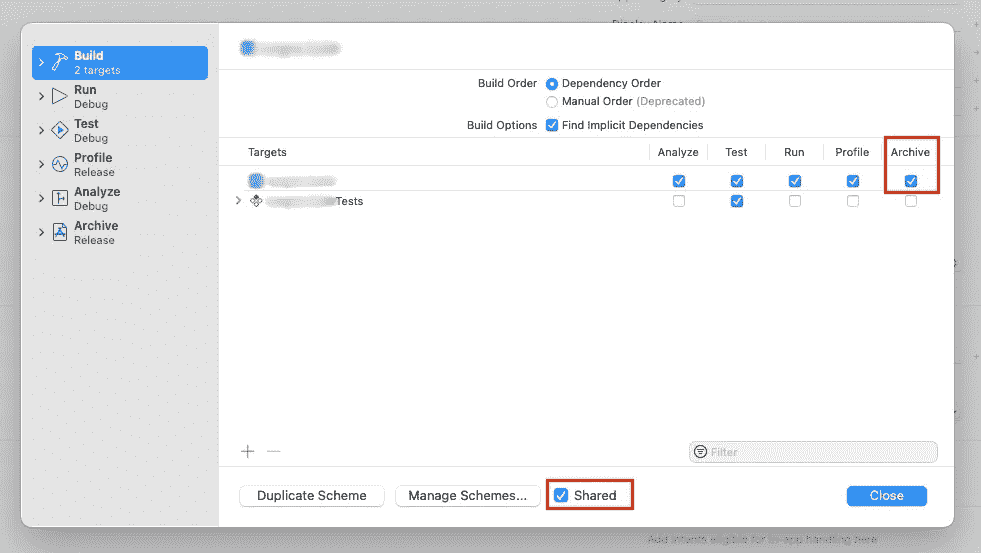
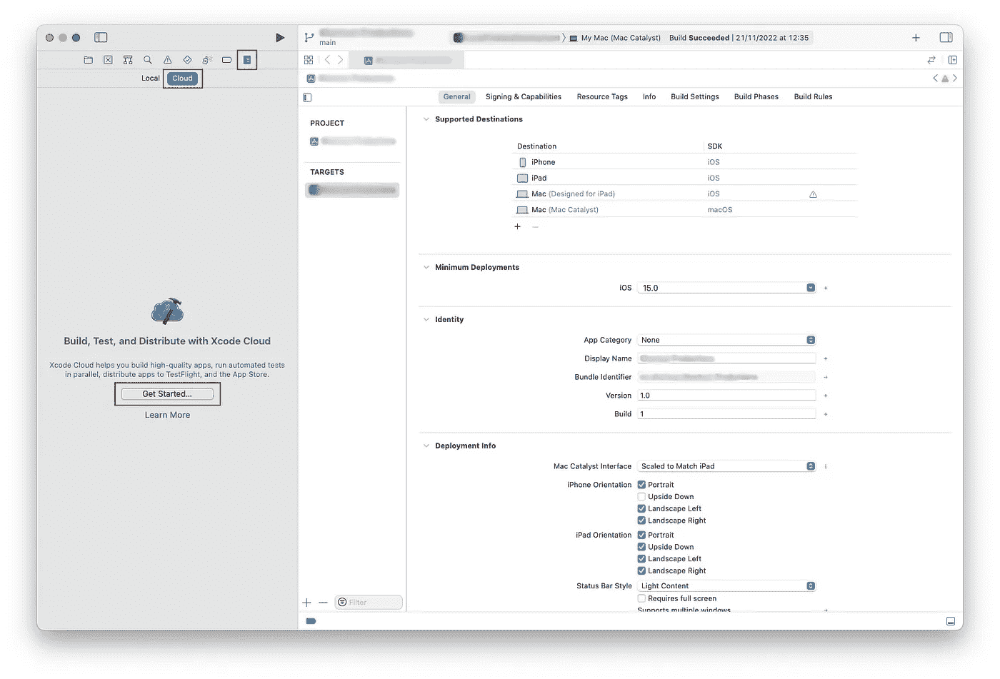
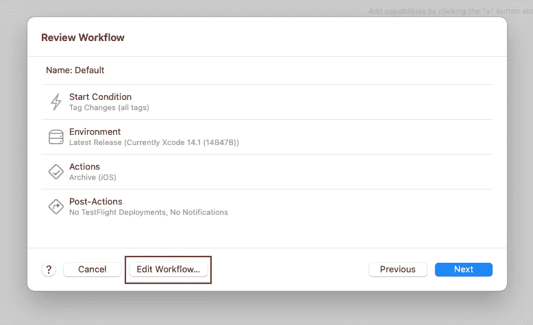
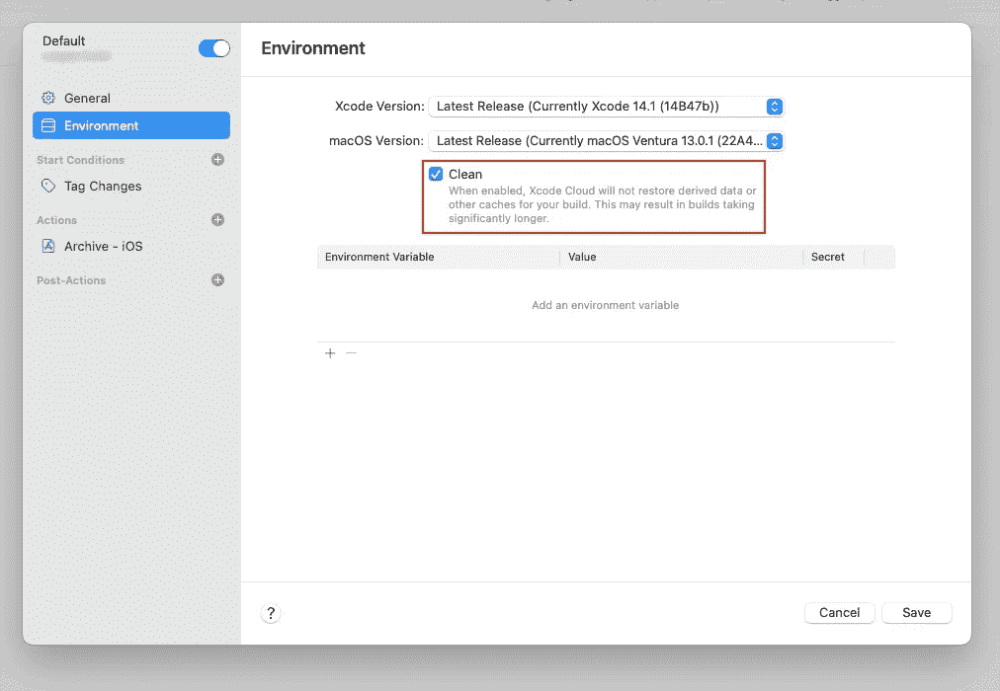
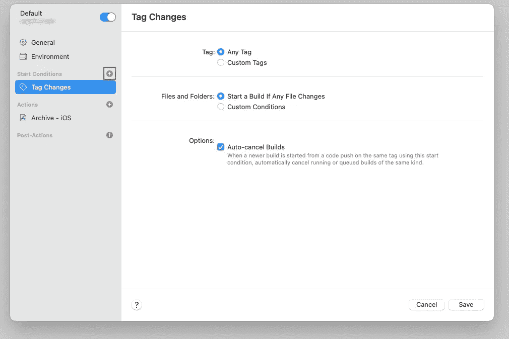
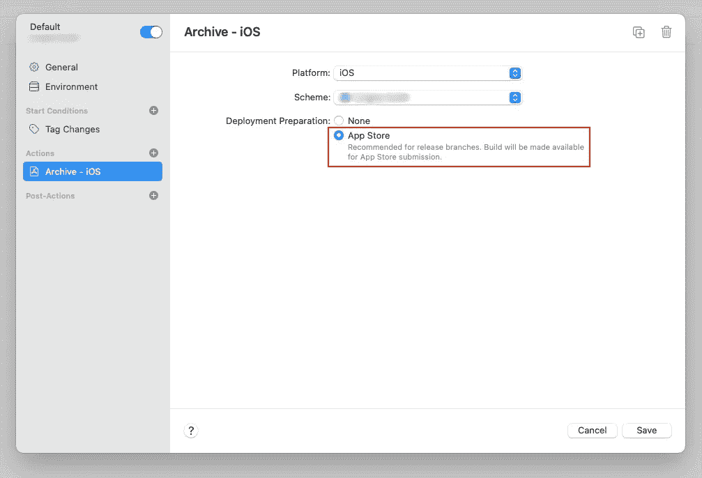

# 如何创建您的 Xcode 云工作流程

> 原文：<https://betterprogramming.pub/how-to-create-your-xcode-cloud-workflow-cd03816bedb8>

## 使用 Xcode Cloud 在 GitHub 上发布每个新版本的 App Store Connect 版本

大型项目的一个常见问题是，人们不知道哪个提交实际上是为了在 App Store 上发布。

也许你在制作之前的版本时很匆忙，忘记在 GitHub 中标记它了？或者甚至忘记合并您正在处理的分支，这样发布代码就不在主分支中了？

在分析错误报告和避免重复工作时，知道哪个代码在发布中是至关重要的。CI/CD 是这个问题的一个解决方案。通过将部署应用程序的过程转移到 GitHub，您可以保持良好的分支和发布标记策略。

Xcode Cloud 是苹果平台开发者在应用中利用持续集成和交付(CI/CD)的绝佳机会。通过 Xcode 14 向所有 Apple 开发人员提供，并完全内置于 Xcode 中——为您的应用程序项目配置 CI/CD 再简单不过了。

# 配置项目

在 Xcode Cloud 中创建工作流之前，我们需要确保项目中的一切都设置正确。提前正确配置一切可以消除云中意外的构建失败。

## **1。确保目标**的方案已共享且存档已启用

大多数项目可能已经在这里正确配置了。您想要构建的方案需要对 Xcode Cloud 可用，并且目标需要启用`Archive`选项(在构建中)。

只是为了确保它是，选择编辑方案(`⌘ + ;`)，看看一切是否看起来不错。

## **2。让 Xcode 云可以使用依赖关系**

最简单的方法是使用 Swift 包，这几乎不需要额外的配置。

您只需要批准您在`$filename.xcodeproj/project.workspace/xcshareddata/swiftpm/Package.resolved`的`Package.resolved`文件在您的 Git 存储库中是可用的。

Xcode Cloud 使用此文件而不是自动包解析来解析 SPM 依赖关系。请注意，该文件可能会在您项目的`.gitignore`中被忽略。

如果您的项目依赖于私有 SPM 依赖项，Xcode Cloud 中的构建将会失败，但会给出如何在构建日志中提供依赖项的说明。

Xcode Cloud 也可以解析来自 CocoaPods 或 Carthage 的依赖项，但这需要额外的设置，超出了本文的范围。如果你感兴趣，可以看看苹果关于审查第三方依赖关系的伟大[文档](https://developer.apple.com/documentation/xcode/making-dependencies-available-to-xcode-cloud#Review-third-party-dependencies)。

# 创建工作流

现在，您已经准备好为您的项目创建工作流了。

转到报告导航器(⌘ + 9)，在云选项卡下按`Get Started…`。如果您已经创建了一个工作流，您可以右击目标并选择`Manage Workflows…`来创建一个新的。

Xcode 将指导您创建新的工作流程，从选择您想要使用的目标开始。大多数配置都在“检查工作流”页面上完成。按下纸张底部的`Edit Workflow…`。

要在新版本上为 App Store Connect 构建新的应用程序，您需要更改三项设置。

## **1。环境**

在环境设置中，启用`Clean`选项从头开始构建每个部署。这是 Xcode Cloud 为发布而构建时的要求。

## **2。开始条件**

添加一个基于`Tag Changes`的新开始条件，删除一个基于分支的开始条件。您甚至可以进一步配置开始条件，例如，要求用某个标记(例如`Release`)来标记提交。

## 3.档案馆

在存档设置中，您要选择`App Store`作为部署准备。如果您启用了试飞，您可以在创建工作流程后在此选择试飞备选方案。

按 save，进入下一步，授予访问权限，并将工作流连接到 GitHub 存储库。

# 结论

恭喜你。就这样，你用 Xcode Cloud 在你的 app 项目上设置了 CI/CD。每当您在 GitHub 中创建新的标记版本时，Xcode Cloud 都会调用并构建您的应用程序的新版本，您可以在 App Store Connect 中管理该版本。