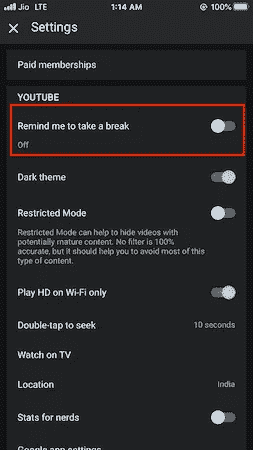
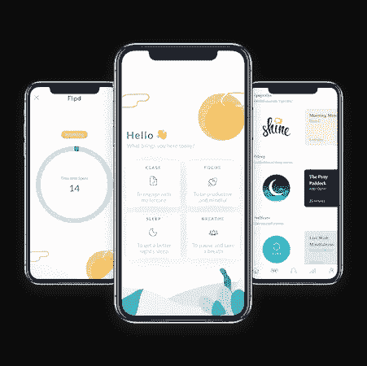
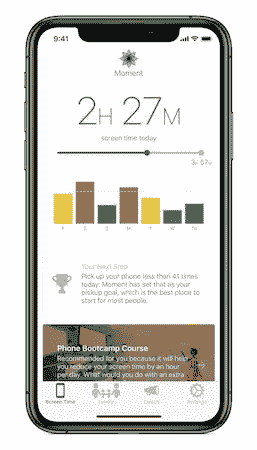
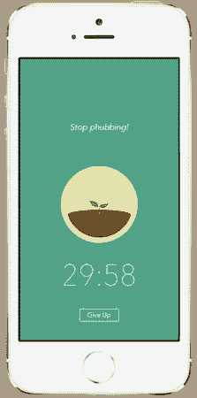

# 如何抑制你的智能手机瘾以提高注意力和工作效率

> 原文：<https://betterprogramming.pub/how-to-curb-your-smartphone-addiction-to-improve-focus-and-productivity-de3a89d4a6e9>

## 让你的手机为你工作的 3 个技巧和应用


布鲁斯·马斯在 [Unsplash](https://unsplash.com?utm_source=medium&utm_medium=referral) 上拍摄的照片。

工作场所心理健康的话题并不新鲜。如今，越来越多的软件开发人员经历着压力、倦怠、生产力下降以及其他与工作相关的心理健康问题。

这在很大程度上可以归因于我们的智能手机。不，智能手机不会直接妨碍我们的大部分心理健康。更确切地说，这是一种后遗症。尽管有很多应用程序旨在让我们的生活和工作更有效率，但分心的代价往往超过好处。

据说，过度使用智能手机会造成睡眠障碍、焦虑、孤立等生理影响，还会因戒断症状而增加不安和紧张。

智能手机成瘾是我们在工作中失去注意力和生产力的根本原因。

作为一名 iOS 开发人员，我的手机是我最喜欢的人，我在工作时间的很长一段时间里都与它互动(主要是为了测试功能)。可以理解的是，不断的通知和令人上瘾的社交媒体应用就在咫尺，我必须想出一个策略来尽量减少分心。

不管你属于哪一类员工，以下建议都可以帮助你减少工作效率的损失，并通过控制你的智能手机瘾来提高工作的专注度。我不会要求你把电话放在 DND 上，因为这不是对每个人都可行的。

# 禁用通知徽章

智能手机用户平均每天拿起手机 150 次，其中很多都与通知有关。软件被设计成会让人上瘾，通知徽章只会引诱你打开应用程序。因此，你需要做的第一件事就是禁用除了最重要的应用程序的通知徽章。这些小红点只会引诱你时不时地打开应用程序或查看手机。

# 重新排列您的主屏幕

当你周围有噪音时，你会做什么？你可能会试着疏远自己。考虑在你的主屏幕上做同样的事情。当你拿起电话时，主屏幕是你看到的第一件事，很容易打开社交媒体应用程序，忘记时间。

把它们切掉。您的主屏幕应该只包含最重要的应用程序。通常情况下，电话、信息、电子邮件和地图都可以。把剩下的打包，送到最远的屏幕。打开它们应该要花点力气。

# 调整你的手机设置

凭借其内置的屏幕时间设施，苹果和谷歌正在通过让用户意识到这一点来遏制智能手机成瘾。虽然一个好的统计设计屏幕可能会让智能手机更容易上瘾，但将手机转为灰度模式肯定会让它看起来很无聊，从而减少分心。

在 iOS 设备上，您可以通过以下方式启用彩色滤镜，轻松地在彩色和灰度之间切换:

```
Settings > General > Accessibility > Accessibility Shortcut > Color Filters
```

此外，休息有助于恢复一个人的精力。YouTube 等应用确实提供了内置的课间休息支持:



# 有用的应用程序

虽然用技术来战胜技术成瘾似乎有悖常理，但有一些智能应用程序可以帮助减少手机的使用。让我们开始吃吧。

## 1.Flipd

Flipd 是一款数字健康应用，它可以让你在一段选定的时间内，通过移除除了基本应用之外的所有应用来断开手机电源。它向你展示了一个计时器，并具有正念辅导等功能，以及从歌曲到生产力提示的音频内容库，它努力训练你的大脑专注于现在。

此外，通过挑战朋友的互动方式，它确保了一个人是负责任的。



## 2.瞬间

通过有指导的辅导课程，[这款应用](https://inthemoment.io/)努力一次减少一天的手机使用量。通过每天调整某些习惯，它旨在提高注意力和联系，从而确保更多的家庭时间。

没有动力，改变不会发生。为了确保您培养更好的习惯，并且不会忘记您的进度，Moment 允许您与家人共享您的手机使用统计数据。



## 3.森林

[森林](https://forestapp.cc/)为你提供一个游戏化的解决方案，让你戒掉智能手机瘾。游戏化的应用程序旨在鼓励好习惯，并帮助他们在一段时间内保持下去。

每当你打算离开手机的时候，这个应用程序就会种下一棵树。当你专注于你的工作时，你的树会成长，如果你未能完成任务，它就会死去，从而成为你远离手机干扰的良好激励。



# 结束语

社交媒体的使用[增加了抑郁和孤独](https://penntoday.upenn.edu/news/social-media-use-increases-depression-and-loneliness)。进行数字排毒，尤其是在睡觉前和凌晨，可以通过放松对你的大脑产生积极的影响。

作为一名移动应用程序开发人员，拥有一部用于工作的备用手机是最被低估的投资之一(除非你有幸从雇主那里得到一部)。

我希望这些技巧和应用程序能帮助你抑制你的智能手机成瘾。智能手机是为了娱乐我们，但是过度依赖它们会妨碍你的工作和个人空间。

这一次到此为止。感谢阅读。