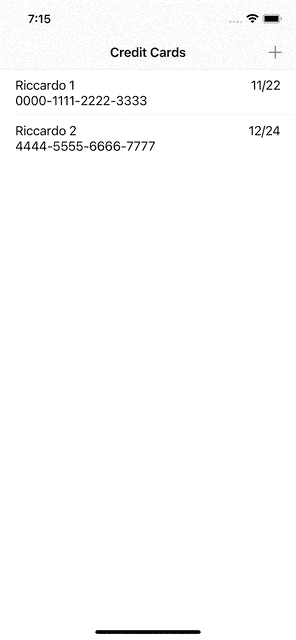
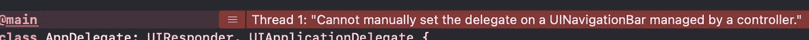

# 如何在 iOS 中自定义 UINavigationController 的行为

> 原文：<https://betterprogramming.pub/how-to-customise-the-behaviour-of-uinavigationcontroller-in-ios-f6424300f58>

## 让我们在 UINavigationController 中覆盖导航

照片由[威廉·布特](https://unsplash.com/@williambout?utm_source=medium&utm_medium=referral)在 [Unsplash](https://unsplash.com?utm_source=medium&utm_medium=referral) 上拍摄

拥有一个像 UIKit 这样成熟的框架通常是一件非常好的事情。我们可以相信这些组件会像描述的那样工作。我们有大量的资源，很可能其他人已经有了类似的问题，并且有解决方案。

然而，尽管有这些美好的事实，有时现有的组件使得编写最简单的函数变得困难。例如，本周我不得不拦截`UINavigationController`中的导航，以便在导航到前一个屏幕之前向用户显示警告。在继续弹出动画之前，我们需要询问用户是否确定要中止当前流程。

这似乎是一个简单的任务，但令人惊讶的是，在 Swift 中没有办法轻松拦截用户点击默认后退按钮的事件。

如果你进行快速搜索，你会发现许多不同的解决方案:从在`viewWillDisappear`方法中编写一些代码来检测应用程序是否正在离开当前 VC，到实现一个自定义的后退按钮。

在今天的文章中，我们将探讨如何通过一个客户`UINavigationController`以适当的方式实现这种行为。

# 该应用程序

对于本文的内容，我们将使用一个简单的应用程序。它允许我们保存信用卡的详细信息。出于安全原因，在用户确认详细信息之前，我们不想在本地存储这些信息。

在点击后退按钮时，我们想警告用户，如果他们继续向后导航，所有的信息都将丢失。

# 控制导航

为了实现这个解决方案，我们依赖于实现一个特殊的委托:`[UINavigationBarDelegate](https://developer.apple.com/documentation/uikit/uinavigationbardelegate)`。这个委托让我们截取了四个非常有趣的事件:

*   `[func navigationBar(_:shouldPush:) -> Bool](https://developer.apple.com/documentation/uikit/uinavigationbardelegate/1624941-navigationbar)`:在导航控件试图按下特定的`UINavigationItem`之前调用。如果我们返回`false`，导航停止。
*   `[func navigationBar(_:didPush:)](https://developer.apple.com/documentation/uikit/uinavigationbardelegate/1624964-navigationbar)`:在`UINavigationItem`被推入堆栈后调用。
*   `[func navigationBar(_:shouldPop:) -> Bool](https://developer.apple.com/documentation/uikit/uinavigationbardelegate/1624944-navigationbar)`:在导航控件试图弹出一个特定的`UINavigationItem`之前调用。如果我们返回`false`，航行就停止了。
*   `[func navigationBar(_:didPop:)](https://developer.apple.com/documentation/uikit/uinavigationbardelegate/1624948-navigationbar)`从堆栈中弹出`UINavigationItem`后调用。

每个`UINavigationController`都自动成为自己`navigationBar`的`navigationBar.delegate`。如果我们试图手动将`delegate`属性设置为任何值，甚至是`self`，我们会得到这个错误:

只有一种方法可以实现这个委托:

1.  创建`UINavigationController`的子类
2.  使子类符合`UINavigationBarDelegate`并实现我们需要的方法。

## 创建 UINavigationController 子类

第一步是定义一个定制的`UINavigationController`子类。

这一部分非常容易。我们不需要在子类中实现任何代码，我们只需要一个自定义代码来使它符合委托。

## 实现 UINavigationBarDelegate 方法

第二步是实际实现委托的方法。`UINavigationBarDelegate`是一个 Objective-C 协议，它的所有方法都是可选的。这有两层含义:

1.  所有符合协议的实体必须从`NSObject`继承，或者它们也必须符合`NSObjectProtocol`。这已经满足了，因为我们的一致性类型扩展了一个扩展了`NSObject`的`UINavigationController`。
2.  我们可以在代码中只实现我们需要的方法，因为它们都是可选的。

对于我们的例子，我们只需要实现`[func navigationBar(_:shouldPop:) -> Bool](https://developer.apple.com/documentation/uikit/uinavigationbardelegate/1624944-navigationbar)`方法。请注意以下事项:

上面的代码片段由两个方法组成:委托方法实现和一个显示确认警告的函数。

警报控制器代码是一个标准代码:我们创建视图控制器，包括标题、消息和动作，然后呈现它。当用户按下`Yes, cancel`时，我们手动调用`popViewController`方法。否则，我们什么也不做。

委托方法的实现更有趣。目前，这种伪代码是行不通的。不幸的是，没有直接的方法将`UINavigationItem`与相应的`UIViewController`联系起来。如果我们检查`[UINavigationItem](https://developer.apple.com/documentation/uikit/uinavigationitem)`文档，我们唯一可以使用的就是标题。但是，正如我们所知，弦并不那么可靠。

## 将 NavigationItem 链接到 ViewController

我发现有两种优雅的方式将这两种元素联系起来。第一个是使用一个被遗忘的名为`[tag](https://developer.apple.com/documentation/uikit/uiview/1622493-tag)`的 Objective-C 变量。正如我们从文档中看到的，所有的`UIView`都有这个属性，它被用来在运行时标识一个特定的视图。其默认值为`0`。

首先要做的是用我们所有的事例定义一个枚举。我们可以称之为`ViewControllerTag`:

现在，我们需要使用它。首先，在我们的`ViewController` s 的`viewDidLoad`方法中，我们可以访问`navigationItem`对象。然后，我们可以尝试设置`tag`属性。

然而，如果我们尝试这样做，我们可以看到这个属性对于`UINavigationItem`来说是不存在的。这是因为 Swift 试图隐藏那些稍微不安全的 API，以提高我们代码的质量。

通过使用一种叫做[键值编码](https://developer.apple.com/library/archive/documentation/Cocoa/Conceptual/KeyValueCoding/)的技术，在运行时仍然可以访问这些属性。所有的`NSObject`都有几个方法来设置特定键的值并检索该值。这就是`setValue(_:forKey:)`方法和`value(forKey:)`方法。

多亏了这种技术，我们可以为`UINavigationItem`编写这个小扩展。

在这个扩展中，我们创建了一个私有属性来设置和检索`tag`。然后，我们创建一个助手，以更具描述性的方式获取和设置`ViewControllerTag`。

创建链接的另一种方法是使用关联对象而不是标签。如你所知，扩展中不能有任何存储变量，我们也不能修改`UINavigationItem`的原始代码。然而，如果我们从 Objective-C 运行时扩展一个对象，我们可以在运行时创建一个存储变量。如果您想使用这种方法，我们可以创建这个扩展:

这里，我们创建一个键，通过使用`objc_getAssociatedObject`和`objc_setAssociateObject`，我们可以添加一个存储变量来链接`UINavigationItem`和相应的`UIViewController`。

这两种技术都访问 Objective-C 运行时，为了创建链接，我们牺牲了一点类型安全。

独立于所选择的技术，我们现在可以更新我们的`ViewController`来创建链接。在他们的`viewDidLoad`方法中，我们可以如下设置`viewControllerTag`:

现在，我们应用程序中的每个`UIViewController`都在其导航项目中设置了一个合适的标签。让我们更新我们`NavigationController`的代码来使用它吧！

在`navigationBar`委托方法中，我们从导航项中检索标签。如果标签不存在，我们可以返回`true`允许正常导航。否则，我们切换标签来决定如何处理导航，一个视图控制器接一个视图控制器。

注意:从技术上讲，我们可以只为那些需要修改导航的控制器设置一个标签。

# 标签的替代物

当前的解决方案运行良好，并且在恒定时间内有效。我们访问标签并做出决定。

但是，它需要修改每个视图控制器的代码来添加标签。有些情况下，我们无法更改视图控制器代码。在这些情况下，我们可以使用不同的解决方案:我们可以在`NavigationController`的`viewControllers`属性中搜索`last`视图控制器，它的`navigationItem`是传递给委托的那个。

我们可以创建一个标记协议`PopRequiresConfirmation`，我们可以让所有的`ViewController`都符合该协议。每当我们发现一个标有该协议的`ViewController`并且对应于`navigationItem`时，我们就要求用户确认。

这是代码:

在代码片段的第一部分，我们声明了`PopRequiresConfirmation`并标记了需要特定行为的`ViewController`。在我们的例子中，那只是`AddCreditCardVC`。

然后，我们实现`UINavigationBarDelegate`方法。在那里，我们将`navigationItem`传递给一个 helper 方法，该方法在`NavigationController`的`viewControllers`列表中搜索具有该`navigationItem`的`last`。

我们搜索`last`元素是因为我们从栈顶弹出它:如果你的应用程序允许多次推送相同的`ViewController`，你可能会观察到一些奇怪的行为。

最后，我们检查我们找到的 viewController 是否符合`PopRequiresConfirmation`协议。如果是，我们返回`true`。否则，我们返回`false`。

这个解决方案的美妙之处在于，我们不必定义额外的枚举，也不必使用任何额外的状态变量来创建`viewController`和`navigationItem`之间的链接。对于具有深度或无限导航的应用程序，这种实现可能会变得昂贵。

# 结论

在今天的文章中，我们探讨了如何控制应用程序中的导航。为了实现这一点，我们需要创建一个定制的导航控制器，并且我们需要实现一些来自`UINavigationBarDelegate`的委托方法。

在使用它时，我们发现 UIKit 没有提供`UINavigationItem`和`UIViewController`之间的直接链接。我们使用 Objective-C 运行时、KVC 技术或相关对象创建了这个链接。

我们还探索了使用标记协议和在视图控制器列表中搜索的替代方法。这种解决方案需要线性时间，但不需要篡改现有的视图控制器。你可以在[这个资源库](https://github.com/cipolleschi/BlockingNavigation)中找到最终的项目。

只有当我们实际上可以创建`UINavigationController`的自定义子类时，这种方法才有效。当我们不能时，也许因为我们正在创建一个库，我们需要使用应用程序传递的`UINavigationController`，我们需要使用其他技术，比如覆盖后退按钮行为。

这个解决方案更加优雅，需要更少的 UI 恶作剧，并且应该涵盖 80%的我们创建自己的应用程序的情况。